# Shipwright

**Gated agentic dev lifecycle for Cursor and Claude Code** — traceable specs, a verify-review-ship loop, and
compounding memory. Commands use the `sw-` prefix.

Orchestrators advance on green and **halt at human gates** (freeze, merge, feedback routing). Shipwright
**never auto-merges**.

- **Traceable specs** — frozen PRDs, tasks, and amendments in your repo
- **Gated ship loop** — verify, review, CI truth, stabilize; you merge
- **Compounding memory** — post-ship retro and durable project learnings

## Prerequisites

Install these **before** cloning Shipwright. They are required for the plugin itself or for common workflows.

| Tool | Why |
|------|-----|
| **git** | Branches, worktrees, commits — used throughout the ship loop |
| **bash** | `scripts/install.sh` and gate scripts |
| **rsync** | `install.sh` copies the plugin tree to your local plugin directory |
| **Python 3** | `python3 -m sw generate` when developing Shipwright; some gate/validation scripts |
| **GitHub CLI (`gh`)** | `/sw-pr`, `/sw-watch-ci`, and PR blocker flows — run `gh auth login` |

**Per target repo** (the project you build in, not the Shipwright repo):

| Tool | Why |
|------|-----|
| **Your project toolchain** | Configure `verify.lint`, `verify.typecheck`, `verify.test` in `workflow.config.json` so `/sw-verify` runs real checks |

Optional integrations (CodeRabbit, Recallium, Sentry) are configured during [plugin setup](#plugin-setup-and-configuration) — not required to install Shipwright.

## Installation

Shipwright installs **once per machine**. Configuration happens later **in each project repo**.

> Remove other workflow plugins under `~/.cursor/plugins/local/` before installing — duplicates can shadow
> `sw-` commands.

### Cursor

```bash
git clone https://github.com/grdavies/shipwright
cd shipwright
./scripts/install.sh
```

1. `install.sh` copies `dist/cursor/` → `~/.cursor/plugins/local/shipwright` (override with `scripts/install.sh /path/to/dest`).
2. Run **Developer: Reload Window** in Cursor.
3. Confirm `sw-` commands appear in the command palette (e.g. `/sw-setup`, `/sw-doc`).

### Claude Code

```bash
git clone https://github.com/grdavies/shipwright
cd shipwright
```

Point your Claude Code plugin path at the generated tree:

- **Path:** `<shipwright-repo>/dist/claude-code/`
- Or copy `dist/claude-code/` into your Claude plugins directory per Claude Code docs.

Reload Claude Code after adding the plugin. Command surface uses the same `sw-` prefix as Cursor.

### Developing Shipwright itself

Authoring lives in `core/`; install trees are generated:

```bash
python3 -m sw generate --all --install   # regenerate dist/ and install to Cursor
```

See [CONTRIBUTING.md](CONTRIBUTING.md). User docs live in [`documentation/`](documentation/); internal planning
artifacts live in gitignored `docs/`.

## Plugin setup and configuration

Shipwright configures **per target repo** — open your project in Cursor (or Claude Code) and set it up there.

### Zero-config fast path

A repo can work without `workflow.config.json` if you commit:

```text
.cursor/sw-memory.provider    # file containing: in-repo
.cursor/sw-memory/memories/   # empty
.cursor/sw-memory/rules/      # empty
```

The fail-closed hook engages via the marker. Run `/sw-setup` when you want full config.

### `/sw-setup` (recommended)

In your **target repo**, run `/sw-setup`. It scaffolds a new config or re-runs as a **doctor** if
`.cursor/workflow.config.json` already exists.

**Step 1 — Memory provider**

| Question | Choices | Default | Writes |
|----------|---------|---------|--------|
| Where should durable memory live? | **in-repo** · recallium | **in-repo** | `memory.provider` |

For **in-repo** (default):

- Creates `.cursor/sw-memory.provider` containing `in-repo`
- Creates `.cursor/sw-memory/memories/` and `.cursor/sw-memory/rules/` (empty — no auto-seeded rules)
- Asks **commit mode:** `committed` (default, PR-reviewable) or `local` (gitignore `.cursor/sw-memory-local/`)

For **recallium:** requires a reachable REST base URL (`memory.connection.restBaseUrl`); setup warns if health check fails.

**Step 2 — Review provider**

| Question | Choices | Default | Writes |
|----------|---------|---------|--------|
| External AI review on PRs? | **coderabbit** · none | **none** | `review.provider` |

Canonical opt-out: `review.provider: "none"`. Do not use `review.enabled: false` (deprecated).

**Step 3 — Doc→implementation boundary**

| Question | Choices | Default | Writes |
|----------|---------|---------|--------|
| After frozen tasks? | **stop** · confirm · auto | **confirm** | `doc.afterTasks` |

`confirm` shows the full task list and requires `proceed` or `yes` before dispatch. `auto` provisions a worktree
and dispatches without a second prompt.

**Step 4 — Guardrails**

| Setting | Default | Meaning |
|---------|---------|---------|
| `guardrails.enforceBeforeSubmit` | `true` | Memory guardrails run before prompts submit |
| `guardrails.requireRuleClass` | `false` | Set `true` in mature repos that require allowlisted rules |

**Step 5 — Environment doctor** (warnings only, never hard-fails scaffold)

- CodeRabbit CLI on `PATH` when review provider is `coderabbit`
- Recallium reachable when memory provider is `recallium`
- Placeholder `verify.*` commands → recommends configuring real lint/typecheck/test commands
- Missing memory dirs → offers `mkdir -p` repair

**Step 6 — Write config**

Validates against `core/sw-reference/config.schema.json`, then writes `.cursor/workflow.config.json`.

**Setup tip:** add `docs/` to your project `.gitignore` if you want brainstorms, PRDs, and decisions to stay local.

### Manual config

```bash
mkdir -p .cursor
cp core/sw-reference/workflow.config.example.json .cursor/workflow.config.json
# edit memory.project, verify.*, providers
```

| Key | Purpose |
|-----|---------|
| `doc.afterTasks` | After frozen tasks: `stop` \| `confirm` (default) \| `auto` — see [getting started](documentation/getting-started.md) |
| `memory.provider` | `in-repo` (default) or `recallium` |
| `review.provider` | AI review adapter — default **`none`** (off); `coderabbit` is opt-in |
| `verify.lint` / `verify.typecheck` / `verify.test` | Commands `/sw-verify` runs in your repo |
| `coderabbit.reviewGraceMinutes` | Gate grace window before absent review = settled |
| `checks.treatNeutralAsPass` | NEUTRAL CI checks count as pass unless allowlisted |
| `checks.neutralAllowlist` | Check names that stay blocking |
| `memory.autoSync` | Stop-hook thresholds for `/sw-memory-sync` scheduling |

Canonical opt-out for review: `review.provider: "none"`.

Provider **credentials** come from the environment or your secret store — never commit secrets.

See `core/sw-reference/config.schema.json` for the full schema. User guides: [getting started](documentation/getting-started.md), [commands](documentation/commands.md).

## First-run workflow (summary)

1. `/sw-setup` — config + `doc.afterTasks` + review choice (`none` default).
2. `/sw-doc` — doc chain; **single-pass** `/sw-tasks`; boundary modes control dispatch after freeze.
3. `/sw-worktree` + `/sw-start` — implementation only inside a worktree (never bare `main`).
4. `/sw-ship` or atomic execute → verify → PR → watch-ci → ready.

### Optional integrations

Configure these in `/sw-setup` or `workflow.config.json` when you need them:

| Integration | Config | When to enable |
|-------------|--------|----------------|
| **CodeRabbit** | `review.provider: coderabbit` | AI review on PRs; install CodeRabbit CLI for local flows |
| **Recallium** | `memory.provider: recallium` | External memory store instead of in-repo markdown |
| **Sentry** | Production signals via `/sw-feedback` or `/sw-debug` | Route production errors into the debug workstream |

## Learn more

| Doc | Audience |
|-----|----------|
| [documentation/getting-started.md](documentation/getting-started.md) | Persona quick paths |
| [documentation/commands.md](documentation/commands.md) | Full command taxonomy |
| [CONTRIBUTING.md](CONTRIBUTING.md) | Developing the plugin |
| [PROVENANCE.md](PROVENANCE.md) | Upstream sources |

## Workstreams

Most users follow this order: **write and review documentation** → **ship from frozen tasks** → **debug or
triage production issues** when needed. Post-merge, **compound** learnings back into memory.

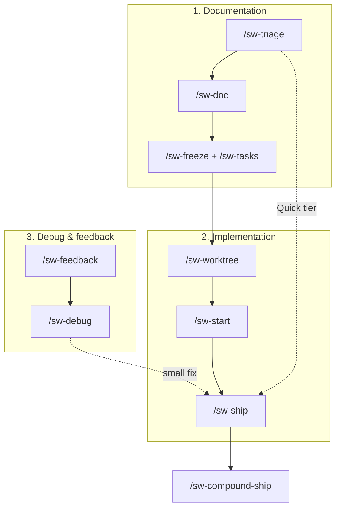

**Tiers** classify how much documentation ceremony a piece of work needs. `/sw-triage` scores deterministically;
`/sw-doc` respects the result.

### Tiers: Quick, Standard, and Full

| | **Quick** | **Standard** | **Full** |
|---|-----------|--------------|----------|
| **Typical scope** | 0–1 files, low risk | 2–5 files, bounded feature | 6+ files, or ambiguous scope |
| **Doc pipeline** | **Skipped** — route straight to implementation | PRD → review → freeze → tasks | Brainstorm → PRD → review → freeze → tasks |
| **Persona review** | None | Signal-driven panel on PRD | Signal-driven panel on PRD |
| **Artifacts produced** | None (implement from prompt) | `docs/prds/<n>-*/` PRD + frozen tasks | `docs/brainstorms/` + PRD + frozen tasks |
| **Human gates** | Merge gate only | `doc.afterTasks` confirm; freeze; merge | `doc.afterTasks`; brainstorm checkpoint; freeze; merge |
| **Best for** | Hotfixes, typos, single-file tweaks | Most features with clear acceptance criteria | New domains, spikes, “figure out” scope |
| **Entry command** | `/sw-triage` then `/sw-worktree` + `/sw-ship` | `/sw-doc` or `/sw-prd` | `/sw-doc` (includes brainstorm) |

**Risk floor:** keywords like `auth`, `payment`, `migration`, or `webhook` force **at least Standard** even for
1-file changes. **Ambiguity bump:** words like `maybe`, `explore`, or `TBD` push Quick→Standard or
Standard→Full.

**Classification flow** (`/sw-triage`):

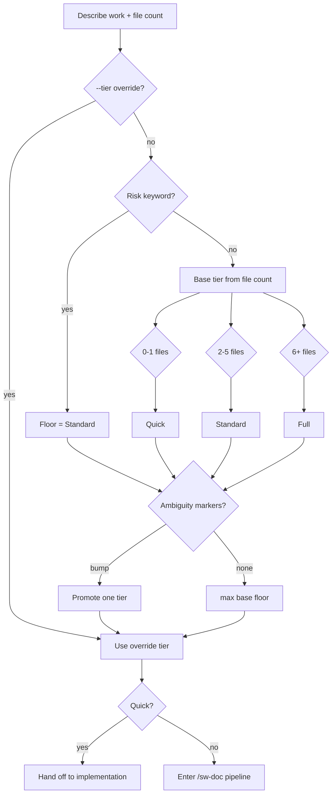

#### Quick tier workflow

No spec artifacts. Triage routes directly to the ship loop.

```mermaid
flowchart LR
  T["/sw-triage"] --> Q[Quick]
  Q --> WT["/sw-worktree provision"]
  WT --> ST["/sw-start"]
  ST --> EX["/sw-execute"]
  EX --> SH["/sw-ship"]
  SH --> V["verify → review → commit"]
  V --> PR["/sw-pr → /sw-watch-ci"]
  PR --> STB["/sw-stabilize"]
  STB --> RD["/sw-ready — PAUSE"]
  RD --> MERGE[You merge]
  MERGE --> CM["/sw-compound-ship"]
```

```text
/sw-triage — 1 file, fix export button label typo
/sw-worktree provision → /sw-start → /sw-execute → /sw-ship
```

#### Standard tier workflow

PRD and frozen tasks before code. No brainstorm phase.

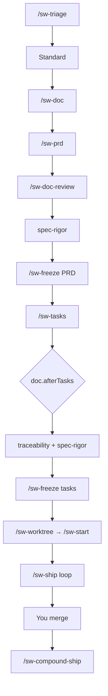

```text
/sw-doc
Feature: CSV export on reports table — 4 files, clear criteria, no auth
```

#### Full tier workflow

Explores requirements before the PRD. Use when scope or product decisions are still open.

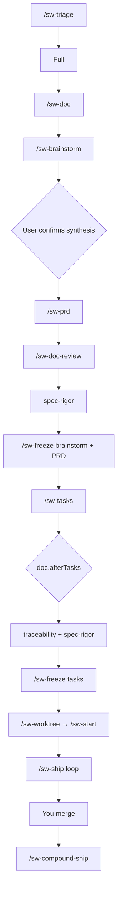

```text
/sw-doc
Feature: new billing portal — explore pricing models, 8+ files, auth + Stripe
```

> **Note:** `/sw-doc` **stops** on Quick tier and tells you to use the implementation workstream instead.

---

### Documentation — spec before code

Use when tier is **Standard** or **Full** and you need a reviewed plan before implementation.

**Standard doc pipeline** (no brainstorm):

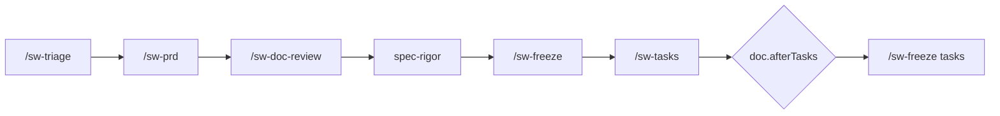

**Full doc pipeline** (brainstorm first):

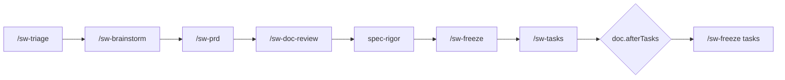

Or run `/sw-doc` to orchestrate either chain end-to-end.

**Typical flow**

1. `/sw-triage` — classify tier (or pass `--tier` to `/sw-doc`)
2. `/sw-doc` — runs the tier-appropriate doc chain
3. Human **`doc.afterTasks`** checkpoint after single-pass task freeze (default `confirm`)
4. Frozen PRD + tasks become the spec for `/sw-ship`

**Sample prompts**

```text
/sw-doc
Feature: user profile settings page
Context: Need PRD and tasks before implementation. Tier unknown — triage first.
```

```text
/sw-prd --tier standard
Feature: add export-to-CSV on reports table
Context: 3–4 files, no auth changes. Skip brainstorm.
```

**Key commands**

| Command | Use when |
|---------|----------|
| `/sw-doc` | End-to-end doc pipeline orchestrator |
| `/sw-triage` | Classify Quick / Standard / Full only |
| `/sw-brainstorm` | Full-tier requirements exploration (before PRD) |
| `/sw-prd` | Draft PRD or decision record |
| `/sw-doc-review` | Persona panel on spec drafts |
| `/sw-freeze` | Lock artifact; no further edits without `/sw-amend` |
| `/sw-tasks` | Generate task list from frozen PRD |
| `/sw-amend` | Post-freeze correction via amendment file |

---

### Implementation — ship a feature from spec

Use when you have frozen tasks (Standard/Full) or a Quick-tier slice and want a verified PR.

**`/sw-ship` chain:**

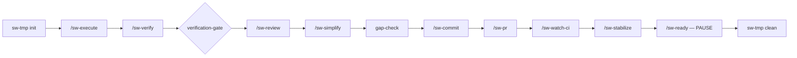

Halts on verification failure, review blockers, or red CI. **Never auto-merges** — you decide at `/sw-ready`.

**Typical flow**

1. `/sw-worktree provision` — isolated worktree for the work item
2. `/sw-start` — phase branch (e.g. `feat/my-feature-phase-mvp`)
3. `/sw-execute` — implement one task slice (or let `/sw-ship` orchestrate)
4. `/sw-ship` — verify → review → commit → PR → watch CI → stabilize → **pause at merge-ready**
5. You merge manually; then `/sw-compound-ship` in the target repo

**Sample prompts**

```text
/sw-worktree provision
Work item: user-profile-settings (from PRD 003 tasks)
```

```text
/sw-ship
Context: Phase 1 tasks 1.1–1.3 complete. Parent branch main. Run full loop through stabilize.
```

```text
/sw-execute
Task: 2.1 from tasks-003-user-profile.md — add settings form component
```

**Key commands**

| Command | Use when |
|---------|----------|
| `/sw-ship` | Full phase loop; halts at merge gate |
| `/sw-worktree` | Create or tear down per-item worktree |
| `/sw-start` | Open phase branch inside worktree |
| `/sw-execute` | One bounded implementation slice |
| `/sw-verify` | Run scoped lint/typecheck/test |
| `/sw-review` | Local multi-agent + provider review |
| `/sw-commit` | Commit after verify + review |
| `/sw-pr` | Push and open/update PR |
| `/sw-watch-ci` | Poll PR checks until green/red/timeout |
| `/sw-stabilize` | Clear failing checks and review threads |
| `/sw-ready` | Final readiness report (never merges) |
| `/sw-compound-ship` | Post-merge retro → compound → memory sync |

**Post-merge chain** (`/sw-compound-ship`):

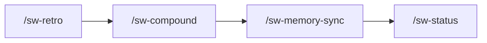

---

### Debug — production or dev-time issues

Use when something is broken in production or you need RCA before fixing.

**`/sw-debug` workflow:**

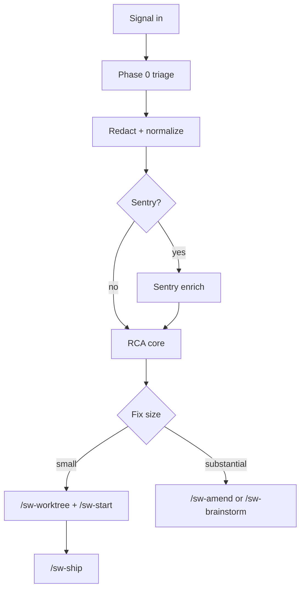

**Typical flow**

1. `/sw-debug` with signal (Sentry issue, stack trace, deploy log excerpt)
2. RCA core diagnoses; routes by fix size:
   - **Small** → `/sw-worktree` + `/sw-ship`
   - **Large** → `/sw-brainstorm` or `/sw-amend`

**Sample prompts**

```text
/sw-debug
Signal: Sentry issue PROJECT-123 — NullReference in CheckoutService.SubmitOrder
Context: Started after deploy v2.4.1 yesterday. 400 events/hour.
```

```text
/sw-debug
Signal: CI passes locally but fails on PR #42 — test_user_export timeout
```

**Key commands**

| Command | Use when |
|---------|----------|
| `/sw-debug` | RCA + route; does not implement or merge |
| `/sw-feedback` | Normalize inbound signal and suggest route (human confirms) |
| `/sw-feedback-close` | Close backlog signal after fix verified shipped |

---

### Feedback — intake from production, review, or retro

Use to capture signals without immediately analyzing them.

**`/sw-feedback` workflow:**

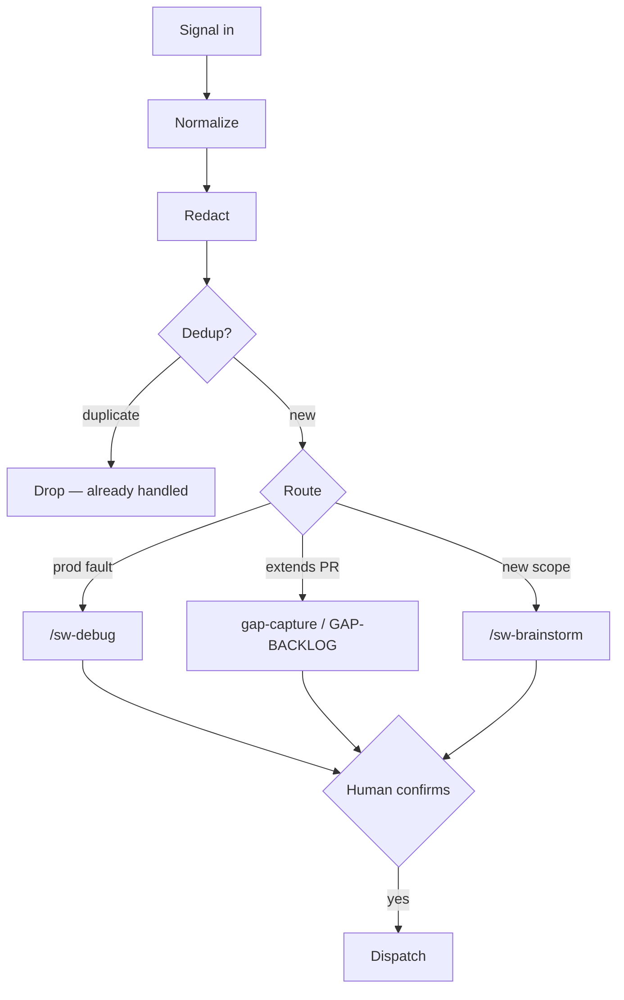

**Sample prompt**

```text
/sw-feedback
Signal: Code review on PR #88 — "missing rate limit on public endpoint"
Source: review comment
```

`/sw-feedback` redacts, classifies, and proposes a route (debug, gap-capture, brainstorm). **Confirm** before
dispatch.

---

### Quick reference — commands you invoke directly

| Command | One-line use case |
|---------|-------------------|
| `/sw-setup` | First run or doctor in a target repo |
| `/sw-triage` | How much ceremony does this work need? |
| `/sw-doc` | Full documentation pipeline |
| `/sw-ship` | Verify, review, PR, CI, stabilize — stop before merge |
| `/sw-debug` | Diagnose production or CI failure |
| `/sw-feedback` | Intake and route external signals |
| `/sw-worktree` | Isolate work in a git worktree |
| `/sw-start` | Start a phase branch |
| `/sw-execute` | Implement one task slice |
| `/sw-status` | Reconcile PRD status from git facts |
| `/sw-memory-sync` | Distill session into durable memory |
| `/sw-memory-audit` | Audit memory hygiene (read-only) |
| `/sw-compound` | Turn retro into memories |
| `/sw-retro` | Post-ship retrospective report |

For the full command list, see [documentation/commands.md](documentation/commands.md).

## License

MIT
