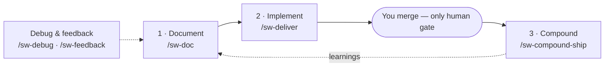

# Shipwright

[](version.txt)
[](#license)
[](#install)

**A gated agentic dev lifecycle for Cursor and Claude Code.** Traceable specs, a verify → review →
ship loop, and compounding memory — all driven by `sw-` commands.

Orchestrators advance on green and **halt at human gates** (freeze, merge, feedback routing).
Shipwright **never auto-merges**.

- **Traceable specs** — frozen PRDs, tasks, and amendments live in your repo
- **Gated ship loop** — verify, review, CI truth, stabilize; *you* merge
- **Compounding memory** — post-ship retro and durable project learnings



> New here? Read **[Getting started](docs/guides/getting-started.md)** for guided persona paths, or
> jump to the deep-dive **[workflow guide](docs/guides/workflows.md)**.

## Prerequisites

Check you have the essentials:

```bash
git --version && bash --version && rsync --version && gh --version
```

- [x] **git**, **bash**, **rsync** — clone, run `scripts/install.sh`, copy the plugin tree
- [x] **GitHub CLI (`gh`)** — `/sw-pr`, `/sw-watch-ci`, PR blocker flows (run `gh auth login`)
- [ ] **Python 3** — only for developing Shipwright (`python3 -m sw generate`; see [CONTRIBUTING.md](CONTRIBUTING.md))

## Install

Shipwright installs **once per machine**; you configure it **per project repo**. Once installed,
`sw-` commands appear in the palette (e.g. `/sw-setup`, `/sw-doc`).

<details open>
<summary><b>Cursor</b></summary>

```bash
git clone https://github.com/grdavies/shipwright
cd shipwright
./scripts/install.sh          # copies dist/cursor/ → ~/.cursor/plugins/local/shipwright
```

Run **Developer: Reload Window** in Cursor. Override the destination:
`./scripts/install.sh /path/to/dest`.
</details>

<details>
<summary><b>Claude Code</b></summary>

```bash
git clone https://github.com/grdavies/shipwright
cd shipwright
```

Point your Claude Code plugin path at `<shipwright-repo>/dist/claude-code/`, or copy that tree into
your Claude plugins directory per Claude Code docs. Reload Claude Code.
</details>

## Configuration

Open your **target project repo** and run **`/sw-setup`**. It walks you through four questions and
writes `.cursor/workflow.config.json`:

1. **Memory provider** — `in-repo` (default, committed markdown store) or `recallium` (external
   REST store). For in-repo, choose `committed` (PR-reviewable) or `local` (gitignored).
2. **Review provider** — `none` (default) or `coderabbit` (opt-in AI review on PRs).
3. **Doc→implementation boundary** (`doc.afterTasks`) — `confirm` (default: show frozen task list,
   require `proceed` before dispatch) · `stop` · `auto`.
4. **Guardrails** — `enforceBeforeSubmit` (default on) and `requireRuleClass` (default off; enable
   in mature repos).

Re-run `/sw-setup` at any time — it acts as a **doctor** against an existing config, validating,
reporting drift, and offering targeted repair without a full rescaffold.

**Worktree invariant:** implementation never starts on bare `main` — use `/sw-worktree` and a feature branch.
**Single-pass `/sw-tasks`:** one pass produces the complete frozen checklist; no implementation dispatch in the doc chain.
**Review:** `review.provider` defaults to **`none`**; the canonical way to disable external review is `review.provider: "none"` (CodeRabbit is opt-in).

Configure `verify.lint` / `verify.typecheck` / `verify.test` so `/sw-verify` runs real checks.
Full walkthrough and schema: **[configuration](docs/guides/configuration.md)**.

## First run

1. **`/sw-doc`** — triage → (brainstorm) → PRD → review → freeze → tasks.
2. **`/sw-deliver run <frozen-tasks>`** — drives every phase to one merge gate; **you merge**.

Quick fixes skip the doc pipeline — see [Getting started](docs/guides/getting-started.md).

## Workstreams

Four lifecycle workstreams sit on the foundation. Each has an **orchestrator** that chains atomic
`sw-` commands; every atomic stays independently runnable.

| Workstream | Orchestrator | Chain | Does not |
|------------|--------------|-------|----------|
| **Document** | `/sw-doc` | triage → brainstorm (Full) → PRD → review → freeze → tasks | implement or merge |
| **Implement** | `/sw-deliver` | `run` → per-phase `/sw-ship` → auto-merge → terminal PR → main | bypass `/sw-ship` or auto-merge to `main` |
| **Debug** | `/sw-debug` | triage signal → RCA → route by fix size | implement or merge |
| **Feedback** | `/sw-feedback` | normalize + redact → route to debug / gaps / brainstorm | analyze or dispatch without confirmation |

**`/sw-deliver` is the default implementation path** once `/sw-doc` produces a frozen task list — the
"play button" that drives every phase of a feature to one human merge gate. Mode auto-detect picks
phase-mode from `--task-list` vs multi-feature from `--items`/`--edges`. Use `--dry-run` for plan-only
output; re-run `run` to **resume** after interrupt. Run the manual `/sw-ship`
atomics directly only for Quick-tier hotfixes, debugging, or single-phase reruns.

→ Full per-tier flows, diagrams, and sample prompts: **[workflow guide](docs/guides/workflows.md)**.

## Tiers

`/sw-triage` scores work deterministically; `/sw-doc` respects the result.

| | **Quick** | **Standard** | **Full** |
|---|-----------|--------------|----------|
| **Scope** | 0–1 files, low risk | 2–5 files, bounded | 6+ files or ambiguous |
| **Docs** | skipped | PRD → freeze → tasks | brainstorm → PRD → freeze → tasks |
| **Entry** | manual `/sw-ship` | `/sw-deliver run` | `/sw-deliver run` |

**Risk floor:** `auth`, `payment`, `migration`, `webhook` force at least Standard. **Ambiguity bump:**
`maybe`, `explore`, `TBD` push a tier up. Details in the [workflow guide](docs/guides/workflows.md).

## Learn more

| Doc | Audience |
|-----|----------|
| [Getting started](docs/guides/getting-started.md) | First run + persona quick paths |
| [Workflow guide](docs/guides/workflows.md) | Tiers, per-workstream flows, diagrams, prompts |
| [Commands](docs/guides/commands.md) | Full command taxonomy |
| [Configuration](docs/guides/configuration.md) | `/sw-setup` + every config key |
| [CONTRIBUTING.md](CONTRIBUTING.md) | Developing the plugin |
| [PROVENANCE.md](PROVENANCE.md) | Upstream sources |

## License

MIT
