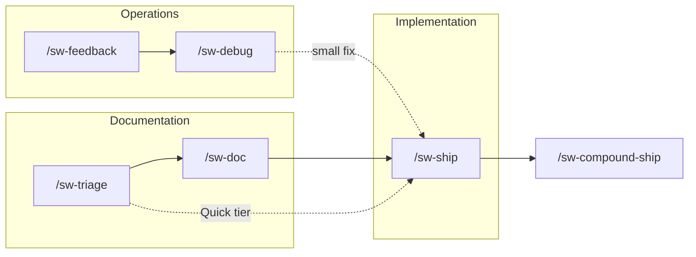

# Shipwright

**Gated agentic dev lifecycle for Cursor and Claude Code** — traceable specs, a verify-review-ship loop, and
compounding memory. Commands use the `sw-` prefix.

Orchestrators advance on green and **halt at human gates** (freeze, merge, feedback routing). Shipwright
**never auto-merges**.

- **Traceable specs** — frozen PRDs, tasks, and amendments in your repo
- **Gated ship loop** — verify, review, CI truth, stabilize; you merge
- **Compounding memory** — post-ship retro and durable project learnings

## Prerequisites

git · GitHub CLI (`gh`) for PR flows · optional CodeRabbit, Recallium, Sentry

## Install the plugin

Remove other workflow plugins under `~/.cursor/plugins/local/` first — duplicates can shadow `sw-` commands.

```bash
git clone https://github.com/grdavies/shipwright
cd shipwright
./scripts/install.sh
```

**Developer: Reload Window** in Cursor. Default path: `~/.cursor/plugins/local/shipwright`

For Claude Code, point your plugin path at `dist/claude-code/`.

## Configure your project

Shipwright configures **per target repo**, not at install time.

**Fast path:** run `/sw-setup` in your project for guided scaffolding.

**Zero-config memory:** commit `.cursor/sw-memory.provider` (`in-repo`) and empty
`.cursor/sw-memory/{memories,rules}/` — no `workflow.config.json` until you need more.

See [configuration summary](#configuration) below or `core/sw-reference/config.schema.json` for all keys.

## When to use what

| Goal | Start with |
|------|------------|
| New feature with spec | `/sw-doc` |
| Ship a phase / PR | `/sw-ship` |
| Production or user signal | `/sw-feedback` or `/sw-debug` |
| After merge | `/sw-compound-ship` |
| Classify scope only | `/sw-triage` |

## Tiers

| Tier | Doc chain | Typical use |
|------|-----------|-------------|
| **Quick** | Skipped → implementation | 0–1 files, no risk keywords |
| **Standard** | PRD → review → freeze → tasks | Bounded multi-file features |
| **Full** | Brainstorm → PRD → … | Ambiguous or large scope |

## Workstreams



Quick tier bypasses `/sw-doc` and routes directly to the ship loop.

## Configuration

Copy the example or use `/sw-setup`:

```bash
mkdir -p .cursor
cp core/sw-reference/workflow.config.example.json .cursor/workflow.config.json
```

| Key | Purpose |
|-----|---------|
| `memory.provider` | `in-repo` (default) or `recallium` |
| `review.provider` | AI review adapter (`coderabbit` default) |
| `checks.treatNeutralAsPass` | NEUTRAL CI checks as pass unless allowlisted |

Provider credentials come from the environment — never commit secrets.

## Learn more

| Doc | Audience |
|-----|----------|
| [documentation/getting-started.md](documentation/getting-started.md) | Using Shipwright in your repo |
| [documentation/commands.md](documentation/commands.md) | Command taxonomy |
| [CONTRIBUTING.md](CONTRIBUTING.md) | Developing the plugin |
| [PROVENANCE.md](PROVENANCE.md) | Upstream sources |

## Developing Shipwright

Authoring lives in `core/`; install trees are generated:

```bash
python3 -m sw generate --all --install
```

See [CONTRIBUTING.md](CONTRIBUTING.md). Internal planning artifacts live in gitignored `docs/`; user docs live
in `documentation/`.

## License

MIT
