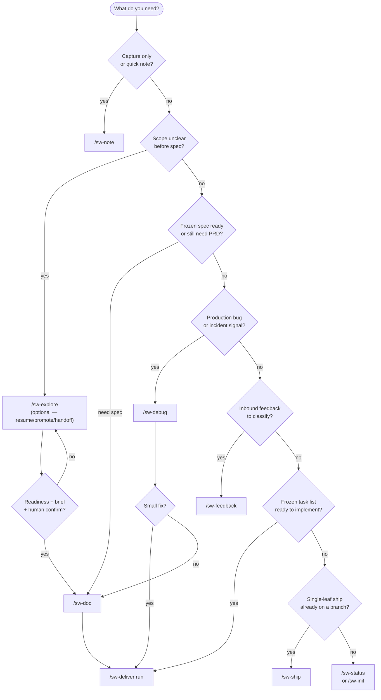
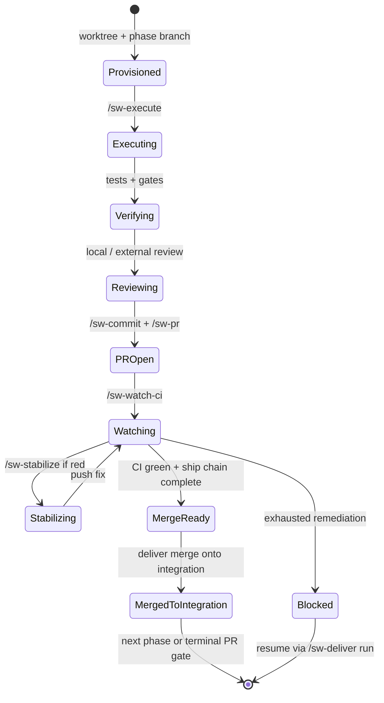
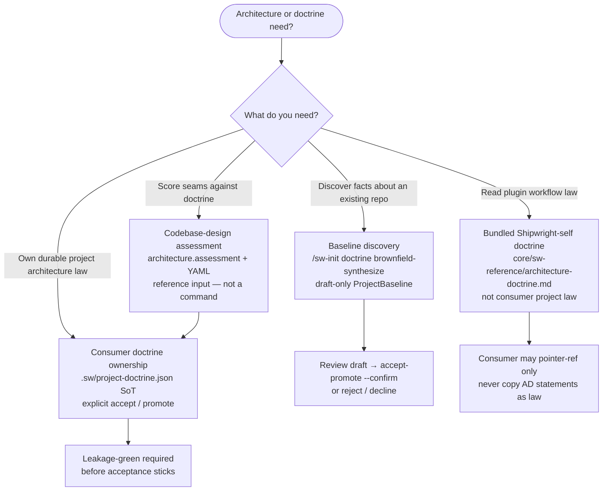
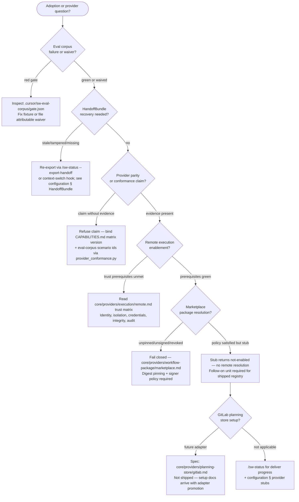

# Decision tree

Quick routing for the `sw-` command surface and per-worktree state. Pair with the [glossary](glossary.md).

## Which entry command?

## Per-worktree state machine (deliver / ship)

## Operator reminders

- Not sure which command? Run bare `/sw` — it reads worktree/planning state and proposes the one next action
  with confirm, rather than making you walk this chart by hand.
- Prefer `/sw-deliver run` for a frozen task list—do not hand-roll phase worktrees while the driver can advance.
- `/sw-ship` never merges to the default branch; humans own that gate.
- After merge, `/sw-cleanup` dry-runs removals until you confirm.

## Consult and capture (outside the pipeline)

`/sw-ask`, `/sw-become`, `/sw-note`, and `/sw-guide` never join the flowchart above — they are read-only or
local-capture surfaces you can reach for at any point without affecting pipeline state. `/sw-ask` and
`/sw-guide` never write; `/sw-note` writes only to your local notebook until you explicitly graduate an item;
`/sw-become` writes only a new persona file after you confirm the draft.

## Deprecated aliases

`/sw-setup` and `/sw-compound`/`/sw-compound-ship` remain as one-release delegating aliases to `/sw-init` and
`/sw-retrospective` respectively — see [commands](commands.md#deprecated-command-aliases-closed-rename-table)
for the closed rename table. Retire call sites onto the replacement name before the alias window closes.

## ProjectDoctrine and architecture routing

When the question is about project architecture law, baseline facts, or assessment — not a new workflow
command — route here. **No** `/sw-codebase-design` or `/sw-graph-*` entry points exist on this surface;
use `/sw-init` and the reference/assessment paths below. Pre-planning exploration uses `/sw-explore`
(optional) and is documented separately in the main entry tree above.

| Intent | Go here | Do not |
| --- | --- | --- |
| **Baseline discovery** | `/sw-init` brownfield synthesize → `.sw/project-baseline.draft.json` | Treat draft as law or auto-promote |
| **Consumer doctrine ownership** | Repo-local `.sw/project-doctrine.json` via explicit accept/promote | Read issue-store projection as authority |
| **Codebase-design assessment** | `architecture.assessment.*` + assessment YAML / consumer vocabulary | Register a top-level `/sw-codebase-design` command |
| **Bundled Shipwright-self doctrine** | `core/sw-reference/architecture-doctrine.md` (`AD-<n>`) | Inherit plugin self-description as project law |

Greenfield empty scaffold is opt-in only. Details: [configuration](configuration.md#consumer-projectdoctrine),
`.shipwright/layout.md`, `core/sw-reference/README.md`.

## Adoption and provider readiness

Route adoption questions and provider enablement checks here before opening a new gap or PRD.

| Symptom | Route | Do not |
| --- | --- | --- |
| Corpus gate red on release | Fix failing scenarios or file waiver (`SW_EVAL_CORPUS_WAIVER`) | Bypass gate without attributable waiver |
| Holdout leakage in metrics | Re-separate holdout fixtures per eval-corpus schema | Mix holdout into release-gate partition |
| Handoff import failure | Re-export bundle; check transition provenance digest | Resume a foreign harness run |
| Parity claim rejected | Refresh conformance evidence with corpus scenario ids | Register stub as shipped backend |
| Remote exec enablement blocked | Complete trust-matrix prerequisites in remote.md | Enable on-by-default without audit evidence |
| Marketplace resolution refused | Pin digest, verify signer, check revocation policy | Install from unpinned remote registry |
| GitLab store desired | Read gitlab.md spec; wait for follow-on promotion | Configure `gitlab` as shipped `planning.store.backend` today |

## Explore glossary

| Term | Meaning |
| --- | --- |
| **destination** | Non-committal outcome statement captured before graph expansion in `/sw-explore`. |
| **ExplorationMap** | Canonical `ExplorationMap@v1` session artifact (`scripts/exploration_store.py`). |
| **readiness** | `PlanningReadiness@v1` classification of blocking / non-blocking / deferred unknowns. |
| **brief** | `ExplorationBrief@v1` handoff bundle proposing planning-unit candidates without creating PRDs/tasks. |
| **promote** | Operator-confirmed conversation → graph promotion (`/sw-explore promote`). |
| **degraded** | Optional intelligence hooks absent or failed — exploration continues with advisory notice. |
| **skip explore** | Route directly to `/sw-doc` or implementation when scope, acceptance criteria, and tier are already clear. |
