# Workflow guide

This guide covers the four Shipwright workstreams in depth: tiers, per-workstream flows, diagrams,
and sample prompts. For the high-level overview, see the [README](../../README.md).

## Tiers: Quick, Standard, and Full

`/sw-triage` scores work deterministically; `/sw-doc` respects the result.

| | **Quick** | **Standard** | **Full** |
|---|-----------|--------------|----------|
| **Typical scope** | 0–1 files, low risk | 2–5 files, bounded feature | 6+ files, or ambiguous scope |
| **Doc pipeline** | **Skipped** — route straight to implementation | PRD → review → freeze → tasks | Brainstorm → PRD → review → freeze → tasks |
| **Persona review** | None | Signal-driven panel on PRD | Signal-driven panel on PRD |
| **Artifacts produced** | None (implement from prompt) | `docs/prds/<n>-*/` PRD + frozen tasks | `docs/brainstorms/` + PRD + frozen tasks |
| **Human gates** | Merge gate only | `doc.afterTasks` confirm; freeze; merge | `doc.afterTasks`; brainstorm checkpoint; freeze; merge |
| **Best for** | Hotfixes, typos, single-file tweaks | Most features with clear acceptance criteria | New domains, spikes, "figure out" scope |
| **Entry command** | `/sw-triage` then manual `/sw-ship` | `/sw-deliver run` after `/sw-doc` | `/sw-deliver run` after `/sw-doc` |

**Risk floor:** keywords like `auth`, `payment`, `migration`, or `webhook` force **at least Standard**
even for 1-file changes. **Ambiguity bump:** words like `maybe`, `explore`, or `TBD` push Quick→Standard
or Standard→Full. Mechanical scoring and monotonic merge live in `scripts/triage_lib.py` —
file-count alone (including rename-only churn) is not a sole Full trigger; reductions below the
mechanical floor require detector no-fire or a recorded human waiver.

### Workflow profiles and budgets

`graphExecution.profiles.optimization` (`fast` | `balanced` | `thorough`) adjusts optional reviewers
only — **cache**, **loop bounds**, and **resourceLimits** are kernel immutables and rejected in
profile bodies. Per-node budgets (`graphExecution.budget`) halt fail-closed to **non-ready**;
required capabilities are never shed to recover budget headroom. See [`INVARIANTS.md`](../../INVARIANTS.md).

### TraceRef / CoverageEdge status

Blocking coverage on `/sw-status` passes only when the correct verifier class attests `pass` at the
current `headSha`. Advisory evidence is labeled and never satisfies blocking edges —
`scripts/graph/traceability.py` is the canonical predicate; benchmark acceptance reuses it.

### Classification flow (`/sw-triage`)

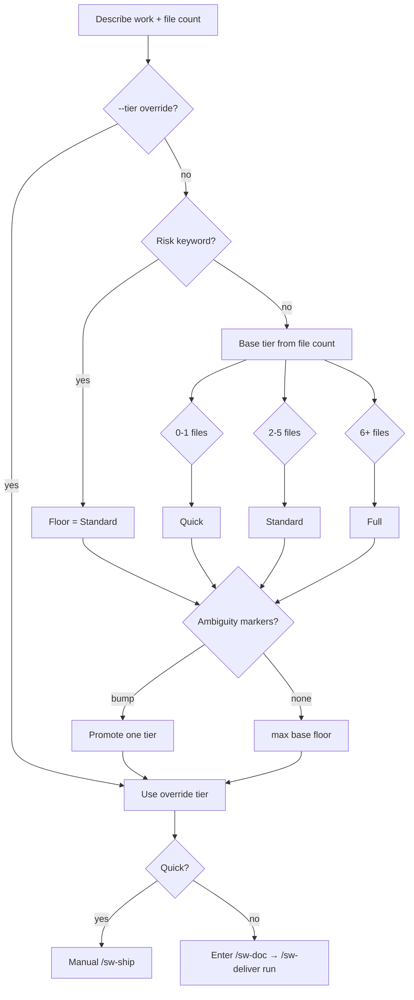

### Evidence-backed triage and planning entry

Deterministic tier classification in `scripts/triage_lib.py` remains authoritative. Project intelligence
feeds **advisory** `TriageEvidence@v1` through existing triage and doc-entry surfaces — no new slash
commands. Recommendations are **non-authoritative** (`authority: non-authoritative`); the safety-floor
hard veto and required gates cannot be lowered or bypassed (D3, D6).

#### Producer inputs

`scripts/triage_evidence.py` aggregates fresh producer signals into one evidence bundle:

| Producer signal | Source module | When unavailable |
| --- | --- | --- |
| `architecture-radar` | `scripts/architecture_radar.py` | `absent` + reason (never coerced to numeric zero) |
| `workflow-history` | `scripts/workflow_intelligence.py` | `absent` + reason |
| `exploration-findings` | `scripts/exploration_intelligence.py` | `absent` + reason (contract-only — exploration execution UX lives elsewhere) |
| `decision-graph` | `scripts/decision_graph/frontier.py` | `absent` + reason |
| `verification-capability` | `scripts/host_doctor_lib.py` | `absent` + reason |

Each signal carries an explicit weight, `present` or `absent` state, optional `safety-floor` class, and a
**freshness envelope** (`digest`, `observedAt`, `producerPath`, `producerSignature`, optional `expiresAt`,
invalidation metadata). Clock-only timestamps without digest binding are rejected.

#### Weighted advisory merge and veto order

Merge order is fixed and deterministic:

1. **Mechanical tier** — file count, risk keywords, ambiguity markers (existing `/sw-triage` scoring).
2. **Safety-floor veto** — fresh `safety-floor` signals enforce a minimum tier before any advisory promotion.
3. **Promotion-gated advisory** — weighted advisory score maps to a tier only when the capability registry
   reports `active` for `triage.recommendation`; otherwise advisory output is recorded in `explain` but not
   applied (`promotion_shadow` signal).

Weighted merge (`aggregate_weighted_advisory`) exposes each contribution, `absent` producers, and
`excludedStale` dispositions in the explain payload. Stale, expired, or digest-mismatched advisory signals
are excluded; fresh safety-floor inputs outrank stale advisory evidence.

Doc-entry rescore (`scripts/doc_rescore.py`) reads the same contract — deterministic rescore and safety
gates run first; there is no config or CLI override for safety-kernel vetoes.

#### Read-only status explanation

Inspect the live recommendation without mutating stores:

```bash
python3 scripts/status_collect.py triage-recommendation-explain \
  [--unit-id <unit-id>] [--description "<work description>"] [--file-count N] [--query "<text>"]
```

Returns `recommendation` (applied/deterministic/advisory/veto/floor tiers), weighted `contributions`,
`absent` and `excludedStale` lists, `promotion` binding (`capabilityId`, `revision`, `state`,
`evidenceRef`), and `evidenceTimestamp`. `readOnly: true` and `productAuthority: false` always — see
`core/commands/sw-status.md`.

Storage layout for producer artifacts, the capability registry, and compression evidence logs lives in
`.shipwright/layout.md` (**Project intelligence evidence and promotion stores**). Configuration keys:
`planning.intelligence.triageEvidence.*`, `planning.intelligence.capabilityPromotion.*`, and
`contextCompression.phase` — see `docs/guides/configuration.md`.

### Quick tier workflow

No spec artifacts — no frozen task list, so **`/sw-deliver` does not apply**. Triage routes to the
manual `/sw-ship` atomics. Quick work compiles to a **fixed WorkflowGraph** (`scripts/graph/quick_ship_compile.py`)
mirroring `canonicalPhaseChains.sw-ship` — implement → verify → review → gaps → commit → PR → CI →
stabilize → ready/merge-ready halt. Topology is config-declared only (no adaptive capability selection);
**never auto-merges**.


**Conductor vs GraphScheduler:** `/sw-deliver` autonomous conductor fans out phases and drives
merge queues — it does not replace `GraphScheduler`. WorkflowGraph node execution runs on the graph scheduler's
single owning loop via `ExecutionBackend`; Quick `/sw-ship` compiles to the same IR. No `/sw-graph-*` commands.

#### Quick ship parity matrix

| Concern | With PR | No PR yet | Resume authority |
| --- | --- | --- | --- |
| Terminal verdict | `merge-ready-green` | `merge-ready-green` | `ship-steps.json` (`currentStep`) |
| Merge | Never (human gate) | Never (human gate) | `--from <step>` or durable `ship-steps.json` |
| `verification-gate` | Unconditional | Unconditional | Re-run from `sw-verify` on stale evidence |
| Ready / `check-gate` | Unconditional | Unconditional | Re-run `sw-stabilize`/`sw-ready` chain tail |
| `sw-review` independence | Distinct judgment vote required | Same | `--skip-local` records bypass only |
| `--fast` | Skips `gap-check`, `sw-simplify` | Same | Bypass evidence written; mandatory gates unchanged |
| Legacy substrate | `ship_loop.py` step driver until cutover evidence | Same | Graph compile is observability + scheduler admission |

Rollback: the legacy step substrate is removed only after dogfood parity evidence; until then
`ship-steps.json` remains authoritative for resume even when a compiled graph exists.

```mermaid
flowchart LR
T["/sw-triage"] --> Q[Quick]
Q --> WT["/sw-worktree provision"]
WT --> ST["/sw-start"]
ST --> EX["/sw-execute"]
EX --> SH["/sw-ship"]
SH --> V["verify → review → commit"]
V --> PR["/sw-pr → /sw-watch-ci"]
PR --> STB["/sw-stabilize"]
STB --> RD["/sw-ready — PAUSE"]
RD --> MERGE[You merge]
MERGE --> CM["/sw-compound-ship"]
```

```text
/sw-triage — 1 file, fix export button label typo
/sw-worktree provision → /sw-start → /sw-execute → /sw-ship
```

### Standard tier workflow

PRD and frozen tasks before code. No brainstorm phase.

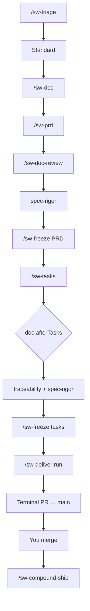

```text
/sw-doc
Feature: CSV export on reports table — 4 files, clear criteria, no auth
/sw-deliver run docs/prds/<n>-<slug>/tasks-<n>-<slug>.md
```

### Full tier workflow

Explores requirements before the PRD. Use when scope or product decisions are still open.

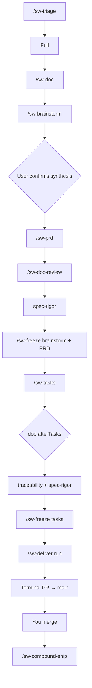

```text
/sw-doc
Feature: new billing portal — explore pricing models, 8+ files, auth + Stripe
/sw-deliver run docs/prds/<n>-<slug>/tasks-<n>-<slug>.md
```

> **Note:** `/sw-doc` **stops** on Quick tier and tells you to use the implementation workstream
> instead.

---

## Workflow sequencing invariants

These invariants apply to the durable doc driver (`scripts/doc_loop.py`) and the planning helpers it
calls. They are ordering contracts — violating them fails closed rather than silently skipping work.

### Number reservation transaction

Concurrent doc runs must not allocate the same PRD number. Reservation is transactional:

| Backend | Mechanism | Lock path |
| --- | --- | --- |
| File-store | Exclusive `.cursor/sw-planning-reservations/<nnn>.lock` until PRD body exists or stale reclaim | `planning_reserve.py` |
| Issue-store | Provider duplicate-open guard + store mint | `planning_store.py` |

`/sw-prd` and `/sw-tasks` call `planning_reserve.py reserve` before writing numbered artifacts. A second
run receives a distinct number or a fail-closed `reservation-held` halt — never a silent collision.
Stale reservations are reclaimable when heartbeat + PID predicates match the ship-lease staleness model.

```bash
python3 scripts/planning_reserve.py . reserve --unit-id <unit-id> --slug <slug>
python3 scripts/planning_reserve.py . release --number <nnn> --unit-id <unit-id>
```

### Pre-freeze rescore

After related-work acknowledgement and before PRD freeze, `/sw-doc` runs `final-triage-rescore`
(`doc_rescore.py`):

| Direction | Policy | Operator gate |
| --- | --- | --- |
| Escalation (tier bump) | Automatic — recorded on the doc-run receipt | None |
| Downgrade (tier drop) | Refused without explicit human-attributed justification | Human halt |
| Post-freeze signal | Recorded as amendment input only — frozen unit stays closed | `/sw-amend` path |

Escalation never reopens a frozen artifact. Downgrade without justification fails closed with a
machine-readable `halt` and the current/proposed tier in the payload.

### Profiles, budgets, and traceability

| Concern | Module | Config surface |
| --- | --- | --- |
| Optimization profile + budgets | `scripts/graph/profiles.py` | `graphExecution.profiles`, `graphExecution.budget` |
| TraceRef / CoverageEdge predicates | `scripts/graph/traceability.py` | `/sw-status` graph-progress + explain |
| Monotonic triage merge | `scripts/triage_lib.py` | `/sw-triage` (`classify` subcommand) |

Kernel immutables (`cache`, `loop_bounds`, `resourceLimits`) cannot be set on workflow profiles —
budget halt maps to **non-ready**; required capabilities are never shed to recover spend. Tier
reductions require authorized waiver paths (`human-waiver` or mechanical no-fire) via
`merge_tier_monotonic`. See `INVARIANTS.md` for the four cross-cutting enforcement paths.

### Publication sequencing invariants

Publication mode is store-conditioned — the doc driver never reaches standalone `docs-commit` /
`docs-pr` stages (`UNREACHABLE_PUBLICATION_STAGES` in `doc_loop.py`):

| Store mode | Publication path | In-driver behaviour |
| --- | --- | --- |
| File-store (`file-store-feature-seed`) | `wave_spec_seed.py` feature-seed onto `<type>/<slug>` at freeze/afterTasks | Acquire doc-to-feature handoff lock → real non-dry-run seed → release lock; no nested docs-PR |
| Issue-store (same-repo) | Same feature-seed path when publication mode permits | Handoff lock + seed as above |
| Issue-store (`separate-project-store-only`) | Feature-seed skipped | `skipped: true` — handoff lock not acquired |
| Issue-store (materialize) | Issue bodies authoritative; materialize at deliver run-entry | `planning_materialize.py` verifies frozen hash |

Standalone `scripts/docs_worktree.py` / `scripts/docs_pr.py` remain **operator tools** for pre-existing
docs branches — the durable doc driver does not invoke them. `publication_mode(root)` selects the path;
attempting an unreachable stage raises `publication-stage-unreachable`.

Target-lock ordering: doc-run exclusion (`sw-doc-run-locks/`) is acquired before persistent doc-run
state mutation, matching deliver target-lock precedence. Feature-seed additionally requires the
doc-to-feature handoff lock (`wave_spec_seed_guard.py`) and refuses when a live deliver target-lock
already holds the destination branch.

---

## Lifecycle routing — Capture → Explore → Specify → Build → Learn

Shipwright’s default lifecycle places **Explore** between **Capture** and **Specify**. Every stage has
explicit entry paths and bidirectional provenance where handoffs cross workstreams.

| Stage | Primary surface | Role |
| --- | --- | --- |
| **Capture** | `/sw-note` | Lightweight idea/note capture; graduate to explore with `--to explore` |
| **Explore** (optional) | `/sw-explore` | Destination-first structured exploration before planning |
| **Specify** | `/sw-doc` | PRD → review → freeze → tasks; backward route to explore when not ready |
| **Build** | `/sw-deliver run` | Phase-mode ship loops per frozen task list to integration merge gate |
| **Learn** | `/sw-retrospective` | Pre/post-merge compounding; optional gap capture and memory sync |

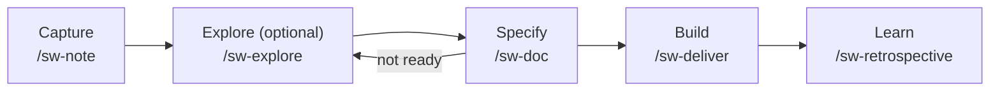

**Entry and provenance**

| Transition | Command / contract | Provenance |
| --- | --- | --- |
| Capture → Explore | `/sw-note graduate <id> --to explore` → `/sw-explore --from-notebook <id>` | Bidirectional `notebookId` on `ExplorationMap@v1`; reversible round trip |
| Idea → Explore | `/sw-explore idea <text>` or `/sw-explore <text>` | Fresh map with destination-first capture |
| Resume Explore | `/sw-explore resume <map-id>` | Optimistic revision on persisted map |
| Explore → Specify | `/sw-explore handoff <map-id> --to doc` → `/sw-doc` | Human confirm; loop guard in `workflow_extensions.py` |
| Specify → Explore | `/sw-doc` backward route when readiness insufficient | Cancelable `/sw-explore resume` proposal |

## Explore workstream — optional pre-planning

Use `/sw-explore` when product scope, destination, or acceptance boundaries are still open **before**
`/sw-doc`. Explore is **optional** — operators may skip directly to Specify or Build when tier and
acceptance criteria are already clear.

**Entry paths**

| Path | Command | Notes |
| --- | --- | --- |
| idea | `/sw-explore idea <text>` or `/sw-explore <text>` | Destination-first structured capture |
| notebook | `/sw-explore --from-notebook <id>` | Graduates `/sw-note` with bidirectional provenance |
| resume | `/sw-explore resume <map-id>` | Optimistic revision — stale writes fail closed |
| promote | `/sw-explore promote <map-id> --trigger <name>` | Human confirm before graph expansion |
| handoff | `/sw-explore handoff <map-id> --to doc` | Explicit forward route after readiness/brief |

**Authority boundaries**

- Humans own intent, blocking-unknown classification, promote triggers, and doc handoff — agents propose only.
- Explore **never** dispatches `/sw-deliver`, `/sw-ship`, `/sw-execute`, or opens implementation worktrees.
- Explore **does not** create PRDs, tasks, branches, or issue-store planning units (no mega-planning).
- Prototype evidence remains **non-production-eligible**; memory lookup routes through `memory-preflight` brokers only.

**Intelligence degradation**

Optional project-intelligence hooks (architecture radar, vocabulary, historical memory) are **degradable**:
absence or provider failure surfaces advisory state and exploration continues on canonical map data.

**Explore ↔ doc handoff**

| Direction | Trigger | Route |
| --- | --- | --- |
| Explore → doc | Readiness + brief + human confirm | `/sw-explore handoff … --to doc` → `/sw-doc` |
| Doc → explore | Insufficient readiness / blocking unknowns | `/sw-doc` backward route → `/sw-explore resume` |

Loop guards and decline receipts are enforced in `scripts/workflow_extensions.py`; never nested orchestrator dispatch.

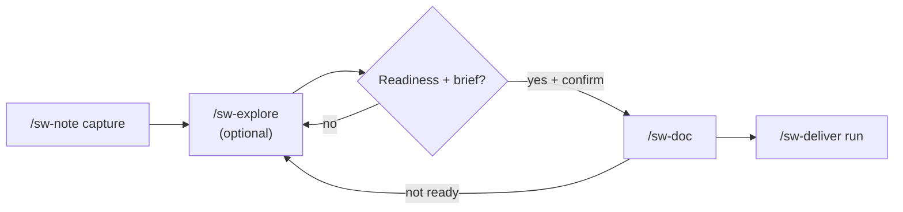

---

## Documentation workstream — spec before code

Use when tier is **Standard** or **Full** and you need a reviewed plan before implementation.

**Standard doc pipeline** (no brainstorm):

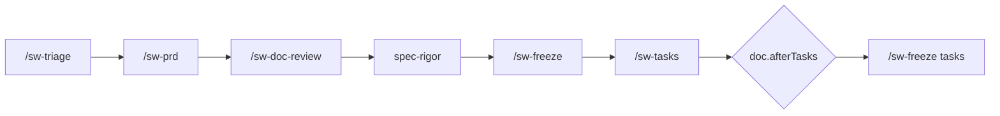

**Full doc pipeline** (brainstorm first):

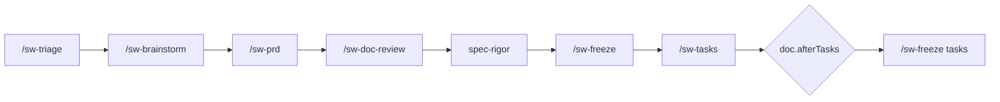

Or run `/sw-doc` to orchestrate either chain end-to-end.

**Typical flow**

1. `/sw-triage` — classify tier (or pass `--tier` to `/sw-doc`)
2. `/sw-doc` — runs the tier-appropriate doc chain
3. Human **`doc.afterTasks`** checkpoint after single-pass task freeze (default `confirm`) — a dedicated
**Implementation checkpoint** block (not buried in closing prose); only `proceed`/`yes` continues;
unrelated messages re-emit the checkpoint until acked
4. Frozen PRD + tasks become the spec for **`/sw-deliver run <frozen-task-list-path>`** (primary post-freeze
command; `/sw-doc` dispatches it on `confirm`/`auto`) or manual `/sw-ship` per phase

**Sample prompts**

```text
/sw-doc
Feature: user profile settings page
Context: Need PRD and tasks before implementation. Tier unknown — triage first.
```

```text
/sw-prd --tier standard
Feature: add export-to-CSV on reports table
Context: 3–4 files, no auth changes. Skip brainstorm.
```

**Key commands**

| Command | Use when |
|---------|----------|
| `/sw-doc` | End-to-end doc pipeline orchestrator |
| `/sw-triage` | Classify Quick / Standard / Full only |
| `/sw-brainstorm` | Full-tier requirements exploration (before PRD) |
| `/sw-prd` | Draft PRD or decision record |
| `/sw-doc-review` | Persona panel on spec drafts |
| `/sw-freeze` | Lock artifact; no further edits without `/sw-amend` |
| `/sw-tasks` | Generate task list from frozen PRD |
| `/sw-amend` | Post-freeze correction via amendment file |

### Planning publication sequencing

Doc authoring follows strict **Publication sequencing invariants**: substantive edits route through
`docs-edit-route` onto a `docs/<topic>` worktree and PR; mechanical INDEX/COMPLETION-LOG projections
batch separately. Never commit substantive planning bodies on the protected default branch.

Before `/sw-freeze`, `/sw-doc` may run a **Pre-freeze rescore** (`scripts/doc_rescore.py`): tier
escalations apply automatically; downgrades require explicit human-attributed justification. A rescore
signal after freeze is amendment input only — it does not reopen the frozen unit.

New planning units receive a PRD number through **Number reservation transaction**
(`scripts/planning_reserve.py`): under issue-store the store mints via duplicate-open-tasks guard; under
file-store a git-common-dir lock reserves the number until completion or staleness reclaim. Same-process
threads serialize through an allocator lock in addition to `flock(2)`.

**Doc-loop concurrency:** concurrent doc runs share `.cursor/sw-doc-runs/index.json` under a
`planning_txn.store_lock`. Cross-clone exclusion for target and doc-to-feature handoff locks uses
`wave_remote_lease` git-ref CAS. See `.shipwright/layout.md` Doc-run layout and target-lock sections.

---

## Implementation workstream — ship a feature from spec

**Primary path:** `/sw-deliver run` orchestrates every phase from the frozen task list to one terminal
merge gate. `/sw-ship`, `/sw-execute`, and the other ship-loop atomics still exist — `/sw-deliver`
invokes them per phase; run them manually only for Quick-tier hotfixes, debugging, or single-phase
reruns.

**Graph runtime:** after cutover, deliver (and the other orchestrators) compile onto
**WorkflowGraph** — the sole production execution runtime. Operator status and explain stay on
`/sw-status`; plan summaries use `/sw-deliver --explain-plan`. Cutover advances
`dogfood` → `limited-scope` → `full-ownership` without a parallel command surface or dual runtime.
See [`commands.md` — Graph execution runtime](commands.md#graph-execution-runtime) and
[`graph-domain-terminology.md`](graph-domain-terminology.md).

### Typed fragment composition and adaptive convergence

Workflow templates under `.sw/workflows/` compose from **typed subgraph fragments** before the kernel
compiler runs. Convergence loops and shadow evaluation are graph-runtime primitives — operator UX stays
on `/sw-deliver` and `/sw-status` (no graph-prefixed slash commands).

**Fragment composition:**

| Concept | Behavior |
| --- | --- |
| **`use:` pin** | Templates reference fragments as `<name>@<version>` (for example `security-review@2`); expansion is deterministic and records each fragment digest |
| **Ceilings** | Static cycle detection plus maximum depth, node, and edge ceilings during expansion — errors name the offending fragment pin |
| **Required-capability fragments** | Non-skippable; `when:` guards on required-capability fragments read only pre-dispatch mechanical artifacts |
| **Parent re-approval** | A fragment upgrade changes the expanded digest; unapproved digests cannot dispatch |

**Semver packages, lockfile, and trust:**

Workflow fragments can be published as semver packages under `.sw/workflows/packages/` with pins recorded
in `.sw/workflows/lock.json`. Discovery of a catalog entry does **not** imply trust — resolution fails
closed unless the lock digest, signature, and out-of-band trust anchors all match.

| Concept | Behavior |
| --- | --- |
| **Producers** | `shipwright` (this repo) and `shipwright-dogfood` publish signed packs |
| **Consumers** | `shipwright` dogfood path plus `shipwright-sibling-consumer` for cross-repo reuse |
| **Trust anchors** | Configured only in `.cursor/sw-package-trust-anchors.json` — never from pack, registry, or repo under resolution |
| **Lock edits** | Digest-level lock diffs require the same human/admin approval as pack approval |
| **Expansion tuple** | Kernel compile binds `(packDigest, profileId, requirementSetDigest, kernelVersion)`; additive detector injection is admitted without re-approval; weaken/remove requires fresh approval |
| **Adoption metrics** | Rollout reports reuse count, update friction, and broken-pin rate via `scripts/graph/packages/adoption.py` |

Trust path: **discover → resolve → digest pin → approve(tuple) → compile**.

**Shadow evaluation:**

Before a proposed graph can replace canonical dispatch, **shadow mode** scores the candidate against
canonical using kernel-derived metrics only. Shadow holds no credential broker, no outbound adapter, and
no write-scoped worktree; mutating node kinds are estimated from receipts rather than executed.
Proposal-supplied metric fields (including any `shadowScore` payload) are ignored. Outcomes surface on
`/sw-deliver` (shadow comparison) and `/sw-status` (`explain`) — see
[`commands.md` — Workflow optimizer policy](commands.md#workflow-optimizer-policy).

**Adaptive convergence:**

Bounded discovery loops run until dry, a discretionary stop fires, or a hard ceiling is hit.

| Control | Meaning |
| --- | --- |
| **`max_rounds`** | Hard ceiling — exceeding it halts with partial fingerprints preserved (`graph.convergence.max-rounds-exceeded`) |
| **Discretionary stops** | After at least two healthy productive rounds: marginal-value, duplicate-rate, or token-budget early stop |
| **`dry-clean`** | Success only when discovery exited successfully, produced non-empty evidence, and was not truncated or rate-limited (`graph.convergence.dry-clean`) |
| **`dry-error`** | Halt or fail — truncated, rate-limited, or errored discovery is never treated as converged (`graph.convergence.dry-error` and related codes) |

Stable convergence reason codes and canonical next actions are emitted onto graph status and explain
surfaces via `scripts/graph/observability.py`. Term definitions:
[`graph-domain-terminology.md`](graph-domain-terminology.md).

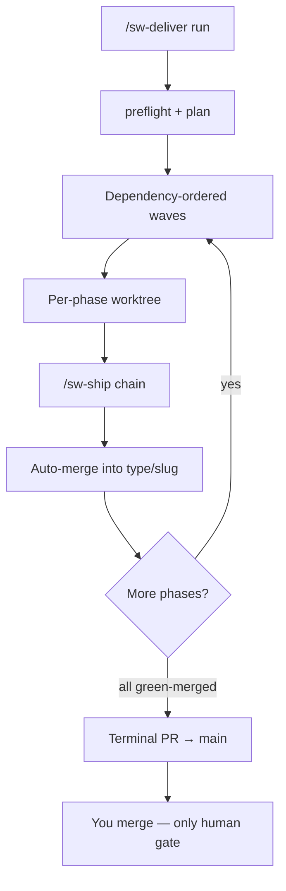

### `/sw-deliver run` — phase-mode play button (default)

When `/sw-doc` has produced a **frozen** task list (`tasks-<n>-<slug>.md`), `/sw-deliver` is the
default implementation orchestrator. Mode auto-detect from input:

| Input | Mode |
|-------|------|
| `--task-list docs/prds/<n>-<slug>/tasks-....md` | **phase-mode** — one feature, many phases |
| `--items A,B` + `--edges C:A` | **multi-feature** — independent features + integration branch |

**Typical phase-mode flow:**

```text
/sw-deliver run docs/prds/004-my-feature/tasks-004-my-feature.md
```

1. `preflight` + `plan` — validates frozen tasks, CI/review base-branch preflight, writes
`.cursor/sw-deliver-plan.json`.
2. Provisions orchestrator + per-phase worktrees; dispatches full `/sw-ship` per phase.
3. Auto-merges each green phase into `<type>/<slug>`; siblings continue on blast-radius block.
4. Opens a **single terminal** `<type>/<slug> → main` PR when all phases are `green-merged` — the
only human merge gate for the feature.

**Resumption:** re-run the same `run` command after interrupt; `resume reconcile` skips
`green-merged` phases. Use `plan --from <phase>` when upstream phases are already merged.

**Dry-run:** `scripts/wave.py plan --task-list <path> --dry-run` emits the plan JSON without writing
`.cursor/sw-deliver-plan.json`.

**Durable autonomy:** the driver is `scripts/wave.py deliver-loop` (also invoked by
`/sw-deliver run`). It persists cursor state in **scoped** `.cursor/sw-deliver-state.<slug>.json` at the
repo root (canonical — ), resumes after crash without restarting from plan, and never emits manual
“next steps” prose while work remains. Phase advancement keys off durable `status.json` in each
**phase-worktree** (`status collect` — not chat). Per-phase `/sw-ship` persists step-level state
(`ship-steps.json`) for mid-chain resume.

**Phase-mode context (worktree-scoped):** when `/sw-deliver` dispatches `/sw-ship` for a phase, it
MUST invoke with `--phase-mode` and carry context via **worktree-scoped state**
(`.cursor/sw-worktree-state.json` → `phaseMode`) and/or an **explicit dispatch environment** set on
that spawned process only (`SW_PHASE_MODE`, `SW_PHASE_SLUG`, `SW_PHASE_ID`, `SW_RUN_DIR`,
`SW_TASK_LIST`, `SW_INTEGRATION_BRANCH`). Ambient orchestrator shell env or a sibling worktree must
not activate phase-mode — only the dispatcher's per-spawn bindings count. Interactive human `/sw-ship`
runs omit `--phase-mode` (default). See `core/commands/sw-ship.md` **Phase-mode contract**.

**Concurrent deliver:** orthogonal features may run `/sw-deliver run` in parallel — each
target branch owns scoped state/lock files. `/sw-status` lists every in-flight run via
`.cursor/sw-deliver-runs/index.json`. Living docs (`INDEX.md`, `CHANGELOG.md`) stay serialized via
`.cursor/sw-living-docs.lock`.

**Freeze-time commit:** `/sw-freeze` commits frozen artifacts onto `<type>/<slug>` immediately
(closing the working-tree data-loss window) via the same spec-seed helper as `/sw-doc` afterTasks — never
`main`.

**Autonomous conductor:** `/sw-deliver` loads `skills/conductor/SKILL.md` and runs an
**in-turn self-continuation loop** — after each `deliver-loop` step the conductor re-invokes the driver
until a **legitimate halt** (terminal merge gate, exhausted remediation, ambiguous/destructive action,
configured checkpoint, phase timeout, external-wait exhaustion, or run-level budget). Routine steps
(status collect, merge enqueue, bookkeeping, living-doc reconcile) never pause for user input.

**Parallel dispatch:** dependency-ready phases within a wave dispatch as background sub-agents in
disjoint worktrees, bounded by `worktree.parallelCeiling` (default 4). Peak concurrency ≥2 when the
plan has parallelizable waves. Outcomes are read only from durable `status.json` — never chat logs.
Merge is single-flight (conductor-serialized queue + lock).

** deliver invariants:** whole-batch merge gating (no lone merge-enqueue while siblings lack
validated terminal status), deterministic-conflict auto-regen on the bounded path set, terminal
status.json provenance + blessed /sw-ship --phase-mode recovery (never hand-edit status), and
bounded verify:failed → /sw-stabilize remediation. CI-required fixtures:
feat-test-plan-dual-ship-fixtures, feat-test-plan-regression-remediation-fixtures,
feat-test-plan-parallel-merge-safety-fixtures, feat-test-plan-status-integrity-fixtures,
feat-test-plan-mechanical-sourcing-fixtures, feat-test-plan-deliver-invariant-fixtures.

**Pervasive delegation:** all five orchestrators (`/sw-doc`, `/sw-ship`, `/sw-deliver`,
`/sw-debug`, `/sw-feedback`) default to **delegate-by-default** for substantive steps. Only closed
inline allowlists (bookkeeping, driver invocations, human gates) run in-turn. Every delegated `Task`
must carry an explicit resolved `model:` and caveman intensity — enforced by `dispatch-check.py` and
mechanical `dispatch preflight` + `preToolUse` deny. Tune gate aggressiveness with `delegation.mode`
(`bind-only` | `heuristic` | `default`). Intensity maps live in `communication.routing` (command → skill
→ agent → default). See `rules/sw-subagent-dispatch.mdc` and `core/sw-reference/models-tiering.md`.

**Legitimate halts (summary):** final merge to `main`; remediation budget exhausted; merge conflict /
destructive git; `deliver.autonomy.mode: supervised` or `doc.afterTasks: confirm`; phase liveness
timeout; CI/external wait exhausted; run-level `deliver.autonomy.maxRunMinutes` / `maxIterations`;
**credential lookup blocked or timed out** (`resolver-lookup-timeout` when an interactive backend
blocks past the per-lookup hard timeout — recorded as a legitimate conductor halt with
`haltResume.haltCause`, not a silent retry loop).
**Merge-exec recovery:** when `merge run-next` halts with an open `mergeJournal`, resume via the
printed `resumeCommand` — journal auto-clear runs when ancestry shows the phase already merged; otherwise use
`python3 scripts/wave.py merge ancestry-check` then `merge exec` or `/sw-deliver run`. See
[`parallel-merge-and-recovery.md`](../../core/skills/deliver/references/parallel-merge-and-recovery.md).

Every halt emits one consolidated report with an exact `resumeCommand` — not “continue?”.

See `configuration.md` for `deliver.autonomy` defaults and `skills/conductor/SKILL.md` for the full
contract.

**Merge queue:** phases with no per-phase PR use a local-evidence merge path; phases with a PR use
`check-gate.py`. `status.json` binds to the phase head SHA — stale status cannot authorize a merge.
The orchestrator worktree owns a non-detached `<type>/<slug>` checkout; phase merges advance that ref
(no manual fast-forward on the primary checkout).

**Pre-merge compounding:** after all phases are `green-merged`, the driver runs `/sw-retrospective
--pre-merge` (single-sourced chain; deprecated `/sw-compound-ship` routes to the same). File outputs
are committed on the feature branch; memory writes are not committed. `compound.autonomy` (`supervised` |
`auto`) gates approval prompts only — memory fail-closed and rule-class human gates always apply.
Completion is recorded as `completed-pending-merge` until the human merges; the loop then suggests
`/sw-cleanup` (dry-run first; agent asks for confirm before applying removals).

**Retro painful → gap capture:** optional supervised gap drafts from structured retro
output. **`retrospective.gapCapture.enabled` defaults to `false`** — operators must opt in. When enabled,
only retro items with **`kind: painful`** auto-draft to `.cursor/sw-gap-draft-inbox/`; `well` and `change`
are excluded. **`maxCapturesPerRun`** caps drafts per retrospective invocation; exceeding the cap stops
further drafts and surfaces an operator message (no silent overflow). Materialization is never in-loop —
operators run `planning_gap_capture.py` confirm/materialize with per-item digest binding after review.
Draft → confirm → materialize lifecycle and route records are documented in
[`configuration.md`](configuration.md#retrospective-gap-capture) and
[`/sw-retrospective`](../../core/commands/sw-retrospective.md). Distinct from terminal
`deliver.terminal.gapCapture` at deliver completion.

**Task currency:** frozen task checkboxes may be toggled in-loop; a currency gate blocks the terminal
merge if checkboxes diverge from the durable ledger.

**Living-doc currency:** INDEX status, COMPLETION-LOG, and GAP-BACKLOG reconcile in-loop on the
feature branch; `docs-currency` hard-blocks the terminal gate on drift for the current PRD.

**Planning lifecycle:** units under `docs/planning/` carry typed lifecycles and `depends:`/`absorbs:`/
`supersedes:` edges. The maintenance reconciler (`planning-graph reconcile`) regenerates the INDEX `derived`
region and archive view; deliver writes `inFlight` only. `/sw-deliver next` and the unit-level dependency gate
fail closed on unmet prerequisites (`planning.autonomy` soft-enforces priority on explicit `--task-list`).
Legacy `GAP-BACKLOG.md` is a read-only projection during cutover — gap capture writes canonical gap units.

**Hybrid PRD absorbs:** under issue-store, PRD-side `absorbs:` survives put→get as durable
`sw-edges` entries with `rel: absorbs` — not as raw YAML on the operator body and not as label-only discovery.
Put compose merges absorbs into the existing edge set and preserves native links; read parses the fence before
strip with edges authoritative over truncated labels. Linkage (`record_absorb_linkage`) writes PRD-side absorbs
before gap-side puts; revision conflicts refetch+remerge — never resubmit stale bytes.

**Deliver `target` shapes:** run-state `target` may be either a feature-branch string
(`feat/<slug>`) or an object `{"branch":"feat/<slug>", ...}`. All branch resolution — cleanup enumeration,
scoped in-flight protection, adopt breadcrumbs, merge enqueue — routes through `target_branch_from_state()`;
ad-hoc `(state.get("target") or {}).get("branch")` on those paths is prohibited. An unresolvable migration
breadcrumb or missing target **widens** in-flight protection (fail closed) rather than narrowing scope to a
stale slug — see `/sw-cleanup` scoped-run rules in `core/commands/sw-cleanup.md`.


**Doc frontmatter traceability:** Full-tier PRDs carry `brainstorm:` in frontmatter; writable brainstorms
may gain `prd:` forward links. `/sw-freeze` verifies resolvable linkage before freeze.

**Branch policy:** workflow-created branches use conforming type prefixes (`feat/`, `fix/`, …) from
`release-please-config.json` — never `pf/`.

**Secret safety:** `scripts/secret-scan.py` runs at every workflow push chokepoint (`git-push.py`);
range-scoped redaction is required (`scripts/redaction-guard.py` refuses bare-branch history rewrite).


### Terminal ship-run chain (`ship run`)

After all phase PRs merge into the integration branch, the supervised terminal checkpoint runs
`python3 scripts/wave_terminal.py ship run` (prepare → push → bounded **`watch-ci`** → stabilize) without
exiting inside prepare/retro helpers. Bounded polling honors `checks.watch.maxWaitMinutes`;
single-shot `check-gate` is dry-run/test only.

Phase-mode `/sw-ship` uses the same durable `ship_loop.py` driver: mechanical steps advance in-process;
`sw-watch-ci` polls check-gate with backoff.

### Terminal acceptance record (deliver closeout)

When all phases reach `green-merged` and the terminal gate is live green, deliver persists a validated
**terminal acceptance record** before the human merge gate on `<type>/<slug> → main`.

| Concern | Contract |
| --- | --- |
| **Status location** | `.cursor/sw-deliver-runs/<runId>/terminal-acceptance.json` (run-scoped; see `.shipwright/layout.md`) |
| **Schema fields** | `schemaVersion`, `runId`, `targetBranch`, `sourceTaskList`, `phases`, `terminalPr`, `terminalGate`, `terminalGateExitCode`, `gatesRunRollup`, `interactionCount`, `recordedAt` |
| **Verification** | `python3 scripts/wave_terminal.py terminal pr gate` on green paths; `wave_acceptance.validate_acceptance_record` and `wave_terminal.validate_acceptance_schema` refuse incomplete ledgers |
| **Resumable halts** | Legitimate terminal interrupts attach `haltResume` (`haltCause`, `resumeCommand`, `runId`, `autonomyDirective`) via `halt_resume.enrich_legitimate_halt` — resume with `/sw-deliver run` (never bare `deliver-loop`) |

Interactive `/sw-ship` phase-mode runs emit per-phase `status.json` only; the terminal acceptance record
is a **deliver-run** artifact after all phases merge — distinct from phase `merge-ready-green`.

### gap-check write before merge-ready-green

Before publishing `merge-ready-green` status, run gap-check and **write** durable status through
`python3 scripts/gap-check-gate.py write` (or `status_integrity.py write`). Skipping the write leaves
terminal status fail-closed ( / ).

### `/sw-ship` — single-phase loop (manual / Quick tier)

Used directly for **Quick-tier** work (no frozen task list) or when debugging a single phase. When
you run `/sw-deliver`, this chain executes **inside** each phase.

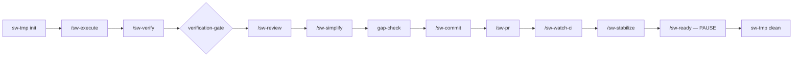

Halts on verification failure, review blockers, or red CI. **Never auto-merges.**

**Typical manual flow** (Quick tier or single-phase debug)

1. `/sw-worktree provision` — isolated worktree for the work item
2. `/sw-start` — phase branch
3. `/sw-execute` — implement one task slice
4. `/sw-ship` — verify → review → commit → PR → watch CI → stabilize → **pause at merge-ready**
5. You merge manually; then `/sw-compound-ship` in the target repo

**Sample prompts (manual / debug)**

```text
/sw-worktree provision
Work item: user-profile-settings (from tasks)
```

```text
/sw-ship
Context: Phase 1 tasks 1.1–1.3 complete. Parent branch main. Run full loop through stabilize.
```

**Post-merge chain (`/sw-compound-ship`):**

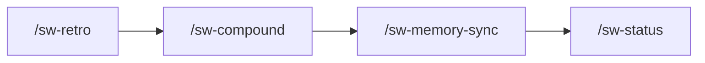

**Key commands**

| Command | Use when |
|---------|----------|
| `/sw-deliver run <frozen-tasks>` | **Primary** — orchestrate all phases to one terminal merge gate |
| `/sw-ship` | Manual single-phase loop (Quick tier, debug, or without `/sw-deliver`) |
| `/sw-worktree` | Create or tear down per-item worktree (manual; `/sw-deliver` provisions automatically) |
| `/sw-start` | Open phase branch inside worktree (manual path) |
| `/sw-execute` | One bounded implementation slice (manual path; first step inside `/sw-ship`) |
| `/sw-verify` | Run scoped lint/typecheck/test |
| `/sw-review` | Local multi-agent + provider review |
| `/sw-commit` | Commit after verify + review |
| `/sw-pr` | Push and open/update PR |
| `/sw-watch-ci` | Poll PR checks until green/red/timeout |
| `/sw-stabilize` | Clear failing checks and review threads |
| `/sw-ready` | Final readiness report (never merges) |
| `/sw-compound-ship` | Post-merge retro → compound → memory sync |
---

## Issue-store migration lifecycle preservation ( Phase 2)

When migrating between in-repo markdown artifacts and the configured `issue-store`, lifecycle metadata
survives in **both directions** (`files-to-issues` and `issues-to-files`). Bodies are content-hash verified
before any source is removed; lifecycle fields are checked as part of verification.

### Open / frozen status

- **Files → issues:** `frozen: true` (and optional `frozen_at`) in frontmatter becomes the `sw:frozen` label
on the issue, issue lock, and a freeze-record comment when applicable. Open vs closed issue state follows
artifact `status` (gaps with `status: resolved` close the issue).
- **Issues → files:** `sw:frozen` and `sw:frozen-at:*` labels restore `frozen: true` and `frozen_at` in
frontmatter. Issue `open`/`closed` state maps back to artifact lifecycle fields.

### `sw-edges` and native links

- **Files → issues:** The canonical `sw-edges` fenced block (and any frontmatter edge keys) is composed
into the issue body; provider-native link projections are stored alongside canonical edges.
- **Issues → files:** Edges and native projections round-trip into the `sw-edges` block (and frontmatter
edge keys when present). Divergence beyond tolerance fails verification.

### Gap status

- **Files → issues:** Gap units carry `status` (`open`, `planned`/`scheduled`, `resolved`) as issue labels
(`open`, `gap-scheduled`, `resolved`) plus optional `sw:gap-schedule:*` labels.
- **Issues → files:** Labels restore `status` and `schedule` frontmatter on gap artifacts under
`docs/planning/gap/`.

### Visibility gate (per create)

Every migration **create** resolves visibility via before any API write. A private or
`memory`-class artifact targeting a public/shared issue store is **refused** for that item only: it is
reported in the migration plan (`refusedCount`, action `refused`, reason `visibility`), its source file
remains untouched, and the rest of the batch continues.

### Bidirectional guarantees

| Concern | Files → issues | Issues → files |
| --- | --- | --- |
| Body | Hash-verified after create | Hash-verified after write |
| Frozen | `sw:frozen` + lock + freeze record | `frozen: true` in frontmatter |
| Edges | `sw-edges` block + native links on issue | `sw-edges` block restored |
| Gap status | Status labels on issue | `status` / `schedule` frontmatter |
| Visibility | Refused before create if private | `visibility` frontmatter from labels |

Operator entry: `/sw-migrate` and `python3 scripts/planning_migrate.py <repo> store-files-to-issues`
(dry-run default; `--apply` to mutate). Journal:
`.cursor/hooks/state/issue-store-migration-journal.json`.

## Issue-native doc-review and release grouping ( Phase 3)

Inert when `planning.store.backend != issue-store`.

### Doc-review via issue comments (, )

Under issue-store, `/sw-doc-review` posts persona findings as marker-delimited `sw:doc-review` comments on the
PRD artifact issue. Synthesis opens a **review-round manifest** pinning ordered comment IDs + revisions at
checkpoint; any add/edit/delete before synthesis **fails closed**. Persona comments are excluded from
canonicalization. When `backend != issue-store`, the in-IDE parallel sub-agent panel + JSON synthesis is
unchanged (no regression).

Human review notes use a separate comment channel (no `sw:doc-review` marker).

### Release grouping (, )

`planning.releaseGrouping.mode` maps `sw:prd` units to provider milestones (`github-issues`) or iterations
(`gitlab-issues`) via the capability-gated `issue-milestone` verb. Absent capability → skip with operator
notice; deliver continues with flat-label fallback (`planning.releaseGrouping.labelPrefix`). Scheduler wiring
is — 045 is grouping/annotation only.

See `core/commands/sw-doc-review.md`, `core/skills/doc-review/SKILL.md`, and
`docs/guides/configuration.md` **Release grouping**.


## Issue-derived graph, hierarchy, and cross-project recall ( Phase 3)

Inert when `planning.store.backend != issue-store`.

### Task-list hierarchy (, , )

Frozen task lists project to provider epic/sub-issue hierarchy where supported; providers lacking
hierarchy verbs degrade to checkbox/body-encoded phase lists with operator notice — deliver continues.

```bash
python3 scripts/planning_hierarchy.py <repo> resolve-mode
python3 scripts/planning_hierarchy.py <repo> project docs/prds/<n>-<slug>/tasks-<n>-<slug>.md
python3 scripts/planning_hierarchy.py <repo> aggregate-status --payload-json '<parent+children>'
```

Parent epic status aggregates from children on read; contradictions fail closed. Body `sw-edges` blocks are
authoritative over native sub-issue links on conflict.

### Cross-project recall

Rationale pointers may be recalled across `projectKey` boundaries when authorized; dereference is redacted
via `memory-redact` so project B cannot read project A private rationale.

```bash
python3 scripts/planning_cross_project_recall.py recall --payload-json '{"sourceProjectKey":"a","callerProjectKey":"b",...}'
```

See `core/skills/memory/SKILL.md` **Cross-project recall**.

### inFlight tracking-issue safety

Optional tracking issues for committed `inFlight` tuples route through `planning_tracking_issue.py` and
`redact_inflight_tuple`; private/`memory` units are refused on public origin stores.

See `core/skills/deliver/SKILL.md` **Task-list hierarchy and inFlight tracking issues**.


## Issue-store deliver progress and native links

Inert when `resolve_effective_backend` ≠ `issue-store` (file-store paths unchanged — ).

### Native provider links (–, )

Issues adapters implement `native_links` on create/update/read — no discard on write. `sw-edges` in the
issue body stays authoritative; native links are projections for provider UI readability.

| Provider | Adapter | Native link verbs |
| --- | --- | --- |
| GitHub | `planning_github_client.py` | Sub-issue REST when capable; `cross-reference` comment fallback |
| GitLab | `planning_gitlab_client.py` | Issue link API where available |
| Jira | `planning_jira_client.py` | Issue links via REST; link type from createmeta / `planning.store.issues.linkDefaults` |

`planning_canonical.native_links_from_edges` resolves `sw-edges` unit targets to issue ids via the issue
unit index. Emission paths: migration create, `planning_gap_capture`, `planning_hierarchy` sub-issue create,
and edge reconciliation.

`python3 scripts/planning_store.py probe-issues-token` includes `nativeLinksCapable: true|false`. When the
provider lacks link scope or the API returns 403/404, adapters emit one per-run stderr notice
`native-links-degraded` and deliver continues — body edges remain authoritative .

### Deliver hierarchy and progress sync (–, )

| Hook | Module | Action |
| --- | --- | --- |
| Phase provision | `wave_deliver_loop.py` → `planning_progress.provision_deliver_hierarchy` | Apply `planning_hierarchy.project_task_list_hierarchy`; persist `hierarchyMap` on deliver state |
| Phase `merge-ready-green` | `wave_merge.py` → `planning_progress.sync_phase_done` | Apply `sw:phase:<id>:done` label on phase sub-issue |
| Checkbox toggle | `phase_acceptance_gate.py` / `execute_task_status.py` → `planning_progress.propagate_checkbox_to_issue_store` | Mirror phase task checkboxes onto sub-issue body when `hierarchyMap` present |

Deliver state shape: `hierarchyMap: { epicIssueId, phases: { "<id>": { issueId, unitId, doneSynced? } } }`.
Providers without hierarchy verbs degrade to checkbox/body-encoded phase lists with operator notice — deliver
continues. Label/body sync failures emit `progress-label-degraded` or `progress-body-degraded` once per run.

Run-entry materialize (`planning_materialize.py`) still verifies frozen task-list hash before `plan`/`preflight`
when the logical `body-path` is issue-backed only ( Phase 0).

### Living-docs issue projection

When `planning_cutover` marks the `derived` region `issue`, `wave_living_docs.py reconcile` calls
`planning_index_issue.project_index_status` instead of file `set-index-status` — INDEX PRD status is written
via `planning_store.put` on the derived artifact unit. File authority unchanged when `derived` ≠ `issue`.

Terminal reconcile still runs `gap-resolve` for absorbing PRDs when INDEX status is `complete`; gap rows are
edited on canonical gap **issues** — `docs/prds/GAP-BACKLOG.md` is a read-only projection refreshed by
`planning_gap_capture.py refresh-projection`.

Fixture suites: `planning-native-links-fixtures`, `planning-deliver-progress-fixtures`; extend
`planning-cutover-fixtures` for issue-derived INDEX projection.


## Debug workstream

Use when something is broken in production or you need RCA before fixing.

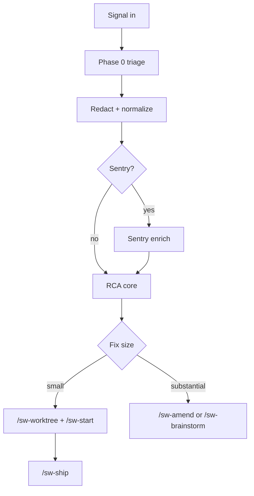

**Typical flow**

1. `/sw-debug` with signal (Sentry issue, stack trace, deploy log excerpt)
2. RCA core diagnoses; routes by fix size:
- **Small** → `/sw-worktree` + `/sw-ship`
- **Large** → `/sw-brainstorm` or `/sw-amend`

**Sample prompts**

```text
/sw-debug
Signal: Sentry issue PROJECT-123 — NullReference in CheckoutService.SubmitOrder
Context: Started after deploy v2.4.1 yesterday. 400 events/hour.
```

```text
/sw-debug
Signal: CI passes locally but fails on PR #42 — test_user_export timeout
```

**Key commands**

| Command | Use when |
|---------|----------|
| `/sw-debug` | RCA + route; does not implement or merge |
| `/sw-feedback` | Normalize inbound signal and suggest route (human confirms) |
| `/sw-feedback-close` | Close backlog signal after fix verified shipped |

---

## Feedback workstream

Use to capture signals without immediately analyzing them.

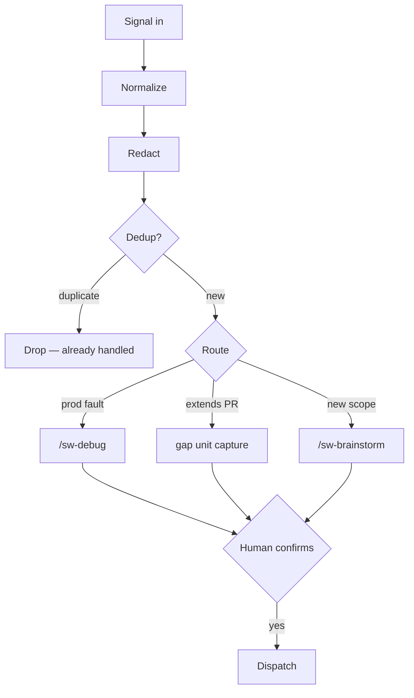

**Sample prompt**

```text
/sw-feedback
Signal: Code review on PR #88 — "missing rate limit on public endpoint"
Source: review comment
```

`/sw-feedback` redacts, classifies, and proposes a route. **Confirm** before dispatch.


## Planning autonomy and two-track edits

035-owned sections complement lifecycle/reconciler docs (033-owned).

### Backlog pull-in (–)

At PRD creation (`/sw-prd`) and task generation (`/sw-tasks`), `scripts/planning-related.py` scans the graph
and emits a **confirm-list** — never auto-absorbs. Stale/already-resolved candidates are flagged; human confirms
via `planning-related.py confirm`. Private units contribute metadata only ( visibility resolver).

### Autonomy posture (–)

| Mode | Behavior |
| --- | --- |
| `maintenance-only` (default) | Mechanical INDEX `derived` / reconciler bookkeeping runs without prompts; content decisions stay human-gated |
| `full-conductor` (opt-in) | Gap/absorption-class auto-decision under conductor legitimate-halt + mutation budget; never private/memory units; handoff-only (no nested orchestrators) |

Config: `planning.autonomy` + `planning.fullConductor.*` — see [configuration](configuration.md#planning-autonomy).

### Two-track doc-edit driver (–)

| Track | Allowlist | Route |
| --- | --- | --- |
| Mechanical | INDEX `derived` only, SUPERSEDED manifest, gap index | Batched `docs-merge.py` with CI auto-merge |
| Substantive | Any `docs/planning/<unit-id>/` path | Auto-driven docs worktree + PR via `docs-edit-route.py` |

`inFlight` is never mechanical. Branch protection probe fails closed to PR path.


## Scheduler frontier skip + park governance

`planning-graph.py next` (file path, via `wave_deliver.py` → `planning_deliver_gate.cmd_next`) and the
issue-store scheduler (`planning_scheduler.py`) **skip** units that cannot run — instead of failing the
whole frontier — and report why:

- A unit with no frozen task list is skipped as `no-frozen-task-list`; the scheduler advances to the next
runnable unit and lists the skips under `skipped` in its JSON payload .
- The issue-store frontier additionally drops units carrying the `sw:parked` label, so legacy migrated
units (e.g. `003-prd-pr-agent-review-provider`) no longer stall scheduling (, D4).

**Park governance .** Parking is deliberately gated so a unit cannot be silently removed:

```bash
# allowlisted actor + reason required; refused fail-closed otherwise
python3 scripts/planning-graph.py park <unit-id> --reason "<why>" [--actor <actor>]
python3 scripts/planning-graph.py unpark <unit-id> [--actor <actor>]
```

- The acting operator must be listed in `planning.scheduler.parkAllowlist` (see
[configuration](configuration.md)); an empty allowlist authorizes no one, and a park with no reason is
refused.
- Parked units are recorded in the local, backend-neutral registry `.cursor/planning-parked.json`
(`unit-id → {reason, actor, at}`); the file-store path is unchanged when nothing is parked .

**Scheduler-exhausted halt.** When the eligible frontier is non-empty but every candidate is parked or
unrunnable, the scheduler emits an explicit `scheduler-exhausted` halt (exit 40) naming the parked and
unrunnable units plus the unpark remediation — never a silent empty result. `planning-doctor.py` surfaces
the same condition as an `over-parked-frontier` drift finding.


## Linear adapter documentation currency

Adapter-complete for and close requires the documentation inventory below to be
current. Verify before terminal merge:

```bash
python3 scripts/planning_linear_client.py . docs-currency-gate
```

| Surface | Path | Covers |
| --- | --- | --- |
| Linear provider spec | `core/providers/issues/linear.md` | Config keys, LCD verbs, stage-1 dogfood checklist, OAuth secondary mode, lock/overflow |
| Issues capability index inputs | `core/providers/issues/CAPABILITIES.md` | Verb contract, linear registration vs shipped, rate-limit map, doctor hooks (/) |
| Config schema + example | `core/sw-reference/config.schema.json`, `core/sw-reference/workflow.config.example.json` | `teamKey`/`teamId`, `authMode`, `operatorProjection.linear` flags |
| Operator guides | `docs/guides/workflows.md` (this section), `docs/guides/configuration.md` | browse + dogfood acceptance , issue-store routing |
| Command / surface refs | `docs/guides/commands.md` | Living-doc currency, deliver gates mentioning issues providers |
| Planning-store invariants | `core/providers/planning-store/issue-store.md`, `scripts/planning_store.py` facade | Facade-only projection mutation , dual-write canonical body , drift halt , dirty resume |
| GitHub Projects projection notes | `scripts/planning_github_projects_v2.py` module doc + `CAPABILITIES.md` degradation table | parity + Initiative/Cycle degradations |
| Conformance harness | `scripts/unit_tests/planning/test_prd066_*.py` | Stage gates, registration, projection schema |

Stage promotion gates (M7/A) inside :

| Stage | Gate | Auth |
| --- | --- | --- |
| 1 | dogfood checklist + rebuild | `api-key` |
| 2 | GitHub Projects parity | unchanged |
| 3 | Comments/relations surface (/) | unchanged |
| 4 | canonical fidelity + OAuth docs | oauth documented before advertising |

## Issue-store on Bitbucket hosts

Bitbucket Cloud repos use this host adapter for PR/CI only — **not** native Bitbucket issues for planning.

| Planning path | Config |
| --- | --- |
| **Default** — separate GitHub/GitLab planning project | `planning.store.storeLocation.mode: separate-project` + `issuesProvider: github-issues` or `gitlab-issues` |
| **Opt-in** — Jira (Cloud first) | `planning.store.issuesProvider: jira` + `planning.store.issues.*` |

When `issuesProvider` is unset on a Bitbucket host with `backend: issue-store`, run
`python3 scripts/planning_store.py bitbucket-issue-store-guidance` for structured routing guidance before
enabling issue-store. Init probes for Jira: `python3 scripts/planning_store.py probe-jira-init`.

Fixture suites: `scripts/test/run-planning-047-doc-impact-fixtures.sh`,
`scripts/test/run-planning-047-conformance.sh`, `scripts/test/run-planning-047-phase3-fixtures.sh`.

## Build-chain maintenance

When a change touches repo-root `scripts/` or other harness/emittable paths, propagate through the
build chain before opening a PR:

```bash
python3 scripts/build-chain-sync.py
```

This runs, in order:

1. `scripts/copy-to-core.py` — mirror harness + content into `core/` (orphan fail-closed on `core/sw-reference/`)
2. `python3 -m sw generate --all` — refresh `dist/cursor/` and `dist/claude-code/`
3. `scripts/snapshot-tree.py` — update `cursor-golden.manifest` when `dist/` changed

The SoT map lives in `.shipwright/layout.md` and `core/sw-reference/build-chain-sot.json`. CI enforces
`scripts/`↔`core/scripts/` parity (`run_core_scripts_parity_fixtures.py`) and dist↔golden parity.

## Release dist and effective-config auto-regen

The **Release dist regen** workflow (`.github/workflows/release-dist-regen.yml`) runs only on
`release-please--branches--main` PR heads from this repository (fork heads are excluded). It refreshes
`dist/` via `python3 -m sw generate --all`, then runs
`python3 scripts/effective_config_gen.py all --write` so effective-config projections stay aligned with
the release-please version line. When either surface changes, a single chore commit stages `dist/` plus
`docs/guides/configuration.md`, `core/sw-reference/generated/effective-config.json`, and
`core/sw-reference/generated/upgrade-manifest-*.json`.

Off that automation path, regenerate projections locally before opening a PR:

```bash
python3 scripts/effective_config_gen.py all --write
```

## Pre-work memory search

Before substantive work, every **work-performing** command runs a scoped `memory-preflight` **search**
(not optional guidance). The obligation applies to `/sw-execute`, `/sw-debug`, `/sw-prd`, `/sw-brainstorm`,
`/sw-amend`, `/sw-review`, and `/sw-stabilize`.

1. **Search** — scoped file-path + semantic queries across classes `rule`, `decision`, `learning`,
`code-context`, `design` via `providers/<memory.provider>.md` (see `skills/memory/SKILL.md`).
2. **Surface + reconcile** — applicable rules and contradicting decisions are reconciled before mutation.
3. **Record** — `python3 scripts/wave.py memory prework record --surface <cmd> …` writes a redacted breadcrumb
to `.cursor/hooks/state/memory-prework-search.json` and `run.log`.
4. **Enforce** — the `preToolUse` hook denies the first file mutation without a fresh record; `memory:offline`
(probe-gated provider outage) satisfies the gate.

Delegated sub-agents inherit the obligation (`rules/sw-subagent-dispatch.mdc`): perform the search or receive
a fresh redacted result fenced as `untrusted_payload`. Pure read-only exploration dispatch is exempt.


## Deliver plan-policy pilot

`/sw-deliver` exercises both proposal tiers live when `orchestration.planPolicy: proposed` and pilot guards pass:

- **Wave entry** — conductor proposes batching → `wave.py plan validate --tier wave` → `waveBatchingPlan` on shared run-state.
- **Phase entry** — executor proposes step plan → `plan validate --tier phase` → `phase-step-plan.json` in the phase run dir.
- **Intra-phase fan-out** — guideline-bounded parallelism with disjoint partition validation, global cap
`waveSlots + activeIntraPhase ≤ min(parallelCeiling, harnessLimit)`, and `dispatch-decisions.json` audit.
- **Driver budgets** — `wave_deliver_loop.py` enforces `runStartedAt`, `driverIterationCount`, `noProgressStreak`; clean halt preserves merge-queue integrity.
- **Benefit metric ** — paired `canonical` vs `proposed` runs; `wave.py plan benefit-report` applies the fail-closed decision rule.

Default remains `canonical`. PRD-024 fans the proved pattern to `/sw-doc`, `/sw-debug`, and `/sw-feedback`.

## Orchestration plan policy

Shipwright splits orchestration into a **deterministic safety kernel** (non-skippable chokepoints) and an
**agent-decidable plan-policy** surface (optional steps, reorderings within guidelines, wave batching).
The classification is single-sourced in `core/sw-reference/kernel-classification.md`.

| Mode | Config | Behavior |
| --- | --- | --- |
| **Canonical** (default) | `orchestration.planPolicy: canonical` | Byte-identical to pre-022: hardcoded `/sw-ship` chain and plan-time deliver waves |
| Proposed (opt-in) | `orchestration.planPolicy: proposed` | Phase executors and the conductor may propose plans validated by `wave.py plan validate` |

**Default disclosure:** new repos seed `canonical`. Nothing observable changes until you opt into `proposed`
with PRD-023 pilot guards on `/sw-deliver`. Invalid proposals fail closed to the canonical chain
(phase) or canonical waves / `wave.py schedule` (wave).

Two-tier persistence: wave batching → shared deliver run-state (conductor-only); phase step plans → per-phase
run dir. See [configuration](configuration.md#orchestration-plan-policy-orchestrationplanpolicy) and
[call-site map](../../scripts/test/fixtures/planning-post-migration/022-kernel-classification-and-plan-validation/call-site-map.md).

## Orchestrator plan-policy fan-out

All four orchestrators (`/sw-deliver`, `/sw-debug`, `/sw-doc`, `/sw-feedback`) consume
`orchestration.planPolicy`. Default `canonical` is byte-identical to pre-024 behavior.

- **Durable path:** `/sw-deliver` and `/sw-doc` → `/sw-deliver run` handoff use deliver-scoped durable state.
- **Episodic path:** `/sw-debug` and `/sw-feedback` use per-invocation scratch under `.cursor/sw-debug-runs/`
and `.cursor/sw-feedback-runs/` (abandoned on terminal halt; no crash-resume).
- **Consistency-only:** `/sw-doc` defers proposed guideline packs when `canonical ≡ proposed` (variance probe).

See `docs/guides/configuration.md` (–) and `core/sw-reference/layout.md` (scratch + preflight paths).


## Execute loop

Per-task discipline: **red → green → tdd-gate → refactor → stage-1 review → stage-2 review** (refactor re-runs verify; `quality:none` skips structural signal). Ship adds **decision-log provenance** on the PR.

## GitHub Projects v2 operator browse ( R11b, R29a)

When `planning.store.backend` is `issue-store` with `issuesProvider: github-issues`,
Shipwright projects the semantic planning graph into a GitHub Project for product-owner
browse. Configure `planning.store.operatorProjection.githubProjects` (`ownerLogin`,
`projectNumber`, optional `fieldMap`, `budget`).

### Required Project fields / views

Map these semantic keys to Project custom fields (names are defaults; override via `fieldMap`):

| Field | Answers PO question |
| --- | --- |
| `Absorbs` (multi) | Which gaps a PRD absorbs |
| `Brainstorms` (relation) | Which brainstorms feed a PRD |
| `Phases` (text/checkbox) | Task/phase completion for an in-flight PRD |
| `Status` (single select) | Item semantic status (backlog / in_flight / done) — **not** (4)-complete alone |
| `Program` / `Initiative` (required discriminator) **or** Project-per-program | (4) program backlog vs in-flight vs done |

### Dogfood / fixture walkthrough

1. `python3 scripts/planning_store.py probe-projection` — expect `available` with scoped token or `projection-unavailable` with loud notice (R11a).
2. `SW_ISSUES_FIXTURE=1 python3 scripts/planning_store.py projection-refresh` — idempotent upsert in fixture mode.
3. Open the configured GitHub Project and verify the four questions without opening issue YAML bodies.
4. `python3 scripts/planning_cutover.py projection-gate` — R29a living-doc cutover stays blocked until projection is `ready`.

Living-doc operator cutover (local INDEX/COMPLETION-LOG authority) MUST NOT proceed until
`projection-gate` reports `ready: true` (pair with `planning_cutover` committed gate).

## Reviewer effectiveness calibration

Offline, advisory program for persona×model effectiveness — **non-gating** by design. Live `/sw-review`
panels, kernel gates, and promotion paths are unchanged by metrics output.

### Label ingestion

Operators record exogenous true-positive / false-positive labels through the CLI:

```bash
python3 scripts/reviewer-metrics.py label \
  --finding-id <id> --reviewer-id <persona> --verdict tp|fp \
  --actor <who> --reason <why>
```

Labels require immutable provenance (`scripts/graph/reviewer_metrics/provenance.py`). Self-authored
confirmation alone is insufficient; peer agreement without exogenous coupling is rejected
(`scripts/graph/reviewer_metrics/surviving.py`). Writes pass through `memory-redact.py` before persistence.

### Report interpretation

| Report | Entry | Meaning |
| --- | --- | --- |
| Calibration | `graph.reviewer_metrics.calibration` | Confidence vs exogenous true-positive rates over windows |
| Cost | `graph.reviewer_metrics.cost` | Cost-per-surviving-finding with proxy/unknown handling |
| Offline eval | `graph.reviewer_metrics.eval_report` | Coverage, unresolved rate, calibration error, ranking stability |
| Export | `python3 scripts/reviewer-metrics.py export` | Top/bottom pairs + independence warnings — metadata only |

### Uncertainty and non-gating

- **Unlabeled findings are censored** — excluded from Elo losses and negative calibration (not treated as false
  negatives).
- **Ranking requires N≥10** reviewers in cohort; below threshold reports `unknown` and never recommends.
- **Elo is same-cohort pairwise**; draw outcomes are no-ops (ratings unchanged).
- **Independence warnings are report-only** — they cannot change quorum, verdicts, escalation, or kernel bindings.
- **Advisory picker deferred** — metrics do not auto-select review panel members in v1.

Authority: `.cursor/sw-learning-store/` via `ReviewerMetricsStoreAdapter` only (see `.shipwright/layout.md`).

## Codebase Intelligence

Shipwright exposes a **dual-engine** operator surface — architecture health radar and domain vocabulary
divergence — without new slash commands. Existing workflows invoke read-only CLIs and surface artifacts
through `/sw-status`, `/sw-prd`, `/sw-doc-review`, and `/sw-retrospective`.

### Configuration

`planning.intelligence` in `workflow.config.json` (schema: `core/sw-reference/config.schema.json`):

| Key | Default | Role |
| --- | --- | --- |
| `planning.intelligence.radar.postMerge` | `false` | When true, `/sw-retrospective --post-merge` may run `architecture_radar.py scan` |
| `planning.intelligence.radar.schedule` | `null` | Optional maintenance schedule; `null` disables scheduled scans |
| `planning.intelligence.radar.windows.*` | see schema | Git-churn window and activity-bias thresholds |
| `planning.intelligence.vocabulary.strictMode` | `false` | When true, divergence `error` severity blocks spec-rigor; default advisory |
| `planning.intelligence.triageEvidence.weights.*` | see schema | Bounded per-producer advisory weights (0.0–1.0) |
| `planning.intelligence.triageEvidence.freshness.defaultTtlSeconds` | `86400` | Default evidence envelope TTL when producers omit explicit expiry |
| `planning.intelligence.capabilityPromotion.families.*` | see schema | N-run metric thresholds per capability family |

### Triage evidence and measured promotion

First registry consumers: triage recommendation (`triage.recommendation`), exploration inference
(`exploration.inference`, contract-only producer), and context compression (`context.compression`). Promotion
states follow `shadow → candidate → active → rolled_back`; rollback restores the prior active revision.

| Concern | Contract |
| --- | --- |
| Evidence contract | `TriageEvidence@v1` in `scripts/triage_evidence.py` |
| Triage merge | `scripts/triage_lib.py` — veto-first, promotion-gated advisory |
| Doc entry | `scripts/doc_rescore.py` — shared evidence read, no veto override |
| Registry | `.cursor/capability-promotion-registry.json` (`CapabilityPromotion@v1`) |
| Status explain | `python3 scripts/status_collect.py triage-recommendation-explain` |
| Tests | `scripts/unit_tests/planning/test_triage_evidence.py`, `test_capability_promotion.py`, `test_status_collect_intelligence.py` |

Operator configuration and terminology parity: `docs/guides/configuration.md` (**Project intelligence —
evidence and promotion**).

### Architecture radar

Read-only signal collection and scoring — never mutates git or worktrees.

```bash
python3 scripts/architecture_radar.py scan
python3 scripts/architecture_radar.py explain <modulePath> [--scan-id <id>]
python3 scripts/architecture_radar.py emit-candidates [--scan-id <id>] --confirm
```

| Concern | Contract |
| --- | --- |
| Artifacts | `.cursor/sw-architecture-radar/` (`last.json` + per-`scanId/` candidates) |
| Shared signals | `scripts/codebase_intelligence_signals.py` — git churn, review findings, gap linkage, reverts, import fan-out, test fragility |
| Human gate | `emit-candidates` invokes gap capture **only** with `--confirm` |
| Status | `python3 scripts/status_collect.py architecture-radar-last` |
| Post-merge retro | Optional `scan` when `radar.postMerge: true`; compound notes only — never auto-emit or promote |

### Domain vocabulary

Terms are authoritative in the planning issue-store (`vocab-<slug>` units). The CLI never writes under
`docs/` in the code repo.

```bash
python3 scripts/domain_vocabulary.py put-term --slug <slug> --body-file <path>
python3 scripts/domain_vocabulary.py get-term --slug <slug>
python3 scripts/domain_vocabulary.py list-terms
python3 scripts/domain_vocabulary.py check-divergence --body-file <prd-draft.md>
```

| Concern | Contract |
| --- | --- |
| Divergence artifact | `.cursor/sw-vocabulary-divergence/last.json` (read-only) |
| PRD hook | `/sw-prd` post-draft `check-divergence` — advisory unless `strictMode` |
| Doc review | Coherence persona receives divergence summary when present; no silent canonical promotion |
| Status | `python3 scripts/status_collect.py vocabulary-divergence-last` |
| Tests | `scripts/unit_tests/planning/test_domain_vocabulary.py`, `test_architecture_radar.py` |

### Layout and absorb close-out

Harness roots and absorb acceptance criteria live in `.shipwright/layout.md` (**Codebase Intelligence surfaces**).

## Turn-independent deliver ship loop

Phase-mode `/sw-deliver run` drives `/sw-ship` through the durable **ship-loop driver** — not ad-hoc
command chains. The conductor re-invokes `deliver-loop` in-turn until a legitimate halt; operators
should not see "continue deliver?" prompts when `deliver.autonomy.mode: autonomous`.

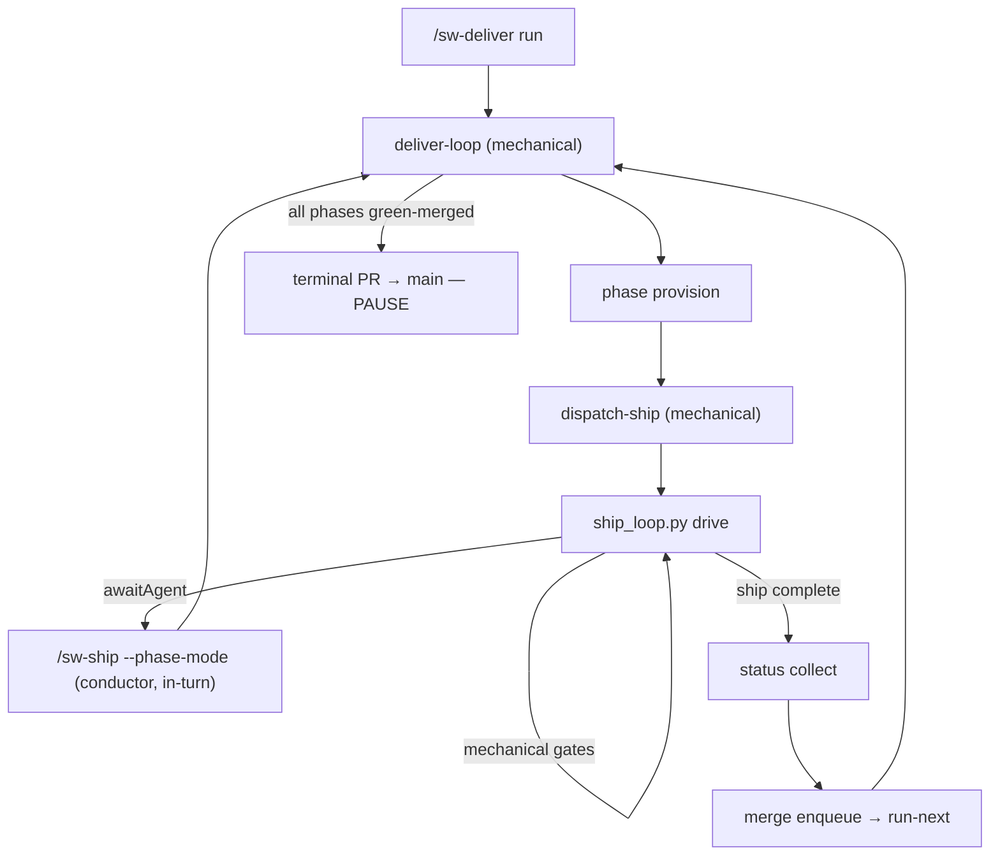

**Zero-interaction bar:** from `/sw-deliver run` through terminal PR preparation, the only chat turns
are driver-managed `awaitAgent` boundaries (execute, review, simplify, stabilize). Mechanical steps
gate handlers, commit, PR, CI watch, evidence writes — run without operator prompts. `dispatch-ship` and
`dispatch-batch` are mechanical; the driver never spawns Tasks.

**Evidence path:** each mandatory gate writes binding-valid records under
`.cursor/sw-deliver-runs/<phaseSlug>/gate-evidence/<gateId>.status.json`. `merge-ready-green` refuses
when evidence is missing, stale, or head-mismatched per the gate's declared binding mode.

**Resume:** halt payloads emit `/sw-deliver run <frozen-task-list>` or `/sw-deliver run --issue <n>`
never bare `deliver-loop` as the operator command.

## Deliver autonomy

Phase-mode deliver enforces durable **shipChain** consumability on terminal status : merge-ready
without a complete canonical ship chain is non-consumable. **Dispatch lease** blocks duplicate
`dispatch-ship` while a per-phase lease is live; **inline dispatch** is default for single-phase waves
— only `dispatch-batch` may use background Tasks.

**Re-adopt gate :** `/sw-deliver run` refuses double-drive when `driverHeartbeatAt` is fresh;
self-wake continuations are the carve-out. **Hang/desync** detection halts with `resumeCommand` before
silent spin . **Pre-PR smoke** runs targeted pytest via `test_scope` before `sw-pr` .

Finalize hygiene (–): non-mutating `build-chain-sync --check`, living-docs deferral on lock miss,
and `close_delivery_units` with parent-checkbox epic close after main merge.


## Deliver loop reliability ( Wave A)

Phase-mode `/sw-deliver` reliability contracts (–):

| Contract | Behavior |
| --- | --- |
| Living-doc finalize | `finalize-completion` does **not** outer-acquire `.cursor/sw-living-docs.lock`; `living-docs reconcile` owns the lock via `living_doc_write_lock`. |
| Tasks currency path | Under issue-store, currency/`ledger check` prefers `.cursor/planning-materialized/<logical-path>` when the docs/ path is absent. |
| Checkbox sync | `merge-ready-green` syncs phase checkboxes through `planning_progress` → store `progress_update` with etag retry; revision conflicts fail closed (no silent degrade). |
| Terminal corroboration | Terminal tasks-currency requires independent CI/gate or completion-claim corroboration — checkbox↔ledger alone is insufficient. |
| Preflight timeout | `deliver.preflight.timeoutSeconds` (default **90**) bounds base-check probes; timeout emits fail-closed resume JSON. |
| Skip-base-check cache | `--skip-base-check` reuses `.cursor/sw-deliver-preflight-cache.json` when present; otherwise skips re-probe without failing. |
| Ship-lease reclaim | Reclaim only when **same host** + **stale heartbeat** + **dead PID** (optional start-token match). |
| Terminal env | Terminal PR/ship clears `SW_PHASE_*` so trunk base is used — never phase integration base. |
| Closure unit ids | `close-delivery-units` resolves `tasks-<n>-<slug>`, legacy, and `tasks-debug-*` forms; ambiguity fails closed. |
| Merge enqueue queue | `merge-enqueue` applies returned `mergeQueue` via `apply_merge_enqueue_result` before `persist_cursor` — stale in-memory state cannot wipe the queue empty. Regression: `scripts/unit_tests/deliver/test_merge_enqueue_persist_reload.py`. |
| Phase provision stdout | `wave_lifecycle.provision_payload_from_stdout` parses the **last** JSON object from mixed stdout and validates non-empty `path`/`name`; invalid payloads fail closed with captured stdout (no silent `{raw:…}` success). Regression: `scripts/unit_tests/deliver/test_phase_provision_stdout_json.py`. |
| Absorb close-out | Plugin consumability delivery gaps discoverable via PRD `absorbs` / `sw-edges` or `planningIssues` + gap `absorbed-by` provenance; verify with `python3 scripts/planning_gap_capture.py <root> verify-absorb-closeout-073`. |
| Closeout hardening | Phase-ship hygiene auto-repair (`phase_ship_hygiene.py`); prefer-run-scoped adopt (`wave_run_adopt.py`); numeric absorb exactly-one (`planning_store_facade.py` closeout). Absorb map: #730 hygiene, #731 adopt, #739 numeric absorb. See `core/commands/sw-deliver.md` **Closeout hardening**. |

Resume after halt: `/sw-deliver run` from the orchestrator worktree (or `/sw-deliver run --issue <n>` under issue-store).

### Verify no-baseline evidence matrix (planning#641 / #642)

Planning issues **#641** and **#642** share one `no-baseline` verification class. Before closing
either issue, the suite partition below must return a conclusive verdict without a logged override —
committed baselines plus runtime harness refuse, not isolation alone.

| Planning issue | Tracking unit | Suite partition | Signal hash | Root cause | Remediation |
| --- | --- | --- | --- | --- | --- |
| #641 | verify-override follow-up (641) | `scripts/unit_tests/w4/harness_improvement.py` verify-evidence attribution cases | `3b1b69a5e7ff67fe5e52c3e4a6d6347b` | verify/gate failure without attribution baseline → `inconclusiveClass: no-baseline` | Committed baselines under `scripts/test/fixtures/verify-evidence/baselines/planning-641-642/`; pass `--restore-committed-baseline` to `verify-evidence.py` when callers omit `--baseline-*` |
| #642 | verify-override follow-up (642) | *(shared with #641 — same partition)* | *(shared)* | *(shared)* | Runtime refuse: `capture_verify_override` / `override-add` refuse live issue-store writes under harness unless `SW_ALLOW_LIVE_PLANNING_STORE=1`; static lint remains defense-in-depth |

Recurrence on an existing verify-override unit increments `.cursor/hooks/state/verify-override-recurrence/<signature>.json`
so operators see repeat signal without a duplicate tracking unit.

**Conductor recovery:** when `mergeJournal` is abandoned on halt, `preserve_merge_queue_on_halt` keeps
`mergeQueue` replayable while clearing the journal. When `phase-provision` previously failed on noisy
stdout, re-run `/sw-deliver run` — provision now records durable `phaseWorktrees.path`/`name` from the
validated JSON tail instead of looping `conductor:no-progress` on null paths.


## Workflow packages, trust, and expansion tuples

Semver workflow packs live under `.sw/workflows/packages/` as signed `WorkflowPackage`
artifacts. **Discovery does not imply trust** — only lock-pinned, signature-verified packs
resolve at compile time.

| Surface | Path | Role |
| --- | --- | --- |
| Lockfile | `.sw/workflows/lock.json` | Pins digest + signer for each pack and its transitive dependencies |
| Trust anchors | `.cursor/sw-package-trust-anchors.json` (operator-local) | Out-of-band signer keys; unknown/expired/revoked keys fail closed |
| Resolver | `scripts/graph/packages/resolver.py` | `discover_packages` lists catalog entries; `resolve_trusted_packages` verifies pins |
| Expansion tuple | `scripts/graph/packages/approval_tuple.py` | Human approval over `(packDigest, profileId, requirementSetDigest, kernelVersion)` |

Lock edits require the same digest-bound approval record as pack promotion. Additive detector
injections may proceed without re-approval; any weakening relative to the approved expansion tuple
requires a fresh approval before `kernel_compiler.compile_workflow_graph` admits the graph.

Named producer (`shipwright-dogfood`) and sibling consumer (`shipwright-sibling-consumer`) adoption
metrics (`reuseCount`, `updateFrictionSeconds`, `brokenPinRate`) are reported via
`graph.packages.report_adoption_metrics` for rollout observability.

## Debug small-fix handoff

`/sw-debug` small route materializes `tasks-debug-<slug>` via `scripts/debug_deliver_handoff.py`, prints
`/sw-deliver run --unit-id …`, and may same-turn confirm into deliver. Execute/ship before confirm is
forbidden (`debug.pack.json` / `pre-confirm-guard`). Post-handoff halts belong to `/sw-deliver`.

## Craft-parity operator surfaces

Guided setup, state-aware entry, requirements divergence, and lightweight consult/capture surfaces that fit
the existing `sw-` command surface without adding a second pipeline:

| Surface | Behavior |
| --- | --- |
| `/sw-init` guided interview | Scan → present findings → confirm/correct → ask only unresolved choices, each with a recommended default; doctor/repair modes unchanged. |
| `/sw` bare entry | Reads worktree state + planning store, proposes the single next action with confirm — not a static menu. |
| `/sw-brainstorm` divergence | Names the core tension, generates 3–5 deliberate stances (including one cross-domain borrow) with trade-offs and effort, recommends one with conviction, persists chosen + rejected. Unsure responses route by type — calibration loop, narrower regenerate, or explicit delegation — instead of re-asking the same question. |
| Calibration loop | Reusable convergence primitive: one concrete either/or instance per turn, a fixed verdict set, restated principle, and stop-on-stability. Wired into brainstorm unsure-routing, doc-review disposition disputes, and feedback ambiguous-scope calls. |
| `/sw-ask` | Read-only consult routed to the best-fit existing persona; no pipeline side effects. |
| `/sw-become` | Crystallizes a new persona into one fixed local destination, confirm-before-write, never overwrites. |
| `/sw-note` | One-line idea/task/note capture under a local notebook outside the planning store; confirm-first graduation to a gap or brainstorm with two-way provenance. |
| `/sw-guide` | Read-only explanation of workflow behavior plus config/state/planning-backend diagnosis; never mutates. |

See [commands](commands.md#consult-and-capture) for the full command list and
[configuration](configuration.md#notebook-session-index) for the notebook session-index opt-in.

## Deliver driver resilience decision acknowledgements

Deliver driver resilience clusters finalize, orch cwd adopt, and exclusive run lease (see
`core/commands/sw-deliver.md` absorb map). Operator-facing fencing decisions:

- **D4** — **Generation fencing:** stale run-lease reclaim bumps a durable `generation`; writes from a
  prior generation fail closed so a reclaimed owner cannot corrupt run state after takeover.
- **D5** — **Local common-dir scope:** exclusive runId leases are anchored to the git common-dir
  (`.cursor/sw-deliver-run-locks/`). Uncertain ownership and cross-clone reclaim fail closed — they are
  not remote `wave_remote_lease` CAS locks.

<!-- currency: refreshed 2026-08-30T01:55:00Z for terminal prepare (doc_loop + publication sequencing) -->

