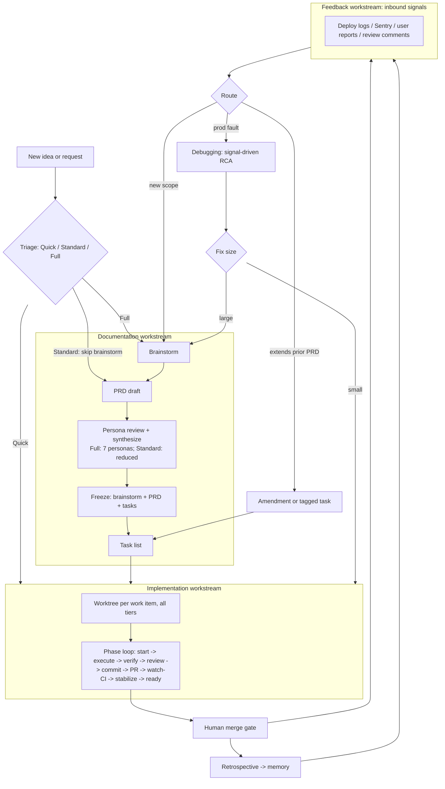

# Unified Development Workflow Plugin

## Summary

A self-contained Cursor workflow plugin, built fresh in `currsor-phase-flow-2`, that merges the
strongest pieces of the existing `phase-flow` plugin and the EveryInc compound-engineering plugin into
one prefixed, conflict-free system. It is organized around four workstreams — documentation,
implementation, debugging, and feedback — with sub-agents and loops as first-class primitives, git-worktree
isolation for parallel work, Recallium-backed durable memory, and token/model discipline tiered by task
type. A triage step routes each piece of work across a three-tier pipeline (Quick / Standard / Full) so
small changes stay fast and large ones stay rigorous.

## Problem Frame

The current `phase-flow` plugin is already mature: it ships an atomic phase loop, a gated `/ship`
orchestrator, a hardened all-checks CI gate with a CodeRabbit barrier, a provider-agnostic Recallium
memory layer, and early sub-agent/loop use in `gap-check` and `stabilize-loop`. But it stops short of the
full lifecycle the user wants. There is no dedicated brainstorm stage before a PRD, no multi-persona PRD
review, no doc-freeze/handoff lock, no git-worktree orchestration, no debugging workflow, and no feedback
workflow. Sub-agents and loops exist in only a couple of places rather than as a deliberate architecture.

The compound-engineering plugin solves much of the missing half (brainstorm → plan → work → review →
compound, persona review, durable learnings) but is large and opinionated. The goal is not to adopt either
wholesale, nor to depend on both being installed at once — which would create command collisions and
ambiguous usage. It is to re-imagine the process as one coherent, self-contained plugin that produces
better code more quickly: heavier rigor where it changes outcomes (brainstorming, spec review), and
minimal ceremony and token spend everywhere else.

---

## Key Decisions

- **Fresh, self-contained, prefixed plugin.** Build new in `currsor-phase-flow-2` and vendor everything
  in-tree, rather than extending v1 or composing on compound-engineering. This buys a clean architecture
  and zero command collisions, paid for by porting proven gate/memory/stabilize code and maintaining a
  vendored persona set. A single distinct command prefix keeps it safe to run alongside anything else
  installed.
  - *Decision-record (why not prefix-and-extend v1?).* Prefixing v1's commands in place would resolve
    collisions alone, so collisions are not the deciding factor. The rebuild is chosen for what extending
    v1 cannot cleanly deliver: (1) a coherent four-workstream architecture with sub-agents/loops as a
    first-class primitive rather than retrofitted into v1's phase-loop-centric shape; (2) a vendored persona
    set and doc pipeline (brainstorm → PRD → panel → freeze) that v1 lacks entirely and that would bolt on
    awkwardly; (3) a single uniform `pf-` surface and per-worktree state model designed in from the start
    rather than grafted onto v1's per-repo assumptions. The accepted cost is the vendoring + provenance/
    `/pf-upstream` maintenance tax (R40) and re-porting proven code; the considered alternative
    (incrementally extend the mature v1) was rejected because the lifecycle gaps are structural, not
    additive.
- **Vendoring is deliberate; upstream is tracked, not depended on.** Self-containment means borrowed tools'
  improvements don't flow in automatically — the accepted mitigation is a provenance manifest plus a
  `/pf-upstream` refresh that surfaces upstream changes for selective porting, and a preference for borrowing
  patterns over code so re-derivation stays cheap.
- **Tiered ceremony with up-front triage.** A triage step sorts work into three tiers — Quick (straight to
  the phase loop), Standard (short PRD + tasks), and Full (brainstorm → PRD → persona panel → freeze) —
  with risk triggers (auth, payments, data migration, public API) forcing at least Standard. This is what
  keeps "quicker" honest; the classifier's reliability is load-bearing.
- **Tiered token and model spend.** Terse/caveman-style output and cheaper models on mechanical and
  sub-agent steps; full fidelity on brainstorming, PRD authoring, and persona analysis. The dominant lever
  is structural (sub-agent context isolation), not terse prompting.
- **Frozen specs, living status.** Brainstorm docs, PRDs, and task lists freeze at the engineering handoff
  and are never edited afterward. A separate living layer (task checkboxes, a PRD index, a completion log)
  tracks progress.
- **Amendments as sibling frozen files; freeze enforced in depth.** A frozen PRD is extended by a separate
  amendment file that states only the delta and is itself reviewed and frozen — the parent is never
  mutated. Amendments can also *correct* a frozen parent, not just extend it: a typed `supersedes`/`retracts`
  directive (reviewed against the parent) is the sanctioned way to fix a wrong requirement, resolved by a
  precedence-aware union at implementation time (R12). Freeze is enforced by a `frozen: true` flag, an agent
  guardrail rule, a local pre-commit hook, and an authoritative server-side/CI check; there is no unfreeze,
  so reviewed amendments are the only change path. This is also the capture path for missed or PR-extending
  work.
- **Debugging is signal-driven, sharing a root-cause core with stabilize.** The debug workflow is
  triggered by deployment logs, Sentry events, or user-identified behavior — root-cause analysis from
  production signals, not dev-time test reproduction. It shares one hypothesis-driven RCA core with the
  stabilize loop (two entry points, one analysis discipline); the difference is the trigger (post-ship
  signals vs. in-loop failures), not the machinery.
- **Feedback is a unified intake.** One workflow ingests production signals, code-review feedback, and
  retrospectives, then routes each to debugging, gap-capture, or a new brainstorm.
- **Persona panel auto-applies safe fixes, gates judgment calls.** Parallel persona sub-agents critique
  the PRD draft; a synthesizer applies clear fixes and surfaces only genuine trade-offs for the user.
- **AI code review is a swappable provider.** Like memory, the code-review tool sits behind a capability
  spec + adapter (CodeRabbit today), config-selected. The hard part of the abstraction is normalizing the
  per-head review state (landed / in-flight / skipped / clean) the gate depends on — not just the findings —
  so each adapter implements that detection and the gate/stabilize loop stay tool-agnostic.
- **Memory is the single source of truth; no repo doctrine.** All evolving project doctrine, decisions, and
  learnings live only in the swappable memory system, with relationships first-class. Maintaining a parallel
  repo doctrine layer would duplicate the store, rot its hand-cross-linked relationships, and create a
  conflict-authority problem that a single store simply doesn't have. The plugin's own behavior rules and
  the frozen/living artifacts stay in the repo — they are plugin source and version-controlled deliverables,
  not accumulated knowledge.

---

## Architecture Overview

---

## Requirements

### Plugin foundation and packaging

- R1. Built fresh in `currsor-phase-flow-2`, merging the strongest pieces of `phase-flow` and
  compound-engineering, with no runtime dependency on either installed plugin.
- R2. Every command, skill, rule, persona, and hook is vendored in-tree, so the plugin loads and runs with
  no sibling plugin present.
- R3. All commands share the `pf-` namespace prefix (e.g. `/pf-brainstorm`, `/pf-ship`, `/pf-debug`),
  which avoids collisions with v1's unprefixed names and compound-engineering's `/ce-`.
- R4. Proven v1 mechanisms are ported intact: the all-checks CI gate (exit-code verdict + a per-head
  AI-review barrier, with CodeRabbit as today's adapter — see R36), the provider-agnostic memory seam, and
  the stabilize loop.

### Documentation workstream

- R5. A triage step classifies each new piece of work into one of three tiers and routes it accordingly:
  **Quick** (trivial, well-defined → straight to the phase loop, no brainstorm/PRD), **Standard**
  (bounded feature with some decisions → short PRD + tasks, skip extensive brainstorm), and **Full**
  (ambiguous, cross-cutting, or high-risk → full brainstorm → PRD → persona panel → freeze). Risk triggers
  (auth, payments, data migration, public API) force at least Standard regardless of size, and a manual tier
  override is always available.
- R6. The full pipeline runs brainstorm → PRD draft → multi-persona review → freeze → task list, in order;
  a PRD is never drafted before brainstorming concludes. The brainstorm stage adapts the ce-brainstorm
  pattern — one-question-at-a-time collaborative dialogue, scope-tier assessment, and a synthesis
  checkpoint — and produces a frozen brainstorm requirements doc that feeds `/pf-prd`.
- R7. On every Full-tier PRD the first draft is reviewed by seven persona sub-agents run in parallel —
  coherence, feasibility, product, scope-guardian, security, design, and adversarial — whose findings a
  synthesizer consolidates. Standard-tier PRDs get a reduced, targeted pass (the always-on coherence and
  scope-guardian personas at minimum), scaling like the amendment review in R10; Quick work gets none.
- R8. The synthesizer auto-applies clear, non-controversial fixes and surfaces only genuine trade-offs and
  judgment calls for the user to decide before freeze.
- R9. On freeze, the brainstorm doc, PRD, and task list become immutable handoff artifacts, enforced in
  depth: a `frozen: true` frontmatter flag marks the artifact, an agent guardrail rule forbids editing it,
  a git pre-commit hook (installed via a bootstrap step that wires `core.hooksPath`) blocks local commits
  that modify a frozen file, and — as the authoritative, non-bypassable layer — a server-side/CI required
  check rejects any diff that touches a `frozen: true` file. The local layers are convenience/early-warning
  (the pre-commit hook is install-dependent and `--no-verify`-bypassable); the CI check is what actually
  guarantees frozen integrity on the branch. There is no unfreeze — the only sanctioned change path is a new
  amendment (R10).
- R10. An existing frozen PRD is extended via a separate sibling amendment file (e.g.
  `prds/<n>-<slug>/amendments/A1-<short>.md`) that references the parent, states only the delta, and is
  itself reviewed and frozen. An amendment may both add new requirements and carry typed directives against
  parent R-IDs — `supersedes: R<n>` (a new requirement replaces the named parent requirement) or
  `retracts: R<n>` (the named parent requirement is dropped as obsolete, with a recorded rationale) — which
  is the sanctioned path for correcting a *wrong* frozen requirement, not just extending an incomplete one.
  Amendment review scales to the amendment's own triage tier (a small amendment gets a light/targeted pass,
  a substantial one the full panel), but coherence and scope-guardian always run against the frozen parent:
  they verify every supersede/retract target exists, isn't already retracted, and records a rationale. An
  *undeclared* contradiction or duplication of parent requirements remains the amendment-specific failure
  mode; a declared, reviewed supersede/retract is the explicit exception.
- R11. Amendment requirement IDs continue the parent PRD's namespace so IDs never collide (parent R1–R10,
  amendment R11+). A supersede introduces a new continued R-ID carrying the corrected requirement and a
  `supersedes:` pointer to the parent R-ID it replaces; the parent ID is never reused or rewritten.
- R12. At implementation time the spec is read as the precedence-aware union of a PRD and all its
  amendments, applied in amendment order: new requirements are added, a `supersedes`d parent R-ID resolves
  to its replacement, and a `retracts`d parent R-ID is removed. The frozen parent file is never mutated —
  every override lives in the amendment.

### Living documentation

- R13. Progress tracking is a living layer distinct from frozen specs: task checkboxes, a single living PRD
  index recording parent→amendment links and a per-PRD status (not-started / in-progress / shipped), and an
  append-only completion log recording each shipped phase.
- R14. Git is the source of truth for what shipped: PRD status is derived and reconciled from git (merged
  PRs, task checkboxes), not hand-set, so the index is an at-a-glance reconciled view rather than a
  drift-prone hand-maintained field. Frozen artifacts stay untouched and carry no status field.

### Implementation workstream

- R15. Work runs the atomic phase loop (start → execute → verify → review → commit → PR → watch-CI →
  stabilize → ready) under a gated orchestrator that advances only on green and halts at the human merge
  gate; it never merges.
- R16. AI code review runs through a swappable review provider (R36) plus the all-checks gate; normalized
  review feedback flows into a bounded stabilize loop that draws on the shared RCA core (R35) for in-loop
  CI/review failures.
- R17. A retrospective/learnings capture runs after shipping and feeds the compounding step (R33).
- R36. The AI code-review tool is a swappable provider mirroring the memory seam: a capability spec plus an
  adapter (CodeRabbit today), selected via a `review.provider` config key. Consumers depend only on
  normalized signals — a per-head review state (landed / in-flight / skipped / clean) and normalized
  findings (inline threads + non-inline) — never on a specific tool's API. New tools (Bugbot, Copilot
  review, Seer, etc.) add an adapter, leaving the gate and stabilize loop unchanged. Reporting a per-head
  review state is a **required** adapter capability, not an optional one: a provider that cannot answer
  "has the review for this head settled" is gate-incompatible and the gate stays fail-closed (yellow) for
  it rather than reporting a green it can't substantiate. The four-state model is the contract adapters
  normalize *to*; tools without a native per-head "landed" notion must synthesize it conservatively or be
  excluded from the merge gate.

### Worktrees and parallelism

- R18. Every piece of work runs in its own git worktree — all three tiers including Quick; there is no work
  in the bare main checkout. A feature's phases run sequentially inside its worktree, and independent
  streams get separate worktrees that proceed in parallel. Uniform isolation is chosen over avoiding
  per-change overhead, so disciplined worktree teardown (R21) is load-bearing.
- R19. Worktree isolation covers more than files: each gets unique port assignments, a separate DB/instance
  where relevant, and independent build/deps, recorded in a per-worktree scaffold.
- R20. Active parallelism is bounded to a practical ceiling (~2–4 worktrees); beyond it a dedicated
  orchestrator reviews cross-branch diffs. Prefer rebase for linear history, run a merge pre-flight before
  dispatching long-running parallel agents, and never parallelize shared-migration or tightly-coupled work.
- R21. Worktree lifecycle is managed safely — removal via `git worktree remove` + `git worktree prune`
  (never `rm`) — with disk-cost awareness.

### Debugging workstream

- R22. The debugging workflow is signal-driven RCA triggered by deployment logs, Sentry events, or
  user-identified behavior — not dev-time test reproduction.
- R23. Debugging integrates with the Sentry MCP to pull issue/event context (stack traces, breadcrumbs,
  traces) for root-cause analysis.
- R24. A debug investigation produces a root cause plus a proposed fix and routes downstream: a scoped
  phase for a small fix, or a new brainstorm/PRD/amendment when the fix is substantial.
- R35. Stabilize and debug share one hypothesis-driven RCA core (a single skill with two entry points):
  stabilize feeds it in-loop CI/review failures, debug feeds it deploy/Sentry/user signals. Same analysis
  discipline, different inputs and downstream routing.

### Feedback workstream

- R25. The feedback workflow is a unified inbound-signals intake covering production/operational signals
  (deploy logs, Sentry), code-review feedback (the configured review provider or human), and post-ship
  retrospectives.
- R26. Intake triages each signal and routes it to the debugging workflow, to gap-capture (an amendment or
  tagged task), or to a new brainstorm — closing the loop from shipped code back to the documentation
  pipeline.
- R27. "Work missed or that extends a prior PR" is a first-class intake here: substantial scope spawns an
  amendment, trivial in-scope gaps append a source-tagged task.

### Sub-agents and loops

- R28. Sub-agents are a first-class primitive across workstreams: parallel persona review, parallel
  research/grounding, gap-closers, and isolated exploration whose large reads never enter the
  orchestrator's context.
- R29. Loops are a first-class primitive (ship orchestration, stabilize, persona-review fix, debug RCA),
  each with hard stops — max iterations, no-progress detection, circuit breaker — to prevent infinite runs.
- R37. Sub-agent dispatch is heuristic-gated: delegate when work spans many files or heavy exploration
  (rule of thumb ~8+ files) that would otherwise bloat the orchestrator's context, when subtasks are
  independently parallelizable, or for throwaway exploration whose reads shouldn't pollute context. Stay
  inline for small, single-file, low-context work, and run delegated mechanical work on cheaper models
  (R30).

### Token and model tiering

- R30. Token minimization is tiered by task type: terse/caveman output and cheaper models on mechanical and
  sub-agent work; full fidelity on brainstorming, PRD authoring, and persona analysis.
- R31. The primary lever is structural — sub-agent context isolation, reference/handoff passing instead of
  inline content, and lazy skill-loading — with caveman applied only as an output-only add-on on
  low-reasoning steps.

### Memory, compounding, and command taxonomy

- R32. The swappable memory system (Recallium today) is the single source of truth for all evolving project
  doctrine, decisions, and learnings — there is no parallel repo doctrine layer. Commands route through a
  memory-preflight skill rather than calling the provider directly. Relationships (supersedes, relates-to,
  file-linked) are first-class in both the live store and the neutral export/import schema, so a future
  provider either supports an equivalent edge model or the import degrades to flat memories plus a
  relationships sidecar. Durable behavioral guardrails are promoted to `rule`-class memories that are
  injected deterministically each session (REST list, not semantic retrieval). Rule-class injection is
  **fail-closed**: if the provider is unreachable the session halts with a loud error rather than proceeding
  unguarded, so always-on guardrails can never silently fail to surface — reachable memory is a hard
  precondition for a guarded session (other, non-guardrail hook operations stay fail-open, R39).
- R33. A compounding step distills each retrospective/feedback item into memory with relationship edges and
  promotes durable behavioral guardrails to `rule`-class memories (human-gated per R42) — so each unit of
  work makes the next one start smarter.
- R41. Every ingestion edge runs a secret/PII redaction pass before content is persisted or re-injected:
  deploy logs, Sentry payloads (stack traces, breadcrumbs), and conversation transcripts are scrubbed for
  credentials, tokens, and PII on the way into both RCA prompts and memory distillation, so sensitive data
  never lands durably in the store or re-enters future sessions.
- R42. Promotion to `rule`-class (deterministically-injected, always-on) memory is human-gated, not
  automatic: because R33 distills attacker-influenceable signals (Sentry, deploy logs, review comments,
  user reports), a candidate guardrail requires explicit confirmation and carries provenance metadata
  (source, distillation origin) so a poisoned or wrong learning cannot silently become an injected
  directive. `/pf-memory-audit` reviews active rule-class guardrails on a defined cadence and maintains a
  repo-side override/allowlist — the one repo-resident control over which guardrails may inject, since no
  parallel doctrine layer exists to correct a bad one.
- R43. The memory provider's trust boundary is explicit: stored doctrine carries a data-sensitivity
  classification, access is least-privilege and credential-scoped, transport/at-rest encryption is required,
  and a provider compromise/tamper is a named failure mode (rule-class memories are the highest-integrity
  class). The neutral export/import artifact is treated as sensitive and protected in transit and at rest.
- R34. Commands are organized and named so correct usage is obvious: the `pf-` prefix, names that signal
  workstream and boundary (what each does and does not do), and atomic commands that remain independently
  runnable beneath the orchestrators.

### State and hooks

- R38. Workflow state is per-worktree — stored in each worktree's own git directory so concurrent streams
  never collide — tracking that worktree's tier, phase, and workstream. The repo-level living index (R13)
  aggregates across worktrees; there is no global mutable state file.
- R39. v1's hooks carry over, adapted: the sessionStart hook deterministically injects `rule`-class
  memories plus the tiered caveman session directive, and the stop hook schedules memory-sync/compounding on
  its configured thresholds. Rule-class injection is fail-closed (R32) — a session won't proceed unguarded —
  while non-guardrail hook operations (the caveman directive, stop-hook scheduling) stay fail-open so a
  provider blip never blocks ordinary work.

### Upstream provenance and refresh

- R40. Each vendored or pattern-borrowed component records its source repo and derived-from
  commit/version in a provenance manifest. A maintenance command (`/pf-upstream`) diffs tracked upstreams
  since the recorded point, surfaces notable changes, and proposes selective ports — so improvements from
  the borrowed tools can be carried forward deliberately rather than lost. Pattern-borrowing is favored
  over code-copying so re-derivation stays cheap, and portable skills (e.g. caveman) may be
  referenced/installed rather than copied.

---

## Command Surface

A hybrid surface: a small set of primary workstream entry-points users reach for by default, with the
atomic phase commands runnable beneath as the advanced layer. Every command carries the `pf-` prefix, which
avoids collisions with v1's unprefixed names (`/ship`, `/spec-prd`) and compound-engineering's `/ce-`.
Exact names are confirmable during planning; the organizing principle is fixed.

- **Primary (orchestrators / entry-points)**
  - `/pf-triage` — classify work into Quick / Standard / Full and route it.
  - `/pf-doc` — documentation orchestrator (brainstorm → PRD → persona panel → freeze → tasks).
  - `/pf-ship` — implementation orchestrator (worktree → phase loop → merge gate).
  - `/pf-debug` — signal-driven root-cause analysis.
  - `/pf-feedback` — inbound-signals intake and routing.

- **Atomic — documentation** (independently runnable): `/pf-brainstorm`, `/pf-prd`, `/pf-amend`,
  `/pf-doc-review`, `/pf-tasks`, `/pf-freeze`.
- **Atomic — implementation**: `/pf-start`, `/pf-execute`, `/pf-verify`, `/pf-review`, `/pf-commit`,
  `/pf-pr`, `/pf-watch-ci`, `/pf-stabilize`, `/pf-ready`.
- **Cross-cutting**: `/pf-worktree`, `/pf-status` (living index + completion log), `/pf-compound`,
  `/pf-retro`, `/pf-upstream` (provenance diff + selective port), `/pf-memory-{audit,sync,export,import}`.

Naming rules: orchestrators are short workstream nouns/verbs; atomic commands name the phase they perform;
each command's description states its boundary (what it does and does not do) so the orchestrator-vs-atomic
distinction is unambiguous at the call site.

---

## Key Flows

Documentation creation and implementation are separate flows: a frozen doc set is a handoff artifact that
implementation may pick up immediately or well later. The two never run as one continuous step.

- F1. Documentation creation
  - **Trigger:** Triage routes a request to Standard or Full.
  - **Steps:** (Full only) brainstorm → PRD draft → parallel persona review + synthesize (auto-fix safe,
    gate judgment calls) → freeze brainstorm + PRD → generate task list → freeze task list.
  - **Outcome:** A frozen, version-controlled doc set ready for engineering — produced independently of, and
    possibly long before, implementation.
  - **Covered by:** R5, R6, R7, R8, R9.

- F2. Implementation
  - **Trigger:** A frozen PRD (plus any amendments) and its task list are picked up for build — or triage
    routes Quick work straight here.
  - **Steps:** Provision a worktree → run the phase loop (start → execute → verify → review → commit → PR →
    watch-CI → stabilize → ready) reading the PRD + amendments union → human merge gate → retrospective →
    compounding → reconcile the living index/completion log.
  - **Covered by:** R12, R13, R14, R15, R16, R17, R18, R33.

- F3. Extending an existing frozen PRD
  - **Trigger:** A new brainstorm (or in-flight discovery) needs to add scope to a frozen PRD.
  - **Steps:** Create a sibling amendment file stating only the delta with continued R-IDs → review and
    freeze the amendment → append source-tagged tasks to the living task list → implementation reads the
    PRD + amendments union. The parent PRD is never edited.
  - **Covered by:** R10, R11, R12, R13, R27.

- F4. Signal-driven debugging
  - **Trigger:** A deployment log, Sentry event, or user-identified behavior indicates a fault.
  - **Steps:** Pull context via the Sentry MCP → RCA loop (bounded) → root cause + proposed fix → route to
    a scoped phase (small) or a new brainstorm/amendment (large).
  - **Covered by:** R22, R23, R24, R29, R35.

- F5. Feedback intake and routing
  - **Trigger:** Any inbound signal (prod, review, retro) arrives.
  - **Steps:** Triage the signal → route to debugging, gap-capture (amendment/tagged task), or a new
    brainstorm → update living docs/memory.
  - **Covered by:** R25, R26, R27.

---

## Success Criteria

- **Gate correctness — no false greens.** For any gate-compliant review provider (one that exposes a
  per-head review state, per R36), the all-checks gate never reports merge-ready while a review is in-flight
  or has unresolved actionable findings; the v1 false-green classes (#330 unresolved threads, #322 in-flight
  re-review) stay fixed under the provider abstraction. Providers that cannot expose per-head state are
  gate-incompatible (fail-closed), not silently trusted.
- **Token reduction without quality loss.** Measurable token savings on mechanical/sub-agent steps (caveman
  + context isolation) with no regression in review findings caught or test pass rates versus a
  full-fidelity baseline.
- **Doc-freeze integrity (defense-in-depth).** No edit to a frozen artifact lands on the branch — the
  authoritative server-side/CI required check rejects it, backed by the local `frozen` flag, guardrail
  rule, and pre-commit hook as early-warning layers — and every post-freeze change arrives as an amendment.
- **Handoff quality.** A frozen PRD + task list lets implementation (and `/pf-ship`) proceed without
  re-asking product questions the documentation pipeline already answered.
- **Triage accuracy.** Work lands in the right tier, and risk-triggered items (auth, payments, data
  migration, public API) never slip into Quick.
- **Parallel throughput.** Multiple worktree streams proceed without cross-stream state collisions, with
  conflicts confined to the recombination/orchestration step.
- **Compounding.** Each cycle adds durable, relationship-linked memories, and recurring findings
  demonstrably decline over time.
- **Provider swappability.** Swapping the memory or review provider needs only a new adapter plus config —
  no command changes — validated by a neutral export/import round-trip that preserves relationships.

---

## Scope Boundaries

### Recommended build order (phasing, not scope cut)

All four workstreams are in scope. The recommended sequence proves the core value path before adding the
post-ship machinery: **Phase 1** — the documentation and implementation workstreams (triage, doc pipeline,
freeze/amendments, worktree phase loop, gate, stabilize, memory/compounding), i.e. the doc → implement →
ship loop that delivers "better code quicker." **Phase 2** — the debugging and feedback workstreams (Sentry
MCP integration, signal-driven RCA, unified intake/routing), built once the core loop is proven and the
shared RCA core (R35) has a second real consumer. This is sequencing guidance for planning; nothing here is
dropped from the product.

### Deferred for later

- Marketplace publishing/distribution of the plugin.
- Exercising additional memory providers — the provider abstraction is kept, but only Recallium is wired.
- Exercising additional AI code-review providers — the review-provider abstraction (R36) is kept, but only
  CodeRabbit is wired.
- Team/multi-user collaboration features beyond single-developer use.

### Outside this product's identity

- A from-scratch reinvention that discards v1's proven CI gate, memory seam, and stabilize loop — those are
  ported, not rebuilt.
- A composition that depends on compound-engineering (or any sibling plugin) being installed at runtime.
- Implementing the plugin itself — this brainstorm produces the requirements; the build is planning and
  execution.

---

## Dependencies / Assumptions

- Cursor's native worktree support can be leaned on for provisioning; the plugin's value-add is per-work-item
  environment scaffolding (ports/DB/deps) and a recombination/orchestration step rather than reimplementing
  worktrees.
- The configured AI code-review provider (CodeRabbit today) and the Sentry MCP are available in the target
  environments. Reporting a per-head review state (not just fetching comments) is a required adapter
  capability (R36): a provider that can't expose "has the review for this commit landed" is gate-incompatible
  and the gate stays fail-closed for it rather than reporting a green it can't substantiate.
- Recallium is reachable for both the memory-preflight skill and the auto-injection/distillation hooks
  carried over from v1. With doctrine living only in memory, reachable memory is a hard precondition for a
  guarded session: rule-class guardrail injection is fail-closed (R32/R39) and halts loudly rather than
  proceeding unguarded, while non-guardrail hook operations stay fail-open. The version-controlled artifacts
  (PRDs, tasks) remain the offline paper trail but do not themselves carry behavioral guardrails.
- The provider capability spec and neutral export/import must model relationship edges, not just flat
  memories — this is what keeps "swap the provider later" honest now that relationships are load-bearing.
- Caveman-style terseness is quality-safe only on low-reasoning output (data, status, review comments) and
  degrades reasoning-heavy work — so it is confined to those steps by design.
- Sub-agent delegation carries a fixed per-agent overhead, so isolation pays off on multi-file/large-context
  work and should not be forced on small tasks.

---

## Outstanding Questions

### Deferred to planning

- Concrete on-disk layout for brainstorms, PRDs, amendments, task lists, the PRD index, and the completion
  log.
- The exact signals and thresholds the triage classifier uses to place work in Quick / Standard / Full (the
  three tiers and the risk triggers are decided; the scoring heuristic is not). Because the classifier is
  load-bearing, planning must also define a conservative default (ambiguity → Standard) and an in-loop
  misroute-recovery path — a `/pf-triage` re-entry that promotes a Quick item into the doc pipeline when its
  scope expands mid-flight — rather than relying solely on a human invoking the manual override.
- The per-worktree environment-scaffold schema (port/DB/deps assignments).
- The provenance manifest schema and the `/pf-upstream` refresh cadence (and which upstreams are tracked
  for code vs. pattern borrowing).
- Model assignments per token tier, and where the bounded-loop hard-stop thresholds sit.
- Whether and how to carry over v1's GitHub tracking-issue + relationships convention into the new doc
  pipeline. This also pins down R14's status-derivation function, which is currently asserted but
  undefined: the PR↔PRD link mechanism, the `shipped` predicate over a PRD-plus-amendments spanning many
  PRs, and whether task checkboxes are derivation inputs or derived outputs (if hand-edited they reintroduce
  the very drift R14 claims to eliminate).

### Surfaced by document review (decide before/at planning)

These are design decisions the multi-persona review flagged as genuine trade-offs rather than clear fixes;
each carries a recommendation but needs an explicit call.

- **[RESOLVED] Frozen-falsehood correction path.** Amendments now carry typed `supersedes`/`retracts`
  directives reviewed against the parent, resolved by a precedence-aware union — see R10, R11, R12 and the
  amendments Key Decision. A wrong frozen requirement is corrected by a declared, reviewed supersede/retract
  rather than an undeclared contradiction; the parent is still never mutated and there is no unfreeze.
- **[RESOLVED] Memory-as-single-source-of-truth resilience & safety.** Resolved as a bundle: rule-class
  injection is now **fail-closed** (R32/R39) — a session halts loudly rather than proceeding unguarded, so
  reachable memory is a hard precondition; rule-class promotion is human-gated with provenance and a
  repo-side override/allowlist (R42); ingestion edges run a secret/PII redaction pass (R41); and the
  provider trust boundary is stated explicitly (R43).
- **[RESOLVED] Premise: build-fresh-and-vendor vs prefix-and-extend v1.** Decision kept (it was a deliberate
  brainstorm choice); rationale now recorded in the "Fresh, self-contained, prefixed plugin" Key Decision —
  the lifecycle gaps are structural, not additive, which is what extending v1 can't cleanly deliver.
- **[DECISION KEPT] Uniform worktree + full env scaffold on every tier.** Four lenses flagged that R18/R19's
  per-worktree ports/DB/deps on every Quick change trades speed for isolation, but uniform isolation is a
  deliberate choice (no special-case for "trivial" work that later proves non-trivial); the accepted
  mitigation is disciplined teardown (R21) and the ~2–4 parallel ceiling (R20). R18 and R19 stand as
  written. (Planning may still optimize provisioning cost, but the uniform-scaffold contract is fixed.)
- **[RESOLVED] Build order / phasing.** All four workstreams are kept (no scope cut); the recommended
  *sequence* is now recorded under Scope Boundaries → Recommended build order — core loop
  (doc + implementation) first, debugging + feedback as a phase-2 tail.
- **[DECISION KEPT] Full review-provider abstraction at v1.** Deliberate brainstorm choice (full provider
  seam mirroring memory). Kept as R36; not reduced to a contract-only shim. The load-bearing part is the
  normalized per-head review-state contract, which R36 now makes a required adapter capability.
- **[DECISION KEPT] Provenance manifest + `/pf-upstream`.** Deliberate brainstorm choice (R40). Kept as the
  mechanism for carrying upstream improvements forward deliberately; not reduced to a README-only note.

---

## Sources / Research

Internal:

- `phase-flow` plugin (`cursor-phase-flow`): the atomic phase loop, `/ship` orchestrator, all-checks gate
  (`scripts/check-gate.sh`), `gap-check` and `stabilize-loop` skills, and the Recallium memory seam.

External (patterns the design borrows from; not runtime dependencies; tracked via the provenance manifest,
R40):

- EveryInc compound-engineering plugin — lifecycle structure (brainstorm → plan → work → review →
  compound), parallel persona review (`ce-doc-review`), and durable "compounding" learnings.
- `github/spec-kit` and `rhuss/cc-spex` — spec-driven phase pipelines; cc-spex combines worktree isolation,
  parallel agents, multi-perspective review with a bounded auto-fix loop, and post-PR CI watch.
- `skullninja/coco-workflow` — autonomous PRD→PR loop with circuit-breaker / max-iteration design.
- Elastic "caveman" token study and `agent-teams-lite` token-economics notes — terseness is output-only and
  quality-safe only on low-reasoning steps; sub-agent context isolation is the dominant quality-preserving
  token lever.
- 2026 git-worktree parallelism practice — file isolation is insufficient (assign ports/DB/deps), disk cost
  is real, ~2–4 parallel ceiling, and an orchestrator/recombination step beyond that.
