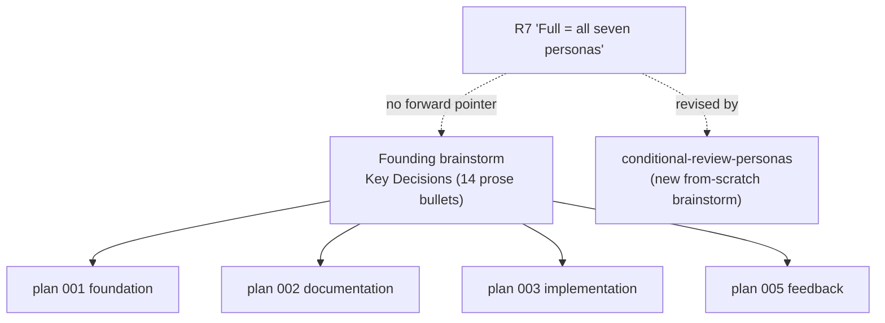

# Dev-Cycle "Standard" Gap Analysis

## Summary

A comparison of a colleague's project-agnostic "Standard" development cycle against phase-flow v2, to
surface ideas worth incorporating. The headline finding is not the colleague's most visible feature (ADRs)
but its underlying primitive: a **decision record as a version-controlled deliverable**, which phase-flow's
freeze model is already 90% built to host and which fills a gap already costing this repo. Three further
clusters are recommended for incorporation — wave orchestration, model-tiering, and an invariants file —
and two are recommended against (land-docs-on-main, changelog generation) as conflicting with phase-flow's
identity. This doc captures dispositions for later `/pf-plan`; it proposes no implementation.

## Problem Frame

The colleague's "Standard" splits a universal process from an 18-slot per-project profile, and is strongest
exactly where phase-flow is thinnest: multi-stream build orchestration (a dependency-ordered wave plan,
unattended dependent-branch stacking, an integration branch), up-front numbered decision records, and an
explicit model-tier map. phase-flow is stronger on doc rigor (freeze + amendment + spec-union), durable
memory compounding, ceremony tiering, and provider abstraction — areas the Standard lacks. The useful
question is therefore narrow: which of the Standard's strengths transfer without contradicting decisions
phase-flow already made deliberately (notably R32, "memory is the single source of truth; no parallel repo
doctrine layer").

The decision-record cluster is the one that looked like a head-on contradiction with R32 and turned out not
to be — which is why it earns the headline.

---

## Key Decisions

- **The portable idea is decision-records-as-deliverables, not ADR ceremony.** The Standard's ADRs carry a
  separate `docs/adr/` tree, a numbering script, and an integrity hook. Importing that machinery would add a
  competing knowledge store and reopen R32. The transferable primitive underneath is smaller: an
  individually-addressable, reviewed-before-build, repo-resident architectural decision. phase-flow can host
  that inside its existing frozen-doc family with no new tooling.

- **R32 drew a deliverable-vs-knowledge line, not a repo-vs-memory line.** R32 rejected a second knowledge
  store that *competes with memory* for evolving doctrine, on three grounds: duplication, relationship rot,
  and conflict-of-authority. It explicitly carved out frozen/living artifacts as "version-controlled
  deliverables, not accumulated knowledge." A decision record framed as a deliverable (a decision for *this*
  codebase, like a PRD) sits on the carved-out side: memory links to it rather than duplicating it, its
  supersedes chain is linear rather than a rich edge graph, and the deliverable/knowledge category split
  resolves authority the same way it already does for frozen PRDs.

- **The gap is real and already costing this repo.** The 14 architectural decisions in the founding
  brainstorm's Key Decisions section govern four workstream plans (`docs/plans/2026-06-22-001`, `-002`,
  `-003`, `-005`) yet live only as undifferentiated prose in one document. When one of them changed —
  R7's "Full tier loads all seven personas" — the revision became a whole new from-scratch brainstorm
  (`docs/brainstorms/2026-06-23-conditional-review-personas-requirements.md`) that re-grounds the premise,
  rather than an addressable supersession, and the original R7 still reads "all seven" with no forward
  pointer.

- **Recommend against the Standard's most invasive ideas.** Land-docs-on-main tensions with phase-flow's
  CI-enforced freeze (it pushes specs to `main` before the build gate). Changelog/house-voice generation is
  a release-tooling concern outside a workflow plugin's identity. Both are recorded under Scope Boundaries,
  not Requirements.

### The gap, visualized

One document is the de-facto authority for decisions that fan out across the whole plugin, and revision
happens off to the side with no link back. Decision records as deliverables give each decision its own
addressable file and reuse the existing `supersedes`/`retracts` path for revision.

### Disposition matrix

| Cluster | What the Standard does | phase-flow v2 today | Disposition |
|---|---|---|---|
| B. Decision records | ADRs drafted up front, reviewed at the gate, numbered on `main`; integrity hook | Decisions as PRD "Decision Log" prose + retrospective `decision`-class memory | **Pursue (headline)** — as a deliverable doc type, not ADR ceremony (R1–R4) |
| A. Wave orchestration | Dependency-ordered wave plan; dependents stack on green unmerged branches; `integration/<stamp>` branch tests all leaves | Per-item worktrees + parallel ceiling + manual recombination; no waves, no integration branch | **Pursue** (R5–R7) |
| D. Model tiering | Deep/Build/Cheap → model map per project; reviewer tier ≥ builder tier | Policy-only (R30); persona reviewers hardcoded `model: fast`; no model catalog | **Pursue** (R8–R9) |
| E. Project profile | 18 declarative slots incl. `invariants_file`, model defaults, distribution, platform floor | `workflow.config.json` covers build/test/review/CI/memory/worktree; no invariants, model defaults, distribution | **Partial** — pursue `invariants_file` (R10); rest deferred |
| C. Land docs on `main` first | Docs-on-main carve-out skips slow build gate; ADRs numbered before any worktree | Docs frozen on the working branch; no fast-path | **Skip** — tensions with CI-enforced freeze (Scope Boundaries) |
| F. Changelog | Changelog hook on push, cheap-tier generated, house voice | None (only internal `prds/COMPLETION-LOG.md`) | **Skip** — outside identity (Scope Boundaries) |

---

## Requirements

### Decision records (B) — headline

- R1. phase-flow gains a `decision-record` artifact type as a first-class member of the frozen-doc family,
  for cross-cutting architectural decisions not owned by a single PRD, reusing the existing freeze,
  amendment, and spec-union machinery rather than introducing ADR-specific tooling.
- R2. The decision record is individually addressable (its own file and stable ID) and is reviewed before
  build through the existing persona/doc-review path, so a decision is critiqued at decision-time rather
  than only distilled retrospectively into memory.
- R3. A decision record is revised only via the existing `supersedes`/`retracts` amendment mechanism, which
  leaves the superseded record in place with a forward pointer to its replacement — never edited in place,
  never silently orphaned.
- R4. Memory references a decision record by link (e.g. `relatedFiles`) rather than duplicating its content,
  preserving R32: the record is the canonical deliverable, memory is the cross-cutting knowledge layer that
  points at it.

### Build-wave orchestration (A)

- R5. The implementation workstream gains a dependency-ordered wave plan that batches independent work items
  into parallel waves and orders dependent chains, produced once for a round of work rather than per single
  feature.
- R6. A dependent work item can stack on its dependency's green but unmerged branch, so a chain builds
  unattended without any item touching `main` mid-flight.
- R7. Green leaves merge into a single integration branch (`integration/<stamp>`) to be tested as a whole
  before merge; the existing human merge gate is preserved — the integration branch is authorized to `main`
  in dependency order, never auto-merged.

### Model tiering (D)

- R8. `workflow.config.json` gains an explicit per-tier model map (deep / build / cheap → concrete models),
  concretizing R30's currently policy-only tiering into a configurable, per-project assignment.
- R9. A reviewer-tier ≥ builder-tier rule is enforced; the persona reviewer agents currently declared
  `model: fast` in `agents/pf-*-reviewer.md` violate this and are the first thing the rule corrects.

### Project profile (E)

- R10. The config gains an optional `invariants_file` slot pointing at a hard-constraints document
  (e.g. `INVARIANTS.md` / `SECURITY.md`) that is surfaced to reviewers as non-negotiable constraints during
  doc-review and code-review.

---

## Scope Boundaries

### Deferred for later

- The remaining Standard profile slots beyond `invariants_file` (model defaults are covered by R8;
  `distribution`, `platform_floor`, `ai_runtime`, `stack`, `status`/`version`) are incremental config
  completeness, not load-bearing — add as concrete need arises.
- Land-docs-on-`main` (cluster C) becomes worth re-evaluating only if wave orchestration (A) is adopted and
  the parallel-worktree base-branch freshness it solves becomes a real pain; on its own it is not pursued.

### Outside this product's identity

- ADR ceremony as the Standard ships it — a separate `docs/adr/` tree, a numbering script, and an integrity
  hook. The decision-record primitive (R1–R4) delivers the value; the ceremony reopens R32 and adds a
  competing knowledge store.
- Land-docs-on-`main` as a standing carve-out. phase-flow's freeze is CI-enforced on the branch; routing
  specs to `main` ahead of the build gate contradicts the defense-in-depth freeze model and the "no work on
  the bare main checkout" rule (R18).
- Changelog / house-voice generation (cluster F). Release-note authoring is release tooling, not the
  workflow plugin's job; `prds/COMPLETION-LOG.md` already covers internal shipped-phase tracking.

---

## Dependencies / Assumptions

- The decision-record type (R1–R4) assumes the freeze, amendment, and spec-union machinery generalizes
  beyond PRDs with little change — plausible because all three are already doc-type-agnostic in
  `skills/spec-union/` and `commands/pf-freeze.md`, but planning must confirm the freeze hook and CI check
  treat a new doc type the same way.
- Wave orchestration (R5–R7) assumes the existing worktree provisioning and parallel ceiling
  (`skills/worktree/`, `skills/parallelism/`) are the substrate the wave layer sits on, not a rewrite.
- The reviewer-tier rule (R9) assumes a model catalog exists to compare tiers against — i.e. R8 lands first
  or alongside.

---

## Outstanding Questions

### Resolve before planning

- Whether the founding brainstorm's existing 14 Key Decisions are migrated into decision records on adoption
  (a one-time backfill) or only new decisions use the type going forward. The conditional-personas revision
  argues for backfilling at least the decisions that have already been revised or referenced across plans.

### Deferred to planning

- The ID namespace and on-disk path for decision records (continue the brainstorm/PRD R-ID convention, or a
  distinct D-ID namespace; where the files live relative to `prds/` and `docs/brainstorms/`).
- The wave-plan representation and where it is authored (a new artifact, or an extension of the task list),
  and the merge-pre-flight discipline for stacked dependent branches.
- The integration-branch lifecycle: naming/stamp scheme, teardown, and how a red integration test routes
  back to the offending leaf without unwinding the whole wave.
- The concrete tier→model values for R8 and whether they are global defaults plus per-project overrides.

---

## Sources / Research

Internal:

- `docs/brainstorms/2026-06-22-unified-dev-workflow-plugin-requirements.md` — the founding brainstorm; Key
  Decisions (lines 38–95) and R32 (memory as single source of truth) anchor the decision-record analysis.
- `docs/brainstorms/2026-06-23-conditional-review-personas-requirements.md` — concrete evidence of the
  supersession failure mode (R7 revised as a from-scratch brainstorm).
- `skills/prd/SKILL.md` (Decision Log section), `skills/compound/SKILL.md` (`decision`-class memory),
  `skills/spec-union/`, `commands/pf-freeze.md`, `commands/pf-amend.md` — phase-flow's current
  decision-capture and freeze machinery.
- `skills/worktree/SKILL.md`, `skills/parallelism/SKILL.md` — the parallelism substrate cluster A would
  extend.
- `agents/pf-*-reviewer.md` — persona reviewers declared `model: fast`, which R9 corrects.

External:

- The colleague's "Development Cycle — The Standard" workflow document (the two-layer Standard + Profile
  model, the 5-stage Discussion, the plan/ADR review gate, land-on-main, the wave-runner loop, model tiers,
  and the 18-slot profile schema).
