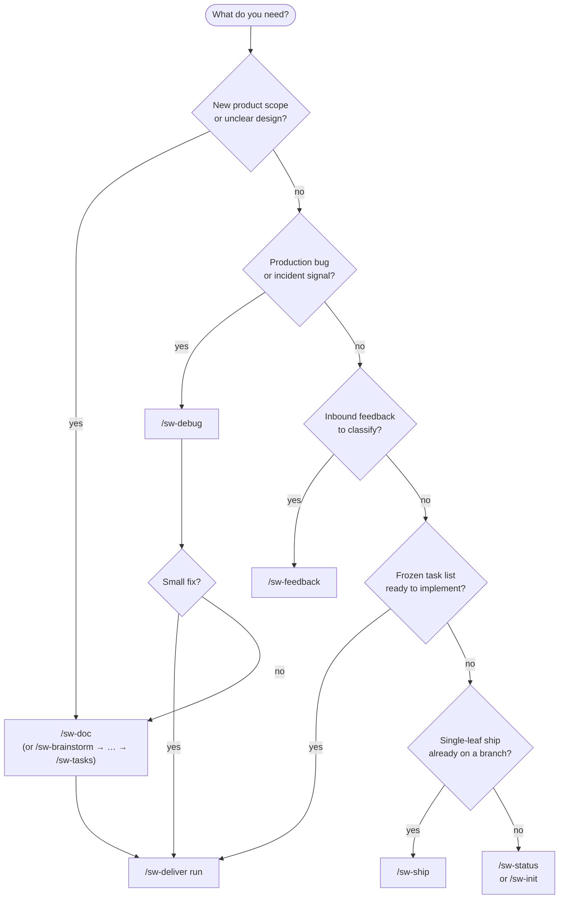
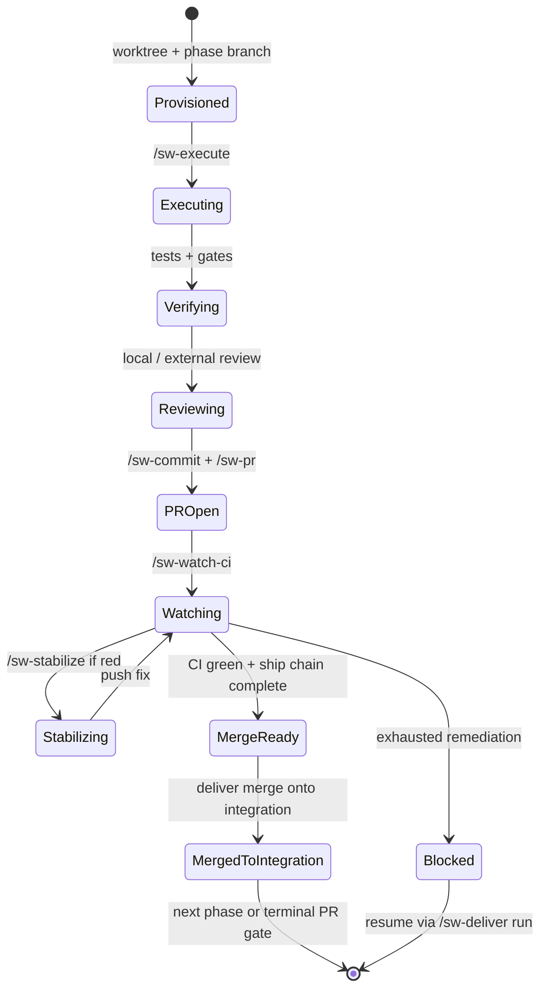

# Decision tree

Quick routing for the `sw-` command surface and per-worktree state. Pair with the [glossary](glossary.md).

## Which entry command?

## Per-worktree state machine (deliver / ship)

## Operator reminders

- Prefer `/sw-deliver run` for a frozen task list—do not hand-roll phase worktrees while the driver can advance.
- `/sw-ship` never merges to the default branch; humans own that gate.
- After merge, `/sw-cleanup` dry-runs removals until you confirm.
