# Workflow guide

This guide covers the four Shipwright workstreams in depth: tiers, per-workstream flows, diagrams,
and sample prompts. For the high-level overview, see the [README](../../README.md).

## Tiers: Quick, Standard, and Full

`/sw-triage` scores work deterministically; `/sw-doc` respects the result.

| | **Quick** | **Standard** | **Full** |
|---|-----------|--------------|----------|
| **Typical scope** | 0–1 files, low risk | 2–5 files, bounded feature | 6+ files, or ambiguous scope |
| **Doc pipeline** | **Skipped** — route straight to implementation | PRD → review → freeze → tasks | Brainstorm → PRD → review → freeze → tasks |
| **Persona review** | None | Signal-driven panel on PRD | Signal-driven panel on PRD |
| **Artifacts produced** | None (implement from prompt) | `docs/prds/<n>-*/` PRD + frozen tasks | `docs/brainstorms/` + PRD + frozen tasks |
| **Human gates** | Merge gate only | `doc.afterTasks` confirm; freeze; merge | `doc.afterTasks`; brainstorm checkpoint; freeze; merge |
| **Best for** | Hotfixes, typos, single-file tweaks | Most features with clear acceptance criteria | New domains, spikes, "figure out" scope |
| **Entry command** | `/sw-triage` then manual `/sw-ship` | `/sw-deliver run` after `/sw-doc` | `/sw-deliver run` after `/sw-doc` |

**Risk floor:** keywords like `auth`, `payment`, `migration`, or `webhook` force **at least Standard**
even for 1-file changes. **Ambiguity bump:** words like `maybe`, `explore`, or `TBD` push Quick→Standard
or Standard→Full.

### Classification flow (`/sw-triage`)

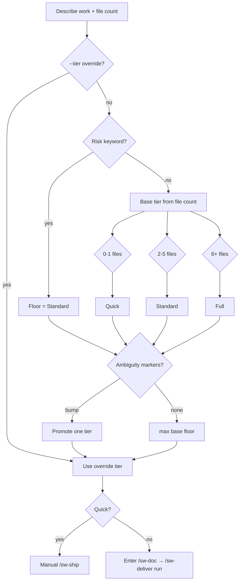

### Quick tier workflow

No spec artifacts — no frozen task list, so **`/sw-deliver` does not apply**. Triage routes to the
manual `/sw-ship` atomics.

```mermaid
flowchart LR
  T["/sw-triage"] --> Q[Quick]
  Q --> WT["/sw-worktree provision"]
  WT --> ST["/sw-start"]
  ST --> EX["/sw-execute"]
  EX --> SH["/sw-ship"]
  SH --> V["verify → review → commit"]
  V --> PR["/sw-pr → /sw-watch-ci"]
  PR --> STB["/sw-stabilize"]
  STB --> RD["/sw-ready — PAUSE"]
  RD --> MERGE[You merge]
  MERGE --> CM["/sw-compound-ship"]
```

```text
/sw-triage — 1 file, fix export button label typo
/sw-worktree provision → /sw-start → /sw-execute → /sw-ship
```

### Standard tier workflow

PRD and frozen tasks before code. No brainstorm phase.

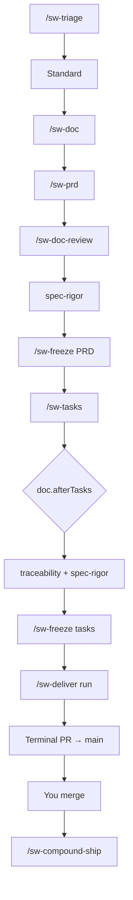

```text
/sw-doc
Feature: CSV export on reports table — 4 files, clear criteria, no auth
/sw-deliver run docs/prds/<n>-<slug>/tasks-<n>-<slug>.md
```

### Full tier workflow

Explores requirements before the PRD. Use when scope or product decisions are still open.

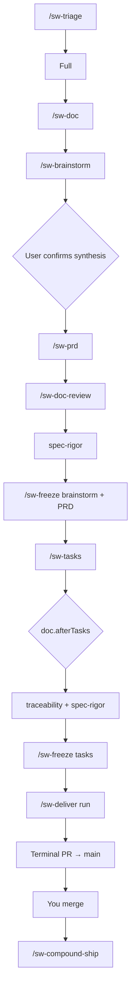

```text
/sw-doc
Feature: new billing portal — explore pricing models, 8+ files, auth + Stripe
/sw-deliver run docs/prds/<n>-<slug>/tasks-<n>-<slug>.md
```

> **Note:** `/sw-doc` **stops** on Quick tier and tells you to use the implementation workstream
> instead.

---

## Documentation workstream — spec before code

Use when tier is **Standard** or **Full** and you need a reviewed plan before implementation.

**Standard doc pipeline** (no brainstorm):

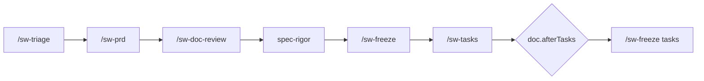

**Full doc pipeline** (brainstorm first):

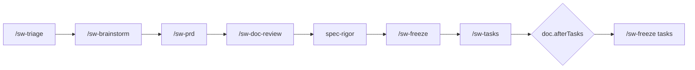

Or run `/sw-doc` to orchestrate either chain end-to-end.

**Typical flow**

1. `/sw-triage` — classify tier (or pass `--tier` to `/sw-doc`)
2. `/sw-doc` — runs the tier-appropriate doc chain
3. Human **`doc.afterTasks`** checkpoint after single-pass task freeze (default `confirm`)
4. Frozen PRD + tasks become the spec for **`/sw-deliver run`** (primary) or manual `/sw-ship` per phase

**Sample prompts**

```text
/sw-doc
Feature: user profile settings page
Context: Need PRD and tasks before implementation. Tier unknown — triage first.
```

```text
/sw-prd --tier standard
Feature: add export-to-CSV on reports table
Context: 3–4 files, no auth changes. Skip brainstorm.
```

**Key commands**

| Command | Use when |
|---------|----------|
| `/sw-doc` | End-to-end doc pipeline orchestrator |
| `/sw-triage` | Classify Quick / Standard / Full only |
| `/sw-brainstorm` | Full-tier requirements exploration (before PRD) |
| `/sw-prd` | Draft PRD or decision record |
| `/sw-doc-review` | Persona panel on spec drafts |
| `/sw-freeze` | Lock artifact; no further edits without `/sw-amend` |
| `/sw-tasks` | Generate task list from frozen PRD |
| `/sw-amend` | Post-freeze correction via amendment file |

---

## Implementation workstream — ship a feature from spec

**Primary path:** `/sw-deliver run` orchestrates every phase from the frozen task list to one terminal
merge gate. `/sw-ship`, `/sw-execute`, and the other ship-loop atomics still exist — `/sw-deliver`
invokes them per phase; run them manually only for Quick-tier hotfixes, debugging, or single-phase
reruns.

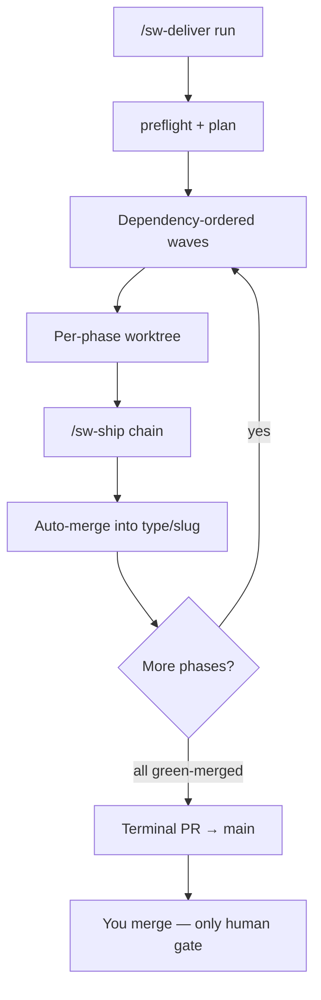

### `/sw-deliver run` — phase-mode play button (default)

When `/sw-doc` has produced a **frozen** task list (`tasks-<n>-<slug>.md`), `/sw-deliver` is the
default implementation orchestrator. Mode auto-detect from input:

| Input | Mode |
|-------|------|
| `--task-list docs/prds/<n>-<slug>/tasks-....md` | **phase-mode** — one feature, many phases |
| `--items A,B` + `--edges C:A` | **multi-feature** — independent features + integration branch |

**Typical phase-mode flow:**

```text
/sw-deliver run docs/prds/004-my-feature/tasks-004-my-feature.md
```

1. `preflight` + `plan` — validates frozen tasks, CI/review base-branch preflight, writes
   `.cursor/sw-deliver-plan.json`.
2. Provisions orchestrator + per-phase worktrees; dispatches full `/sw-ship` per phase.
3. Auto-merges each green phase into `<type>/<slug>`; siblings continue on blast-radius block.
4. Opens a **single terminal** `<type>/<slug> → main` PR when all phases are `green-merged` — the
   only human merge gate for the feature.

**Resumption:** re-run the same `run` command after interrupt; `resume reconcile` skips
`green-merged` phases. Use `plan --from <phase>` when upstream phases are already merged.

**Dry-run:** `scripts/wave.sh plan --task-list <path> --dry-run` emits the plan JSON without writing
`.cursor/sw-deliver-plan.json`.

**Durable autonomy (PRD 007):** the driver is `scripts/wave.sh deliver-loop` (also invoked by
`/sw-deliver run`). It persists cursor state in `.cursor/sw-deliver-state.json`, resumes after crash
without restarting from plan, and never emits manual “next steps” prose while work remains. Phase
advancement keys off durable `status.json` in each **phase-worktree** (`status collect` — not chat).
Per-phase `/sw-ship` persists step-level state (`ship-steps.json`) for mid-chain resume.

**Merge queue:** phases with no per-phase PR use a local-evidence merge path; phases with a PR use
`check-gate.sh`. `status.json` binds to the phase head SHA — stale status cannot authorize a merge.
The orchestrator worktree owns a non-detached `<type>/<slug>` checkout; phase merges advance that ref
(no manual fast-forward on the primary checkout).

**Pre-merge compounding:** after all phases are `green-merged`, the driver runs `/sw-compound-ship
--pre-merge` (file outputs committed on the feature branch; memory writes not committed). Completion
is recorded as `completed-pending-merge` until the human merges; the loop then suggests
`/sw-cleanup`.

**Task currency:** frozen task checkboxes may be toggled in-loop; a currency gate blocks the terminal
merge if checkboxes diverge from the durable ledger.

**Branch policy:** workflow-created branches use conforming type prefixes (`feat/`, `fix/`, …) from
`release-please-config.json` — never `pf/`.

**Secret safety:** `scripts/secret-scan.sh` runs at every workflow push chokepoint (`git-push.sh`);
range-scoped redaction is required (`scripts/redaction-guard.sh` refuses bare-branch history rewrite).

### `/sw-ship` — single-phase loop (manual / Quick tier)

Used directly for **Quick-tier** work (no frozen task list) or when debugging a single phase. When
you run `/sw-deliver`, this chain executes **inside** each phase.

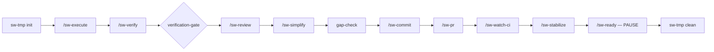

Halts on verification failure, review blockers, or red CI. **Never auto-merges.**

**Typical manual flow** (Quick tier or single-phase debug)

1. `/sw-worktree provision` — isolated worktree for the work item
2. `/sw-start` — phase branch
3. `/sw-execute` — implement one task slice
4. `/sw-ship` — verify → review → commit → PR → watch CI → stabilize → **pause at merge-ready**
5. You merge manually; then `/sw-compound-ship` in the target repo

**Sample prompts (manual / debug)**

```text
/sw-worktree provision
Work item: user-profile-settings (from PRD 003 tasks)
```

```text
/sw-ship
Context: Phase 1 tasks 1.1–1.3 complete. Parent branch main. Run full loop through stabilize.
```

**Post-merge chain (`/sw-compound-ship`):**

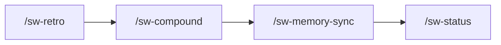

**Key commands**

| Command | Use when |
|---------|----------|
| `/sw-deliver run <frozen-tasks>` | **Primary** — orchestrate all phases to one terminal merge gate |
| `/sw-ship` | Manual single-phase loop (Quick tier, debug, or without `/sw-deliver`) |
| `/sw-worktree` | Create or tear down per-item worktree (manual; `/sw-deliver` provisions automatically) |
| `/sw-start` | Open phase branch inside worktree (manual path) |
| `/sw-execute` | One bounded implementation slice (manual path; first step inside `/sw-ship`) |
| `/sw-verify` | Run scoped lint/typecheck/test |
| `/sw-review` | Local multi-agent + provider review |
| `/sw-commit` | Commit after verify + review |
| `/sw-pr` | Push and open/update PR |
| `/sw-watch-ci` | Poll PR checks until green/red/timeout |
| `/sw-stabilize` | Clear failing checks and review threads |
| `/sw-ready` | Final readiness report (never merges) |
| `/sw-compound-ship` | Post-merge retro → compound → memory sync |

---

## Debug workstream

Use when something is broken in production or you need RCA before fixing.

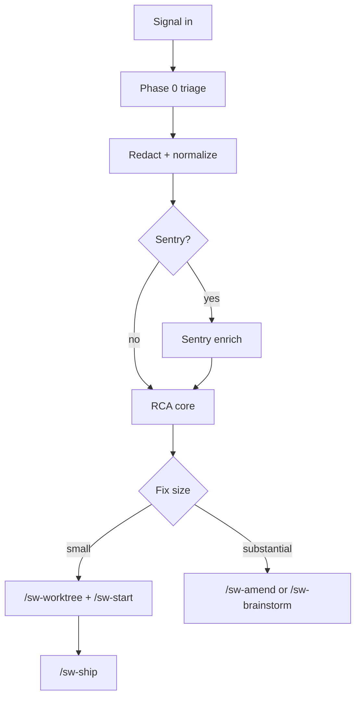

**Typical flow**

1. `/sw-debug` with signal (Sentry issue, stack trace, deploy log excerpt)
2. RCA core diagnoses; routes by fix size:
   - **Small** → `/sw-worktree` + `/sw-ship`
   - **Large** → `/sw-brainstorm` or `/sw-amend`

**Sample prompts**

```text
/sw-debug
Signal: Sentry issue PROJECT-123 — NullReference in CheckoutService.SubmitOrder
Context: Started after deploy v2.4.1 yesterday. 400 events/hour.
```

```text
/sw-debug
Signal: CI passes locally but fails on PR #42 — test_user_export timeout
```

**Key commands**

| Command | Use when |
|---------|----------|
| `/sw-debug` | RCA + route; does not implement or merge |
| `/sw-feedback` | Normalize inbound signal and suggest route (human confirms) |
| `/sw-feedback-close` | Close backlog signal after fix verified shipped |

---

## Feedback workstream

Use to capture signals without immediately analyzing them.

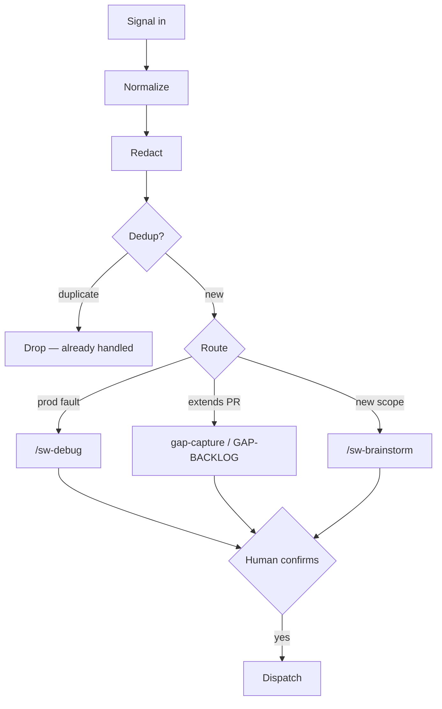

**Sample prompt**

```text
/sw-feedback
Signal: Code review on PR #88 — "missing rate limit on public endpoint"
Source: review comment
```

`/sw-feedback` redacts, classifies, and proposes a route. **Confirm** before dispatch.
