# Workflow guide

This guide covers the four Shipwright workstreams in depth: tiers, per-workstream flows, diagrams,
and sample prompts. For the high-level overview, see the [README](../../README.md).

## Tiers: Quick, Standard, and Full

`/sw-triage` scores work deterministically; `/sw-doc` respects the result.

| | **Quick** | **Standard** | **Full** |
|---|-----------|--------------|----------|
| **Typical scope** | 0–1 files, low risk | 2–5 files, bounded feature | 6+ files, or ambiguous scope |
| **Doc pipeline** | **Skipped** — route straight to implementation | PRD → review → freeze → tasks | Brainstorm → PRD → review → freeze → tasks |
| **Persona review** | None | Signal-driven panel on PRD | Signal-driven panel on PRD |
| **Artifacts produced** | None (implement from prompt) | `docs/prds/<n>-*/` PRD + frozen tasks | `docs/brainstorms/` + PRD + frozen tasks |
| **Human gates** | Merge gate only | `doc.afterTasks` confirm; freeze; merge | `doc.afterTasks`; brainstorm checkpoint; freeze; merge |
| **Best for** | Hotfixes, typos, single-file tweaks | Most features with clear acceptance criteria | New domains, spikes, "figure out" scope |
| **Entry command** | `/sw-triage` then manual `/sw-ship` | `/sw-deliver run` after `/sw-doc` | `/sw-deliver run` after `/sw-doc` |

**Risk floor:** keywords like `auth`, `payment`, `migration`, or `webhook` force **at least Standard**
even for 1-file changes. **Ambiguity bump:** words like `maybe`, `explore`, or `TBD` push Quick→Standard
or Standard→Full.

### Classification flow (`/sw-triage`)

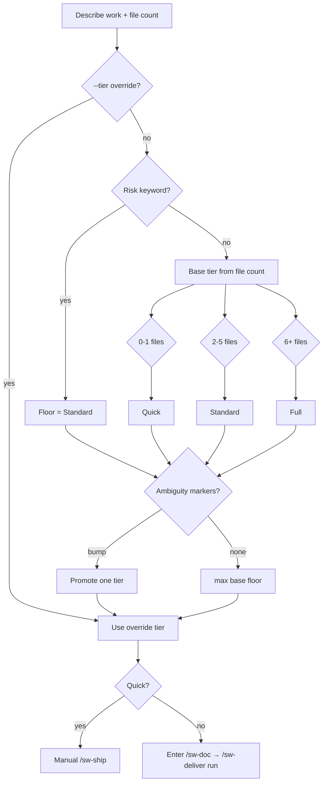

### Quick tier workflow

No spec artifacts — no frozen task list, so **`/sw-deliver` does not apply**. Triage routes to the
manual `/sw-ship` atomics.

```mermaid
flowchart LR
  T["/sw-triage"] --> Q[Quick]
  Q --> WT["/sw-worktree provision"]
  WT --> ST["/sw-start"]
  ST --> EX["/sw-execute"]
  EX --> SH["/sw-ship"]
  SH --> V["verify → review → commit"]
  V --> PR["/sw-pr → /sw-watch-ci"]
  PR --> STB["/sw-stabilize"]
  STB --> RD["/sw-ready — PAUSE"]
  RD --> MERGE[You merge]
  MERGE --> CM["/sw-compound-ship"]
```

```text
/sw-triage — 1 file, fix export button label typo
/sw-worktree provision → /sw-start → /sw-execute → /sw-ship
```

### Standard tier workflow

PRD and frozen tasks before code. No brainstorm phase.

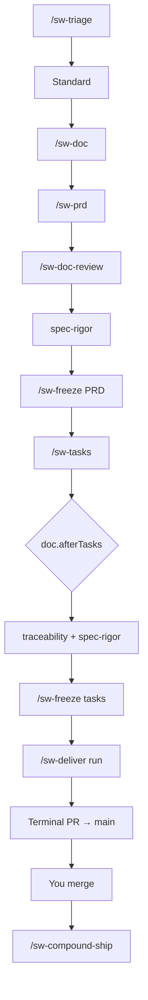

```text
/sw-doc
Feature: CSV export on reports table — 4 files, clear criteria, no auth
/sw-deliver run docs/prds/<n>-<slug>/tasks-<n>-<slug>.md
```

### Full tier workflow

Explores requirements before the PRD. Use when scope or product decisions are still open.

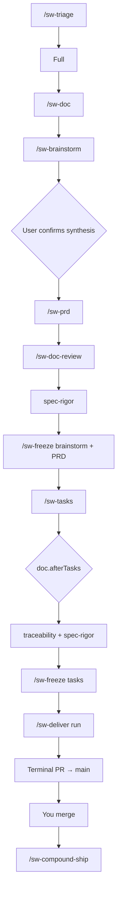

```text
/sw-doc
Feature: new billing portal — explore pricing models, 8+ files, auth + Stripe
/sw-deliver run docs/prds/<n>-<slug>/tasks-<n>-<slug>.md
```

> **Note:** `/sw-doc` **stops** on Quick tier and tells you to use the implementation workstream
> instead.

---

## Documentation workstream — spec before code

Use when tier is **Standard** or **Full** and you need a reviewed plan before implementation.

**Standard doc pipeline** (no brainstorm):

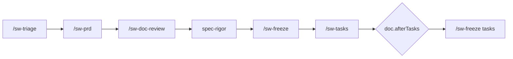

**Full doc pipeline** (brainstorm first):

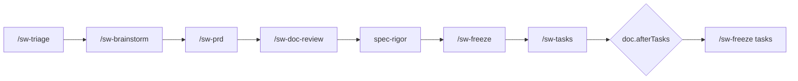

Or run `/sw-doc` to orchestrate either chain end-to-end.

**Typical flow**

1. `/sw-triage` — classify tier (or pass `--tier` to `/sw-doc`)
2. `/sw-doc` — runs the tier-appropriate doc chain
3. Human **`doc.afterTasks`** checkpoint after single-pass task freeze (default `confirm`) — a dedicated
 **Implementation checkpoint** block (not buried in closing prose); only `proceed`/`yes` continues;
 unrelated messages re-emit the checkpoint until acked
4. Frozen PRD + tasks become the spec for **`/sw-deliver run <frozen-task-list-path>`** (primary post-freeze
 command; `/sw-doc` dispatches it on `confirm`/`auto`) or manual `/sw-ship` per phase

**Sample prompts**

```text
/sw-doc
Feature: user profile settings page
Context: Need PRD and tasks before implementation. Tier unknown — triage first.
```

```text
/sw-prd --tier standard
Feature: add export-to-CSV on reports table
Context: 3–4 files, no auth changes. Skip brainstorm.
```

**Key commands**

| Command | Use when |
|---------|----------|
| `/sw-doc` | End-to-end doc pipeline orchestrator |
| `/sw-triage` | Classify Quick / Standard / Full only |
| `/sw-brainstorm` | Full-tier requirements exploration (before PRD) |
| `/sw-prd` | Draft PRD or decision record |
| `/sw-doc-review` | Persona panel on spec drafts |
| `/sw-freeze` | Lock artifact; no further edits without `/sw-amend` |
| `/sw-tasks` | Generate task list from frozen PRD |
| `/sw-amend` | Post-freeze correction via amendment file |

---

## Implementation workstream — ship a feature from spec

**Primary path:** `/sw-deliver run` orchestrates every phase from the frozen task list to one terminal
merge gate. `/sw-ship`, `/sw-execute`, and the other ship-loop atomics still exist — `/sw-deliver`
invokes them per phase; run them manually only for Quick-tier hotfixes, debugging, or single-phase
reruns.

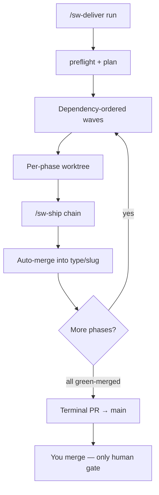

### `/sw-deliver run` — phase-mode play button (default)

When `/sw-doc` has produced a **frozen** task list (`tasks-<n>-<slug>.md`), `/sw-deliver` is the
default implementation orchestrator. Mode auto-detect from input:

| Input | Mode |
|-------|------|
| `--task-list docs/prds/<n>-<slug>/tasks-....md` | **phase-mode** — one feature, many phases |
| `--items A,B` + `--edges C:A` | **multi-feature** — independent features + integration branch |

**Typical phase-mode flow:**

```text
/sw-deliver run docs/prds/004-my-feature/tasks-004-my-feature.md
```

1. `preflight` + `plan` — validates frozen tasks, CI/review base-branch preflight, writes
 `.cursor/sw-deliver-plan.json`.
2. Provisions orchestrator + per-phase worktrees; dispatches full `/sw-ship` per phase.
3. Auto-merges each green phase into `<type>/<slug>`; siblings continue on blast-radius block.
4. Opens a **single terminal** `<type>/<slug> → main` PR when all phases are `green-merged` — the
 only human merge gate for the feature.

**Resumption:** re-run the same `run` command after interrupt; `resume reconcile` skips
`green-merged` phases. Use `plan --from <phase>` when upstream phases are already merged.

**Dry-run:** `scripts/wave.py plan --task-list <path> --dry-run` emits the plan JSON without writing
`.cursor/sw-deliver-plan.json`.

**Durable autonomy:** the driver is `scripts/wave.py deliver-loop` (also invoked by
`/sw-deliver run`). It persists cursor state in **scoped** `.cursor/sw-deliver-state.<slug>.json` at the
repo root (canonical — ), resumes after crash without restarting from plan, and never emits manual
“next steps” prose while work remains. Phase advancement keys off durable `status.json` in each
**phase-worktree** (`status collect` — not chat). Per-phase `/sw-ship` persists step-level state
(`ship-steps.json`) for mid-chain resume.

**Concurrent deliver:** orthogonal features may run `/sw-deliver run` in parallel — each
target branch owns scoped state/lock files. `/sw-status` lists every in-flight run via
`.cursor/sw-deliver-runs/index.json`. Living docs (`INDEX.md`, `CHANGELOG.md`) stay serialized via
`.cursor/sw-living-docs.lock`.

**Freeze-time commit:** `/sw-freeze` commits frozen artifacts onto `<type>/<slug>` immediately
(closing the working-tree data-loss window) via the same spec-seed helper as `/sw-doc` afterTasks — never
`main`.

**Autonomous conductor:** `/sw-deliver` loads `skills/conductor/SKILL.md` and runs an
**in-turn self-continuation loop** — after each `deliver-loop` step the conductor re-invokes the driver
until a **legitimate halt** (terminal merge gate, exhausted remediation, ambiguous/destructive action,
configured checkpoint, phase timeout, external-wait exhaustion, or run-level budget). Routine steps
(status collect, merge enqueue, bookkeeping, living-doc reconcile) never pause for user input.

**Parallel dispatch:** dependency-ready phases within a wave dispatch as background sub-agents in
disjoint worktrees, bounded by `worktree.parallelCeiling` (default 4). Peak concurrency ≥2 when the
plan has parallelizable waves. Outcomes are read only from durable `status.json` — never chat logs.
Merge is single-flight (conductor-serialized queue + lock).

** deliver invariants:** whole-batch merge gating (no lone merge-enqueue while siblings lack
validated terminal status), deterministic-conflict auto-regen on the bounded path set, terminal
status.json provenance + blessed /sw-ship --phase-mode recovery (never hand-edit status), and
bounded verify:failed → /sw-stabilize remediation. CI-required fixtures:
feat-test-plan-dual-ship-fixtures, feat-test-plan-regression-remediation-fixtures,
feat-test-plan-parallel-merge-safety-fixtures, feat-test-plan-status-integrity-fixtures,
feat-test-plan-mechanical-sourcing-fixtures, feat-test-plan-deliver-invariant-fixtures.

**Pervasive delegation:** all five orchestrators (`/sw-doc`, `/sw-ship`, `/sw-deliver`,
`/sw-debug`, `/sw-feedback`) default to **delegate-by-default** for substantive steps. Only closed
inline allowlists (bookkeeping, driver invocations, human gates) run in-turn. Every delegated `Task`
must carry an explicit resolved `model:` and caveman intensity — enforced by `dispatch-check.py` and
mechanical `dispatch preflight` + `preToolUse` deny. Tune gate aggressiveness with `delegation.mode`
(`bind-only` | `heuristic` | `default`). Intensity maps live in `communication.routing` (command → skill
→ agent → default). See `rules/sw-subagent-dispatch.mdc` and `core/sw-reference/models-tiering.md`.

**Legitimate halts (summary):** final merge to `main`; remediation budget exhausted; merge conflict /
destructive git; `deliver.autonomy.mode: supervised` or `doc.afterTasks: confirm`; phase liveness
timeout; CI/external wait exhausted; run-level `deliver.autonomy.maxRunMinutes` / `maxIterations`.
Every halt emits one consolidated report with an exact `resumeCommand` — not “continue?”.

See `configuration.md` for `deliver.autonomy` defaults and `skills/conductor/SKILL.md` for the full
contract.

**Merge queue:** phases with no per-phase PR use a local-evidence merge path; phases with a PR use
`check-gate.py`. `status.json` binds to the phase head SHA — stale status cannot authorize a merge.
The orchestrator worktree owns a non-detached `<type>/<slug>` checkout; phase merges advance that ref
(no manual fast-forward on the primary checkout).

**Pre-merge compounding:** after all phases are `green-merged`, the driver runs `/sw-retrospective
--pre-merge` (single-sourced chain; deprecated `/sw-compound-ship` routes to the same). File outputs
are committed on the feature branch; memory writes are not committed. `compound.autonomy` (`supervised` |
`auto`) gates approval prompts only — memory fail-closed and rule-class human gates always apply.
Completion is recorded as `completed-pending-merge` until the human merges; the loop then suggests
`/sw-cleanup` (dry-run first; agent asks for confirm before applying removals).

**Task currency:** frozen task checkboxes may be toggled in-loop; a currency gate blocks the terminal
merge if checkboxes diverge from the durable ledger.

**Living-doc currency:** INDEX status, COMPLETION-LOG, and GAP-BACKLOG reconcile in-loop on the
feature branch; `docs-currency` hard-blocks the terminal gate on drift for the current PRD.

**Planning lifecycle:** units under `docs/planning/` carry typed lifecycles and `depends:`/`absorbs:`/
`supersedes:` edges. The maintenance reconciler (`planning-graph reconcile`) regenerates the INDEX `derived`
region and archive view; deliver writes `inFlight` only. `/sw-deliver next` and the unit-level dependency gate
fail closed on unmet prerequisites (`planning.autonomy` soft-enforces priority on explicit `--task-list`).
Legacy `GAP-BACKLOG.md` is a read-only projection during cutover — gap capture writes canonical gap units.


**Doc frontmatter traceability:** Full-tier PRDs carry `brainstorm:` in frontmatter; writable brainstorms
may gain `prd:` forward links. `/sw-freeze` verifies resolvable linkage before freeze.

**Branch policy:** workflow-created branches use conforming type prefixes (`feat/`, `fix/`, …) from
`release-please-config.json` — never `pf/`.

**Secret safety:** `scripts/secret-scan.py` runs at every workflow push chokepoint (`git-push.py`);
range-scoped redaction is required (`scripts/redaction-guard.py` refuses bare-branch history rewrite).

### `/sw-ship` — single-phase loop (manual / Quick tier)

Used directly for **Quick-tier** work (no frozen task list) or when debugging a single phase. When
you run `/sw-deliver`, this chain executes **inside** each phase.

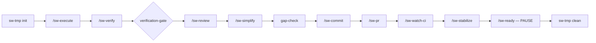

Halts on verification failure, review blockers, or red CI. **Never auto-merges.**

**Typical manual flow** (Quick tier or single-phase debug)

1. `/sw-worktree provision` — isolated worktree for the work item
2. `/sw-start` — phase branch
3. `/sw-execute` — implement one task slice
4. `/sw-ship` — verify → review → commit → PR → watch CI → stabilize → **pause at merge-ready**
5. You merge manually; then `/sw-compound-ship` in the target repo

**Sample prompts (manual / debug)**

```text
/sw-worktree provision
Work item: user-profile-settings (from tasks)
```

```text
/sw-ship
Context: Phase 1 tasks 1.1–1.3 complete. Parent branch main. Run full loop through stabilize.
```

**Post-merge chain (`/sw-compound-ship`):**

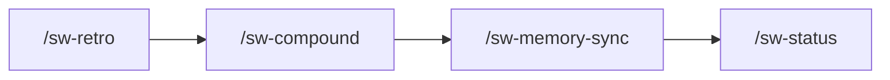

**Key commands**

| Command | Use when |
|---------|----------|
| `/sw-deliver run <frozen-tasks>` | **Primary** — orchestrate all phases to one terminal merge gate |
| `/sw-ship` | Manual single-phase loop (Quick tier, debug, or without `/sw-deliver`) |
| `/sw-worktree` | Create or tear down per-item worktree (manual; `/sw-deliver` provisions automatically) |
| `/sw-start` | Open phase branch inside worktree (manual path) |
| `/sw-execute` | One bounded implementation slice (manual path; first step inside `/sw-ship`) |
| `/sw-verify` | Run scoped lint/typecheck/test |
| `/sw-review` | Local multi-agent + provider review |
| `/sw-commit` | Commit after verify + review |
| `/sw-pr` | Push and open/update PR |
| `/sw-watch-ci` | Poll PR checks until green/red/timeout |
| `/sw-stabilize` | Clear failing checks and review threads |
| `/sw-ready` | Final readiness report (never merges) |
| `/sw-compound-ship` | Post-merge retro → compound → memory sync |
---

## Issue-store migration lifecycle preservation ( Phase 2)

When migrating between in-repo markdown artifacts and the configured `issue-store`, lifecycle metadata
survives in **both directions** (`files-to-issues` and `issues-to-files`). Bodies are content-hash verified
 before any source is removed; lifecycle fields are checked as part of verification.

### Open / frozen status

- **Files → issues:** `frozen: true` (and optional `frozen_at`) in frontmatter becomes the `sw:frozen` label
 on the issue, issue lock, and a freeze-record comment when applicable. Open vs closed issue state follows
 artifact `status` (gaps with `status: resolved` close the issue).
- **Issues → files:** `sw:frozen` and `sw:frozen-at:*` labels restore `frozen: true` and `frozen_at` in
 frontmatter. Issue `open`/`closed` state maps back to artifact lifecycle fields.

### `sw-edges` and native links

- **Files → issues:** The canonical `sw-edges` fenced block (and any frontmatter edge keys) is composed
 into the issue body; provider-native link projections are stored alongside canonical edges.
- **Issues → files:** Edges and native projections round-trip into the `sw-edges` block (and frontmatter
 edge keys when present). Divergence beyond tolerance fails verification.

### Gap status

- **Files → issues:** Gap units carry `status` (`open`, `planned`/`scheduled`, `resolved`) as issue labels
 (`open`, `gap-scheduled`, `resolved`) plus optional `sw:gap-schedule:*` labels.
- **Issues → files:** Labels restore `status` and `schedule` frontmatter on gap artifacts under
 `docs/planning/gap/`.

### Visibility gate (per create)

Every migration **create** resolves visibility via before any API write. A private or
`memory`-class artifact targeting a public/shared issue store is **refused** for that item only: it is
reported in the migration plan (`refusedCount`, action `refused`, reason `visibility`), its source file
remains untouched, and the rest of the batch continues.

### Bidirectional guarantees

| Concern | Files → issues | Issues → files |
| --- | --- | --- |
| Body | Hash-verified after create | Hash-verified after write |
| Frozen | `sw:frozen` + lock + freeze record | `frozen: true` in frontmatter |
| Edges | `sw-edges` block + native links on issue | `sw-edges` block restored |
| Gap status | Status labels on issue | `status` / `schedule` frontmatter |
| Visibility | Refused before create if private | `visibility` frontmatter from labels |

Operator entry: `/sw-migrate` and `python3 scripts/planning_migrate.py <repo> store-files-to-issues`
(dry-run default; `--apply` to mutate). Journal:
`.cursor/hooks/state/issue-store-migration-journal.json`.

## Issue-native doc-review and release grouping ( Phase 3)

Inert when `planning.store.backend != issue-store`.

### Doc-review via issue comments (, )

Under issue-store, `/sw-doc-review` posts persona findings as marker-delimited `sw:doc-review` comments on the
PRD artifact issue. Synthesis opens a **review-round manifest** pinning ordered comment IDs + revisions at
checkpoint; any add/edit/delete before synthesis **fails closed**. Persona comments are excluded from
 canonicalization. When `backend != issue-store`, the in-IDE parallel sub-agent panel + JSON synthesis is
unchanged (no regression).

Human review notes use a separate comment channel (no `sw:doc-review` marker).

### Release grouping (, )

`planning.releaseGrouping.mode` maps `sw:prd` units to provider milestones (`github-issues`) or iterations
(`gitlab-issues`) via the capability-gated `issue-milestone` verb. Absent capability → skip with operator
notice; deliver continues with flat-label fallback (`planning.releaseGrouping.labelPrefix`). Scheduler wiring
is — 045 is grouping/annotation only.

See `core/commands/sw-doc-review.md`, `core/skills/doc-review/SKILL.md`, and
`docs/guides/configuration.md` **Release grouping**.


## Issue-derived graph, hierarchy, and cross-project recall ( Phase 3)

Inert when `planning.store.backend != issue-store`.

### Task-list hierarchy (, , )

Frozen task lists project to provider epic/sub-issue hierarchy where supported; providers lacking
hierarchy verbs degrade to checkbox/body-encoded phase lists with operator notice — deliver continues.

```bash
python3 scripts/planning_hierarchy.py <repo> resolve-mode
python3 scripts/planning_hierarchy.py <repo> project docs/prds/<n>-<slug>/tasks-<n>-<slug>.md
python3 scripts/planning_hierarchy.py <repo> aggregate-status --payload-json '<parent+children>'
```

Parent epic status aggregates from children on read; contradictions fail closed. Body `sw-edges` blocks are
authoritative over native sub-issue links on conflict.

### Cross-project recall

Rationale pointers may be recalled across `projectKey` boundaries when authorized; dereference is redacted
via `memory-redact` so project B cannot read project A private rationale.

```bash
python3 scripts/planning_cross_project_recall.py recall --payload-json '{"sourceProjectKey":"a","callerProjectKey":"b",...}'
```

See `core/skills/memory/SKILL.md` **Cross-project recall**.

### inFlight tracking-issue safety

Optional tracking issues for committed `inFlight` tuples route through `planning_tracking_issue.py` and
`redact_inflight_tuple`; private/`memory` units are refused on public origin stores.

See `core/skills/deliver/SKILL.md` **Task-list hierarchy and inFlight tracking issues**.


## Issue-store deliver progress and native links

Inert when `resolve_effective_backend` ≠ `issue-store` (file-store paths unchanged — ).

### Native provider links (–, )

Issues adapters implement `native_links` on create/update/read — no discard on write. `sw-edges` in the
issue body stays authoritative; native links are projections for provider UI readability.

| Provider | Adapter | Native link verbs |
| --- | --- | --- |
| GitHub | `planning_github_client.py` | Sub-issue REST when capable; `cross-reference` comment fallback |
| GitLab | `planning_gitlab_client.py` | Issue link API where available |
| Jira | `planning_jira_client.py` | Issue links via REST; link type from createmeta / `planning.store.issues.linkDefaults` |

`planning_canonical.native_links_from_edges` resolves `sw-edges` unit targets to issue ids via the issue
unit index. Emission paths: migration create, `planning_gap_capture`, `planning_hierarchy` sub-issue create,
and edge reconciliation.

`python3 scripts/planning_store.py probe-issues-token` includes `nativeLinksCapable: true|false`. When the
provider lacks link scope or the API returns 403/404, adapters emit one per-run stderr notice
`native-links-degraded` and deliver continues — body edges remain authoritative .

### Deliver hierarchy and progress sync (–, )

| Hook | Module | Action |
| --- | --- | --- |
| Phase provision | `wave_deliver_loop.py` → `planning_progress.provision_deliver_hierarchy` | Apply `planning_hierarchy.project_task_list_hierarchy`; persist `hierarchyMap` on deliver state |
| Phase `merge-ready-green` | `wave_merge.py` → `planning_progress.sync_phase_done` | Apply `sw:phase:<id>:done` label on phase sub-issue |
| Checkbox toggle | `phase_acceptance_gate.py` / `execute_task_status.py` → `planning_progress.propagate_checkbox_to_issue_store` | Mirror phase task checkboxes onto sub-issue body when `hierarchyMap` present |

Deliver state shape: `hierarchyMap: { epicIssueId, phases: { "<id>": { issueId, unitId, doneSynced? } } }`.
Providers without hierarchy verbs degrade to checkbox/body-encoded phase lists with operator notice — deliver
continues. Label/body sync failures emit `progress-label-degraded` or `progress-body-degraded` once per run.

Run-entry materialize (`planning_materialize.py`) still verifies frozen task-list hash before `plan`/`preflight`
when the logical `body-path` is issue-backed only ( Phase 0).

### Living-docs issue projection

When `planning_cutover` marks the `derived` region `issue`, `wave_living_docs.py reconcile` calls
`planning_index_issue.project_index_status` instead of file `set-index-status` — INDEX PRD status is written
via `planning_store.put` on the derived artifact unit. File authority unchanged when `derived` ≠ `issue`.

Terminal reconcile still runs `gap-resolve` for absorbing PRDs when INDEX status is `complete`; gap rows are
edited on canonical gap **issues** — `docs/prds/GAP-BACKLOG.md` is a read-only projection refreshed by
`planning_gap_capture.py refresh-projection`.

Fixture suites: `planning-native-links-fixtures`, `planning-deliver-progress-fixtures`; extend
`planning-cutover-fixtures` for issue-derived INDEX projection.


## Debug workstream

Use when something is broken in production or you need RCA before fixing.

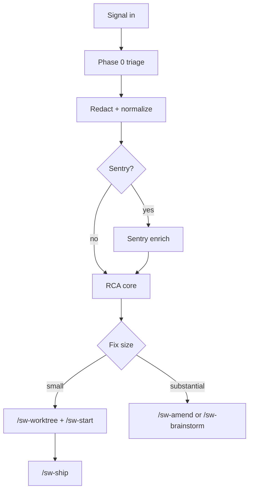

**Typical flow**

1. `/sw-debug` with signal (Sentry issue, stack trace, deploy log excerpt)
2. RCA core diagnoses; routes by fix size:
 - **Small** → `/sw-worktree` + `/sw-ship`
 - **Large** → `/sw-brainstorm` or `/sw-amend`

**Sample prompts**

```text
/sw-debug
Signal: Sentry issue PROJECT-123 — NullReference in CheckoutService.SubmitOrder
Context: Started after deploy v2.4.1 yesterday. 400 events/hour.
```

```text
/sw-debug
Signal: CI passes locally but fails on PR #42 — test_user_export timeout
```

**Key commands**

| Command | Use when |
|---------|----------|
| `/sw-debug` | RCA + route; does not implement or merge |
| `/sw-feedback` | Normalize inbound signal and suggest route (human confirms) |
| `/sw-feedback-close` | Close backlog signal after fix verified shipped |

---

## Feedback workstream

Use to capture signals without immediately analyzing them.

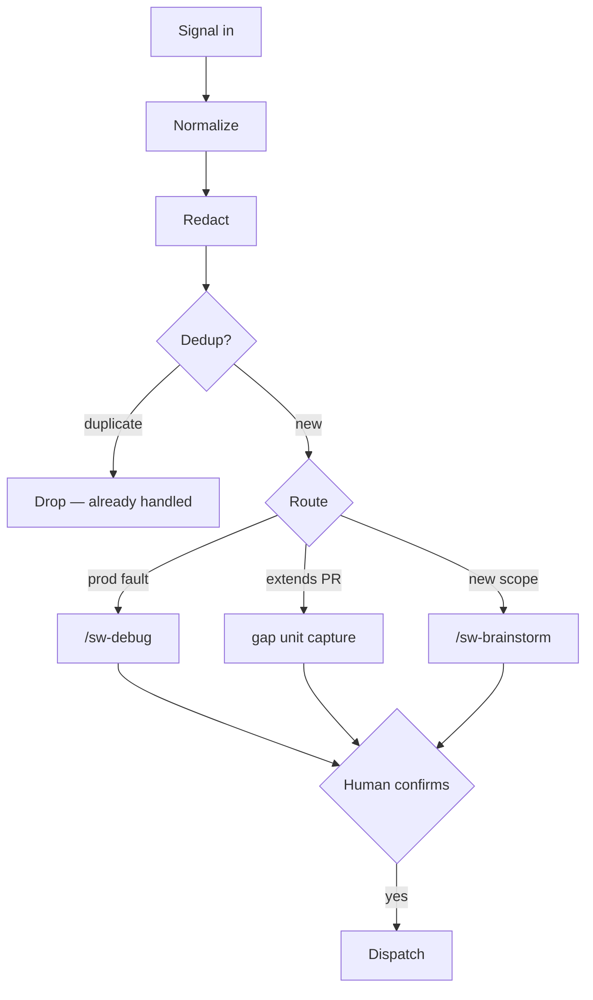

**Sample prompt**

```text
/sw-feedback
Signal: Code review on PR #88 — "missing rate limit on public endpoint"
Source: review comment
```

`/sw-feedback` redacts, classifies, and proposes a route. **Confirm** before dispatch.


## Planning autonomy and two-track edits

035-owned sections complement lifecycle/reconciler docs (033-owned).

### Backlog pull-in (–)

At PRD creation (`/sw-prd`) and task generation (`/sw-tasks`), `scripts/planning-related.py` scans the graph
and emits a **confirm-list** — never auto-absorbs. Stale/already-resolved candidates are flagged; human confirms
via `planning-related.py confirm`. Private units contribute metadata only ( visibility resolver).

### Autonomy posture (–)

| Mode | Behavior |
| --- | --- |
| `maintenance-only` (default) | Mechanical INDEX `derived` / reconciler bookkeeping runs without prompts; content decisions stay human-gated |
| `full-conductor` (opt-in) | Gap/absorption-class auto-decision under conductor legitimate-halt + mutation budget; never private/memory units; handoff-only (no nested orchestrators) |

Config: `planning.autonomy` + `planning.fullConductor.*` — see [configuration](configuration.md#planning-autonomy).

### Two-track doc-edit driver (–)

| Track | Allowlist | Route |
| --- | --- | --- |
| Mechanical | INDEX `derived` only, SUPERSEDED manifest, gap index | Batched `docs-merge.py` with CI auto-merge |
| Substantive | Any `docs/planning/<unit-id>/` path | Auto-driven docs worktree + PR via `docs-edit-route.py` |

`inFlight` is never mechanical. Branch protection probe fails closed to PR path.


## Scheduler frontier skip + park governance

`planning-graph.py next` (file path, via `wave_deliver.py` → `planning_deliver_gate.cmd_next`) and the
issue-store scheduler (`planning_scheduler.py`) **skip** units that cannot run — instead of failing the
whole frontier — and report why:

- A unit with no frozen task list is skipped as `no-frozen-task-list`; the scheduler advances to the next
 runnable unit and lists the skips under `skipped` in its JSON payload .
- The issue-store frontier additionally drops units carrying the `sw:parked` label, so legacy migrated
 units (e.g. `003-prd-pr-agent-review-provider`) no longer stall scheduling (, D4).

**Park governance .** Parking is deliberately gated so a unit cannot be silently removed:

```bash
# allowlisted actor + reason required; refused fail-closed otherwise
python3 scripts/planning-graph.py park <unit-id> --reason "<why>" [--actor <actor>]
python3 scripts/planning-graph.py unpark <unit-id> [--actor <actor>]
```

- The acting operator must be listed in `planning.scheduler.parkAllowlist` (see
 [configuration](configuration.md)); an empty allowlist authorizes no one, and a park with no reason is
 refused.
- Parked units are recorded in the local, backend-neutral registry `.cursor/planning-parked.json`
 (`unit-id → {reason, actor, at}`); the file-store path is unchanged when nothing is parked .

**Scheduler-exhausted halt.** When the eligible frontier is non-empty but every candidate is parked or
unrunnable, the scheduler emits an explicit `scheduler-exhausted` halt (exit 40) naming the parked and
unrunnable units plus the unpark remediation — never a silent empty result. `planning-doctor.py` surfaces
the same condition as an `over-parked-frontier` drift finding.


## Linear adapter documentation currency

Adapter-complete for and close requires the documentation inventory below to be
current. Verify before terminal merge:

```bash
python3 scripts/planning_linear_client.py . docs-currency-gate
```

| Surface | Path | Covers |
| --- | --- | --- |
| Linear provider spec | `core/providers/issues/linear.md` | Config keys, LCD verbs, stage-1 dogfood checklist, OAuth secondary mode, lock/overflow |
| Issues capability index inputs | `core/providers/issues/CAPABILITIES.md` | Verb contract, linear registration vs shipped, rate-limit map, doctor hooks (/) |
| Config schema + example | `core/sw-reference/config.schema.json`, `core/sw-reference/workflow.config.example.json` | `teamKey`/`teamId`, `authMode`, `operatorProjection.linear` flags |
| Operator guides | `docs/guides/workflows.md` (this section), `docs/guides/configuration.md` | browse + dogfood acceptance , issue-store routing |
| Command / surface refs | `docs/guides/commands.md` | Living-doc currency, deliver gates mentioning issues providers |
| Planning-store invariants | `core/providers/planning-store/issue-store.md`, `scripts/planning_store.py` facade | Facade-only projection mutation , dual-write canonical body , drift halt , dirty resume |
| GitHub Projects projection notes | `scripts/planning_github_projects_v2.py` module doc + `CAPABILITIES.md` degradation table | parity + Initiative/Cycle degradations |
| Conformance harness | `scripts/unit_tests/planning/test_prd066_*.py` | Stage gates, registration, projection schema |

Stage promotion gates (M7/A) inside :

| Stage | Gate | Auth |
| --- | --- | --- |
| 1 | dogfood checklist + rebuild | `api-key` |
| 2 | GitHub Projects parity | unchanged |
| 3 | Comments/relations surface (/) | unchanged |
| 4 | canonical fidelity + OAuth docs | oauth documented before advertising |

## Issue-store on Bitbucket hosts ()

Bitbucket Cloud repos use this host adapter for PR/CI only — **not** native Bitbucket issues for planning.

| Planning path | Config |
| --- | --- |
| **Default** — separate GitHub/GitLab planning project | `planning.store.storeLocation.mode: separate-project` + `issuesProvider: github-issues` or `gitlab-issues` |
| **Opt-in** — Jira (Cloud first) | `planning.store.issuesProvider: jira` + `planning.store.issues.*` |

When `issuesProvider` is unset on a Bitbucket host with `backend: issue-store`, run
`python3 scripts/planning_store.py bitbucket-issue-store-guidance` for structured routing guidance before
enabling issue-store. Init probes for Jira: `python3 scripts/planning_store.py probe-jira-init`.

Fixture suites: `scripts/test/run-planning-047-doc-impact-fixtures.sh`,
`scripts/test/run-planning-047-conformance.sh`, `scripts/test/run-planning-047-phase3-fixtures.sh`.

## Build-chain maintenance

When a change touches repo-root `scripts/` or other harness/emittable paths, propagate through the
build chain before opening a PR:

```bash
python3 scripts/build-chain-sync.py
```

This runs, in order:

1. `scripts/copy-to-core.py` — mirror harness + content into `core/` (orphan fail-closed on `core/sw-reference/`)
2. `python3 -m sw generate --all` — refresh `dist/cursor/` and `dist/claude-code/`
3. `scripts/snapshot-tree.py` — update `cursor-golden.manifest` when `dist/` changed

The SoT map lives in `.sw/layout.md` and `core/sw-reference/build-chain-sot.json`. CI enforces
`scripts/`↔`core/scripts/` parity (`run_core_scripts_parity_fixtures.py`) and dist↔golden parity.

## Pre-work memory search

Before substantive work, every **work-performing** command runs a scoped `memory-preflight` **search**
(not optional guidance). The obligation applies to `/sw-execute`, `/sw-debug`, `/sw-prd`, `/sw-brainstorm`,
`/sw-amend`, `/sw-review`, and `/sw-stabilize`.

1. **Search** — scoped file-path + semantic queries across classes `rule`, `decision`, `learning`,
 `code-context`, `design` via `providers/<memory.provider>.md` (see `skills/memory/SKILL.md`).
2. **Surface + reconcile** — applicable rules and contradicting decisions are reconciled before mutation.
3. **Record** — `python3 scripts/wave.py memory prework record --surface <cmd> …` writes a redacted breadcrumb
 to `.cursor/hooks/state/memory-prework-search.json` and `run.log`.
4. **Enforce** — the `preToolUse` hook denies the first file mutation without a fresh record; `memory:offline`
 (probe-gated provider outage) satisfies the gate.

Delegated sub-agents inherit the obligation (`rules/sw-subagent-dispatch.mdc`): perform the search or receive
a fresh redacted result fenced as `untrusted_payload`. Pure read-only exploration dispatch is exempt.


## Deliver plan-policy pilot

`/sw-deliver` exercises both proposal tiers live when `orchestration.planPolicy: proposed` and pilot guards pass:

- **Wave entry** — conductor proposes batching → `wave.py plan validate --tier wave` → `waveBatchingPlan` on shared run-state.
- **Phase entry** — executor proposes step plan → `plan validate --tier phase` → `phase-step-plan.json` in the phase run dir.
- **Intra-phase fan-out** — guideline-bounded parallelism with disjoint partition validation, global cap
 `waveSlots + activeIntraPhase ≤ min(parallelCeiling, harnessLimit)`, and `dispatch-decisions.json` audit.
- **Driver budgets** — `wave_deliver_loop.py` enforces `runStartedAt`, `driverIterationCount`, `noProgressStreak`; clean halt preserves merge-queue integrity.
- **Benefit metric ** — paired `canonical` vs `proposed` runs; `wave.py plan benefit-report` applies the fail-closed decision rule.

Default remains `canonical`. PRD-024 fans the proved pattern to `/sw-doc`, `/sw-debug`, and `/sw-feedback`.

## Orchestration plan policy

Shipwright splits orchestration into a **deterministic safety kernel** (non-skippable chokepoints) and an
**agent-decidable plan-policy** surface (optional steps, reorderings within guidelines, wave batching).
The classification is single-sourced in `core/sw-reference/kernel-classification.md`.

| Mode | Config | Behavior |
| --- | --- | --- |
| **Canonical** (default) | `orchestration.planPolicy: canonical` | Byte-identical to pre-022: hardcoded `/sw-ship` chain and plan-time deliver waves |
| Proposed (opt-in) | `orchestration.planPolicy: proposed` | Phase executors and the conductor may propose plans validated by `wave.py plan validate` |

**Default disclosure:** new repos seed `canonical`. Nothing observable changes until you opt into `proposed`
with PRD-023 pilot guards on `/sw-deliver`. Invalid proposals fail closed to the canonical chain
(phase) or canonical waves / `wave.py schedule` (wave).

Two-tier persistence: wave batching → shared deliver run-state (conductor-only); phase step plans → per-phase
run dir. See [configuration](configuration.md#orchestration-plan-policy-orchestrationplanpolicy) and
[call-site map](../../scripts/test/fixtures/planning-post-migration/022-kernel-classification-and-plan-validation/call-site-map.md).

## Orchestrator plan-policy fan-out

All four orchestrators (`/sw-deliver`, `/sw-debug`, `/sw-doc`, `/sw-feedback`) consume
`orchestration.planPolicy`. Default `canonical` is byte-identical to pre-024 behavior.

- **Durable path:** `/sw-deliver` and `/sw-doc` → `/sw-deliver run` handoff use deliver-scoped durable state.
- **Episodic path:** `/sw-debug` and `/sw-feedback` use per-invocation scratch under `.cursor/sw-debug-runs/`
 and `.cursor/sw-feedback-runs/` (abandoned on terminal halt; no crash-resume).
- **Consistency-only:** `/sw-doc` defers proposed guideline packs when `canonical ≡ proposed` (variance probe).

See `docs/guides/configuration.md` (–) and `core/sw-reference/layout.md` (scratch + preflight paths).


## Execute loop

Per-task discipline: **red → green → tdd-gate → refactor → stage-1 review → stage-2 review** (refactor re-runs verify; `quality:none` skips structural signal). Ship adds **decision-log provenance** on the PR.

## GitHub Projects v2 operator browse ( R11b, R29a)

When `planning.store.backend` is `issue-store` with `issuesProvider: github-issues`,
Shipwright projects the semantic planning graph into a GitHub Project for product-owner
browse. Configure `planning.store.operatorProjection.githubProjects` (`ownerLogin`,
`projectNumber`, optional `fieldMap`, `budget`).

### Required Project fields / views

Map these semantic keys to Project custom fields (names are defaults; override via `fieldMap`):

| Field | Answers PO question |
| --- | --- |
| `Absorbs` (multi) | Which gaps a PRD absorbs |
| `Brainstorms` (relation) | Which brainstorms feed a PRD |
| `Phases` (text/checkbox) | Task/phase completion for an in-flight PRD |
| `Status` (single select) | Item semantic status (backlog / in_flight / done) — **not** (4)-complete alone |
| `Program` / `Initiative` (required discriminator) **or** Project-per-program | (4) program backlog vs in-flight vs done |

### Dogfood / fixture walkthrough

1. `python3 scripts/planning_store.py probe-projection` — expect `available` with scoped token or `projection-unavailable` with loud notice (R11a).
2. `SW_ISSUES_FIXTURE=1 python3 scripts/planning_store.py projection-refresh` — idempotent upsert in fixture mode.
3. Open the configured GitHub Project and verify the four questions without opening issue YAML bodies.
4. `python3 scripts/planning_cutover.py projection-gate` — R29a living-doc cutover stays blocked until projection is `ready`.

Living-doc operator cutover (local INDEX/COMPLETION-LOG authority) MUST NOT proceed until
`projection-gate` reports `ready: true` (pair with `planning_cutover` committed gate).

## Turn-independent deliver ship loop

Phase-mode `/sw-deliver run` drives `/sw-ship` through the durable **ship-loop driver** — not ad-hoc
command chains. The conductor re-invokes `deliver-loop` in-turn until a legitimate halt; operators
should not see "continue deliver?" prompts when `deliver.autonomy.mode: autonomous`.

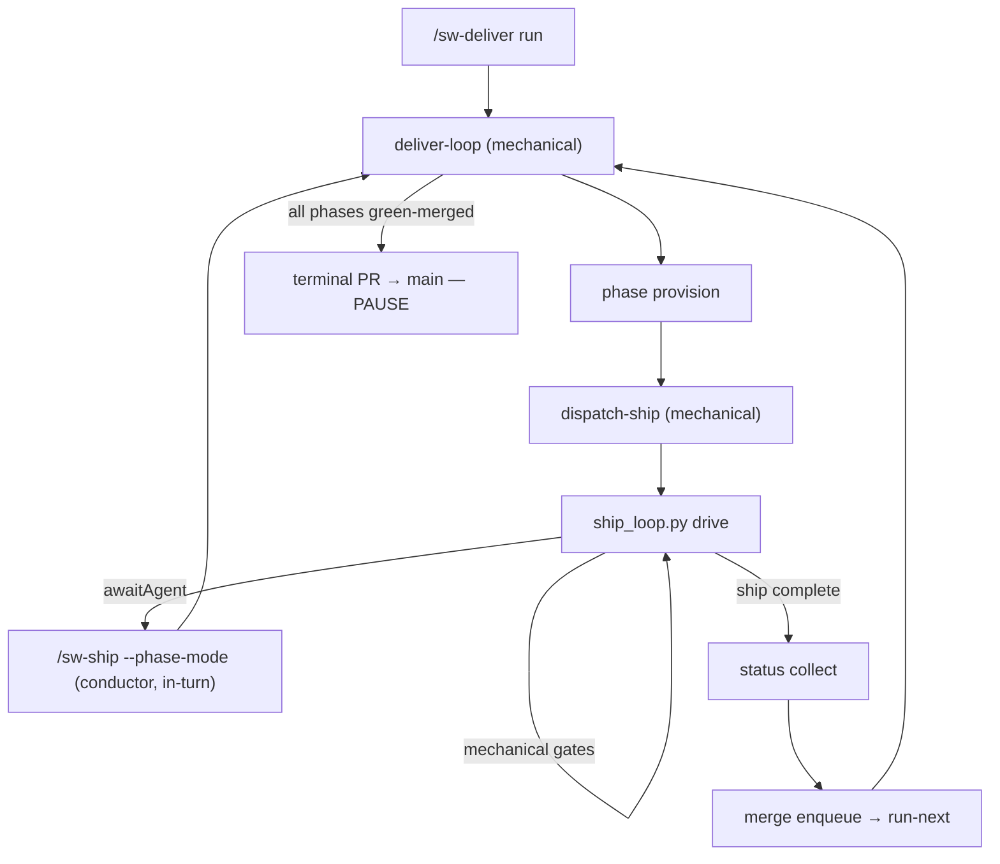

**Zero-interaction bar:** from `/sw-deliver run` through terminal PR preparation, the only chat turns
are driver-managed `awaitAgent` boundaries (execute, review, simplify, stabilize). Mechanical steps
gate handlers, commit, PR, CI watch, evidence writes — run without operator prompts. `dispatch-ship` and
`dispatch-batch` are mechanical; the driver never spawns Tasks.

**Evidence path:** each mandatory gate writes binding-valid records under
`.cursor/sw-deliver-runs/<phaseSlug>/gate-evidence/<gateId>.status.json`. `merge-ready-green` refuses
when evidence is missing, stale, or head-mismatched per the gate's declared binding mode.

**Resume:** halt payloads emit `/sw-deliver run <frozen-task-list>` or `/sw-deliver run --issue <n>`
never bare `deliver-loop` as the operator command.

## Deliver autonomy

Phase-mode deliver enforces durable **shipChain** consumability on terminal status : merge-ready
without a complete canonical ship chain is non-consumable. **Dispatch lease** blocks duplicate
`dispatch-ship` while a per-phase lease is live; **inline dispatch** is default for single-phase waves
 — only `dispatch-batch` may use background Tasks.

**Re-adopt gate :** `/sw-deliver run` refuses double-drive when `driverHeartbeatAt` is fresh;
self-wake continuations are the carve-out. **Hang/desync** detection halts with `resumeCommand` before
silent spin . **Pre-PR smoke** runs targeted pytest via `test_scope` before `sw-pr` .

Finalize hygiene (–): non-mutating `build-chain-sync --check`, living-docs deferral on lock miss,
and `close_delivery_units` with parent-checkbox epic close after main merge.


## Deliver loop reliability ( Wave A)

Phase-mode `/sw-deliver` reliability contracts (–):

| Contract | Behavior |
| --- | --- |
| Living-doc finalize | `finalize-completion` does **not** outer-acquire `.cursor/sw-living-docs.lock`; `living-docs reconcile` owns the lock via `living_doc_write_lock`. |
| Tasks currency path | Under issue-store, currency/`ledger check` prefers `.cursor/planning-materialized/<logical-path>` when the docs/ path is absent. |
| Checkbox sync | `merge-ready-green` syncs phase checkboxes through `planning_progress` → store `progress_update` with etag retry; revision conflicts fail closed (no silent degrade). |
| Terminal corroboration | Terminal tasks-currency requires independent CI/gate or completion-claim corroboration — checkbox↔ledger alone is insufficient. |
| Preflight timeout | `deliver.preflight.timeoutSeconds` (default **90**) bounds base-check probes; timeout emits fail-closed resume JSON. |
| Skip-base-check cache | `--skip-base-check` reuses `.cursor/sw-deliver-preflight-cache.json` when present; otherwise skips re-probe without failing. |
| Ship-lease reclaim | Reclaim only when **same host** + **stale heartbeat** + **dead PID** (optional start-token match). |
| Terminal env | Terminal PR/ship clears `SW_PHASE_*` so trunk base is used — never phase integration base. |
| Closure unit ids | `close-delivery-units` resolves `tasks-<n>-<slug>`, legacy, and `tasks-debug-*` forms; ambiguity fails closed. |

Resume after halt: `/sw-deliver run` from the orchestrator worktree (or `/sw-deliver run --issue <n>` under issue-store).


## Debug small-fix handoff

`/sw-debug` small route materializes `tasks-debug-<slug>` via `scripts/debug_deliver_handoff.py`, prints
`/sw-deliver run --unit-id …`, and may same-turn confirm into deliver. Execute/ship before confirm is
forbidden (`debug.pack.json` / `pre-confirm-guard`). Post-handoff halts belong to `/sw-deliver`.

## Craft-parity operator surfaces

Guided setup, state-aware entry, requirements divergence, and lightweight consult/capture surfaces that fit
the existing `sw-` command surface without adding a second pipeline:

| Surface | Behavior |
| --- | --- |
| `/sw-init` guided interview | Scan → present findings → confirm/correct → ask only unresolved choices, each with a recommended default; doctor/repair modes unchanged. |
| `/sw` bare entry | Reads worktree state + planning store, proposes the single next action with confirm — not a static menu. |
| `/sw-brainstorm` divergence | Names the core tension, generates 3–5 deliberate stances (including one cross-domain borrow) with trade-offs and effort, recommends one with conviction, persists chosen + rejected. Unsure responses route by type — calibration loop, narrower regenerate, or explicit delegation — instead of re-asking the same question. |
| Calibration loop | Reusable convergence primitive: one concrete either/or instance per turn, a fixed verdict set, restated principle, and stop-on-stability. Wired into brainstorm unsure-routing, doc-review disposition disputes, and feedback ambiguous-scope calls. |
| `/sw-ask` | Read-only consult routed to the best-fit existing persona; no pipeline side effects. |
| `/sw-become` | Crystallizes a new persona into one fixed local destination, confirm-before-write, never overwrites. |
| `/sw-note` | One-line idea/task/note capture under a local notebook outside the planning store; confirm-first graduation to a gap or brainstorm with two-way provenance. |
| `/sw-guide` | Read-only explanation of workflow behavior plus config/state/planning-backend diagnosis; never mutates. |

See [commands](commands.md#consult-and-capture) for the full command list and
[configuration](configuration.md#notebook-session-index) for the notebook session-index opt-in.

