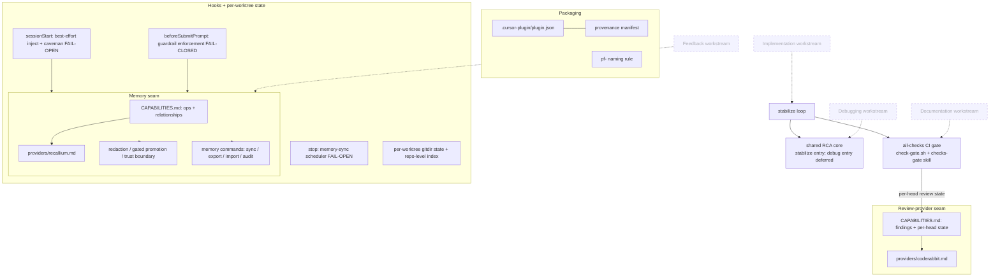

# feat: phase-flow v2 plugin foundation & ported infrastructure

## Implementation status

| Unit | Status | Notes |
|------|--------|-------|
| U1 | **Done** | Manifest, README, PROVENANCE, config schema/example, `sync-local-install.sh`, `pf-naming` rule |
| U2 | **Done** | Gate ported; clock injection (`PF_GATE_NOW`); golden fixture harness |
| U3 | **Done** | Review seam + `coderabbit` / `nocap-stub` executable adapters; `pf-review` |
| U4 | **Done** | Memory skill/spec, Recallium adapter, `pf-memory-*` commands |
| U5 | **Done (docs + policy)** | Guardrails rule, promotion/redaction/trust docs; executable redaction filter deferred |
| U6 | **Done** | Stabilize loop + RCA core (`debug` entry stubbed); `pf-stabilize`, `pf-watch-ci` |
| U7 | **Done** | Hooks (sessionStart fail-open, `beforeSubmitPrompt` fail-closed per A1), per-worktree state |

**Verification:** `bash scripts/test/run-gate-fixtures.sh` — 11/11 passing (gate verdicts, hook guardrails, URL validation).

**Follow-ups (not blocking merge):** neutral-check fixtures; `gh` timeouts in gate; rename gate JSON fields to neutral `review*` keys; executable redaction chokepoint (U5 doc-only today).

## Summary

Stand up the `currsor-phase-flow-2` plugin skeleton and port phase-flow v1's four proven infrastructure
seams into it under the `pf-` namespace: the all-checks CI gate, the swappable memory seam, the
swappable AI code-review seam, and the stabilize/RCA loop — plus the session/stop hooks and a per-worktree
state model. This is the load-bearing base the four workstreams (documentation, implementation, debugging,
feedback) will sit on; those workstreams are planned separately. Where review surfaced correctness/safety
gaps, the ported seams land in their hardened form (per-head review-state as a required adapter capability,
fail-closed rule-class memory injection, ingestion-edge redaction, human-gated guardrail promotion).

This plan covered HOW to build the foundation. **Implementation landed** on `feat/plugin-foundation` ([PR #1](https://github.com/grdavies/currsor-phase-flow-2/pull/1)); see **Implementation status** above for per-unit outcomes.

---

## Problem Frame

The brainstorm (see origin) commits to a fresh, self-contained, `pf-`prefixed plugin that vendors the best
of phase-flow v1 and compound-engineering rather than depending on either at runtime. Before any workstream
can be built, the plugin needs its package skeleton and the infrastructure v1 already proves works: a
deterministic CI gate, a provider-agnostic memory layer, a provider-agnostic review layer, a bounded
stabilize loop, and fail-open/fail-closed session hooks.

v1 ships these as `phase-flow` (unprefixed) with a single Recallium provider and a CodeRabbit-shaped gate.
The foundation must (a) re-home them under `pf-` with zero collision against v1 or compound-engineering's
`/ce-`, (b) generalize the CodeRabbit coupling into a true review-provider seam mirroring the memory seam,
and (c) fold in the hardening the document review surfaced, without waiting for the workstreams.

**Why now / why this scope:** the workstreams (R5–R29) all consume this infrastructure — the gate and
stabilize loop power implementation, the memory seam powers compounding, the hooks inject guardrails into
every session. Building the base first keeps each later workstream plan small and lets the ported pieces be
verified in isolation before orchestration is layered on.

---

## Requirements Traceability

Carried forward from origin (foundation-relevant requirements only):

- **Packaging / namespace:** R1 (built fresh merging v1 + CE), R2 (everything vendored in-tree), R3 (`pf-`
  prefix), R34 (names signal workstream + boundary), R40 (provenance manifest — seeded here; `/pf-upstream`
  refresh deferred).
- **Ported infrastructure (R4):** the all-checks CI gate, the provider-agnostic memory seam, and the
  stabilize loop — ported intact and `pf-`namespaced.
- **Review-provider seam:** R36 (swappable review provider, capability spec + CodeRabbit adapter,
  normalized per-head review state as a **required** adapter capability), and the gate-correctness shape
  the seam must preserve.
- **Memory seam + safety:** R32 (single-source swappable memory, relationships first-class, rule-class
  deterministic injection — **fail-closed**), R41 (ingestion-edge redaction), R42 (human-gated rule-class
  promotion + provenance + audit allowlist), R43 (provider trust boundary).
- **Stabilize / RCA:** R16 (normalized review feedback → bounded stabilize loop) and R35 (shared
  hypothesis-driven RCA core) — the core skill and its **stabilize** entry point; the **debug** entry point
  is scaffolded but deferred to the debugging-workstream plan.
- **Hooks / state / tokens:** R38 (per-worktree state + repo-level index), R39 (sessionStart best-effort
  rule injection + caveman directive; stop-hook memory-sync scheduler; **fail-closed enforcement relocated to
  the `beforeSubmitPrompt` hook per amendment A1** — sessionStart can't block), R30 (tiered token/model
  spend) and R31 (caveman session directive only; the dominant structural-isolation lever and sub-agent
  dispatch are deferred to the workstreams that introduce sub-agents, R37).

Explicitly **not** in this plan (deferred — see Scope Boundaries): R5–R12 (triage + documentation
pipeline, incl. the deterministic triage classifier and freeze enforcement), R13–R14 (living status layer),
R15/R17–R21 (implementation phase loop, worktrees, retrospective/compounding orchestration), R22–R29 +
the RCA debug entry (debugging + feedback workstreams), R37 (sub-agent dispatch policy as a workstream
concern), the `/pf-upstream` refresh command behind R40.

---

## Key Technical Decisions

- **Port, don't rewrite.** v1's `scripts/check-gate.sh`, memory skill/spec/provider, and stabilize-loop
  skill are copied into the new tree and re-homed under `pf-`, preserving their hardened logic (the
  #322/#330 false-green fixes live inside the gate). Rationale: the brainstorm's "Outside this product's
  identity" forbids discarding proven infra; re-deriving the gate's CodeRabbit-state heuristics would
  reintroduce solved bugs. (see origin: Key Decisions, R4)
- **One provider-seam pattern, two instances.** The review seam mirrors the memory seam exactly —
  `CAPABILITIES.md` spec + `providers/<name>.md` adapter + a `*.provider` config key + a neutral
  contract consumers depend on. Memory consumers depend on normalized ops + relationship edges; review
  consumers depend on normalized findings **and** a per-head review state. Rationale: a single learnable
  abstraction; swapping either provider is "add an adapter + flip config." (R32, R36)
- **Adapters have an executable interface for deterministic consumers.** The gate (`check-gate.sh`) and the
  hooks (`session-start.py`, the `beforeSubmitPrompt` fetcher) are deterministic executables — they can't
  read markdown adapters the way agent-mediated memory/review ops can. Each provider therefore ships a small
  executable adapter (a sourced provider script keyed on `*.provider` config, emitting normalized JSON) for
  those paths; markdown adapter docs cover only the agent-mediated consumers (`pf-review`, stabilize).
  Without this split, provider-swap never reaches the gate or the hooks. (R32, R36, R39)
- **Per-head review-state is a required adapter capability, gate stays fail-closed.** The gate never
  reports green off a provider that can't answer "has the review for this head settled"; such a provider is
  gate-incompatible and the verdict stays yellow. This is the contract that keeps "no false greens" honest
  across providers. (R36; origin Success Criteria)
- **Fail-closed guardrail enforcement at `beforeSubmitPrompt`; everything else fail-open.** Cursor's
  `sessionStart` hook is fire-and-forget and cannot block a session, so fail-closed enforcement moves to the
  `beforeSubmitPrompt` hook (whose `continue: false` is enforced): if rule-class guardrails can't be
  confirmed (provider unreachable), the first prompt is blocked with a loud, actionable error — no unguarded
  action proceeds. `sessionStart` still best-effort-injects guardrails + the caveman directive when
  reachable; that injection, the stop-hook scheduler, and the caveman directive stay fail-open. Rationale:
  preserves R32's intent (a guardrail can't silently vanish) at a hook event that can actually enforce it.
  This relocates the enforcement point named in the frozen brainstorm — see amendment A1 (supersedes R39's
  fail-closed clause). (R32, R39 as amended by A1)
- **Guardrail integrity at the ingestion and promotion edges.** Redaction runs before anything is persisted
  or re-injected (R41); promotion to deterministically-injected rule-class is human-gated with provenance
  and a repo-side allowlist that `/pf-memory-audit` maintains (R42). Rationale: compounding distills
  attacker-influenceable signals, so an always-on guardrail must not be auto-writable from untrusted input.
- **Provider credentials come from the environment / secret store, never committed config or logs.**
  Recallium and CodeRabbit require API credentials; `gh` self-authenticates. Config carries provider
  *selection* only — secrets are sourced from env/secret store at runtime, and hook error output (e.g. the
  `beforeSubmitPrompt` block message) and committed examples must never echo keys or endpoints. (R43)
- **Per-worktree state in the worktree's gitdir + a repo-level aggregating index.** No global mutable
  state file; concurrent worktrees never collide. The scheduler/marker state files are machine-local and
  git-ignored (the scheduler-state ignore is already in `.gitignore`). (R38, R39)
- **Triage classifier will be deterministic (decided, deferred build).** Per planning decision the
  Quick/Standard/Full classifier will use rule/heuristic scoring (file-count + risk-trigger keywords +
  ambiguity markers, conservative default to Standard). Recorded here as a fixed input for the deferred
  documentation-workstream plan; not built in this plan.
- **Provenance seeded now, refresh deferred.** Because vendoring happens in this plan, the provenance
  manifest is created and seeded with the exact v1 and compound-engineering sources/commits each component
  derives from. The `/pf-upstream` diff/port command is deferred. (R40)
- **Markdown-driven plugin; tests target the executable pieces.** Commands/skills/rules are markdown, so
  verification centers on the shell gate, the Python hooks, and provider-adapter contracts (golden-input /
  fixture tests where possible), plus structural validation (manifest paths resolve, frontmatter present).

---

## High-Level Technical Design

The foundation is four seams plus the hook/state layer that wires them into every session. The gate
consumes the review seam; the stabilize loop drives the gate and the shared RCA core; the hooks read the
memory seam (fail-closed for guardrails). Workstreams (dashed) consume this base but are out of scope here.



The diagram is authoritative for component relationships; per-unit Files sections are authoritative for
exact paths.

---

## Output Structure

Expected layout after this plan (new files; the implementer may adjust if a better layout emerges):

```text
currsor-phase-flow-2/
├── .cursor-plugin/
│   └── plugin.json                     # manifest: commands, skills, rules, hooks
├── .cursor/
│   └── rules/
│       └── pf-guardrails.mdc           # static always-on guardrail fallback (Cursor inject-bug mitigation)
├── README.md                           # install + usage + component overview
├── PROVENANCE.md                       # vendored-source manifest (R40)
├── commands/
│   ├── pf-review.md                    # provider-routed local-delta review
│   ├── pf-stabilize.md
│   ├── pf-watch-ci.md
│   ├── pf-memory-sync.md
│   ├── pf-memory-export.md
│   ├── pf-memory-import.md
│   └── pf-memory-audit.md
├── skills/
│   ├── checks-gate/SKILL.md            # gate predicate doc
│   ├── stabilize-loop/SKILL.md         # bounded loop
│   ├── rca-core/SKILL.md               # shared RCA (stabilize entry; debug deferred)
│   └── memory/
│       ├── SKILL.md                    # memory-preflight
│       └── CAPABILITIES.md             # memory seam spec
├── providers/
│   ├── recallium.md                    # memory adapter (markdown, agent-mediated)
│   ├── recallium-rules.sh              # executable rule-fetcher for hooks
│   └── review/
│       ├── CAPABILITIES.md             # review seam spec
│       ├── coderabbit.md               # review adapter (markdown)
│       └── coderabbit.sh               # executable adapter for the gate path
├── rules/
│   ├── pf-naming.mdc                   # pf- namespace + boundary conventions
│   ├── checks-gate.mdc
│   ├── code-review-automation.mdc
│   └── memory-guardrails.mdc           # fail-closed injection + promotion policy
├── hooks/
│   ├── hooks.json                      # sessionStart + beforeSubmitPrompt + stop
│   ├── session-start.py                # best-effort inject (fail-open)
│   ├── before-submit-guardrails.py     # fail-closed enforcement (continue:false)
│   ├── session-context.md
│   └── memory-sync-stop.py
├── scripts/
│   ├── check-gate.sh
│   └── sync-local-install.sh
├── config/
│   └── workflow.config.example.json    # review.provider + memory.provider + checks + state
└── docs/
    └── config.schema.json
```

---

## Implementation Units

### U1. Plugin scaffold, packaging, and provenance

- **Status:** Done (`c02b087`).
- **Goal:** A loadable, self-contained `pf-` plugin skeleton with manifest, README, config schema/example,
  local-install helper, provenance manifest, and the namespace/naming rule — no behavior yet.
- **Requirements:** R1, R2, R3, R34, R40.
- **Dependencies:** none.
- **Files:** `.cursor-plugin/plugin.json`, `README.md`, `PROVENANCE.md`, `config/workflow.config.example.json`,
  `docs/config.schema.json`, `scripts/sync-local-install.sh`, `rules/pf-naming.mdc`.
- **Approach:** Mirror v1's `.cursor-plugin/plugin.json` shape, declaring `./commands/`, `./skills/`,
  `./rules/`, `./hooks/hooks.json`; `name: phase-flow-v2` (or chosen id). Config example carries
  `memory.provider` and `review.provider` keys plus the full gate-consumed set — `checks` (incl.
  `treatNeutralAsPass`, `neutralAllowlist`), `coderabbit.reviewGraceMinutes`, `stateFile`, and `autoSync` —
  and declares provider *selection only*: API credentials are sourced from the environment / secret store at
  runtime, never committed here. `PROVENANCE.md`
  records, per vendored component, the source repo + derived-from commit (phase-flow v1 `scripts/check-gate.sh`,
  `skills/memory/*`, `providers/recallium.md`, `hooks/*`, `skills/stabilize-loop/*`; compound-engineering
  persona-panel pattern). `rules/pf-naming.mdc` fixes the `pf-` prefix, orchestrator-vs-atomic boundary
  language, and "description states what it does and does not do."
- **Patterns to follow:** phase-flow v1 `.cursor-plugin/plugin.json`, `config/workflow.config.example.json`,
  `docs/config.schema.json`, `scripts/sync-local-install.sh`; plugin-quality-gates rule (manifest valid,
  relative paths, declared component paths exist).
- **Test scenarios:**
  - Manifest validity: `plugin.json` parses, declares only paths that exist on disk, no absolute paths / `..`.
  - Config schema: the example config validates against `docs/config.schema.json`; `memory.provider`,
    `review.provider`, `coderabbit.reviewGraceMinutes`, and `checks.treatNeutralAsPass` / `neutralAllowlist`
    are all present and documented.
  - Credential hygiene: the committed example config contains no secrets / API keys (provider selection only).
  - Provenance completeness: every vendored component added in later units has a `PROVENANCE.md` entry
    (re-checked at end of plan).
  - `Test expectation: structural only — no runtime behavior in this unit.`
- **Verification:** Plugin loads in Cursor with no missing-component errors; `sync-local-install.sh` mirrors
  the tree to the local plugins dir.

### U2. Port the all-checks CI gate

- **Status:** Done — gate + fixtures; `mktemp`, empty-metadata blocked, `review.provider` sanitized.
- **Goal:** The deterministic gate (verdict + exit codes) ported intact and `pf-`namespaced, decoupled from
  any single review tool at the boundary it will later consume (U3).
- **Requirements:** R4, R16 (gate half), origin Success Criteria (no false greens).
- **Dependencies:** U1.
- **Files:** `scripts/check-gate.sh`, `skills/checks-gate/SKILL.md`, `rules/checks-gate.mdc`.
- **Approach:** Copy v1 `scripts/check-gate.sh` preserving its classification (`pass`/`pending`/`fail`/`block`),
  the unresolved-actionable review-thread count, and the verdict precedence (`red`→`blocked`→`yellow`→`green`)
  with exit codes `green=0, yellow=10, red=20, blocked=30`. Refactor the CodeRabbit-specific per-head detection (status-context match,
  latest review `commit.oid`, summary-comment markers, grace window) so it is sourced from the review-seam
  contract rather than hard-coded — the actual seam lands in U3; here, isolate the detection behind a single
  internal function/boundary with CodeRabbit as the inline default so the gate keeps working standalone.
  Config keys read from `.cursor/workflow.config.json` or `workflow.config.json`. Add a clock-injection seam
  (env override of "now") so the grace-window verdict is deterministically testable.
- **Patterns to follow:** phase-flow v1 `scripts/check-gate.sh`, `skills/checks-gate/SKILL.md`,
  `rules/checks-gate.mdc`.
- **Test scenarios:**
  - Golden-verdict cases (fixture JSON for `gh pr checks` / GraphQL): all-success → `green` (exit 0);
    a PENDING check → `yellow` (exit 10); a FAILURE → `red` (exit 20); zero checks or an unresolved
    actionable thread → `blocked` (exit 30).
  - NEUTRAL handling: NEUTRAL → `blocked` unless `treatNeutralAsPass`/allowlisted.
  - Per-head review state: review landed on current head → settled; in-flight marker present → `yellow`;
    no review signal past grace window → treated as settled (absent), matching v1.
  - Config resolution: gate reads `checks.*` and `coderabbit.reviewGraceMinutes` from either config path.
  - Deterministic harness: tests inject the clock (e.g. `PF_GATE_NOW`) and use a PATH `gh` stub that
    dispatches on subcommand + args across every surface the gate shells out to (`gh pr view`, `gh repo
    view`, `gh pr checks`, `gh api graphql` reviews/threads, `gh api .../comments`, `.../commits`), so
    grace-window verdicts don't drift with wall-clock.
- **Verification:** Gate produces the same verdict/exit-code on the fixture suite as v1 for equivalent
  inputs; the per-head detection sits behind one boundary ready for U3.

### U3. Swappable AI code-review provider seam

- **Status:** Done — executable adapters wired; gate sources `providers/review/<provider>.sh`.
- **Goal:** A review-provider seam mirroring the memory seam — capability spec + CodeRabbit adapter + a
  `review.provider` config key — with the gate consuming normalized per-head review state through it.
- **Requirements:** R36, R16.
- **Dependencies:** U2.
- **Files:** `providers/review/CAPABILITIES.md`, `providers/review/coderabbit.md`,
  `providers/review/coderabbit.sh` (executable adapter for the gate path), `commands/pf-review.md`
  (local-delta review entry), update `scripts/check-gate.sh` + `skills/checks-gate/SKILL.md` +
  `rules/code-review-automation.mdc`.
- **Approach:** `CAPABILITIES.md` defines the neutral contract: normalized findings (inline threads +
  non-inline) and a **required** per-head review state (`landed`/`in-flight`/`skipped`/`clean`), plus a
  capability flag for providers that cannot expose per-head state (→ gate-incompatible, fail-closed). The
  CodeRabbit adapter maps v1's detection (status context, `commit.oid`, summary markers, grace) onto the
  contract. The gate's U2 boundary now calls the configured adapter; consumers never touch a tool API.
  Because `check-gate.sh` is a deterministic shell script that cannot read a markdown adapter, the gate path
  consumes review state through an **executable** adapter — a provider script (`providers/review/<name>.sh`)
  the gate sources, selected by `review.provider`, emitting the normalized per-head state + findings as
  JSON. The markdown `CAPABILITIES.md` / `coderabbit.md` document the contract for the agent-mediated
  consumer (`pf-review`); the `.sh` adapter is the executable mirror for the gate.
  `pf-review.md` ports v1 `commands/coderabbit.md` as the provider-routed local review command.
- **Patterns to follow:** phase-flow v1 `commands/coderabbit.md`, `rules/code-review-automation.mdc`, and
  the gate's existing CodeRabbit logic; the memory seam's `CAPABILITIES.md` + `providers/recallium.md` as
  the structural template for spec+adapter.
- **Test scenarios:**
  - Contract round-trip: CodeRabbit adapter output validates against `CAPABILITIES.md` (findings + one of
    the four per-head states).
  - Gate-through-seam: gate verdict via the seam equals the U2 inline result for the same CodeRabbit fixture.
  - Capability gating: a stub adapter that declares no per-head-state capability forces the gate to stay
    `yellow` (never green) — the no-false-greens guarantee holds. Covers origin Success Criteria.
  - Config switch: changing `review.provider` makes `check-gate.sh` source a different executable adapter
    (`providers/review/<name>.sh`) without gate/skill edits; the emitted normalized JSON validates against
    `CAPABILITIES.md`.
- **Verification:** Gate is tool-agnostic at the boundary; CodeRabbit works as the default adapter; an
  incomplete adapter cannot produce a false green.

### U4. Swappable memory seam

- **Status:** Done — preflight skill, Recallium adapter, four `pf-memory-*` commands.
- **Goal:** The provider-agnostic memory layer ported intact — preflight skill, capability spec, Recallium
  adapter, neutral JSONL export/import, and the four memory commands — with relationships and rule-class
  as first-class types.
- **Requirements:** R4, R32 (mechanics), R34.
- **Dependencies:** U1.
- **Files:** `skills/memory/SKILL.md`, `skills/memory/CAPABILITIES.md`, `providers/recallium.md`,
  `commands/pf-memory-sync.md`, `commands/pf-memory-export.md`, `commands/pf-memory-import.md`,
  `commands/pf-memory-audit.md`.
- **Approach:** Port v1's memory skill/spec/provider verbatim except for `pf-` renames and the explicit
  modeling of relationship edges (`supersedes`, `relates-to`, `file-linked`) in both the live ops and the
  neutral JSONL schema, with a documented degrade-to-sidecar path for edge-less future providers. Recallium's
  native links are an untyped task↔memory id list (`link_task_memories`), so Recallium is recorded as
  **edge-degraded** (flat memories + a typed-relationships sidecar), not edge-native; full typed-edge
  round-trip is validated against a stub edge-capable provider. Memory commands route through the preflight
  skill, never the provider directly. Sync reads transcript deltas
  only and search-before-stores; the incremental marker file convention is carried over (machine-local).
- **Patterns to follow:** phase-flow v1 `skills/memory/SKILL.md`, `skills/memory/CAPABILITIES.md`,
  `providers/recallium.md`, `commands/memory-*.md`, and the marker-file convention.
- **Test scenarios:**
  - Export→import round-trip preserves memories **and** typed relationship edges, validated against a
    **stub edge-capable provider** (Recallium is edge-degraded: flat memories + relationships sidecar).
  - Degrade path: importing into an edge-less stub yields flat memories + a relationships sidecar.
  - Preflight routing: a memory command resolves the adapter from `memory.provider` config; an unknown
    provider errors clearly.
  - Sync delta discipline: a re-run with no new transcript delta is a no-op (marker respected).
  - `Covers` the swappability success criterion (neutral round-trip preserves relationships).
- **Verification:** Memory commands work through Recallium; export/import is idempotent and edge-preserving;
  no consumer references a provider API directly.

### U5. Memory safety and resilience

- **Status:** Done (policy + docs) — guardrails rule, audit allowlist contract, trust boundary; **executable redaction filter not built** (documented chokepoint only).
- **Goal:** Harden the memory seam per review: ingestion-edge redaction, human-gated rule-class promotion
  with provenance + audit allowlist, an explicit provider trust boundary, and fail-closed rule-class
  injection semantics defined at the seam.
- **Requirements:** R41, R42, R43, R32 (fail-closed).
- **Dependencies:** U4.
- **Files:** `skills/memory/CAPABILITIES.md` (extend), `providers/recallium.md` (extend),
  `rules/memory-guardrails.mdc`, `commands/pf-memory-audit.md` (extend), `skills/memory/SKILL.md` (extend
  write contract).
- **Approach:** Add a redaction step to the write contract that scrubs secrets/PII (tokens, auth headers,
  env values, PII patterns) before persistence or re-injection — applied at transcript, deploy-log, and
  Sentry-payload edges (the latter two are documented now, exercised by the deferred workstreams). Redaction
  is implemented as a single shared chokepoint (a deterministic filter, not a prompt-only instruction) that
  every current and future ingestion edge must route through, so deferred edges can't later bypass it; it
  pairs with the credential-handling decision (no secrets in config or hook output). Define
  rule-class promotion as a human-gated step requiring confirmation + provenance metadata (source,
  distillation origin); `/pf-memory-audit` gains a repo-side allowlist/override of active rule-class
  guardrails and a defined audit cadence. Document the provider trust boundary (data classification,
  least-privilege credential scope, encryption in transit/at rest, tamper/compromise failure mode, export
  protection). State the fail-closed contract for rule-class injection (the hook in U7 enforces it).
- **Patterns to follow:** v1 `commands/memory-audit.md` and `skills/memory/SKILL.md` write contract;
  existing always-applied memory rules for tone.
- **Test scenarios:**
  - Redaction: a named secret/PII corpus (AWS `AKIA…`, `ghp_…`/PATs, JWTs, `Bearer` auth headers,
    `-----BEGIN … KEY-----` blocks, emails) plus negative / adversarial cases (a secret in an unexpected
    position or format) is absent from the stored payload and the re-injection text, asserted per pattern
    class.
  - Promotion gate: an auto-distilled candidate cannot reach rule-class without the human-confirm step;
    a promoted rule carries provenance metadata.
  - Allowlist authority: a rule-class memory not on the repo-side allowlist is excluded from deterministic
    injection.
  - `Test expectation:` trust-boundary doc — structural (presence of the required sections), not behavioral.
- **Verification:** No secret/PII reaches the store in fixtures; rule-class set is human-controlled and
  provenance-tagged; trust-boundary section is complete.

### U6. Stabilize loop and shared RCA core

- **Status:** Done — stabilize wired to gate + review seam; `debug` entry stubbed; `pf-stabilize` mandates `check-gate.sh`.
- **Goal:** Port the bounded stabilize loop and introduce the single hypothesis-driven RCA core skill with
  the **stabilize** entry point wired; the **debug** entry point is scaffolded and explicitly deferred.
- **Requirements:** R4 (stabilize-loop port), R16, R35 (core + stabilize entry).
- **Dependencies:** U2, U3.
- **Files:** `skills/stabilize-loop/SKILL.md`, `skills/rca-core/SKILL.md`, `commands/pf-stabilize.md`,
  `commands/pf-watch-ci.md`.
- **Approach:** Port v1 `skills/stabilize-loop/SKILL.md` + `commands/stabilize-pr.md` + `commands/watch-ci.md`
  under `pf-`, preserving hard stops (max iterations, no-progress detection). Factor the root-cause analysis
  out of stabilize into `skills/rca-core/SKILL.md` as a single skill with two declared entry points:
  `stabilize` (inputs: failing checks + normalized unresolved review findings from U3) is implemented;
  `debug` (inputs: deploy/Sentry/user signals) is stubbed with a clear "deferred to debugging-workstream
  plan" marker so the core's shape is fixed now. Stabilize consumes the gate verdict (U2) and the review
  seam's normalized findings (U3).
- **Patterns to follow:** phase-flow v1 `skills/stabilize-loop/SKILL.md`, `commands/stabilize-pr.md`,
  `commands/watch-ci.md`.
- **Test scenarios:**
  - Loop termination: the loop stops at max-iterations and on no-progress detection (no infinite run).
  - Green exit: loop exits once the gate returns `green`.
  - RCA core entry contract: the `stabilize` entry accepts gate failures + normalized review findings and
    produces a hypothesis→fix structure; the `debug` entry exists but returns a deferred marker.
  - Review-seam coupling: stabilize reads findings via the U3 seam, not a CodeRabbit-specific call.
- **Verification:** Stabilize drives the gate to green or halts safely; RCA core is the single analysis
  skill with stabilize wired and debug scaffolded.

### U7. Session/stop hooks and per-worktree state model

- **Status:** Done — A1 fail-closed at `beforeSubmitPrompt`; shared `pf_hook_util` / `pf_recallium_url`; localhost-only `restBaseUrl`; `memory.guardrails.allowEmptyRules` bootstrap; `lastCompletedGenerationId` fix in stop hook.
- **Goal:** Port the hooks with the hardened fail-open `sessionStart` + fail-closed `beforeSubmitPrompt`
  guardrail enforcement (per amendment A1), the tiered caveman directive, and a per-worktree state model
  with a non-colliding repo-level aggregating index.
- **Requirements:** R38, R39 (as amended by A1), R30, R31, R32 (fail-closed enforcement point).
- **Dependencies:** U4, U5.
- **Files:** `hooks/hooks.json`, `hooks/session-start.py`, `hooks/before-submit-guardrails.py`,
  `hooks/session-context.md`, `hooks/memory-sync-stop.py`, `providers/recallium-rules.sh` (executable
  rule-fetcher), `.cursor/rules/pf-guardrails.mdc` (static fallback subset).
- **Approach:** Port v1 hooks under `pf-`. `session-start.py`: **best-effort** inject `rule`-class memories +
  the tiered caveman directive + workflow banner via `session-context.md` (fail-open — `sessionStart` is
  fire-and-forget and cannot block). Fail-closed enforcement moves to a new `beforeSubmitPrompt` hook
  (`before-submit-guardrails.py`): if rule-class guardrails can't be confirmed, it returns `continue: false`
  and blocks the first prompt with a loud, actionable error — no unguarded action proceeds (the enforcement
  point for U5's contract; see amendment A1). Both hooks fetch rules via a **provider-neutral executable
  fetcher** (`providers/<name>-rules.sh`) keyed on `memory.provider`, not the markdown preflight (hooks run
  before the agent); fetcher/error output never echoes credentials. Because Cursor's `sessionStart`
  `additional_context` injection has a known reliability bug, an always-on guardrail subset is mirrored to a
  static `.cursor/rules/pf-guardrails.mdc` fallback. `memory-sync-stop.py`: keep the turn/time/transcript
  thresholds + scheduler-state file (already git-ignored). Per-worktree state lives in the worktree's own
  gitdir (linked worktrees: `.git/worktrees/<name>/`) recording tier/phase/workstream; the repo-level index
  is **derived / read-time** (aggregated via `git worktree list`) or append-only — never a concurrently
  written shared file — so "no global mutable state" holds.
- **Patterns to follow:** phase-flow v1 `hooks/hooks.json`, `hooks/session-start.py`,
  `hooks/session-context.md`, `hooks/memory-sync-stop.py`, and the scheduler/marker state conventions
  (`before-submit-guardrails.py` and the rule-fetcher are new).
- **Test scenarios:**
  - Fail-closed enforcement: with the provider unreachable, `beforeSubmitPrompt` returns `continue: false`
    and the first prompt is **blocked** (not merely announced); with it reachable, the prompt proceeds and
    guardrails are present.
  - Allowlist enforcement: a rule-class memory present in the provider but absent from the repo-side
    allowlist is **not** injected by the live hook path.
  - Fail-open paths: a provider blip does not block `sessionStart` best-effort injection, the caveman
    directive, or stop-hook scheduling (all still exit 0).
  - Credential hygiene: hook error / block output never contains the provider key or endpoint.
  - Scheduler thresholds: stop hook emits the memory-sync follow-up only when turn/time thresholds are met;
    scheduler-state file is updated and is git-ignored.
  - Per-worktree isolation: two simulated worktrees maintain independent gitdir state; the derived
    repo-level index reflects both without a shared-file write collision.
- **Verification:** Guardrails are enforced at `beforeSubmitPrompt` (unguarded action is blocked, not just
  announced); ordinary work is never blocked by a provider blip on the fail-open paths; concurrent worktrees
  do not collide on state.

---

## Scope Boundaries

### Deferred to Follow-Up Work (separate plans)

- **Documentation workstream:** the deterministic triage classifier (decided: rule/heuristic scoring,
  conservative default to Standard), `/pf-brainstorm`, `/pf-prd`, `/pf-amend`, `/pf-tasks`, the persona
  panel (`/pf-doc-review` adapting CE's `ce-*-reviewer` panel + synthesis), and freeze enforcement
  (`frozen` flag rule + pre-commit hook + `core.hooksPath` bootstrap + CI required-check) with the
  supersede/retract amendment model.
- **Implementation workstream:** worktree provisioning/teardown + env scaffold (R18–R21), the atomic phase
  loop and `/pf-ship` orchestrator (R15), retrospective/compounding orchestration (R17, R33), and the
  living status layer (R13–R14).
- **Debugging workstream:** the RCA core's `debug` entry point, Sentry MCP integration, `/pf-debug`
  (R22–R24).
- **Feedback workstream:** `/pf-feedback` unified intake + routing (R25–R27).
- **`/pf-upstream`** provenance-diff/refresh command (R40) — the manifest is seeded here; the diff/port
  command is later.
- **Sub-agent dispatch policy** (R37) as a workstream-level concern.

### Outside this product's identity (from origin)

- A from-scratch reinvention that discards v1's proven CI gate, memory seam, and stabilize loop — those are
  ported here, not rebuilt.
- A composition that depends on compound-engineering (or any sibling plugin) being installed at runtime.
- Implementing the workstreams in this plan — this plan builds only the foundation they sit on.

---

## Risks & Dependencies

- **Cross-repo port fidelity.** The gate's CodeRabbit-state heuristics are subtle (status context vs
  `commit.oid` vs summary markers vs grace window); a sloppy port reintroduces the #322/#330 false greens.
  *Mitigation:* U2/U3 golden-fixture suite asserting verdict/exit-code parity with v1 before refactoring
  the boundary.
- **`gh`/GraphQL-dependent tests.** Parts of the gate depend on live `gh` output. *Mitigation:* drive tests
  from captured fixture JSON; mark the few genuinely live paths as integration-only.
- **Seam generalization scope creep.** Generalizing the review seam (U3) could pull in speculative
  multi-provider work. *Mitigation:* only CodeRabbit is wired; the seam is contract + one adapter +
  capability gating, nothing more.
- **Hook fail-closed UX.** Fail-closed enforcement at `beforeSubmitPrompt` blocks the first prompt if
  Recallium is flaky, which could be annoying. *Mitigation:* fail-closed is scoped strictly to rule-class
  guardrails; everything else (sessionStart injection, caveman, stop scheduler) is fail-open, and the block
  message is a clear actionable error, not a crash.
- **Cursor `sessionStart` `additional_context` injection bug (June 2026).** Hook-injected guardrails are
  load-bearing, and the known platform bug can drop injected context. *Mitigation:* the `.cursor/rules`
  static fallback (U7) carries the critical guardrail subset, and `beforeSubmitPrompt` enforcement does not
  rely on `additional_context`; verify the bug's status in the target Cursor version before building U7.
- **Provider credential handling.** Recallium / CodeRabbit keys must not leak into committed config or hook
  output. *Mitigation:* env / secret-store sourcing plus the no-secret-in-config / hook-output tests
  (U1, U5, U7).
- **Dependency on Recallium + CodeRabbit availability** for end-to-end verification (origin
  Dependencies/Assumptions) — fixture tests reduce but don't eliminate this for live paths.

---

## Sources & Research

Internal (vendored — recorded in `PROVENANCE.md` per R40):

- phase-flow v1 (`cursor-phase-flow`): `scripts/check-gate.sh`, `skills/checks-gate/SKILL.md`,
  `skills/memory/{SKILL.md,CAPABILITIES.md}`, `providers/recallium.md`, `skills/stabilize-loop/SKILL.md`,
  `commands/{coderabbit,stabilize-pr,watch-ci,memory-*}.md`, `hooks/{hooks.json,session-start.py,session-context.md,memory-sync-stop.py}`,
  `config/workflow.config.example.json`, `docs/config.schema.json`, `scripts/sync-local-install.sh`.
- compound-engineering: the `ce-doc-review` persona-panel + synthesis pattern (`agents/ce-*-reviewer.md`,
  `skills/ce-doc-review/references/*`) — pattern reference for the deferred documentation-workstream panel,
  not ported in this plan.

Origin requirements: `docs/brainstorms/2026-06-22-unified-dev-workflow-plugin-requirements.md` (frozen).
External grounding (spec-kit, cc-spex, coco-workflow, caveman) was captured in the origin's Sources and is
not re-researched here.
