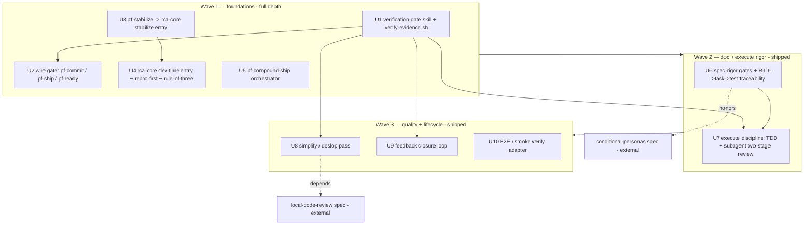

# feat: Loop improvement program (cross-loop quality gates + skill adoption)

Nine improvements (IM1–IM9) across the document, implementation, and debugging loops, delivered in three
dependency-ordered waves. **All ten units (U1–U10) shipped** and merged via PR #6
(`feat/loop-improvement-wave1`) at merge commit `2610119` on 2026-06-23 — including the Wave 2–3 units that
were originally planned at a directional altitude, which were carried to full implementation in the same
program. The directional framing in the unit bodies below reflects the *plan-time* commitment level and is
retained for historical context; see the status table for what actually landed.

## Implementation Status

**Program status: ✅ done** — merged via [PR #6](https://github.com/grdavies/currsor-phase-flow-2/pull/6)
(`feat/loop-improvement-wave1`), merge commit `2610119`, 2026-06-23.

| Unit | IM | Wave | Status | Commit | Notes |
| --- | --- | --- | --- | --- | --- |
| U1 | IM1 | 1 | ✅ done | `98557be` | Verification-gate skill + `scripts/verify-evidence.sh` + fixtures |
| U2 | IM1 | 1 | ✅ done | `56521be` | Gate wired into commit/ship/review; `pf-ready` intentionally gate-free (CI-only) |
| U3 | IM2 | 1 | ✅ done | `89fca89` | Route `/pf-stabilize` through `rca-core` stabilize entry |
| U4 | IM2 | 1 | ✅ done | `6b9a2e6` | Debugging hardening: dev-time entry, repro-first, rule-of-three, regression test, bisect |
| U5 | IM3 | 1 | ✅ done | `7d3dc25` | Post-merge compound orchestrator command |
| U6 | IM4 | 2 | ✅ done | `6dfe44d` | Spec-rigor gates + R-ID→task→test traceability |
| U7 | IM5+IM6 | 2 | ✅ done | `c519da4` | Execute discipline: TDD gate + subagent two-stage review (extends `/pf-execute`) |
| U8 | IM7 | 3 | ✅ done | `f4b768d` | Simplification / deslop pass |
| U9 | IM8 | 3 | ✅ done | `f2e41d3` | Feedback closure loop (`prds/GAP-BACKLOG.md` consumption) |
| U10 | IM9 | 3 | ✅ done | `fdeaab3` | E2E / smoke verify adapter (`providers/verify/`); hardened in `449b65f` |

**Verification:** `scripts/test/run-improvement-fixtures.sh` (created in U1, extended through U10), registered in
`.cursor/workflow.config.json` → `verify.test`.

---

## Summary

phase-flow v2 has a complete loop graph but unevenly gated steps. This plan closes the highest-leverage gaps
identified in the origin brainstorm: an evidence-over-claims verification gate, a unified root-cause
discipline, a post-merge compounding orchestrator, plus spec rigor, execute discipline, simplification,
feedback closure, and E2E verification. Wave 1 landed the self-contained foundations; Waves 2–3, originally
scoped at a directional altitude on Wave-1 primitives and two in-flight specs, were carried to full
implementation in the same program (see Implementation Status).

The plan honors the plugin's frozen requirements and guardrails: `pf-` naming, R41 redaction at ingestion
edges, checks-gate authority (`scripts/check-gate.sh` is the only green oracle), R29 loop hard stops, R42
human-gated rule promotion, and doc-freeze immutability.

---

## Problem Frame

The origin brainstorm (`docs/brainstorms/2026-06-23-loop-improvement-program-requirements.md`) found the loops
gated unevenly: strong gates (CI checks-gate, freeze-in-depth, redaction chokepoint, doc-review panel) coexist
with thin or missing ones. Three converging research streams (internal gap-map, external 2026 best-practices,
skill-ecosystem survey) named the same holes. The cross-cutting meta-pattern to extend: chain single-purpose
steps with a mandatory verification gate between each, read real artifacts/diffs/logs rather than the agent's
"done" claim, and use fresh-context subagents for review.

Two grounding corrections from repo research shaped this plan:

- `commands/pf-execute.md` is **already implemented** (impl plan 003, U3 Done) — IM5/IM6 *extend* it, they do
  not build it.
- `commands/pf-stabilize.md` had **zero** references to `skills/rca-core/SKILL.md` at plan time, confirming
  the broken R35 promise IM2 repaired (fixed in U3).

---

## Requirements Traceability

Each unit advances an origin IM-ID and honors/advances frozen R-IDs from
`docs/brainstorms/2026-06-22-unified-dev-workflow-plugin-requirements.md`.

| IM | Improvement | Units | Frozen R-IDs honored/advanced |
| --- | --- | --- | --- |
| IM1 | Verification-before-completion gate | U1, U2 | R15 (gated phase loop), R16 (gate→stabilize) |
| IM2 | Unify RCA + harden debugging | U3, U4 | R35 (one RCA, two entries), R29 (loop hard stops), R22 (signal-driven) |
| IM3 | Post-merge compound orchestrator | U5 | R13/R14 (living status), R32 (memory authority), R42 (rule promotion gate) |
| IM4 | Spec-rigor gates + traceability | U6 | R5–R12 (doc workstream), R9 (freeze) |
| IM5 | Test-first / TDD gate | U7 | R15–R17 (implementation loop) |
| IM6 | Subagent-driven execute | U7 | R37 (subagent dispatch), R17 |
| IM7 | Simplification / deslop pass | U8 | R16, R36 (review seam) |
| IM8 | Feedback closure loop | U9 | R25–R27 (feedback intake/route/gap) |
| IM9 | E2E / smoke verify adapter | U10 | R17 (verification) |

---

## Key Technical Decisions

**KTD1 — Verification gate is a reusable skill + executable verdict helper, not a fold into `/pf-verify`.**
A new `skills/verification-gate/SKILL.md` plus `scripts/verify-evidence.sh` emits a three-state verdict
(`verified` / `not-verified` / `inconclusive`). It is chosen over folding the verdict into `/pf-verify`
specifically so debug (U4) and feedback closure (U9) can call the *same* gate; if that reuse did not exist,
folding into `pf-verify` (which already owns the verify logs) would be preferable.

**Structured evidence is a prerequisite, not an assumption.** Feasibility and adversarial review of this plan
found that today's `/tmp` evidence is raw, unstructured command output; the gate JSON is never persisted to a
file; the review log path is nondeterministic and only exists for the CodeRabbit CLI provider; and no baseline
run exists. So U1 **cannot** reliably classify raw
logs or separate new from pre-existing failures against current artifacts. U1/U2 therefore add a structured
evidence contract: producers (`pf-verify`, `pf-review`, `check-gate.sh`) write a stable, deterministic status
file (e.g. `/tmp/pf-verify.status.json` with `{command, exitCode, status}`) and the gate consumes those plus
a named baseline. Evidence sources are typed **required vs optional** per provider config (a review-disabled
repo still reaches `verified` from verify + gate evidence alone). When no baseline is present the verdict
degrades to `inconclusive`, never `not-verified`.

**Authority is reconciled, not advisory-and-blocking at once.** The gate is **complementary to**
`skills/checks-gate` (CI truth) and never overrides a red/green `check-gate.sh` verdict — `scripts/check-gate.sh`
stays the sole green oracle. At the pre-CI boundary (`pf-commit`/`pf-ship` pre-push) the gate **blocks only on a
fresh, attributable `not-verified` failure**; `inconclusive` (missing/stale evidence) is logged and the chain
continues, so it never inserts a frequent mid-chain pause. (Advances IM1.)

**KTD2 — `/pf-stabilize` routes through the `rca-core` stabilize entry while keeping its ledger.** U3
augments rather than replaces: the blocker ledger, reply-before-resolve, non-inline harvest, and per-head
recompute stay; the triage that feeds them now loads `skills/rca-core/SKILL.md` (stabilize entry). This
repairs R35 without regressing the checks-gate authority or thread-resolution guardrails.

**KTD3 — Debugging hardening extends `rca-core`, it does not add a parallel skill.** U4 adds a dev-time
entry (test/build failures) alongside the existing debug + stabilize entries, plus a reproduction-first gate,
a failing-regression-test-before-fix gate, and a rule-of-three → question-architecture escalation that maps
onto existing R29 hard stops. git-bisect-for-regressions is offered as an optional step.

**KTD4 — Post-merge compounding is a new orchestrator command following the `pf-ship`/`pf-doc` convention.**
U5 creates `commands/pf-compound-ship.md` that delegates to existing `pf-retro` → `pf-compound` →
(optional `pf-memory-sync`) → `pf-status reconcile`/`append-log` atomics. It never reimplements them, never
auto-promotes rule-class memories (R42), and fires only after the human merge gate.

**KTD5 — Waves 2–3 extend existing surfaces (planned directionally; carried to implementation — see Status).**
`pf-execute` already exists, so IM5/IM6 attach to its steps; IM9 adds a *new* verify-provider selector modeled
on `check-gate.sh`'s adapter-exec pattern (not a structural copy of `pf-verify`, which has no dispatch logic to
mirror). The local-code-review spec was scoped as an external integration point for U8 and the
conditional-personas spec as a non-blocking input for U6; in the end both units shipped without waiting on
those specs, which remain separate follow-ups (see "Related external specs" below).

**KTD6 — Tests follow the established workstream convention.** `scripts/test/run-improvement-fixtures.sh`
(created in U1, extended through U10) uses golden fixtures for the executable verdict helper and structural
greps for markdown wiring, then registers into `.cursor/workflow.config.json` → `verify.test`.

**KTD7 — Cumulative gate friction is bounded by a program-level principle.** The program stacks several gates
(verification, spec-rigor, TDD, simplification, E2E) on a captive internal user. To avoid over-gating the loop
(which raises workaround risk — routing around `pf-commit`/`pf-execute` with raw git), every gate is
**default-on for risky changes with a lightweight path for trivial ones**, and gates stay additive/advisory
unless a block is clearly earned by a fresh attributable failure. Any human override is a single, logged,
auditable decision (R42-style human-gating); it can never suppress a red `check-gate.sh`/CI verdict.

---

## High-Level Technical Design

The diagram is authoritative for wave grouping and attach points; per-unit **Files** are authoritative for
paths.

Attach points into the existing loops: U2 into `commands/pf-ship.md`/`pf-commit.md`/`pf-ready.md`; U3/U4 into
`commands/pf-stabilize.md` + `skills/rca-core` + `skills/debug`; U5 a new orchestrator beside `pf-ship`;
U7 into `commands/pf-execute.md` + `rules/pf-subagent-dispatch.mdc`; U9 into `skills/gap-check` + `pf-execute`;
U10 into `commands/pf-verify.md` + new `providers/verify/`.

---

## Implementation Units

Suggested build order: land the two dependency-free certain wins first — **U3** (repairs the broken R35
promise) and **U5** (reliable compounding) — in parallel with **U1** (the riskiest net-new primitive), then
U2 (needs U1) and U4 (needs U3): `U3 ∥ U5 ∥ U1 → U2, U4` (Wave 1). Then U6 → U7 (Wave 2), then U8 → U9 → U10
(Wave 3). This retires trust-debt early rather than gating the certain wins behind U1's verdict design.

### U1. Verification-gate skill + executable verdict helper (IM1)

- **Goal:** A reusable "evidence over claims" gate that returns a three-state verdict from **structured**
  evidence, separating new from pre-existing failures only when a baseline exists.
- **Requirements:** IM1; honors R15/R16 (gated loop), R41 (redact any persisted evidence summary).
- **Dependencies:** none (but its production value depends on the structured-evidence emission added here +
  in U2).
- **Files:**
  - `skills/verification-gate/SKILL.md` (new) — read/evaluate recipe, three-state contract, required-vs-optional
    evidence typing, baseline contract, reuse points.
  - `skills/verification-gate/references/verdict-schema.json` (new) — verdict + typed evidence-pointer shape.
  - `scripts/verify-evidence.sh` (new) — deterministic verdict from structured status files + persisted
    `check-gate.sh` JSON + optional baseline.
  - `commands/pf-verify.md` (modify) — also emit a stable `/tmp/pf-verify.status.json`
    (`{command, exitCode, status}`) alongside the existing raw log.
  - `scripts/test/run-improvement-fixtures.sh` (new) — runner; golden fixtures for the helper.
  - `scripts/test/fixtures/verify-evidence/*` (new) — verified / not-verified / inconclusive / no-baseline /
    review-disabled inputs.
- **Approach:** The helper consumes **typed** evidence pointers (verify status file = required; gate JSON =
  required when a PR exists; review log = optional, absent-aware) and folds them into one verdict: `verified`
  (all required evidence present and passing), `not-verified` (a fresh, attributable failure present),
  `inconclusive` (required evidence missing/stale, **or no baseline available**). New-vs-pre-existing
  separation requires a named baseline (gate JSON / verify status captured against the merge base or
  pre-change head); with no baseline the verdict is `inconclusive`, never `not-verified`. The skill documents
  the recipe and reuse contract; the script is the testable oracle. The gate never overrides `check-gate.sh`.
- **Patterns to follow:** `scripts/check-gate.sh` (exit-code + JSON verdict style), `skills/checks-gate/SKILL.md`
  (gate-skill shape), `scripts/memory-redact.sh` (deterministic, offline, fixture-tested).
- **Test scenarios:**
  - `Covers IM1.` All required structured evidence passing → `verified`, exit 0.
  - Fresh failing verify status (absent in baseline, present at head) → `not-verified`, non-zero exit.
  - Required evidence missing/stale → `inconclusive`.
  - No baseline present → `inconclusive` (never `not-verified`), even with a failing head.
  - Failure present in baseline AND head (unchanged) → not attributed as new → not `not-verified`.
  - Review-disabled config (no review log) → still reaches `verified` from verify + gate evidence.
  - Determinism: same inputs → identical verdict JSON.
- **Verification:** `scripts/test/run-improvement-fixtures.sh` passes the verification-gate fixtures, including
  the no-baseline and review-disabled cases.

### U2. Wire the verification gate into commit / ship / ready (IM1)

- **Goal:** Make the gate load-bearing at the **pre-CI** "done" boundary without changing the green oracle or
  inserting a frequent mid-chain pause.
- **Requirements:** IM1; honors R15 (gated loop), R16.
- **Dependencies:** U1.
- **Files:**
  - `commands/pf-commit.md` (modify) — add precondition: verification-gate verdict must be `verified` before
    commit, or a single logged auditable override (R42-style; can never suppress a red `check-gate.sh`/CI).
  - `commands/pf-ship.md` (modify) — insert the gate after `pf-verify`, before `pf-commit`; block only on a
    fresh attributable `not-verified`; `inconclusive` is logged and the chain continues (preserves the
    single-terminal-pause model).
  - `commands/pf-review.md` (modify) — emit a stable review status pointer (or a fixed-path symlink to the
    latest review log) so the gate has a deterministic, absent-aware review evidence source.
  - `scripts/test/run-improvement-fixtures.sh` (modify) — structural assertions for the wiring.
  - **`commands/pf-ready.md` is intentionally NOT wired** — at the post-push merge gate the gate is redundant
    with CI and would import a stale-`/tmp` false-red. If ready-time local context is ever wanted it is
    strictly informational (log only, never affects the merge-ready verdict).
- **Approach:** Commands `Load skills/verification-gate/SKILL.md`. The gate blocks the orchestrator only on a
  fresh attributable `not-verified` failure; `inconclusive` logs and continues. Never auto-fix. `check-gate.sh`
  remains the sole merge-gate oracle.
- **Patterns to follow:** `commands/pf-ship.md` chain/guardrail sections; `commands/pf-commit.md` existing
  `/pf-verify` precondition.
- **Test scenarios:**
  - `Covers IM1.` Structural: `pf-commit.md` references the verification gate as a precondition with the
    bounded-override clause.
  - Structural: `pf-ship.md` chain lists the gate between verify and commit and continues on `inconclusive`.
  - Structural: `pf-ready.md` is unchanged / keeps `check-gate.sh` as the sole authoritative verdict.
- **Verification:** Wiring greps pass in `run-improvement-fixtures.sh`; `pf-ship` chain advances on
  `inconclusive` and halts only on fresh `not-verified`.

### U3. Route `/pf-stabilize` through the `rca-core` stabilize entry (IM2)

- **Goal:** Repair R35 — stabilize uses the shared RCA discipline instead of ad-hoc blocker triage, without
  nesting loops or misapplying the causal-chain gate.
- **Requirements:** IM2; honors R35, R29, R16; preserves checks-gate authority and reply-before-resolve.
- **Dependencies:** none (independent of U1).
- **Files:**
  - `commands/pf-stabilize.md` (modify) — triage step loads `skills/rca-core/SKILL.md` (stabilize entry);
    ledger, reply-before-resolve, non-inline harvest, per-head recompute unchanged.
  - `skills/rca-core/SKILL.md` (modify) — stabilize entry **consumes** pf-stabilize's already-harvested
    artifacts (`/tmp/pf-stabilize-threads.json`, `-noninline.md`, gate JSON) rather than re-collecting, so
    collection happens exactly once.
  - `skills/stabilize-loop/SKILL.md` (modify, if needed) — note that the loop inherits the RCA-backed pass.
  - `scripts/test/run-improvement-fixtures.sh` (modify) — structural + iteration-ceiling assertions.
- **Approach:** Insert RCA between failure harvest and the blocker ledger. Two corrections from review:
  (1) **No nested R29 loops** — the rca-core stabilize entry runs as a *single bounded analysis step per
  stabilize pass* (not its own iterating loop), so the existing stabilize-loop R29 budget remains the one
  authoritative ceiling. (2) **Causal-chain gate applies to `fix-now` blockers only** — `resolve-with-evidence`,
  `already-fixed-with-evidence`, and nit/defer items bypass RCA and go straight to their ledger disposition
  (a stale bot nit has no trigger→symptom chain to complete). Augmentation, not replacement.
- **Patterns to follow:** `commands/pf-debug.md` (which already loads the `rca-core` debug entry);
  `skills/rca-core/SKILL.md` stabilize-entry section.
- **Test scenarios:**
  - `Covers IM2.` Structural: `pf-stabilize.md` references `skills/rca-core` (stabilize entry).
  - Structural: reply-before-resolve and per-head recompute language retained.
  - Structural: non-fix ledger buckets (resolve-with-evidence / already-fixed) bypass the causal-chain gate.
  - Behavioral: combined stabilize + RCA respects one R29 iteration ceiling (no per-pass budget multiplication).
- **Verification:** `run-improvement-fixtures.sh` confirms the wiring, the single iteration ceiling, and the
  non-fix bypass.

### U4. Debugging hardening: dev-time entry, repro-first, rule-of-three, regression test (IM2)

- **Goal:** Add the systematic-debugging disciplines the loop lacks, as extensions of `rca-core`.
- **Requirements:** IM2; honors R35, R29, R22.
- **Dependencies:** U3 (shared RCA wiring established first).
- **Files:**
  - `skills/rca-core/SKILL.md` (modify) — add a dev-time entry (test/build failures) alongside debug +
    stabilize; document reproduction-first and the rule-of-three escalation as shared discipline.
  - `skills/debug/SKILL.md` (modify) — repro-first gate, failing-regression-test-before-fix, optional
    git-bisect-for-regressions step.
  - `commands/pf-debug.md` (modify) — surface the dev-time entry route.
  - `scripts/test/run-improvement-fixtures.sh` (modify) — structural assertions.
- **Approach:** Reproduction-first requires a reliable repro (or a logged inability) before a scoped fix; the
  failing-regression-test gate requires a test that fails before the fix and passes after; rule-of-three maps
  to the existing R29 circuit breaker (3 identical failures → escalate to architecture review). git-bisect is
  offered for regressions with a determinism-forcing wrapper (exit 0/1/125-skip).
- **Patterns to follow:** `skills/rca-core/SKILL.md` entry-section structure; existing R29 hard-stop language.
- **Test scenarios:**
  - `Covers IM2.` Structural: `rca-core` documents three entries (debug, stabilize, dev-time).
  - Structural: `skills/debug` states a reproduction-first gate and a failing-regression-test gate.
  - Structural: rule-of-three escalation references R29 hard stops.
- **Verification:** `run-improvement-fixtures.sh` confirms the new entry + gates are documented and wired.

### U5. Post-merge compound orchestrator (IM3)

- **Goal:** Make compounding run reliably every ship via a delegating orchestrator.
- **Requirements:** IM3; honors R13/R14, R32, R42.
- **Dependencies:** none.
- **Files:**
  - `commands/pf-compound-ship.md` (new) — orchestrator: `pf-retro` → `pf-compound` → optional
    `pf-memory-sync` → `pf-status reconcile`/`append-log`.
  - `rules/pf-workflow-sequencing.mdc` (modify) — reference the orchestrator for the post-merge sequence.
  - `scripts/test/run-improvement-fixtures.sh` (modify) — structural assertions.
- **Approach:** Follow the `pf-ship`/`pf-doc` orchestrator convention (Chain → Flags → Procedure →
  Guardrails). Delegate to atomics; never reimplement; fire only after the human merge gate; never
  auto-promote rule-class memories (R42 stays human-gated).
- **Patterns to follow:** `commands/pf-ship.md`, `commands/pf-doc.md` (orchestrator skeleton).
- **Test scenarios:**
  - `Covers IM3.` Structural: orchestrator chain lists retro → compound → status in order.
  - Structural: guardrails state "delegates, never merges, never auto-promotes rules."
  - Structural: `pf-workflow-sequencing.mdc` references the new orchestrator.
- **Verification:** `run-improvement-fixtures.sh` confirms the chain order and guardrail boundaries.

---

### U6. Spec-rigor gates + R-ID→task→test traceability (IM4) — *directional*

- **Goal:** Add clarify / checklist / analyze passes before freeze and a requirements-to-test traceability
  check that flags uncovered R-IDs.
- **Requirements:** IM4; honors R5–R12, R9.
- **Dependencies:** benefits from the conditional-personas spec (external); reads `skills/spec-union` output.
- **Approach (directional):** Clarify (ambiguity), checklist (requirement quality), and analyze (spec↔task
  consistency) run before `/pf-freeze`; a traceability check maps each R-ID through `/pf-tasks` to a named
  test scenario and flags gaps. Likely surfaces as additions to `skills/prd`, `skills/tasks`, and a new
  pre-freeze check; exact split decided at execution.
- **Execution-time specifics deferred:** whether gates are always-on or tier-gated (interacts with
  conditional-personas); whether traceability is a script, a skill, or a pre-freeze hook.
- **Test expectation:** structural + a golden traceability fixture, defined when the unit is planned to depth.

### U7. Execute discipline: TDD gate + subagent two-stage review (IM5+IM6) — *directional*

- **Goal:** Add a failing-test-first gate, per-task two-stage (spec-compliance → code-quality) review, and
  executable-plan granularity to the existing `/pf-execute`.
- **Requirements:** IM5, IM6; honors R15–R17, R37.
- **Dependencies:** U1 (verification gate); U6 (R-ID→test traceability feeds the TDD gate).
- **Approach (directional):** Three strands, planned as one execute-discipline workstream:
  - **IM5 TDD gate** — extend `commands/pf-execute.md` steps 5–7 with a red-green gate (test observed to fail
    before implementation; tests not rewritten to pass).
  - **IM6 subagent review** — extend `rules/pf-subagent-dispatch.mdc` with the two-stage review pattern (fresh
    subagent per task; spec-compliance then code-quality).
  - **IM6 executable-plan granularity** — upgrade `skills/tasks` toward code-bearing executable steps (exact
    paths, expected output) with a self-review pass (spec-coverage / placeholder-scan / type-consistency). This
    half of IM6 is carried here, not dropped.
- **Execution-time specifics deferred:** whether TDD ships as a gate vs. an execute mode; exact subagent
  orchestration shape; the `skills/tasks` upgrade depth; interaction with the verification gate from U1.
- **Test expectation:** structural wiring + behavioral fixtures, defined when the unit is planned to depth.

### U8. Simplification / deslop pass (IM7) — *directional*

- **Goal:** A behavior-preserving cleanup pass (reuse/quality/efficiency + AI-slop removal) between execute and
  stabilize.
- **Requirements:** IM7; honors R16, R36.
- **Dependencies:** U1 (re-verifies the post-cleanup diff via the verification gate); the local-code-review
  integration spec (external) — slots alongside it; the conditional-persona rule governs any persona panel it
  uses.
- **Approach (directional):** A new step/command in the ship chain after review, re-verified via U1's gate; may
  reuse the `providers/code-review/` panel proposed by the external spec rather than adding a parallel surface.
- **Execution-time specifics deferred:** standalone command vs. step inside the two-phase `/pf-review`; persona
  set.
- **Test expectation:** structural + behavior-preserving verification, defined when planned to depth.

### U9. Feedback closure loop (IM8) — *directional*

- **Goal:** Consume `prds/GAP-BACKLOG.md` into the implementation loop and close a routed signal once its fix is
  verified shipped.
- **Requirements:** IM8; honors R25–R27.
- **Dependencies:** U1 (verification gate for "verified shipped").
- **Approach (directional):** Extend `skills/gap-check` (and/or `/pf-execute`) to read backlog items, and add a
  closure step that marks a signal resolved after the verification gate confirms the fix shipped. Preserve the
  feedback router's human-confirmation stop and R41 redaction.
- **Execution-time specifics deferred:** backlog consumption mechanism; closure record location/format.
- **Test expectation:** structural + a backlog-consumption fixture, defined when planned to depth.

### U10. E2E / smoke verify adapter (IM9) — *directional*

- **Goal:** A provider-style verify adapter for smoke/E2E over affected routes, gated by project type.
- **Requirements:** IM9; honors R17.
- **Dependencies:** none (stack-dependent); independent of the others.
- **Approach (directional):** Add a new `providers/verify/` adapter split (config selector + `<id>.md`/`<id>.sh`).
  Note: `pf-verify` has no dispatch logic to copy, so the verify-provider **selector is net-new** — model it on
  `check-gate.sh`'s adapter-exec pattern, not on any existing `pf-verify` behavior. Smoke/E2E (e.g. Playwright /
  agent-browser) runs only when configured.
- **Execution-time specifics deferred:** the net-new selector + adapter contract; which runner(s) to support
  first; the `workflow.config.json` schema keys it introduces.
- **Test expectation:** structural + adapter-contract fixture, defined when planned to depth.

---

## Scope Boundaries

### In scope

The nine improvements (IM1–IM9) were addressed in full. The plan-time commitment levels (below) were all
resolved upward — every unit shipped via PR #6, including the units originally scoped as conditional or
directional:

- **Committed / build-ready (shipped):** U1–U5 (IM1–IM3), planned and delivered to full depth.
- **Conditional on external specs (shipped):** U6, U8 — built without waiting on the external specs they were
  scoped to benefit from / depend on.
- **Provisional / directional (shipped):** U7, U9, U10 — carried from directional altitude to implementation
  in the same program.

The "re-scope rather than build on unstable ground" contingency below was not exercised — all units landed.

### Deferred to Follow-Up Work

- `ce-sessions` prior-attempt retrieval (origin item J) — re-evaluate after Wave 1.
- git-bisect tooling beyond the optional step documented in U4.

### Related external specs (separate follow-ups)

- Local multi-agent code review in `/pf-review` — `docs/brainstorms/2026-06-23-local-code-review-loop-integration-requirements.md` (U8 was scoped to integrate with it but shipped independently; spec remains a separate follow-up).
- Conditional doc-persona selection — `docs/brainstorms/2026-06-23-conditional-review-personas-requirements.md` (U6 was scoped to benefit from it but shipped independently; spec remains a separate follow-up).

### Outside this plan

- Re-architecting existing strong gates (checks-gate, freeze, redaction, memory seam).
- Domain skill packs (Vercel/Supabase/Stripe/Sentry) beyond existing Sentry debug enrichment.

---

## Resolved Questions

These plan-time open questions were settled during implementation (all units shipped via PR #6):

- **U1 verdict helper surface** — resolved to a shell helper (`scripts/verify-evidence.sh`) for testability,
  as leaned toward at plan time.
- **U6 gate weight** — clarify/checklist/analyze weight resolved during U6 implementation (`6dfe44d`).
- **U7 TDD shape** — gate vs. execute mode resolved during U7 implementation (`c519da4`).

---

## Risks & Dependencies

- **Wave 2–3 dependency slip (did not materialize).** U6/U7/U8 were scoped to lean on Wave-1 primitives and
  two in-flight specs; the re-scope contingency was not needed — all units landed in the same program.
- **Stabilize regression risk (U3).** Routing through `rca-core` must not drop reply-before-resolve, per-head
  recompute, or checks-gate authority — covered by structural tests.
- **No-auto-fix discipline.** None of these units may auto-apply fixes or hand-roll a green verdict; the
  verification gate is additive to `check-gate.sh`, never an override.
- **Redaction at new edges (R41).** Any evidence summary or closure record persisted to memory runs through
  `scripts/memory-redact.sh`.

---

## Post-Ship Review Findings

A multi-persona `ce-doc-review` of this as-built plan (2026-06-23) surfaced the following follow-ups against
the shipped verification-gate primitive and the program's ship-all-at-once execution. They are recorded here as
backlog, not as changes to what shipped; the gate-hardening items (TB1–TB5) are tracked for a dedicated
follow-up brainstorm.

- **TB1 (high) — Verdict attribution too coarse to catch regressions.** `scripts/verify-evidence.sh`
  fingerprints only `{exitCode, status}` and discards the per-command names the schema carries, so a head that
  fixes one test while breaking another produces an identical fingerprint and is classed "pre-existing
  unchanged" — a real regression can reach `verified`/`inconclusive` and pass the pre-CI gate.
- **TB2 (high) — The gate is fail-open by construction.** `not-verified` is only reachable with a pre-captured
  baseline that has no producer/owner, and a producer that simply does not run degrades to
  `inconclusive`→continue (more lenient than running-and-failing). Skipping a step is therefore the cheapest
  pass, and evidence suppression equals gate bypass.
- **TB3 (high) — Evidence substrate is untrusted.** Fixed-path `/tmp` status files have no
  permission/ownership/integrity model (verdict forgery / TOCTOU on shared runners); R41 redaction is bound
  only to the memory edge, so raw logs/diffs sit in `/tmp` in plaintext with no TTL/cleanup; the
  symlink-to-latest-review-log option adds a symlink-follow vector.
- **TB4 (medium) — Override / lightweight-path audit trail underspecified.** The R42 "auditable" override
  never specifies record location, fields, or tamper-resistance, and KTD7's "lightweight path for trivial
  changes" is an undefined, unowned, unlogged escape hatch — strictly more attractive than the audited
  override.
- **TB5 (medium) — "Gate required when a PR exists" is caller-asserted.** `--require-gate` has no PR detection
  in the helper; a forgotten flag silently drops the CI-gate evidence requirement.
- **TB6 (high) — `done` may overstate completion for U6–U10.** The status flip retained directional unit
  bodies (acceptance bar never written; open decisions resolved only implicitly) with likely structural-grep
  test coverage for the directional half — a traceability gap that undercuts the program's own IM4 thesis.
- **TB7 (medium) — Ship-all-at-once reversed the plan's own risk posture.** All ten units merged in one PR
  despite the documented "re-scope rather than build on unstable ground" stance, without recording why it was
  safe; U8 shipped `done` while its stated hard dependency (local code review) is still unbuilt — a
  false-green, the exact pattern IM1 exists to prevent. A staged "ship Wave 1 → validate the friction bet →
  Waves 2–3" sequence was the lower-risk alternative.
- **TB8 (fyi) — The friction bet is unobservable.** Workaround risk (routing around gates with raw git) is
  named but has no usage signal; cumulative friction is argued per-gate but never summed across the five
  stacked gates; the friction-bounding classifier is deferred, so the "default-on for risky / lightweight for
  trivial" bound could silently collapse.

---

## Sources & Research

- Origin: `docs/brainstorms/2026-06-23-loop-improvement-program-requirements.md` (nine-item program, three
  waves, adoption sources).
- Frozen requirements: `docs/brainstorms/2026-06-22-unified-dev-workflow-plugin-requirements.md` (R1–R43) +
  amendment A1 (R44).
- Repo grounding (this session): per-IM touch-point map and authoring/test conventions across `commands/`,
  `skills/`, `rules/`, `agents/`, `providers/`, `scripts/test/`; prior plans 001–005 for unit/test style.
- External practice (via origin): superpowers (TDD, systematic-debugging, verification-before-completion,
  subagent-driven-development), GitHub Spec Kit (clarify/checklist/analyze, traceability), cursor-team-kit
  (deslop, verify-this), compound-engineering (ce-simplify-code).
