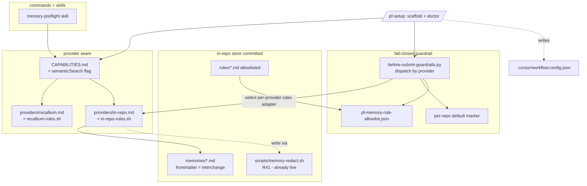

# feat: /pf-setup + in-repo memory provider (zero-dependency default)

Two independently-sequenced deliverables behind a single (already-satisfied) redaction predecessor: a
committed, human-readable **in-repo memory provider** that becomes the fresh-install default so the plugin
works with zero external dependencies, and a **`/pf-setup`** scaffolder/doctor that configures providers,
guardrails, and the store and validates an existing config. The enforced redaction chokepoint the origin
brainstorm scoped as a hard predecessor (U5) **already shipped** (`scripts/memory-redact.sh`, R41 — live),
so this plan treats it as a satisfied precondition and ensures the committed in-repo path routes through it.

## Implementation Units

| Unit | Deliverable | Status | Summary |
| --- | --- | --- | --- |
| U1 | in-repo provider | done | Provider description doc + store layout + capability flags (`semanticSearch`) |
| U2 | in-repo provider | done | Read/write mechanics: keyword+frontmatter search, lazy store create, committed/per-user-local |
| U3 | in-repo provider | done | Provider-dispatched rules adapter + offline fail-closed hook dispatch |
| U4 | in-repo provider | done | Zero-config per-repo default marker + default flip + session-start hint |
| U5 | /pf-setup | done | `/pf-setup` command: scaffold + initialize + environment doctor + re-runnable validator |
| U6 | shared | done | Config schema + example: `in-repo` provider, store/commit-mode knobs |
| U7 | shared | done | Fixtures + docs: rules adapter, provider dispatch, search degradation, setup doctor |

**Precondition (already met):** the R41 redaction chokepoint is live (`scripts/memory-redact.sh`,
`skills/memory/CAPABILITIES.md` → "Redaction chokepoint (R41 — live)"). No redaction unit is built here; U2
only verifies the committed in-repo write path invokes it.

**Verification:** `scripts/test/run-memory-provider-fixtures.sh` — all fixtures passing; registered into
`.cursor/workflow.config.json` → `verify.test`.

**Implementation landed** on `feat/pf-setup-in-repo-memory` ([PR #7](https://github.com/grdavies/currsor-phase-flow-2/pull/7), merge `e1e289c`).

---

## Summary

The plugin advertises a self-contained identity (foundation R2: everything vendored, no runtime dependency
on installed plugins) but its memory seam has a hard runtime dependency on Recallium — the only provider —
and configuration is hand-authored from `config/workflow.config.example.json`. A fresh install neither works
out of the box nor offers an on-ramp.

This plan closes both gaps. **Deliverable A** adds an in-repo markdown-with-frontmatter memory provider that
mirrors the Recallium adapter's seam contract (provider description doc + executable rules adapter +
capability flags), stores memories as committed, PR-reviewable files modeled on `/ce-compound`'s
`docs/solutions/` philosophy, lazily auto-creates its store, and makes the offline fail-closed guardrail work
by dispatching a **provider-specific** rules adapter from the hook (today the hook hardcodes
`providers/recallium-rules.sh`). It becomes the fresh-install default via a per-repo in-tree marker the hook
reads — scoped per-repo, never global, preserving the global-install pass-through built earlier. **Deliverable
B** adds `/pf-setup`: a full scaffolder, initializer, environment doctor, and re-runnable validator.

The work honors frozen guardrails: R41 redaction at the committed-memory edge, R42 human-gated rule promotion
(no auto-seeding; committed `rule` files still pass `/pf-memory-audit` + the repo-side allowlist, allowlist
edit a distinct gate), and the per-repo (never global) enforcement boundary.

---

## Problem Frame

The memory seam (`skills/memory/CAPABILITIES.md`, `skills/memory/SKILL.md` = `memory-preflight`) is
provider-agnostic by design: commands speak the abstract capability vocabulary and a provider adapter at
`providers/<name>.md` maps it to concrete tool calls. But only one adapter exists (`providers/recallium.md` +
`providers/recallium-rules.sh`), and:

- **Memory needs an external service.** A fresh install cannot store or retrieve memory without Recallium
  reachable at `memory.connection.restBaseUrl`.
- **The offline guardrail is Recallium-shaped.** `hooks/before-submit-guardrails.py` defaults its rules
  fetcher to `providers/recallium-rules.sh` (`_DEFAULT_RULES_SCRIPT`), and that script hard-errors for any
  `memory.provider != recallium`. So a non-Recallium provider currently cannot satisfy the fail-closed
  rule-class gate — it would block. Provider dispatch is the missing seam.
- **Config is hand-authored.** `.cursor/workflow.config.json` is copied from the example and edited by hand,
  with no guided path from "installed" to "configured and working," and no way to validate or repair an
  existing config that has drifted (unreachable provider, missing store dir, stale guardrail knobs).

The origin brainstorm scoped an enforced redaction filter as a hard predecessor because committed memories
land in git history permanently. **That predecessor is already built** — `scripts/memory-redact.sh` is the
live R41 chokepoint invoked by `memory-preflight` before every persist. This plan therefore does not build
redaction; it ensures the new committed write path uses it (U2) and proceeds directly to the provider and
setup deliverables.

---

## Requirements Traceability

Origin requirements: `docs/brainstorms/2026-06-22-pf-setup-and-in-repo-memory-requirements.md`. Frozen R-IDs
from `docs/brainstorms/2026-06-22-unified-dev-workflow-plugin-requirements.md`.

| Origin req | Units | Frozen R-IDs honored |
| --- | --- | --- |
| R1 setup scaffolds schema-valid config | U5, U6 | R2 (self-contained), config seam |
| R2 memory-provider selection | U5 | seam abstraction |
| R3 review-provider selection (CodeRabbit/none/disabled) | U5 | review opt-out states |
| R4 store validate/config; lazy create; no auto-seed | U2, U5 | R42 (human-gated rules) |
| R5 guardrail knobs with defaults | U5, U6 | A1 (fail-closed enforcement) |
| R6 environment detection | U5 | — |
| R7 doctor / re-runnable validator | U5 | — |
| R8 markdown+frontmatter committed store | U1, U2 | R41 (redact persisted memory) |
| R9 frontmatter = neutral interchange schema | U1 | export/import seam |
| R10 honest capabilities (`semanticSearch` flag + degradation) | U1, U2 | capability-flag contract |
| R11 provider-dispatched offline rules adapter | U3 | A1, R42 |
| R12 seam contract surface (provider doc + adapter) | U1, U3 | seam abstraction |
| R13 edge-degraded (no typed links) | U1 | interchange schema |
| R14 fresh-install default via per-repo marker | U4 | per-repo (not global) boundary |
| R15 committed-by-default + per-user-local opt-out; rules always committed | U2, U5 | R41, A1 |
| F1 first install zero-config | U2, U4 | — |
| F2 guided setup | U5 | — |
| F3 re-run / doctor | U5 | — |
| F4 offline fail-closed guardrail | U3, U4 | A1 |

---

## Key Technical Decisions

**KTD1 — Redaction is a satisfied precondition, not a unit.** The origin's hard predecessor (enforced
redaction before any committed in-repo path) is already live: `scripts/memory-redact.sh` is the deterministic,
offline R41 chokepoint that `memory-preflight` runs before every `store`. This plan builds no redaction; U2's
committed write recipe routes through the existing chokepoint and a fixture proves a planted secret is scrubbed
before it can be written to the committed store. (If review later wants redaction *hardening* for the
markdown-file corpus specifically, that is a separate follow-up.)

**KTD2 — The in-repo provider mirrors the Recallium seam contract exactly.** It ships `providers/in-repo.md`
(provider description: capability flags + operation mapping, paralleling `providers/recallium.md`) and
`providers/in-repo-rules.sh` (executable rules adapter, paralleling `providers/recallium-rules.sh`). Commands
change nothing — `memory-preflight` already resolves `providers/<memory.provider>.md`. This keeps the new
provider a pure seam addition.

**KTD3 — Store is markdown+frontmatter where frontmatter *is* the neutral interchange schema.** One file per
memory; YAML frontmatter carries the interchange fields (`content` in body; `category`, `tags`,
`relatedFiles`, `importance`, `scope`, `links`, `createdAt` in frontmatter — the exact shape in
`skills/memory/CAPABILITIES.md` → "Neutral interchange format"). Export/import is therefore near-free and
lossless, and the store is human-readable and PR-reviewable. The provider is **edge-degraded**: typed
relationship links (`links[]`) are stored as-written but not traversed; no edge-native graph (R13).

**KTD4 — `semanticSearch` is a new capability flag; retrieval degrades to keyword + frontmatter filtering.**
The existing flags cannot express "no vector search," so U1 adds a `semanticSearch` flag to
`skills/memory/CAPABILITIES.md` and a flag-gated degradation branch in the read recipe. The in-repo provider
sets `semanticSearch:false` and retrieves via ripgrep over the store body + frontmatter-field filtering
(category, tags, relatedFiles globs). Recallium sets `semanticSearch:true` (unchanged behavior).

**KTD5 — Offline fail-closed works by dispatching the rules adapter *by provider*.** `before-submit-
guardrails.py` selects `providers/<memory.provider>-rules.sh` (resolving the provider from config, or from
the per-repo marker when no config is present) instead of hardcoding `_DEFAULT_RULES_SCRIPT`. The in-repo
rules adapter reads committed, **allowlisted** `category: rule` files from the store, validates their
frontmatter against the neutral schema, constrains/escapes rule content before injection, and emits the same
`{ok, rules:[{id, summary}]}` JSON the hook already consumes. Adapter trust is bounded by allowlist +
schema/length check, not by the file being committed (R11, F4). The hook's Recallium-specific error copy
becomes provider-aware.

**KTD6 — Zero-config default via a per-repo in-tree marker, never global.** A minimal committed marker (e.g.
`.cursor/pf-memory.provider` or a `memory.provider` default the hook infers from store presence — exact shape
decided in U4) lets the hook identify the in-repo provider and engage enforcement with no hand-authored
`workflow.config.json`. The marker is per-repo and committed; an unconfigured workspace a global install
merely touches has no marker and is still not gated — preserving the global-install pass-through built earlier
(F1, F4, R14).

**KTD7 — Committed-and-shared by default; per-user-local is a knob; rule-class is always committed.** Memories
are versioned files reviewed in PRs by default (team knowledge, `docs/solutions/` philosophy). `/pf-setup`
offers a per-user-local (gitignored) mode for teams that do not want AI memories committed. **Rule-class files
are always committed regardless of the knob**, because the offline guardrail reads them from disk (R15). No
auto-seeding of starter rules — the store starts empty (R4, R42).

**KTD8 — Own store, not `docs/solutions/`.** The in-repo provider keeps its own directory (exact name decided
in U1) rather than reusing ce-compound's store, avoiding ce-compound's bug/knowledge taxonomy mismatch and a
soft dependency on a sibling plugin's schema. Files stay format-adjacent so a future bridge remains possible.

**KTD9 — `/pf-setup` is scaffolder + initializer + environment doctor + re-runnable validator**, writing
**repo-local** config. Doctor mode (run against an existing config) validates and offers targeted repair
rather than only scaffolding from scratch (R7, F3), consistent with the per-repo pass-through (no global
config).

---

## High-Level Technical Design

The diagram is authoritative for the seam wiring and dispatch points; per-unit **Files** are authoritative for
paths.



Dispatch points: `memory-preflight` already resolves `providers/<memory.provider>.md` (no change). The hook
gains provider dispatch (U3) and marker reading (U4). `/pf-setup` (U5) writes config and initializes the
store. Schema/example (U6) admit the new provider and knobs.

---

## Output Structure

New/changed files (repo-relative):

```
providers/
  in-repo.md                      # U1 — provider description + capability flags
  in-repo-rules.sh                # U3 — offline rules adapter
skills/memory/
  CAPABILITIES.md                 # U1 — add semanticSearch flag + degradation
  SKILL.md                        # U2 — in-repo read/write recipe specifics
scripts/
  in-repo-memory-search.sh        # U2 — deterministic keyword+frontmatter search helper (testable)
commands/
  pf-setup.md                     # U5 — new command
hooks/
  before-submit-guardrails.py     # U3/U4 — provider dispatch + marker read
  session-start.py                # U4 — /pf-setup nudge hint
config/workflow.config.example.json # U6 — in-repo defaults
docs/config.schema.json           # U6 — provider + store/commit-mode knobs
scripts/test/                      # U7 — fixtures + runner registration
```

The in-repo store directory name and per-memory filename scheme are decided in U1 (see Open Questions); the
tree above shows seam files, not the store layout.

---

## Implementation Units

Suggested build order: **U1 → U2 → U3 → U4** complete Deliverable A (the provider, usable zero-config), then
**U5 → U6** add `/pf-setup` and admit the config, then **U7** locks it with fixtures. U6's schema can land
alongside U1 if convenient (it is dependency-light), but U5 needs it.

### U1. In-repo provider description doc + store layout + capability flags

- **Goal:** A seam-conformant provider description and an honest capability declaration, with a decided
  on-disk store layout whose per-memory frontmatter equals the neutral interchange schema.
- **Requirements:** R8, R9, R10, R12, R13; honors the capability-flag contract and interchange schema.
- **Dependencies:** none.
- **Files:**
  - `providers/in-repo.md` (new) — capability flags block, operation mapping (filesystem ops, not MCP),
    canonical-category → file mapping, scope mapping, read/write recipe specifics. Mirror the structure of
    `providers/recallium.md`.
  - `skills/memory/CAPABILITIES.md` (modify) — add the `semanticSearch` flag row (meaning + degradation) to
    the capability-flags table.
  - `scripts/test/fixtures/in-repo-memory/*` (new) — sample store with example memory + rule files for later
    units.
- **Approach:** Define the store layout: a dedicated directory (name decided here — see Open Questions), one
  markdown file per memory with YAML frontmatter carrying `category`, `tags`, `relatedFiles`, `importance`,
  `scope`, `links`, `createdAt` (the interchange fields) and the distilled note as the body; a `rules/`
  subfolder for `category: rule` files. Declare capability flags: `typedMemories:true`, `filePathSearch:true`,
  `categoryFilter:true`, `recencyControl:true` (mtime/`createdAt`), `rulesAtStartup:true`, `tasks:false`,
  `export:true`, `import:true`, `softDelete:true` (frontmatter `inactive:true`), **`semanticSearch:false`**.
  The operation mapping describes filesystem reads/writes + the U2 search helper rather than tool calls.
- **Patterns to follow:** `providers/recallium.md` (section structure, capability block, operation table);
  `skills/memory/CAPABILITIES.md` neutral interchange format.
- **Test scenarios:**
  - `Covers R9.` A memory file's frontmatter round-trips through the neutral interchange shape with no field
    loss (export → import equivalence on the fixture store).
  - `Covers R10.` `providers/in-repo.md` declares `semanticSearch:false`; `CAPABILITIES.md` documents the flag
    and its degradation.
  - Structural: capability block lists every seam flag; canonical categories all map to a file convention.
- **Verification:** the provider doc validates against the seam contract (all ops + flags present); the
  interchange round-trip fixture passes.

### U2. In-repo read/write mechanics: search, lazy store, commit modes

- **Goal:** Working zero-config retrieval and persistence — keyword + frontmatter-filtered search, a store
  that auto-creates on first write, committed-by-default with a per-user-local opt-out, and writes that route
  through the live redaction chokepoint.
- **Requirements:** R4 (lazy create, no seed), R8 (write), R10 (degradation), R15 (commit modes); honors R41.
- **Dependencies:** U1.
- **Files:**
  - `scripts/in-repo-memory-search.sh` (new) — deterministic keyword + frontmatter-filter search over the
    store (ripgrep body match + frontmatter field filters: category, tags, relatedFiles globs); emits ranked
    `{id, summary}` JSON. Testable oracle for the degraded read path.
  - `skills/memory/SKILL.md` (modify) — add in-repo read/write recipe specifics: degraded keyword search when
    `semanticSearch:false`; write recipe creates the store dir on first write, writes one file per memory
    **after** `scripts/memory-redact.sh`, honors the committed-vs-local mode; never auto-seeds.
  - `scripts/test/fixtures/in-repo-memory/*` (extend) — search inputs + a planted-secret write case.
- **Approach:** Search: when the resolved provider declares `semanticSearch:false`, `memory-preflight` calls
  the search helper instead of semantic search; results feed `expand` (read the file body). Store: lazy
  `mkdir -p` on first write so memory works with no `/pf-setup`. Commit mode: default writes tracked files;
  per-user-local mode writes under a gitignored path (added to `.gitignore` by `/pf-setup`), **except**
  `category: rule` files which are always committed (the offline hook reads them). Redaction: the write recipe
  pipes payload through `scripts/memory-redact.sh` before writing — reuse, do not reimplement.
- **Patterns to follow:** `skills/memory/SKILL.md` existing write recipe + R41 chokepoint block;
  `scripts/check-gate.sh` / `scripts/verify-evidence.sh` for deterministic, fixture-tested shell helpers.
- **Test scenarios:**
  - `Covers R4.` First write into an empty repo creates the store dir; no rule files are auto-seeded.
  - `Covers R10.` Keyword search returns the expected memory by body term and by frontmatter filter
    (category/tag/file-glob); identical inputs → identical ranked output (determinism).
  - `Covers R15.` Per-user-local mode writes non-rule memories under the gitignored path; a `category: rule`
    write still lands in the committed `rules/` folder.
  - `Covers R41.` A payload containing a fake AWS key / PEM block is scrubbed by `memory-redact.sh` before the
    file is written — the on-disk file contains no secret.
- **Verification:** the search helper fixtures pass deterministically; the planted-secret write fixture shows
  redacted on-disk content; lazy-create works with no config.

### U3. Provider-dispatched rules adapter + offline fail-closed hook dispatch

- **Goal:** The fail-closed `beforeSubmitPrompt` guardrail works fully offline for the in-repo provider by
  dispatching a provider-specific rules adapter that reads committed, allowlisted rule files from disk.
- **Requirements:** R11, R12, F4; honors A1 (fail-closed), R42 (human-gated rules).
- **Dependencies:** U1 (store layout, rule-file convention).
- **Files:**
  - `providers/in-repo-rules.sh` (new) — reads `category: rule` files from the store `rules/` folder,
    validates each file's frontmatter against the neutral schema, constrains/escapes rule content (length cap
    + escaping) before emitting, and prints `{ok:true, rules:[{id, summary}]}` (the shape
    `before-submit-guardrails.py` consumes). Mirror `providers/recallium-rules.sh` structure.
  - `hooks/before-submit-guardrails.py` (modify) — resolve `memory.provider` (from config, or the U4 marker
    when no config) and dispatch `providers/<provider>-rules.sh` instead of the hardcoded
    `_DEFAULT_RULES_SCRIPT`; keep the `PF_RULES_SCRIPT` env override; make the unreachable-provider error copy
    provider-aware (no longer Recallium-specific).
  - `scripts/test/fixtures/in-repo-rules/*` (new) — allowlisted rule, non-allowlisted rule, schema-invalid
    rule, oversize rule-content cases.
- **Approach:** The hook still gates only when `enforceBeforeSubmit` is true; it still filters by the repo-side
  allowlist (`.cursor/pf-memory-rule-allowlist.json`) and still honors `requireRuleClass`. The only change is
  *which* adapter produces the rules list. The in-repo adapter trusts a rule file only when it is in the
  allowlist AND passes schema/length validation — committed-ness alone is never sufficient (R42). Allowlisted
  rules absent on disk → `{ok:true, rules:[]}` (let the hook's `requireRuleClass` logic decide), never a hard
  error.
- **Patterns to follow:** `providers/recallium-rules.sh` (env handling, JSON output, fail modes);
  `hooks/before-submit-guardrails.py` `_fetch_rules` / `_rules_script` indirection;
  `hooks/pf_hook_util.py` allowlist helpers.
- **Test scenarios:**
  - `Covers R11.` An allowlisted, schema-valid rule file is emitted; a committed-but-not-allowlisted rule is
    excluded; a schema-invalid or oversize rule file is rejected (not emitted).
  - `Covers F4.` With the in-repo provider and no network, the hook loads rules from disk and returns
    `continue:true` (no provider-reachability error).
  - Structural: the hook dispatches `providers/<provider>-rules.sh` by config/marker; the error message is
    provider-neutral.
  - Regression: with `memory.provider: recallium`, the hook still dispatches `recallium-rules.sh` unchanged.
- **Verification:** rules-adapter fixtures pass; the hook returns offline `continue:true` for in-repo and
  preserves Recallium behavior.

### U4. Zero-config per-repo default marker + default flip + session-start hint

- **Goal:** Make the in-repo provider the fresh-install default, effective with no hand-authored config, while
  preserving the global-install pass-through; nudge `/pf-setup` at session start.
- **Requirements:** R14, F1, F4; honors the per-repo (never global) boundary.
- **Dependencies:** U2 (store), U3 (hook dispatch).
- **Files:**
  - `hooks/before-submit-guardrails.py` (modify) — when no `workflow.config.json` is present but a per-repo
    in-tree marker exists, resolve provider = in-repo and engage enforcement; with neither config nor marker,
    keep the current pass-through (no gating).
  - `hooks/session-start.py` (modify) — surface a one-line hint that `/pf-setup` can customize providers and
    guardrails (trigger condition + wording decided here — see Open Questions).
  - `config/workflow.config.example.json` (modify) — document the in-repo default and the marker.
  - `scripts/test/fixtures/marker/*` (new) — marker-present / marker-absent / config-present cases.
- **Approach:** Decide the marker shape (a minimal committed file, e.g. `.cursor/pf-memory.provider`
  containing `in-repo`, or marker-by-store-presence) in this unit and document it. The marker is committed and
  per-repo; a global install touching an unconfigured workspace finds no marker and does not gate (unchanged).
  The default flip is purely resolution-order: explicit config wins; else marker; else pass-through.
- **Patterns to follow:** `hooks/before-submit-guardrails.py` `workflow_config_path` pass-through branch;
  `hooks/pf_hook_util.py` config resolution.
- **Test scenarios:**
  - `Covers R14.` Marker present, no config → hook resolves in-repo and enforces; provider identifiable
    offline.
  - `Covers F1.` Fresh repo with marker + empty store: memory ops work and the guardrail engages without a
    hand-authored config.
  - Pass-through preserved: no config and no marker → `continue:true` (global install does not gate unrelated
    workspaces).
  - Precedence: explicit `memory.provider` in config overrides the marker.
- **Verification:** marker fixtures pass; pass-through preserved for the no-config/no-marker case.

### U5. `/pf-setup` command: scaffold + initialize + environment doctor + validator

- **Goal:** A single command that takes a repo from "installed" to "configured and working," and re-runs as a
  doctor against an existing config.
- **Requirements:** R1–R7, F2, F3; honors review opt-out states and per-repo config.
- **Dependencies:** U6 (schema to validate against); U2/U3/U4 (store + provider to initialize/select).
- **Files:**
  - `commands/pf-setup.md` (new) — interactive procedure: (1) memory-provider selection (in-repo | recallium);
    (2) review-provider selection (coderabbit | none | disabled); (3) guardrail knobs
    (`enforceBeforeSubmit`, `requireRuleClass`) with defaults; (4) store init/validate (in-repo: ensure
    store + commit-mode + `.gitignore` for per-user-local; recallium: reachability check); (5) environment
    detection (CodeRabbit CLI present? Recallium reachable? CI checks exist?) with recommendations;
    (6) write a schema-valid repo-local `.cursor/workflow.config.json`. Doctor mode: detect existing config,
    validate against `docs/config.schema.json`, report problems, offer targeted repair.
  - `rules/pf-workflow-sequencing.mdc` (modify) — reference `/pf-setup` as the onboarding entry point.
  - `scripts/test/fixtures/pf-setup/*` (new) — doctor cases: valid config, missing store dir, unreachable
    provider, stale knob.
- **Approach:** Description-contract: state that `/pf-setup` configures providers/guardrails/store and
  validates/repairs an existing config, and that it does **not** scaffold CI or migrate existing memories
  (Scope Boundaries). Re-runnable: scaffold-from-scratch vs validate-and-repair branches on whether a config
  already exists. Never auto-seed rules. Writes repo-local only.
- **Patterns to follow:** existing command frontmatter + Scope/Procedure/Guardrails skeleton
  (`commands/pf-verify.md`, `commands/pf-ship.md`); `docs/config.schema.json` for validation.
- **Test scenarios:**
  - `Covers R1.` Scaffolded config validates against `docs/config.schema.json`.
  - `Covers R7 / F3.` Doctor run against a config with a missing in-repo store dir reports it and offers
    repair without a full rescaffold.
  - `Covers R6.` Environment detection branches on CodeRabbit-CLI-absent and Recallium-unreachable and emits
    recommendations rather than failing.
  - `Covers R3.` Review selection offers coderabbit / none / disabled and writes the matching `review` block.
  - Structural: description states it does not scaffold CI or migrate memories.
- **Verification:** doctor + scaffold fixtures pass; generated configs are schema-valid.

### U6. Config schema + example: in-repo provider and store/commit-mode knobs

- **Goal:** Admit the in-repo provider and its knobs in the schema and example so `/pf-setup` and hand-authors
  can configure it and validation passes.
- **Requirements:** R1 (schema-valid), R5 (knobs), R15 (commit mode).
- **Dependencies:** none (can land early).
- **Files:**
  - `docs/config.schema.json` (modify) — allow `memory.provider` value `in-repo`; add in-repo memory keys
    (store path/dir, `commitMode: committed|local`) under `memory` (keep `additionalProperties:false` valid);
    keep `memory.project` required but document that in-repo can derive it from the repo name.
  - `config/workflow.config.example.json` (modify) — show the in-repo default block alongside the Recallium
    example (commented or as the default), and the commit-mode knob.
- **Approach:** Extend, don't restructure. Mirror how `verifyE2e` / `review` blocks are typed. Because the
  schema is `additionalProperties:false`, every new key needs an explicit property + description. Defaults:
  `commitMode: committed`.
- **Patterns to follow:** `docs/config.schema.json` `memory`, `review`, `verifyE2e` property blocks.
- **Test scenarios:**
  - `Covers R1.` An in-repo example config validates against the schema; an unknown memory key fails
    validation (proves `additionalProperties:false` still holds).
  - `Covers R15.` `commitMode` accepts `committed` and `local`; an invalid value is rejected.
- **Verification:** schema validation fixtures pass for valid in-repo configs and reject malformed ones.

### U7. Fixtures + docs: consolidate the test surface

- **Goal:** A registered test surface proving the provider, hook dispatch, search degradation, and setup
  doctor behave as specified.
- **Requirements:** advances R4, R10, R11, R14, F4 verification.
- **Dependencies:** U1–U6.
- **Files:**
  - `scripts/test/run-memory-provider-fixtures.sh` (new) — runner aggregating the in-repo provider, rules
    adapter, hook-dispatch, search, marker, schema, and setup-doctor fixtures.
  - `.cursor/workflow.config.json` / `config/workflow.config.example.json` (modify) — register the runner
    under `verify.test` (alongside existing runners).
  - `AGENTS.md` / relevant docs (modify, if needed) — note the in-repo default and `/pf-setup` onboarding.
- **Approach:** Follow the established workstream test convention (golden fixtures for executable helpers +
  structural greps for markdown/hook wiring), mirroring `scripts/test/run-improvement-fixtures.sh`.
- **Patterns to follow:** `scripts/test/run-improvement-fixtures.sh` (runner shape, fixture layout).
- **Test scenarios:**
  - Runner executes all in-repo fixtures and exits non-zero on any failure.
  - Structural: `verify.test` includes the new runner.
- **Verification:** the aggregated runner passes locally and is wired into `verify.test`.

---

## Scope Boundaries

### In scope

- In-repo markdown+frontmatter memory provider (description doc + rules adapter + capability flags +
  search helper), committed-by-default with per-user-local opt-out, lazy store, edge-degraded.
- Provider-dispatched offline fail-closed rules path (hook dispatch by provider + marker).
- Fresh-install default flip via a per-repo in-tree marker.
- `/pf-setup` scaffolder + initializer + environment doctor + re-runnable validator.
- Config schema + example for the new provider and knobs; consolidated fixtures.

### Deferred to Follow-Up Work

- Migrating this repo's own config from Recallium to in-repo to dogfood the new default (Outstanding Question
  in origin) — capability is built here; flipping this repo is a separate decision.
- Redaction *hardening* specific to the committed markdown corpus, if review wants more than the live R41
  chokepoint.

### Outside this plan

- Semantic / vector search for in-repo memory (retrieval is keyword + frontmatter only).
- Migrating existing Recallium memories into the in-repo store.
- Generating a CI workflow (setup detects and recommends; it does not scaffold CI).
- Edge-native typed relationship links (provider is edge-degraded).
- Reusing `docs/solutions/` as the backing store, or a raw-JSONL native store (both considered and rejected
  in the origin).

---

## Resolved decisions (was Open Questions)

- **Store layout (U1).** Committed store at `.cursor/pf-memory/` with `memories/` and `rules/` subfolders;
  one `<id>.md` file per memory (filename stem = memory id); frontmatter = neutral interchange schema.
- **Marker shape (U4).** `.cursor/pf-memory.provider` (committed, per-repo); explicit `workflow.config.json`
  overrides marker; no config and no marker → pass-through unchanged.
- **Keyword search mechanics (U2).** `scripts/in-repo-memory-search.sh` — ripgrep body match + frontmatter
  field filters; no separate index at expected store sizes.
- **Session-start hint (U4).** `hooks/session-start.py` surfaces a one-line `/pf-setup` nudge when the repo
  has the marker but no `workflow.config.json` yet.

---

## Risks & Dependencies

- **Hook regression risk (U3/U4).** The guardrail hook is fail-closed and security-load-bearing; provider
  dispatch and marker reading must not weaken the Recallium path or the global-install pass-through —
  covered by regression fixtures.
- **Committed-secret risk (U2).** Committed memories are permanent in git history; the write path MUST route
  through `scripts/memory-redact.sh` (already live). The planted-secret fixture is the guard.
- **Rule-injection trust (U3).** Committed rule files are untrusted until allowlisted + schema/length
  validated; the adapter never trusts a file for being committed (R42).
- **Schema rigidity (U6).** `additionalProperties:false` means every new key needs an explicit property;
  missing one silently fails validation for valid configs — covered by the validation fixtures.

---

## Sources & Research

- Origin: `docs/brainstorms/2026-06-22-pf-setup-and-in-repo-memory-requirements.md` (two deliverables behind
  the redaction predecessor; 13 resolved review findings).
- Frozen requirements: `docs/brainstorms/2026-06-22-unified-dev-workflow-plugin-requirements.md` +
  amendment A1 (fail-closed enforcement).
- Repo grounding (this session): `providers/recallium.md`, `providers/recallium-rules.sh` (seam template);
  `skills/memory/CAPABILITIES.md` + `skills/memory/SKILL.md` (capability spec, R41-live chokepoint);
  `hooks/before-submit-guardrails.py`, `hooks/pf_hook_util.py` (fail-closed hook, hardcoded rules script);
  `config/workflow.config.example.json`, `docs/config.schema.json` (config shape);
  `scripts/memory-redact.sh` (redaction predecessor — already shipped).
