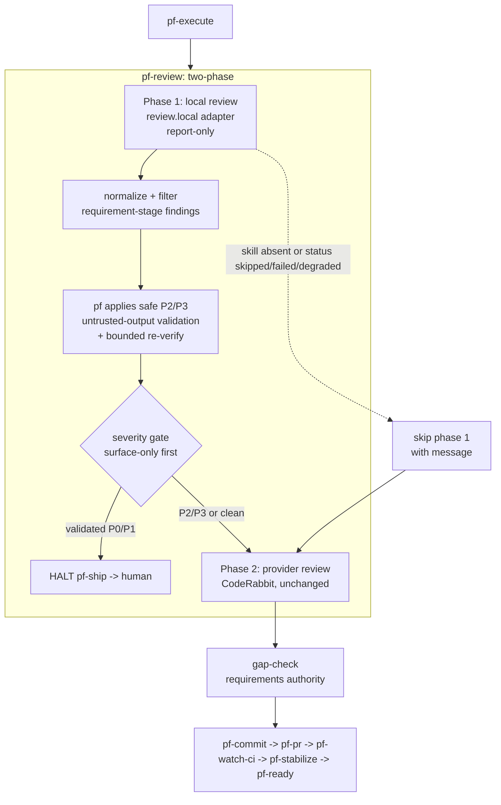

# feat: Local code review in the ship loop (two-phase /pf-review)

Add a **local, multi-agent code review against the implementation** as phase 1 of `/pf-review`, running before
the external provider (CodeRabbit) and before CI. It is wired via the plugin's existing provider-adapter
pattern: a new `review.local.provider` selects an adapter under `providers/code-review/`, with `ce-code-review`
as the (soft-dependency) default adapter. The adapter runs **report-only**; phase-flow owns the apply and the
severity gate. `gap-check` keeps sole requirements authority. The `native` no-dependency panel stays deferred.

## Implementation Units

| Unit | Status | Summary |
| --- | --- | --- |
| U1 | planned | `ce-code-review` adapter under `providers/code-review/` + normalized findings contract |
| U2 | planned | `review.local` config block: schema + example + defaults |
| U3 | planned | Two-phase `/pf-review` procedure (local → provider) with fail-closed skips |
| U4 | planned | pf-owned apply + validated severity gate + bounded re-verify + `/pf-ship` halt |
| U5 | planned | Golden-schema contract test + behavioral fixtures |
| U6 | planned | Docs/rules: local-first review + updated `/pf-review` boundary |

**Soft dependency:** `ce-code-review` (compound-engineering skill). When absent, phase 1 skips with a clear
message (fail-closed) and the loop proceeds to phase 2 — the local-review guarantee is conditional on it being
installed.

**Verification:** `scripts/test/run-code-review-fixtures.sh` (created in U5), registered into
`.cursor/workflow.config.json` → `verify.test`.

---

## Summary

`/pf-review` today means the external provider only (CodeRabbit CLI over the uncommitted delta —
`commands/pf-review.md`). The earliest substantive review of code quality therefore depends on an external
tool and, for branch concerns, on CI. The plugin already runs parallel-persona sub-agent review for
**documents** (`/pf-doc-review` + `agents/pf-*-reviewer.md`) and already owns requirements completeness via
`gap-check` — the missing piece is a fast, local, **code-quality** review of the implementation before any
external tooling engages.

This plan makes `/pf-review` two-phase: phase 1 = local multi-agent review via a `review.local` adapter
(`ce-code-review`, report-only), phase 2 = the existing provider review (unchanged). "Review" stays the single
review gate; loop length is unchanged. phase-flow owns the apply (only low-risk P2/P3 with concrete fixes,
through its own edit machinery so redaction/commit/memory guardrails stay intact) and the severity gate
(validated P0/P1 halt `/pf-ship`; P2/P3 surface and continue). The reviewed diff and adapter output are
treated as untrusted at the apply boundary. Both persist edges are redacted: memory writes via
`memory-preflight` + `scripts/memory-redact.sh`, and the `ce-code-review` run dir (cleartext artifacts outside
pf's chokepoint) is scrubbed after parsing. A version-pinned golden-schema contract test fails loudly on
adapter drift.

---

## Problem Frame

The ship loop is:

```
pf-execute → pf-verify → pf-review → gap-check → pf-commit → pf-pr → pf-watch-ci → pf-stabilize → pf-ready
```

`commands/pf-review.md` resolves `review.provider` and runs CodeRabbit over the uncommitted delta, emitting
`/tmp/pf-review.status.json` for the verification gate. There is no local code-quality review before that.
Three grounding facts shape the plan:

- **The adapter pattern already exists for review** (`review.provider` + `providers/review/coderabbit.md` +
  `providers/review/coderabbit.sh` + `providers/review/CAPABILITIES.md`). The local phase mirrors it under
  `review.local` + `providers/code-review/`.
- **`gap-check` owns requirements completeness** (`skills/gap-check/SKILL.md`). The local review must stay
  requirements-*aware* but emit no completeness verdict, or it double-reports. `ce-code-review` auto-discovers
  a plan and leaks unaddressed-requirement findings into `findings[]`, so the adapter must **post-filter**
  requirement-stage findings — dropping a top-level `plan:` field is insufficient.
- **`/pf-simplify` already exists** (shipped as the loop-program deslop pass). So the origin's "standalone
  `/pf-simplify` is a later follow-up" note is already satisfied and is not part of this plan.

`ce-code-review` writes cleartext run artifacts (`full.diff`, evidence, `review.json`, `report.md`) to
`/tmp/compound-engineering/<run-id>/` **outside** pf's redaction chokepoint — a real persist edge the adapter
must scrub.

---

## Requirements Traceability

Origin decisions Q1–Q6 (`docs/brainstorms/2026-06-23-local-code-review-loop-integration-requirements.md`).
Frozen R-IDs from the unified requirements doc.

| Origin decision | Units | Frozen R-IDs honored |
| --- | --- | --- |
| Q1 provider-adapter; `ce-code-review` soft dependency | U1, U2, U3 | R36 (review seam), seam abstraction |
| Q2 two-phase `/pf-review` (local → provider) | U3 | R15–R17 (gated loop), description contract |
| Q3 `gap-check` keeps requirements authority | U1, U3 | R25–R27 (feedback/gap ownership) |
| Q4 report-only adapter; pf owns apply + severity gate | U4 | R16, checks-gate authority |
| Q5 redaction at both persist edges | U3, U4 | R41 (redaction chokepoint) |
| Q6 focused build scope (no other CE adoption) | scope | one-workstream-per-plan |
| Untrusted adapter output at apply boundary | U4 | R41-adjacent input-trust boundary |

---

## Key Technical Decisions

**KTD1 — Provider-adapter coupling; `ce-code-review` is a soft dependency.** The local review is selected by
`review.local.provider` and implemented by `providers/code-review/<provider>.md`, mirroring `review.provider`.
`ce-code-review` is the default and only adapter this effort; `none` disables. If the configured adapter's
skill is unavailable, phase 1 **skips with a clear message** (fail-closed, matching the CodeRabbit
"review disabled" path) and the loop proceeds to phase 2. The `native` no-dependency panel is **deferred as
YAGNI** (one real consumer; skip-with-message already satisfies fail-closed).

**KTD2 — Two-phase `/pf-review`, local first.** Phase 1 = local multi-agent review (adapter); phase 2 =
provider review (CodeRabbit, unchanged). "Review" stays the single review gate; loop length unchanged. Phase 1
before phase 2 satisfies "prior to any other tooling." Phase 2 still emits `/tmp/pf-review.status.json` for the
verification gate (unchanged); phase 1 does not replace that signal.

**KTD3 — `gap-check` remains the requirements authority.** The local review receives the intent summary
(requirements-aware) but emits **no completeness verdict**. Because `ce-code-review` auto-discovers a plan and
emits requirement findings into `findings[]` (P3 inferred / P1 explicit), the adapter **post-filters
requirement-stage findings** out of its normalized output before they reach pf's gate. `gap-check` (spec union
vs diff + bounded closers + feedback escalation) stays the one source of truth — no double-reporting.

**KTD4 — Report-only adapter; phase-flow owns apply + the severity gate.** The adapter runs
`ce-code-review mode:agent` (report-only; the skill mutates nothing). pf auto-applies only **low-risk P2/P3**
fixes carrying a concrete `suggested_fix` with `requires_verification:false`, through **its own** edit
machinery (so redaction/commit/memory guardrails stay intact). **P0/P1 are never auto-fixed.** pf re-verifies
(bounded: one re-verify pass; circuit-breaker on 3 identical failures per `rules/pf-subagent-dispatch.mdc`),
then gates: **validated P0/P1 halt `/pf-ship`**; **P2/P3 surface and continue** to phase 2.

**KTD5 — Rollout starts surface-only, then promotes to halting.** To avoid false-halts before the local
false-positive rate is known, the P0/P1 gate **ships surface-only (non-halting)** first; halting is promoted
once the validated false-positive rate is measured. Only **validated** P0/P1 (post the skill's Stage 5b
validation wave) are ever eligible to halt. (Decision taken in the scoping synthesis; the gate config carries
both modes so promotion is a config flip, not a code change.)

**KTD6 — The reviewed diff and adapter output are untrusted at the apply boundary.** Adapter
`suggested_fix`/`file` fields flow into pf's auto-apply path — a prompt-injection-to-apply sink. Before
applying, pf validates: `file` resolves **within the repo** (no path traversal), fix size is bounded, and
fixes touching security-sensitive surfaces (auth, secrets, credentials, CI config) are **never auto-applied**
(surfaced for the human). The adapter is pinned to an assumed `ce-code-review` schema version with a
golden-schema contract test that fails loudly on drift.

**KTD7 — Redaction at both persist edges.** The diff is reviewed in the clear (local code; in-session
sub-agents share the main agent's trust boundary — redacting input would cripple the review for no egress
benefit). Two persist edges: (1) durable learnings only via `memory-preflight` + `scripts/memory-redact.sh`
(no direct Recallium, no raw dumps); (2) the `ce-code-review` run dir of cleartext artifacts is
**scrubbed/shredded after parsing** (these are not "ephemeral" in any security sense).

**KTD8 — Fail-closed on non-finding outcomes.** A `status` of `skipped|failed|degraded` carries no `findings`
array and is treated as a skip-with-reason, **never** as a clean review — a missing `findings` array must not
deserialize to "0 findings → pass."

---

## High-Level Technical Design

The diagram is authoritative for phase ordering and the gate; per-unit **Files** are authoritative for paths.



### Adapter contract (provider-neutral, normalized findings)

```json
{
  "status": "complete | skipped | failed | degraded",
  "verdict": "ready | ready-with-fixes | not-ready",
  "findings": [
    { "severity": "P0|P1|P2|P3", "file": "path", "line": 0, "title": "terse",
      "suggested_fix": "concrete or empty", "confidence": 0, "requires_verification": true }
  ]
}
```

Directional — the contract enum and field set are authoritative; the JSON above illustrates shape, not an
implementation literal.

---

## Implementation Units

Suggested build order: **U1 (adapter) → U2 (config) → U3 (two-phase procedure) → U4 (apply + gate)**, then
**U5 (contract test + fixtures)** locks behavior, and **U6 (docs/rules)** records the boundary. U5's golden
schema should be captured early against the real `ce-code-review mode:agent` output so U1's normalization is
written against a pinned fixture.

### U1. `ce-code-review` adapter + normalized findings contract

- **Goal:** A swappable adapter that invokes `ce-code-review` in report-only mode, normalizes its output to
  the contract enum, filters requirement-stage findings, and fails closed on non-finding outcomes.
- **Requirements:** Q1, Q3, Q8 (fail-closed); honors R36 (review seam).
- **Dependencies:** none (but pin the golden schema from U5 early).
- **Files:**
  - `providers/code-review/ce-code-review.md` (new) — adapter description: invoke
    `ce-code-review mode:agent base:<parentBranch> grouping:auto`; parse the skill's JSON; map the verdict
    strings (`Ready to merge | Ready with fixes | Not ready`) to the contract enum; post-filter
    requirement-stage findings; document the run-dir scrub and untrusted-output validation handed to U4.
  - `providers/code-review/CAPABILITIES.md` (new) — the normalized findings contract + status/verdict enums
    (mirror `providers/review/CAPABILITIES.md`).
  - `scripts/test/fixtures/code-review/*` (new) — well-formed, malformed, and `status:skipped|failed|degraded`
    sample outputs; a sample carrying requirement-stage findings.
- **Approach:** The adapter is provider-neutral on the consuming side: `/pf-review` reads only the normalized
  JSON. `status:skipped|failed|degraded` (no `findings`) → surface reason + skip phase 1 (never clean).
  Requirements suppression is a **post-filter** (drop findings whose stage is requirements/completeness),
  heuristic pending a `plan:none`-style upstream affordance.
- **Patterns to follow:** `providers/review/coderabbit.md` (adapter doc shape);
  `providers/review/CAPABILITIES.md` (findings normalization).
- **Test scenarios:**
  - `Covers Q8.` `status:skipped|failed|degraded` with no `findings` → treated as skip, never a clean pass.
  - `Covers Q3.` A sample containing requirement-stage findings → normalized output contains zero of them.
  - Verdict normalization: each ce verdict string maps to the correct contract enum value.
  - Malformed JSON → fail-closed skip with a clear reason (never a silent pass).
- **Verification:** adapter-parse fixtures pass; requirement-stage filtering verified; non-finding outcomes
  fail closed.

### U2. `review.local` config block: schema + example + defaults

- **Goal:** Configuration that selects the local adapter, the gate behavior, and grouping, validating against
  the schema.
- **Requirements:** Q1, Q2; honors per-repo config.
- **Dependencies:** none.
- **Files:**
  - `docs/config.schema.json` (modify) — add `review.local` object: `enabled` (bool), `provider`
    (`ce-code-review | native | none`), `gate` (`haltOn`/`surface` severity arrays), `grouping`. Keep
    `review` `additionalProperties:false` valid by adding the explicit `local` property.
  - `config/workflow.config.example.json` (modify) — add the `review.local` block (default: `enabled:true`,
    `provider:"ce-code-review"`, `gate:{surface:["P0","P1","P2","P3"]}` for surface-only rollout, `grouping:
    "auto"`).
- **Approach:** Mirror the existing `review` / `verifyE2e` typing. The default gate is **surface-only**
  (KTD5): `haltOn` empty (or absent) until promotion; promotion sets `haltOn:["P0","P1"]`. Document both.
- **Patterns to follow:** `docs/config.schema.json` `review` + `verifyE2e` blocks.
- **Test scenarios:**
  - `Covers Q2.` A config with a `review.local` block validates; an unknown `review.local` key is rejected
    (proves `additionalProperties:false`).
  - Gate config: surface-only default (no `haltOn`) and promoted (`haltOn:["P0","P1"]`) both validate.
- **Verification:** schema fixtures pass for valid local-review configs and reject malformed ones.

### U3. Two-phase `/pf-review` procedure

- **Goal:** `/pf-review` runs phase 1 (local adapter) then phase 2 (provider), with correct skip paths,
  memory preflight, requirement-finding filtering, and run-dir scrub — without changing loop length or the
  phase-2 status signal.
- **Requirements:** Q2, Q3, Q5; honors R41, the description contract.
- **Dependencies:** U1, U2.
- **Files:**
  - `commands/pf-review.md` (modify) — insert phase 1 before the existing provider flow: (1) resolve
    `review.local`; if `enabled:false` or `provider:none` → skip to phase 2; (2) read
    `providers/code-review/<provider>.md`; if the adapter's skill is unavailable → skip phase 1 with a clear
    message (no `native` fallback); (3) `memory-preflight` read for known false-positives; (4) compute
    base = per-worktree `parentBranch`; invoke the adapter → normalized JSON; `status:skipped|failed|degraded`
    → surface + skip; filter requirement-stage findings; (5) hand off to U4 apply+gate; (6) `memory-preflight`
    write (redacted) + **scrub the `ce-code-review` run dir**; (7) phase 2 = existing provider flow unchanged
    (still emits `/tmp/pf-review.status.json`). Update the description to state local-then-provider review.
  - `scripts/test/fixtures/code-review/*` (extend) — skip-path fixtures.
- **Approach:** Phase-1-applied fixes are committed/labeled first so phase 2 reviews the post-fix state;
  any phase-2 finding on a phase-1-touched line is annotated "contests applied fix" for the human (no
  automatic re-litigation). Description contract: `/pf-review` does not run the CI gate or stabilize threads.
- **Patterns to follow:** `commands/pf-review.md` current provider procedure; `commands/pf-doc-review.md`
  parallel-dispatch shape; `skills/memory/SKILL.md` preflight read/write.
- **Test scenarios:**
  - `Covers Q2.` `review.local.enabled=false`, `provider=none`, and adapter-skill-absent → clean
    skip-with-message; phase 2 still runs.
  - `Covers Q3.` With a discoverable `docs/plans/*.md` on the branch, the adapter's normalized output reaching
    the gate contains zero requirement-stage findings (gap-check unaffected).
  - `Covers Q5.` The `ce-code-review` run dir is scrubbed/removed after parsing; a learning with a secret is
    redacted before any memory write.
  - Structural: description states local-then-provider and excludes CI gate / stabilize.
- **Verification:** skip-path, requirements-isolation, and persist-edge fixtures pass; phase-2 status signal
  unchanged.

### U4. pf-owned apply + validated severity gate + bounded re-verify + `/pf-ship` halt

- **Goal:** Safe auto-apply of low-risk fixes through pf's own machinery, untrusted-output validation, a
  bounded re-verify, and the (initially surface-only) severity gate wired into `/pf-ship`.
- **Requirements:** Q4, Q5, untrusted-output boundary; honors checks-gate authority, R41.
- **Dependencies:** U3.
- **Files:**
  - `commands/pf-review.md` (modify) — apply step: auto-apply only P2/P3 with a concrete `suggested_fix` and
    `requires_verification:false`, **after** validating `file` resolves in-repo, the fix is size-bounded, and
    the target is not security-sensitive (auth/secrets/credentials/CI config); P0/P1 never auto-fixed; one
    bounded re-verify (`pf-verify`) with circuit-breaker on 3 identical failures.
  - `commands/pf-ship.md` (modify) — stop-conditions/CI segment: a validated P0/P1 from phase 1 halts the
    chain for the human when the gate is in halting mode; surface-only mode logs and continues.
  - `rules/pf-subagent-dispatch.mdc` (modify, if needed) — note the bounded apply/re-verify loop and circuit
    breaker reused here.
  - `scripts/test/fixtures/code-review/*` (extend) — untrusted-output + gate fixtures.
- **Approach:** Apply runs through pf's edit machinery so redaction/commit/memory guardrails stay intact —
  never let the external skill commit into the worktree. The gate reads `review.local.gate`: surface-only
  (default) logs P0/P1 and continues; halting mode halts `/pf-ship`. `check-gate.sh` remains the sole CI
  oracle; this gate never overrides it.
- **Patterns to follow:** `rules/checks-gate.mdc` (gate authority), `rules/pf-subagent-dispatch.mdc` (bounded
  loops, circuit breaker), `commands/pf-ship.md` stop-conditions.
- **Test scenarios:**
  - `Covers Q4.` Validated P0/P1 in halting mode → `/pf-ship` halts; P2/P3 → surfaced, loop continues; clean →
    proceeds to phase 2.
  - Surface-only mode: P0/P1 logs and continues (no halt).
  - Untrusted-output safety: a `suggested_fix` with a path-traversal `file`, an oversize fix, or a
    security-sensitive target is **not** auto-applied (surfaced).
  - Apply loop bounded: one re-verify; circuit-breaker on 3 identical failures.
- **Verification:** gate + untrusted-output fixtures pass in both surface-only and halting modes; bounded loop
  enforced.

### U5. Golden-schema contract test + behavioral fixtures

- **Goal:** A pinned contract that fails loudly when `ce-code-review mode:agent` output drifts, plus the
  behavioral fixtures the other units reference.
- **Requirements:** advances Q1/Q3/Q4/Q5/Q8 verification.
- **Dependencies:** U1–U4.
- **Files:**
  - `scripts/test/run-code-review-fixtures.sh` (new) — runner aggregating adapter-parse, verdict-normalize,
    severity-gate, skip-path, requirements-isolation, untrusted-output, persist-edge, and contract-drift
    fixtures.
  - `scripts/test/fixtures/code-review/golden-schema.json` (new) — pinned `ce-code-review` shape; the drift
    test fails if the live shape diverges.
  - `.cursor/workflow.config.json` / `config/workflow.config.example.json` (modify) — register the runner
    under `verify.test`.
- **Approach:** Follow the established workstream test convention (golden fixtures + structural greps),
  mirroring `scripts/test/run-improvement-fixtures.sh`.
- **Patterns to follow:** `scripts/test/run-improvement-fixtures.sh`.
- **Test scenarios:**
  - `Covers Q1.` Contract-drift fixture fails loudly when the golden schema changes.
  - Runner exits non-zero on any sub-fixture failure; `verify.test` includes the runner.
- **Verification:** aggregated runner passes; drift guard demonstrated.

### U6. Docs/rules: local-first review + updated boundary

- **Goal:** Record the local-then-provider review in the workflow docs and the `/pf-review` boundary row.
- **Requirements:** Q2, Q6; honors the description contract.
- **Dependencies:** U3.
- **Files:**
  - `rules/code-review-automation.mdc` (modify) — document local-first review and the two-phase shape.
  - `rules/pf-workflow-sequencing.mdc` (modify) — update the `/pf-review` boundary row (still one gate;
    local-then-provider).
- **Approach:** Documentation-only; no behavioral change. Note the soft dependency and skip-with-message
  semantics so the loop's behavior is discoverable.
- **Patterns to follow:** existing rows in `rules/pf-workflow-sequencing.mdc`,
  `rules/code-review-automation.mdc`.
- **Test scenarios:** `Test expectation: none -- documentation-only.` Structural grep (in U5 runner): the
  rules reference local-first two-phase review.
- **Verification:** docs describe the two-phase review and soft-dependency behavior.

---

## Scope Boundaries

### In scope

- Two-phase `/pf-review` with a `review.local` provider-adapter (the `ce-code-review` adapter), report-only +
  pf-owned apply with untrusted-output validation, the validated-severity gate (surface-only → halting),
  both-persist-edge redaction (memory + run-dir scrub), a version-pinned contract test, config, docs,
  fixtures.

### Deferred to Follow-Up Work

- Promotion of the P0/P1 gate from surface-only to halting once the local false-positive rate is measured
  (config flip; the modes ship together).
- The `native` no-dependency fallback adapter (deferred as YAGNI; fallback is skip-with-message). If the
  local-review guarantee must later hold without `ce-code-review` installed, promote `native` with a defined
  roster and the same JSON-conformance tests.

### Outside this plan

- A standalone `/pf-simplify` (already shipped as the loop-program deslop pass).
- `ce-sessions` and `ce-test-browser` integrations (deferred in the origin recommendations).
- Any change to `gap-check`'s requirements ownership beyond passing the local review the intent summary.
- Changing the external provider (CodeRabbit) phase-2 behavior.

---

## Open Questions

- **Cost/latency budget & marginal value.** Phase 1 is a heavy nested run (reviewers + a per-finding validator
  wave) before CodeRabbit and CI on the same delta. State a cost budget and a do-nothing baseline (what unique
  P0/P1 does local catch over CodeRabbit+CI?); consider a lighter default (capped validator dispatch / reduced
  persona set); instrument adoption so a one-line `enabled:false` opt-out is observable. Resolve during U3/U4.
- **Apply aggressiveness.** Exact threshold for auto-applying P2/P3 (current default: concrete `suggested_fix`
  + `requires_verification:false` + in-repo + size-bounded + non-security target) — tune in U4 against
  `pf-subagent-dispatch` bounds.
- **Requirement-stage filter heuristic.** The post-filter is heuristic pending a `plan:none`-style upstream
  affordance in `ce-code-review`; revisit if the upstream skill adds one.

---

## Risks & Dependencies

- **Soft-dependency drift.** The adapter is pinned to an assumed `ce-code-review` schema; the golden-schema
  contract test (U5) is the guard against silent drift.
- **False-halt risk.** Halting on local P0/P1 before the false-positive rate is known risks loop friction —
  mitigated by the surface-only-first rollout (KTD5).
- **Untrusted-apply sink.** Adapter `suggested_fix`/`file` flow into auto-apply; path-traversal / oversize /
  security-target validation (U4) is mandatory before any apply.
- **Cleartext `/tmp` residue.** `ce-code-review` writes cleartext artifacts outside pf's chokepoint; the
  run-dir scrub (U3) is required or the residual exposure must be documented and explicitly accepted.
- **No-auto-fix discipline.** P0/P1 are never auto-fixed; `check-gate.sh` stays the sole CI oracle; this gate
  is additive, never an override.

---

## Sources & Research

- Origin: `docs/brainstorms/2026-06-23-local-code-review-loop-integration-requirements.md` (Q1–Q6, adapter
  contract, persist edges, CE-command recommendations).
- Repo grounding (this session): `commands/pf-review.md` (single-phase provider flow + status file),
  `providers/review/coderabbit.md` + `providers/review/CAPABILITIES.md` (adapter template),
  `skills/gap-check/SKILL.md` (requirements authority), `commands/pf-doc-review.md` +
  `agents/pf-*-reviewer.md` (parallel-persona pattern), `rules/pf-subagent-dispatch.mdc`,
  `rules/checks-gate.mdc`, `docs/config.schema.json`; `commands/pf-simplify.md` (deslop already shipped).
- compound-engineering: `ce-code-review` SKILL (modes, requirements-completeness stage, normalized findings,
  persona roster, run-dir artifacts).
