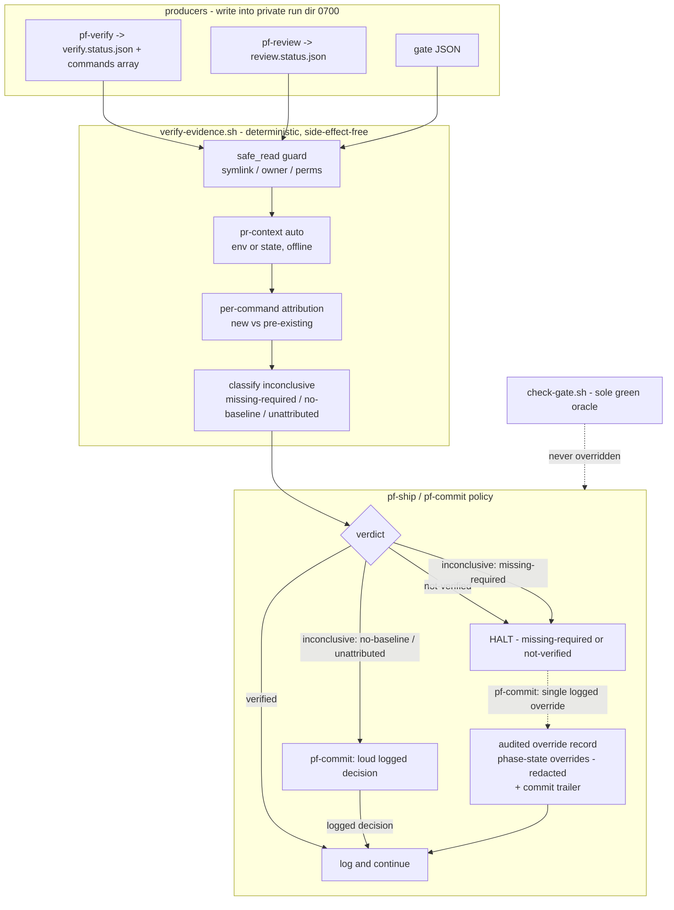

# fix: Verification-gate hardening (attribution, fail-open, substrate, audit)

Harden the shipped verification gate (`scripts/verify-evidence.sh` + `skills/verification-gate/SKILL.md`, plan
001 U1/U2) so its blocking verdict is trustworthy. Six units close the post-ship review findings (TB1–TB5 of
plan 001): tighten verdict attribution (R1), split `inconclusive` into benign/suspicious and stop the silent
pass (R2), give the baseline an owner and a loud no-baseline state (R3), secure the `/tmp` evidence substrate
(R4), make the PR-gate requirement self-verifying (R5), and consume the hardened verdict in the loop behind a
single audited override (R6). `scripts/check-gate.sh` stays the sole green oracle throughout — none of this
work lets the gate override CI.

## Implementation Units

| Unit | Status | Summary |
| --- | --- | --- |
| U1 | done | Per-command `{name, status}` fingerprints; legacy `{exitCode, status}` fallback; attribution fixtures |
| U2 | done | `inconclusiveClass` on all `inconclusive` paths; verdict-schema enum; fixture class assertions |
| U3 | done | `verify-baseline.sh capture`; baseline `safe_read`; loud `no-baseline` via U2 classes |
| U4 | done | `pf-tmp.sh` init/resolve/clean; `evidence-read.sh` `safe_read`; producers → run dir; `validate_run_dir` on resolve |
| U5 | done | `--pr-context on\|off\|auto`; offline PR signals; fixtures pin `--pr-context off` for determinism |
| U6 | done | `pf-ship`/`pf-commit` policy split; `phase-state.sh override-add`; hardening + wiring fixtures |

**Shipped in:** [PR #11](https://github.com/grdavies/currsor-phase-flow-2/pull/11) merged to `main` as `681bcab`
(2026-06-24). Feature commit `4710da3`; plan status doc `6aec743`.

**Verification:** `bash scripts/test/run-improvement-fixtures.sh` — verify-evidence hardening block green at
merge.

**Post-review fixes (in `4710da3`):** reject top-level pass when `commands[]` has failures; missing baseline
path → `missing-required`; per-dimension `no-baseline` when partial baselines cannot attribute a failing
dimension.

**Post-merge follow-up:** fd-level `fstat` after open (full TOCTOU close on legacy paths);
single-open-per-file in `verify-evidence.sh`; remove `/tmp` fallback when `pf-tmp resolve` is empty; symlink
and invalid-run-dir substrate fixtures; optional `override-add` schema validation inside the accessor.

---

## Summary

The gate is currently a trust anchor on an untrusted substrate, and its one blocking state (`not-verified`)
rarely fires. Grounding against the shipped code confirms each finding: `verify_fingerprint`
(`scripts/verify-evidence.sh:80`) collapses evidence to `{exitCode, status}` and discards the per-command
array the contract already carries, so a head that fixes one test and breaks another is classed "pre-existing
unchanged"; every `inconclusive` path (missing/invalid/no-baseline/pre-existing) returns the same exit `10`,
and `commands/pf-ship.md` logs-and-continues on all of them; evidence files are read from fixed, predictable
`/tmp` paths with no ownership/symlink/permission checks; `--require-gate` is a caller flag with no
context detection; and `commands/pf-commit.md`'s override is "R42-style: who, why, timestamp" with **no
specified record location**.

The plan keeps the three-state verdict and the skill+script split (no re-architecture). It upgrades attribution
to use data already present, adds a machine-readable `inconclusiveClass` so consumers can distinguish a benign
first run from suppressed evidence, moves evidence into a run-scoped private temp dir with a consumer guard,
derives the PR-gate requirement from observable context, and routes every override (including any "trivial
change" lightweight path) through one redacted, append-only audit record.

---

## Problem Frame

Plan 001's KTD1 made the gate "evidence over claims" and plan 001's KTD7 made it load-bearing at the pre-CI
boundary, blocking only on a **fresh, attributable `not-verified`** while `inconclusive` logs and continues. The
post-ship `ce-doc-review` panel read the shipped helper and found the blocking verdict far weaker than the
prose implies:

- **Attribution is coarse (TB1/R1).** `verify_fingerprint` emits `{exitCode, status}` only. `gate_fingerprint`
  already includes `failingChecks`, so the gate dimension attributes correctly — but the verify dimension
  cannot see a swapped failure. The verify status shape in the skill already carries
  `commands: [{name, exitCode, status}]`; the data is discarded, not absent.
- **The gate is fail-open (TB2/R2, R3).** `not-verified` requires a baseline, and no producer captures one
  (`--baseline-*` are manual flags). A producer that simply does not run yields "missing" → `inconclusive` →
  continue, which is *more lenient* than running and failing. Skipping a step is the cheapest pass.
- **The substrate is untrusted (TB3/R4).** Fixed `/tmp/pf-*.status.json` paths have no permission/ownership
  model; `verify-evidence.sh` reads them with `jq` directly. Forgery, symlink redirection, and TOCTOU are all
  open. Redaction (`scripts/memory-redact.sh`, R41) is bound only to the memory edge.
- **The PR requirement is caller-asserted (TB5/R5).** `--require-gate` has no context detection; a forgotten
  flag silently drops the CI-gate evidence requirement.
- **The override is unspecified (TB4/R6).** `pf-commit` asserts an "auditable" override but names no record
  location, fields, or tamper-resistance; plan 001's KTD7 "lightweight path for trivial changes" is undefined
  and unlogged.

Out of scope by design: the process retrospectives (ship-all-at-once, "done overstates completion" — TB6/TB7)
stay recorded in plan 001, not re-litigated here.

---

## Requirements Traceability

| R-ID | Finding | Units | Decision carried |
| --- | --- | --- | --- |
| R1 | Coarse attribution | U1 | Fingerprint the per-command identity set; legacy fallback preserved |
| R2 | Fail-open `inconclusive` | U2, U6 | Split benign/suspicious; block on `missing-required`; logged decision required on `no-baseline`/`unattributed` (prompt owned by `pf-commit`) |
| R3 | Baseline has no owner | U3 | Loud first-class no-baseline state + thin opt-in capture helper (not mandatory); baseline read through `safe_read` |
| R4 | Untrusted substrate | U4 | Private run dir + `safe_read` (fd-read-once) + run-dir validation + TTL sweep; crypto integrity deferred |
| R5 | Caller-asserted PR gate | U5 | Requirement derived from observable context (env/state); reduces *accidental* drops — not a control against a hostile env; `--require-gate` kept as manual force |
| R6 | Unspecified override | U6 | One redacted append-only audit record; lightweight path is not an exception |

---

## Key Technical Decisions

**KTD1 — Attribution upgrades the existing fingerprint; it does not change the evidence format (R1).** The
verify status contract already documents `commands: [{name, exitCode, status}]`. U1 makes `verify_fingerprint`
emit a canonical per-command set (sorted `{name, status}`) and treats a failure as **new** when a command that
fails at head passed or was absent at baseline. Status files lacking a `commands[]` array fall back to the
current `{exitCode, status}` behavior, so existing producers and fixtures keep working.

**KTD2 — `inconclusive` gets a machine-readable class; the verdict enum stays three-state (R2).** Rather than
add a fourth verdict (which would break every existing reader and the schema enum), U2 adds an
`inconclusiveClass` field to the verdict JSON: `missing-required` (required verify/gate evidence
missing/invalid/rejected — **suspicious**), `no-baseline` (head fails, no baseline to attribute — **benign**),
`unattributed` (pre-existing unchanged or undetermined dimension — **neutral**). Exit code stays `10`.

**KTD3 — Policy lives in the consumer, not the helper, and the two consumers differ deliberately (R2).** The
helper stays deterministic and side-effect-free: it classifies, it does not decide. The consumers (U6) read
`inconclusiveClass` and apply policy, with an intentional asymmetry that preserves the orchestrator's
no-mid-chain-pause model:
- **`pf-commit`** (the "done" gate) — **block** on `missing-required`; require a **logged decision**
  (loud prompt → audited override record) on `no-baseline` / `unattributed`; proceed on `verified`.
- **`pf-ship`** (orchestrator) — **halt** on `missing-required`; on `no-baseline` / `unattributed`, **log
  loudly and continue** into `pf-commit`, which owns the logged-decision prompt (so the human decision still
  happens before commit, without a duplicate mid-chain pause).

This preserves "same inputs → same verdict JSON" while closing the silent pass: no `inconclusive` reaches a
commit without either passing or producing an audited override.

**KTD4 — Baseline stays opt-in; no-baseline becomes loud, not mandatory; the baseline is a trusted input and
is guarded (R3).** A mandatory pre-change baseline capture would insert a frequent pause the program explicitly
avoided. U3 instead makes `no-baseline` a first-class, surfaced state (via KTD2's class) and ships a **thin
opt-in** capture helper (`scripts/verify-baseline.sh`) so a caller that wants attribution can snapshot a
baseline deterministically. Because the baseline is the trusted comparison input to the only blocking verdict
(a forged baseline that already contains the head's failing set would silently downgrade a real regression to
`unattributed`), the baseline has a **canonical caller-owned location** and is read through the same
`safe_read` guard as head evidence (U4); a rejected baseline degrades to `missing-required`, never a silent
downgrade.

**KTD5 — Substrate floor is a private run dir + a consumer guard, plumbed through existing phase state (R4).**
U4 replaces fixed `/tmp` paths with a per-run directory from `mktemp -d` (mode `0700`, owned by the caller,
unpredictable name) — the primary defense against forgery, symlink redirection, and TOCTOU *for new producers*.
`verify-evidence.sh` gains a `safe_read` guard (reject symlinks, foreign-owned, or group/world-writable files)
as defense-in-depth for the legacy/fixed-path transition, routing a rejected file to `missing-required`.

Two grounding corrections from review shape the mechanism:
- **Cross-shell sharing goes through phase-state, not an exported env var.** `pf-ship` is a markdown-orchestrated
  chain of separate shell steps, so an exported `PF_RUN_DIR` will not reliably propagate and a `trap … EXIT`
  will not fire at "chain end." Producers and the reader resolve the run dir via one shared helper with fixed
  precedence (`$PF_RUN_DIR` → phase-state `runDir` → legacy fixed path), and cleanup is an age-based,
  caller-owned-only `pf-tmp.sh clean` sweep rather than an EXIT trap.
- **The directory itself is validated, and reads are fd-once.** Before consuming, the helper verifies the run
  dir is a real (non-symlink) directory owned by the caller at mode `0700`; and because the helper opens each
  evidence file by path several times today, `safe_read` opens once into a file descriptor, `fstat`s the fd,
  and feeds all `jq` reads from that fd — closing the check-then-reopen TOCTOU window on legacy paths.

Content-signature / nonce integrity is deferred — a `0700` dir an attacker cannot write into makes signing
low-value until the threat model includes a compromised local account.

**KTD6 — The PR-gate requirement is derived from observable context, not a remembered flag (R5).** U5 adds
`--pr-context on|off|auto` (default `auto`). `auto` derives the requirement from deterministic, offline signals
(committed repo state such as upstream/merge-base divergence where available, then CI env like
`GITHUB_HEAD_REF` / PR number, a phase-state PR field, or a supplied gate path) — never a live `gh` network
call, which would break determinism. When PR context is present and gate evidence is missing, the verdict is
`inconclusive` / `missing-required` (suspicious).

**Honest scope:** this closes the *accidental* drop (a forgotten `--require-gate`); it is **not** a control
against a hostile environment, since an actor who controls the env can clear the signals to look PR-less.
Prefer repo-state signals over ambient env precisely to shrink that gap. Because the verdict now depends on
env/state, those are documented as **inputs** in the skill so "same inputs → same verdict" stays honest, and
all pre-existing fixtures pin `--pr-context off` (or scrub `GITHUB_*`/PR signals). `--require-gate` remains a
manual force. `check-gate.sh`/CI remains the real merge oracle regardless.

**KTD7 — One audited override path; the lightweight path is not an exception (R6).** U6 specifies the override
record: **location** — an `overrides[]` entry in per-worktree state written via a **mandatory** new
read-modify-write `scripts/phase-state.sh` accessor (the existing `write` does a shallow top-level merge that
would clobber a prior `overrides` array, so a dedicated append accessor is required, not optional);
**fields** — `{who: git user.email, when: ISO-8601, verdictOverridden, inconclusiveClass, reason}`;
**redaction** — the `reason` (and any persisted evidence summary) runs through `scripts/memory-redact.sh`
before persistence, while `who` is preserved so the actor is retained. Any trivial-change lightweight path
writes the same record — there is no unlogged escape hatch. An override can never suppress a red
`check-gate.sh`/CI verdict.

**Tamper-evidence, honestly scoped.** Per-worktree state (`.git/phase-flow.json`) is uncommitted and freely
rewritable by the same operator, so "tamper-resistant" is not achievable there — the record is **append-only by
accessor convention and tamper-evident via a redacted commit trailer** (the only artifact that leaves the
worktree and is reviewable). The commit-trailer emission is adopted here (resolving plan 001's deferred
question), carrying the same redacted fields.

**KTD8 — Tests extend the established fixture runner (R1–R6).** `scripts/test/run-improvement-fixtures.sh`
gains a hardening block with golden fixtures for each requirement, following the existing
exit-code + `jq` verdict-assertion style.

---

## High-Level Technical Design

The diagram is authoritative for the hardened verdict path and the consumer policy split; per-unit **Files**
are authoritative for paths.

Attach points: U1/U2/U5 modify `scripts/verify-evidence.sh` + skill (U2 also modifies
`references/verdict-schema.json`); U3 adds `scripts/verify-baseline.sh`; U4 adds `scripts/pf-tmp.sh` and the
`safe_read` guard, touching producers (`pf-verify`, `pf-review`) and the other `/tmp` readers
(`simplify-gate.sh`, `feedback-closure-gate.sh`); U6 wires `commands/pf-commit.md` + `commands/pf-ship.md` and
adds the mandatory `phase-state.sh` append accessor.

---

## Implementation Units

Suggested build order (a linearization for convenience, not a strict dependency graph — each unit's
**Dependencies** field is authoritative): U1, U2, U4, U5 are largely independent edits and can land in
parallel; U3 builds on U2's class; U6 consumes U2 (and benefits from U4/U5) and lands last.
`(U1 ∥ U2 ∥ U4 ∥ U5) → U3; U6 last (depends U2)`.

### U1. Per-command attribution fingerprint (R1)

- **Goal:** A swapped failure (one command fixed, another broken) is attributed as new, not "pre-existing
  unchanged."
- **Requirements:** R1 (TB1). Honors determinism.
- **Dependencies:** none.
- **Files:**
  - `scripts/verify-evidence.sh` (modify) — `verify_fingerprint` emits a canonical sorted set of
    `{name, status}` from `.commands[]`; attribution marks a failure new when a head-failing command was
    passing/absent in the baseline. Fall back to `{exitCode, status}` when `.commands[]` is absent.
  - `skills/verification-gate/SKILL.md` (modify) — baseline-contract section documents per-command attribution.
  - `scripts/test/fixtures/verify-evidence/verify-ab-pass.json` (new) — `{A:pass, B:pass}` with `commands[]`.
  - `scripts/test/fixtures/verify-evidence/verify-ab-swapped.json` (new) — `{A:pass, B:fail}` with `commands[]`.
  - `scripts/test/fixtures/verify-evidence/verify-ab-baseline.json` (new) — `{A:fail, B:pass}` baseline.
  - `scripts/test/fixtures/verify-evidence/verify-legacy-nocommands.json` (new) — `{exitCode:1, status:"fail"}`,
    no `commands[]`, to cover the legacy fallback branch (existing fixtures already carry `commands[]`).
  - `scripts/test/run-improvement-fixtures.sh` (modify) — attribution assertions.
- **Approach:** Build each fingerprint as `jq -S` over `[.commands[] | {name, status}] | sort_by(.name)`,
  with overall `{exitCode, status}` retained for legacy files. "New failure" = the head failing-command set is
  not a subset of the baseline failing-command set. Unchanged sets remain `inconclusive`.
- **Patterns to follow:** existing `gate_fingerprint` (`scripts/verify-evidence.sh:85`) which already keys on
  `failingChecks`; `scripts/memory-redact.sh` (deterministic, fixture-tested).
- **Test scenarios:**
  - `Covers R1.` Baseline `{A:fail,B:pass}`, head `{A:pass,B:fail}` (+ passing baseline) → `not-verified`.
  - Baseline `{A:fail}`, head `{A:fail}` unchanged → `inconclusive`.
  - Legacy `verify-legacy-nocommands.json` (no `commands[]`) → same verdict/fingerprint as pre-U1 behavior.
  - Determinism: same inputs → identical fingerprint and verdict JSON.
- **Verification:** `run-improvement-fixtures.sh` attribution cases pass; existing verify-evidence cases stay
  green.

### U2. Classify `inconclusive` (benign vs suspicious) (R2, helper side)

- **Goal:** A consumer can tell suppressed/missing evidence apart from a genuine first run.
- **Requirements:** R2 (TB2). Honors three-state contract + determinism.
- **Dependencies:** none.
- **Files:**
  - `scripts/verify-evidence.sh` (modify) — `emit` adds an `inconclusiveClass` field for `inconclusive`
    verdicts; map each `inconclusive` emit site to `missing-required` | `no-baseline` | `unattributed`.
  - `skills/verification-gate/references/verdict-schema.json` (modify) — add optional `inconclusiveClass`
    enum.
  - `skills/verification-gate/SKILL.md` (modify) — document the three classes and their suspicious/benign
    semantics.
  - `scripts/test/run-improvement-fixtures.sh` (modify) — class assertions.
- **Approach:** Missing/invalid required verify or gate, and `safe_read` rejections (U4), map to
  `missing-required`; failing head with no baseline maps to `no-baseline`; pre-existing-unchanged /
  undetermined maps to `unattributed`. Verdict enum and exit code unchanged (`inconclusive` / `10`).
- **Patterns to follow:** the existing `emit` JSON builder (`scripts/verify-evidence.sh:90`).
- **Test scenarios:**
  - `Covers R2.` Missing required verify → `inconclusive`, `inconclusiveClass == "missing-required"`.
  - Invalid JSON evidence → `missing-required`.
  - Failing head, no baseline → `no-baseline`.
  - Pre-existing unchanged failure → `unattributed`.
  - Schema: output validates against the updated `verdict-schema.json`.
- **Verification:** `run-improvement-fixtures.sh` class cases pass; verdict/exit unchanged for all prior cases.

### U3. Baseline ownership: loud no-baseline state + thin capture helper (R3)

- **Goal:** "No baseline" is a surfaced, first-class state, and a caller can opt into capturing one without a
  mandatory pause.
- **Requirements:** R3 (TB2/D4).
- **Dependencies:** U2 (uses `inconclusiveClass == "no-baseline"`).
- **Files:**
  - `scripts/verify-baseline.sh` (new) — `capture --from <status> --to <baseline>` writes a deterministic
    baseline snapshot via atomic temp-then-rename into the canonical caller-owned baseline location;
    `--gate-from/--gate-to` for gate JSON.
  - `scripts/verify-evidence.sh` (modify) — read `--baseline-verify`/`--baseline-gate` through the same
    `safe_read` guard as head evidence (U4); a rejected baseline → `missing-required`, never a silent downgrade.
  - `skills/verification-gate/SKILL.md` (modify) — baseline section: loud `no-baseline` semantics, canonical
    location + ownership, opt-in capture usage.
  - `commands/pf-verify.md` (modify) — note the optional baseline-capture step (off by default).
  - `scripts/test/fixtures/verify-evidence/` (reuse U1 fixtures) + `scripts/test/run-improvement-fixtures.sh`
    (modify) — capture + integration + tampered-baseline assertions.
- **Approach:** Capture is a pure file copy with validation (rejects non-JSON), never networked. The baseline
  is a longer-lived trusted input (it persists across runs, so it cannot live in the per-run `0700` dir) — it
  has a canonical caller-owned location and is read through `safe_read`. With a captured baseline, U1
  attribution can reach `not-verified`; without one, the verdict stays `inconclusive` / `no-baseline` (benign)
  and is logged loudly by U6.
- **Patterns to follow:** `scripts/verify-baseline.sh` mirrors the arg-parse + `jq -e` validation style of
  `scripts/verify-evidence.sh`.
- **Test scenarios:**
  - `Covers R3.` `capture` writes a baseline whose content matches the source status.
  - `capture` on invalid JSON → non-zero exit, no partial file.
  - Integration: captured baseline + fresh failing head → `not-verified` (with U1).
  - No baseline → `inconclusive` / `no-baseline` (benign, never `not-verified`).
  - Tampered/foreign-owned baseline whose failing-set matches head → `missing-required` (rejected), not a
    silent downgrade to `unattributed`.
- **Verification:** `run-improvement-fixtures.sh` baseline cases pass.

### U4. Substrate hardening floor: private run dir + `safe_read` + TTL cleanup (R4)

- **Goal:** Evidence the gate trusts cannot be forged, symlink-redirected, or swapped on a shared host.
- **Requirements:** R4 (TB3). Honors R41 (redaction at persist edge).
- **Dependencies:** none (but `safe_read` rejections feed U2's `missing-required`).
- **Files:**
  - `scripts/pf-tmp.sh` (new) — `init` validates `${TMPDIR:-/tmp}` (real, non-symlink dir) then creates a
    `0700` run dir via `mktemp -d "${TMPDIR:-/tmp}/pf-run.XXXXXX"`, records `runDir` via
    `scripts/phase-state.sh`, and prints it; `resolve` returns the run dir by fixed precedence
    (`$PF_RUN_DIR` → phase-state `runDir` → legacy fixed path); `clean` age-sweeps **caller-owned-only**
    `pf-run.*` dirs (no symlink traversal).
  - `scripts/verify-evidence.sh` (modify) — add `safe_read` that opens each evidence file **once into a file
    descriptor**, `fstat`s the fd for owner/perms/type, and feeds all `jq` reads from that fd (no path re-open
    after the check — closes the legacy-path TOCTOU); portable `stat_uid` (`stat -f%u` vs `stat -c%u`) **and**
    `stat_perms` (`stat -f%Lp` vs `stat -c%a`) wrappers; before consuming `$PF_RUN_DIR`, validate the dir is a
    real non-symlink directory owned by the caller at mode `0700` (else `missing-required`); resolve evidence
    paths via `pf-tmp.sh resolve`, falling back to legacy fixed paths with a warning.
  - `commands/pf-verify.md`, `commands/pf-review.md` (modify) — resolve the run dir via `pf-tmp.sh resolve`
    and write status files into it with mode `600`.
  - `commands/pf-ship.md` (modify) — `pf-tmp.sh init` at chain start; cleanup via a `pf-tmp.sh clean`
    age-sweep at chain start/end (no `trap … EXIT`, which does not fire across the markdown-orchestrated chain).
  - `scripts/simplify-gate.sh`, `scripts/feedback-closure-gate.sh` (modify) — adopt `safe_read` for their
    `/tmp` reads.
  - `skills/verification-gate/SKILL.md` (modify) — substrate section.
  - `scripts/test/fixtures/verify-evidence/` + `scripts/test/run-improvement-fixtures.sh` (modify) — guard
    assertions.
- **Approach:** The `0700` run dir is the primary control (closes cross-user forgery/symlink/TOCTOU for new
  producers); `safe_read` (fd-read-once) + run-dir validation are defense-in-depth for the legacy/fixed-path
  transition. Rejected files/dirs resolve to `inconclusive` / `missing-required` (U2) with a clear reason.
  Backward compatibility: explicit `--verify-status PATH` still honored.
- **Patterns to follow:** `scripts/phase-state.sh` (per-worktree state read/write); `mktemp -d` idiom.
- **Test scenarios:**
  - `Covers R4.` Symlinked evidence file → rejected → `inconclusive` / `missing-required`.
  - Group-writable evidence file → rejected (achievable in CI without root).
  - `PF_RUN_DIR` pointing at a foreign-owned or world-writable dir → rejected (`missing-required`).
  - `pf-tmp.sh init` creates a dir with mode `0700`; `resolve` honors the env → state → legacy precedence;
    `clean` removes a stale caller-owned `pf-run.*` dir.
  - `stat_uid` and `stat_perms` return correct values on the runner OS.
  - Legacy fixed path owned by the caller with safe perms → still read (compat).
  - Determinism: guard outcome is stable for identical inputs.
- **Verification:** `run-improvement-fixtures.sh` substrate cases pass; existing cases unaffected when paths are
  owned + safe.

### U5. Self-verifying PR-gate requirement (R5)

- **Goal:** A *forgotten* `--require-gate` can no longer accidentally drop the CI-gate evidence requirement
  (not a control against a hostile env — see KTD6 honest-scope).
- **Requirements:** R5 (TB5/D6). Honors determinism + offline operation.
- **Dependencies:** none (interacts with U2: missing required gate → `missing-required`).
- **Files:**
  - `scripts/verify-evidence.sh` (modify) — add `--pr-context on|off|auto` (default `auto`); `auto` derives
    the requirement from offline signals, preferring committed repo state (upstream/merge-base divergence)
    over ambient CI env (`GITHUB_HEAD_REF`/PR number), a phase-state PR field, or a supplied gate path. When PR
    context is present and gate evidence is missing → `inconclusive` / `missing-required`. Keep `--require-gate`
    as manual force.
  - `skills/verification-gate/SKILL.md` (modify) — PR-required section documenting the signals, precedence, and
    that env/state are **inputs** to the verdict (so determinism is honestly scoped).
  - `scripts/test/run-improvement-fixtures.sh` (modify) — context assertions + pin `--pr-context off` (or
    scrub `GITHUB_*`/PR signals) on all pre-existing verify-evidence cases that assert `verified` without a gate.
- **Approach:** No live `gh` call — determinism requires file/state/env signals only. Precedence:
  explicit `--require-gate`/`--pr-context on` > `off` > `auto` (repo-state, then env/state). Document that
  `pf-ship`/`pf-commit`, which already know PR state, set the flag explicitly; `auto` is the accidental-drop
  backstop, not an integrity control.
- **Patterns to follow:** existing `--require-gate` handling (`scripts/verify-evidence.sh:29,134`).
- **Test scenarios:**
  - `Covers R5.` `--pr-context on` + gate missing → `inconclusive` / `missing-required` (not a gate-less
    `verified`).
  - `--pr-context off` + gate missing → review-disabled-style `verified` path preserved.
  - `auto` with a PR signal set (fixed in the test) → behaves as `on`.
  - Pre-existing no-gate `verified` cases run with PR signals scrubbed / `--pr-context off` → still `verified`.
  - Determinism with a fixed environment.
- **Verification:** `run-improvement-fixtures.sh` PR-context cases pass.

### U6. Consume the hardened verdict + audited override record (R2 wiring + R6)

- **Goal:** The loop halts on suspicious evidence and records every override (including any lightweight path)
  in one specified place.
- **Requirements:** R2 (consumer side), R6 (TB4/D7). Honors R41, R42, check-gate authority.
- **Dependencies:** U2 (`inconclusiveClass`); benefits from U4/U5.
- **Files:**
  - `commands/pf-commit.md` (modify) — proceed on `verified`; on `inconclusive` **block** when
    `missing-required`, **require a logged decision** (loud prompt → audited override) on `no-baseline` /
    `unattributed`; override writes the specified record + commit trailer.
  - `commands/pf-ship.md` (modify) — verification-gate step keys on `inconclusiveClass`: **halt** on
    `missing-required`; on `no-baseline` / `unattributed`, **log loudly and continue** into `pf-commit` (which
    owns the logged-decision prompt). Update the Stop-conditions and Guardrails sections accordingly.
  - `skills/verification-gate/SKILL.md` (modify) — consumer contract (the `pf-ship`/`pf-commit` asymmetry) +
    override-record schema + commit-trailer format.
  - `scripts/phase-state.sh` (modify, **required**) — new read-modify-write append accessor (e.g.
    `override-add`) because the existing shallow-merge `write` would clobber a prior `overrides[]` array.
  - `scripts/test/run-improvement-fixtures.sh` (modify) — structural + record assertions.
- **Approach:** Override record fields `{who, when, verdictOverridden, inconclusiveClass, reason}`; `reason`
  **and any persisted evidence summary** redacted via `scripts/memory-redact.sh` while `who` (git user.email)
  is preserved as the audit actor; appended via the new accessor (not the clobbering `write`); **tamper-evident**
  via a redacted commit trailer (the only reviewable artifact that leaves the worktree — per-worktree state is
  uncommitted and not tamper-resistant). Any "trivial change" lightweight path writes the same record — no
  unlogged exception. Override never suppresses a red `check-gate.sh`/CI verdict.
- **Patterns to follow:** existing `commands/pf-commit.md` gate step (lines 13–17); `commands/pf-ship.md`
  verification-gate step (lines 16–18) and Stop-conditions (lines 61–68); `scripts/phase-state.sh` read/write
  accessors.
- **Test scenarios:**
  - `Covers R2.` Structural: `pf-ship.md` halts on `missing-required` and logs+continues on `no-baseline`.
  - Structural: `pf-commit.md` blocks on `missing-required` and requires a logged decision otherwise.
  - `Covers R6.` Behavioral: two sequential overrides both persist (append accessor does not clobber).
  - Structural: override record fields + commit-trailer documented; lightweight path writes the same record.
  - Behavioral: a secret-shaped token in the override `reason` / evidence summary is redacted before persist;
    `who` is retained.
  - Structural: override clause still states it can never suppress a red `check-gate.sh`/CI verdict.
- **Verification:** `run-improvement-fixtures.sh` wiring + record cases pass.

---

## Scope Boundaries

### In scope

- Hardening `scripts/verify-evidence.sh`: per-command attribution (R1), `inconclusiveClass` (R2), `safe_read` +
  run-dir default (R4), `--pr-context` (R5).
- New `scripts/verify-baseline.sh` (R3) and `scripts/pf-tmp.sh` (R4).
- `skills/verification-gate/SKILL.md` + `references/verdict-schema.json`: hardened contract.
- Consumer wiring in `commands/pf-commit.md` / `commands/pf-ship.md` + the override record (R2 wiring, R6).
- `safe_read` adoption in the other `/tmp` readers (`scripts/simplify-gate.sh`,
  `scripts/feedback-closure-gate.sh`).
- Golden fixtures + assertions in `scripts/test/run-improvement-fixtures.sh` for R1–R6.

### Deferred to Follow-Up Work

- Content-signature / per-run nonce integrity for evidence files (R4 option B) — revisit if the threat model
  expands to a compromised local account.
- A mandatory automated baseline producer (R3) — only if the loud no-baseline state proves insufficient in use.
- **Substrate hardening phase 2 (post-merge):** fd `fstat` after open (close path-stat-then-open TOCTOU on
  legacy `/tmp` paths); single fd per evidence file per `verify-evidence.sh` evaluation; fail closed when
  `pf-tmp resolve` is empty (remove `/tmp` fixed-path fallback); symlink + invalid-run-dir fixture coverage.
- **`override-add` accessor hardening:** validate entry schema and run `memory-redact.sh` on `reason` inside
  the accessor (caller redaction remains; accessor is defense-in-depth).

### Resolved at implementation

- **Run-dir migration staging (U4).** Single unit: `pf-tmp.sh` + producer doc updates + compat `/tmp` fallback
  when resolve is empty (deprecation of fallback deferred to substrate phase 2 above).
- **`auto` PR signals (U5).** Precedence implemented: explicit `--require-gate` / `--pr-context on` >
  `--pr-context off` > `auto` (upstream divergence, then `GITHUB_*` / phase-state PR field, then supplied
  gate path). Documented as verdict inputs in the skill.

### Outside this plan

- Re-architecting the three-state verdict model or the skill+script split.
- Any change that lets the gate override `check-gate.sh` / CI — it stays complementary, never authoritative.
- E2E/smoke provider behavior (`providers/verify/`, plan 001 U10) beyond the evidence it emits.
- Process retrospectives TB6/TB7 — recorded in plan 001, not gate code.

---

## Risks & Dependencies

- **Substrate migration regressions (U4).** Moving off fixed `/tmp` paths touches multiple producers/readers;
  the compat fallback (explicit paths + shared resolver + legacy warning) bounds the risk and is covered by
  structural + behavioral fixtures.
- **Fail-closed availability tradeoff (U4).** Routing `safe_read` rejections to `missing-required` → halt is
  correct for integrity, but while predictable legacy paths remain supported, a local user can pre-create a
  foreign-owned/group-writable file at a known path to force every run to halt (a griefing/DoS primitive).
  Accepted tradeoff (integrity over availability); mitigated by accelerating deprecation of predictable legacy
  paths once producers migrate to the run dir.
- **Baseline is the trusted attribution input (U3/U4).** A forged or stale baseline can downgrade a real
  regression; mitigated by the canonical caller-owned location + `safe_read` on baseline reads + the
  tampered-baseline fixture (SEC-1).
- **Determinism (U1, U2, U5).** All helper changes must keep "same inputs → identical verdict JSON"; each unit
  carries a determinism test, and `--pr-context auto` reads env/state only (no network).
- **No CI override.** The override path and all `inconclusive` policy changes are pre-CI only; `check-gate.sh`
  remains the sole green oracle — covered by the U6 structural test.
- **Foreign-ownership testing limits (U4).** Simulating another user's ownership needs root; CI coverage uses
  symlink + group-writable rejections (achievable without root), with the owner check unit-tested via
  `stat_uid`.
- **Redaction at new edges (R41).** The override `reason` and any persisted evidence summary run through
  `scripts/memory-redact.sh`.

---

## Sources & Research

- Origin: `docs/brainstorms/2026-06-23-verification-gate-hardening-requirements.md` (R1–R6, D1–D7).
- Shipped artifacts (grounding this session): `scripts/verify-evidence.sh` (fingerprints at lines 80–88; the
  `inconclusive` emit sites; arg parsing), `skills/verification-gate/SKILL.md` (evidence typing + baseline
  contract), `skills/verification-gate/references/verdict-schema.json`, `commands/pf-commit.md` (gate step +
  override), `commands/pf-ship.md` (chain, inconclusive policy, stop conditions),
  `scripts/test/run-improvement-fixtures.sh` (verify-evidence assertion style), `scripts/memory-redact.sh`
  (R41 chokepoint), `scripts/phase-state.sh` (per-worktree state plumbing).
- Predecessor: `docs/plans/2026-06-23-001-feat-loop-improvement-program-plan.md` — KTD1/KTD7, U1/U2, and the
  Post-Ship Review Findings (TB1–TB5) this plan resolves.
- `ce-doc-review` panel (2026-06-23): adversarial (ADV-1–4) and security-lens (SEC-1–6) findings against the
  shipped gate.
- Headless plan-review of this plan (2026-06-23): coherence, feasibility, and security-lens passes — folded in
  the consumer-policy reconciliation, the multi-shell run-dir resolver, baseline trust model, `safe_read`
  fd-read-once, honest `--pr-context`/override-tamper framing, and the mandatory `phase-state.sh` append
  accessor.
