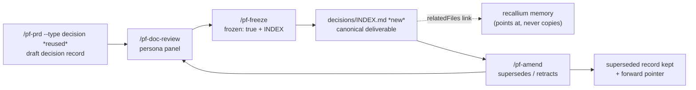
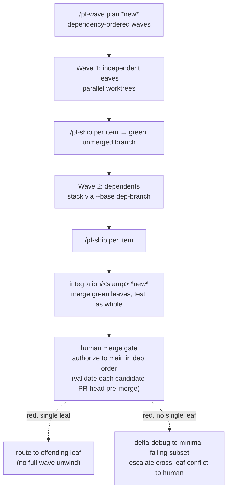

# feat: Dev-cycle Standard gaps — decision records, model tiering, invariants, build waves

Incorporate the four transferable strengths of a colleague's project-agnostic "Standard" development cycle
into phase-flow v2, without reopening decisions the plugin made deliberately (notably R32, memory as the
single source of truth). Ten requirements across four clusters: a first-class **decision-record** artifact
type that reuses the existing freeze/amend/spec-union machinery (R1–R4, the headline), dependency-ordered
**build-wave orchestration** with dependent-branch stacking and an integration branch (R5–R7), an explicit
per-tier **model map** with a reviewer-tier floor (R8–R9), and an optional **invariants-file** constraint
slot surfaced to reviewers (R10). A one-time backfill migrates the founding brainstorm's cross-plan Key
Decisions (the fan-out subset, plus the revised founding KD-R7) into decision records, deferring inert ones to
on-touch migration. Delivered in three dependency-ordered phases. The human merge gate and CI-enforced
freeze are preserved throughout — nothing here lets work reach `main` ahead of the gate.

---

## Summary

The colleague's "Standard" is strongest exactly where phase-flow is thinnest: up-front addressable decision
records, multi-stream wave orchestration, and an explicit model-tier map. phase-flow already owns the harder
primitives those need — a frozen-doc family with amendment + spec-union resolution
(`commands/pf-freeze.md`, `commands/pf-amend.md`, `skills/spec-union/`), bounded parallel worktrees
(`skills/worktree/`, `skills/parallelism/`), and a config schema (`docs/config.schema.json`). This plan
adds the missing surfaces on top of that substrate rather than importing the Standard's tooling.

The headline is the decision record: today the founding brainstorm's 14 architectural decisions live only as
undifferentiated prose in one document yet govern four workstream plans, and when founding KD-R7 was revised
the change became a whole new from-scratch brainstorm with no forward pointer from the original. A decision
record gives each cross-cutting decision its own addressable, reviewed-before-build, frozen file, and reuses
the existing `supersedes`/`retracts` path for revision — so memory links to it (R32 preserved) instead of
duplicating it.

The plan is phased: Phase 1 builds the decision-record type and backfills the fan-out founding decisions;
Phase 2 lands the cheap config wins (model-tier map, invariants slot); Phase 3 builds wave orchestration, the
largest and most independent cluster.

---

## Problem Frame

Grounding each cluster against the current code:

- **Decision records (B).** Freeze is already doc-type-agnostic at the frontmatter level
  (`commands/pf-freeze.md` stamps `frozen: true` + `frozen_at`), but index registration and amendment paths
  are PRD/task-specific (`prds/INDEX.md`, `prds/<n>-<slug>/amendments/`), and `scripts/spec-union.sh` takes a
  PRD path. There is no decision-record path in `docs/layout.md`, no authoring command, and no routing of a
  decision doc through `commands/pf-doc-review.md`. The machinery generalizes, but the seams must be opened
  deliberately.
- **Wave orchestration (A).** `commands/pf-ship.md` orchestrates a single work item's phase loop; there is no
  multi-item wave plan, no dependent-branch stacking, and no integration branch. The substrate exists:
  `scripts/worktree.sh provision` already accepts `--base <ref>` and `--branch`, and `skills/parallelism/`
  owns the ceiling, merge pre-flight, and shared-migration refusal. Waves sit on top of this.
- **Model tiering (D).** `docs/config.schema.json` has `additionalProperties: false` at the top level and
  carries no model configuration. The 7 `agents/pf-*-reviewer.md` personas each declare `model: fast` in
  frontmatter — which R9 (reviewer-tier ≥ builder-tier) flags as the first violation to correct.
- **Invariants (E).** No `invariantsFile` slot exists in the schema; reviewer agents receive only the
  document under review, with no channel for non-negotiable repo constraints.

The unifying constraint: every addition must respect R32 (no competing knowledge store), the CI-enforced
freeze (`scripts/check-frozen.sh`, `.github/workflows/check-frozen.yml`), and the human merge gate
(`commands/pf-ship.md` never merges).

---

## High-Level Technical Design

**Decision-record lifecycle** (reuses the frozen-doc family; new surfaces marked `*new*`):



**Wave orchestration** (sits above the per-item phase loop; preserves the human gate):



Both diagrams are authoritative for component relationships and sequencing; per-unit fields below carry the
detail.

---

## Output Structure

New and modified surfaces (repo-relative; the implementer may adjust layout if a better one emerges):

```text
commands/
  pf-prd.md                 # modified — accept `--type decision` (decisions/, D-IDs, own counter, brainstorm-optional); default `prd` unchanged
  pf-doc.md                 # modified — orchestrator gains a decision entry that delegates to the above
  pf-freeze.md              # modified — route rigor gate by artifact type; decisions/INDEX; no tasks/COMPLETION-LOG for decisions
  pf-amend.md               # modified — decision-record parents; sibling amend-dir; supersede carries a forward-pointer
  pf-doc-review.md          # modified — decision drafts → Full; raised decisions/ amendment floor; ref-relative invariants + override
  pf-review.md              # modified — ref-relative invariants surfaced to code-review + override
  pf-wave.md                # new — wave plan + runner orchestrator
decisions/                  # new — decision-record deliverable family (authored via the PRD machinery)
  INDEX.md
  SUPERSEDED.log            # new — append-only file-side manifest of superseded records (memory audit hook)
  <n>-<slug>.md
  <n>-<slug>.amendments/
    A<k>-<short>.md
skills/
  prd/SKILL.md              # modified — add decision-record section contract + spec-union reuse note
  spec-union/SKILL.md       # modified — [RD] grammar, record-level supersede, transitive chain + cycle guard
  doc-review/SKILL.md       # modified — decision draft Full tier + raised decisions/ amendment floor + invariants class
  compound/SKILL.md         # modified — link records via relatedFiles; supersede manifest + best-effort re-point
  memory/SKILL.md           # modified — file-linked deliverable read recipe; boundary rule; memory-sync reconciliation
  wave/SKILL.md             # new — wave plan representation + stacking + integration lifecycle
scripts/
  spec-union.sh             # modified — ID grammar [RD]\d+ + layout-aware amend-dir + record-level supersede + chain/cycle (PRD output byte-identical)
  spec-rigor-check.sh       # modified — add `--artifact decision` branch (decision sections + [RD] ID matcher)
  model-tier-check.sh       # new — validate reviewer-tier ≥ builder-tier + reviewer→tiers key cross-reference against config
  wave.sh                   # new — wave provision/stack/integration + per-candidate pre-merge validation (split deferred unless it outgrows the file)
  test/                     # modified — doc/impl fixtures for decisions, freeze, spec-union, waves, invariants
docs/
  layout.md                 # modified — decision-record + wave-plan paths
  config.schema.json        # modified — models map, invariantsFile slot, invariantsOptional override
config/
  workflow.config.example.json  # modified — example models + invariantsFile
rules/
  pf-naming.mdc             # modified — one-line reviewer-tier ≥ builder-tier floor rule
providers/
  recallium.md              # verified/modified — relatedFiles link recipe + memory-sync reconciliation
agents/
  pf-*-reviewer.md          # modified (×7) — model tier off `fast` (coordinate w/ plan 004)
```

---

## Key Technical Decisions

- **KTD1 — Decision records are a distinct deliverable family with a `D`-ID namespace, authored via the
  existing doc command with a `decision` type flag — no dedicated command or skill.** They live in a
  top-level `decisions/` tree mirroring `prds/` layout, with their own `decisions/INDEX.md`, but authoring
  reuses `/pf-prd` — generalized into a typed frozen-deliverable author where `--type decision` writes
  `decisions/<n>-<slug>.md` with `D`-IDs and the default `prd` type is unchanged — rather than a new
  `/pf-decision` command, and the section contract lives in `skills/prd/SKILL.md` rather than a new
  `skills/decision-record/`. Rationale: cross-cutting decisions are not owned by any single PRD, so reusing a
  PRD's R-ID namespace would mis-file them — a distinct `D`-ID keeps them addressable and orthogonal — but the
  *authoring surface* must be reused, not duplicated: a separate command and skill would re-state the
  freeze/review/amend handoff the PRD path already encodes, the exact tooling-duplication this plan exists to
  avoid. (Resolves an origin "deferred to planning" item.)
- **KTD2 — Revision reuses `/pf-amend` + spec-union, but the generalization is ID-grammar + amend-dir-layout,
  not a path tweak — and decision supersession is record-level with a forward pointer, never an inlined
  replacement.** `scripts/spec-union.sh` and `commands/pf-amend.md` become doc-type-agnostic rather than
  gaining a parallel decision-specific resolver. The real work, confirmed against the code, is three coupled
  changes, not "accept a different path": (a) the requirement-ID grammar is hardcoded to `R` — `norm_rid`
  prepends `R` (so `supersedes: [D7]` becomes the garbage id `RD7`), the extraction regexes match `R\d+`
  only, and the sort key is `int(x[0][1:])` — so the prefix must be parameterized to accept `[RD]\d+` (or a
  passed `--id-prefix`) with a `(prefix, int)` sort; (b) `amend_dir` is derived as `parent/'amendments'`,
  which is correct for the folder-per-doc PRD layout but resolves to a single shared `decisions/amendments/`
  for the flat `decisions/<n>-<slug>.md` + sibling `<n>-<slug>.amendments/` layout, so resolution must become
  layout-aware (try the `<stem>.amendments/` sibling); (c) decision supersession is **record-level** — an
  amendment with `supersedes: [D<n>]` drops the superseded `D`-ID from the effective set and emits a
  forward-pointer field to the replacement record/doc; spec-union never inlines the replacement's content
  (KTD3 preserved). Because a record-level supersede has **no paired inline replacement**, the drop **cannot**
  live in the existing positional `supersede_targets[i] ↔ replacements[i]` loop (which breaks on the first
  index with no replacement, silently leaving the `D`-ID in the effective set); it is a **standalone drop
  branch** keyed on the amendment's `supersedes` field, emitting `superseded: {"D<n>": {"replacement":
  "<path>"}}` — a new output shape distinct from the PRD `old→new_id` map. The forward-pointer field is
  **conditionally emitted** (only for record-level supersedes) so the PRD path output stays **byte-identical**.
  Two safety rules ride along: the resolver **follows a supersede chain transitively to the terminal
  non-superseded record** (D5→D9→D12 yields D12, not one hop) under a **max-depth cap with cycle detection**
  (a D5↔D9 pointer cycle is a hard error, not an infinite loop); and the pointer **target must be `frozen:true`**,
  asserted at author time. Rationale: a second resolver would rot, but the plan must own the actual
  ID/layout/semantics/chain work, not under-scope it as a path change.
- **KTD3 — Memory references decision records by `relatedFiles` link only, and a stated boundary separates
  the record (deliverable) from the existing `decision`-class memory (knowledge); R32 preserved.** No
  decision-record content is copied into recallium; `skills/compound/` and `skills/memory/` link to the
  canonical file. The selection boundary is explicit doctrine, not left implicit: a **decision record** is
  the up-front, reviewed-before-build, frozen, CI-immutable *deliverable* for a cross-cutting decision that
  governs multiple plans; a **`decision`-class memory** is the retrospective, mutable *knowledge*
  distillation (rationale + why-not) that may link to a record but is never the source of authority for one.
  Rationale: the record is the version-controlled deliverable (the R32 carve-out), memory is the
  cross-cutting knowledge layer that points at it — and without the stated rule an author cannot tell which
  to write, since memory already has a `decision` category. Storing records *inside* memory was considered
  and rejected (see Alternatives): memory has no freeze, no CI-enforced immutability, no before-build persona
  review, and recallium's supersede edge is edge-degraded (`skills/memory/CAPABILITIES.md`), so memory-native
  would rebuild the freeze family inside the provider and weaken CI and provider-swap portability — the
  opposite of reuse. The same provider-out-of-CI-reach limitation means pointer freshness on supersede is
  **best-effort + file-side auditable** (a committed `decisions/SUPERSEDED.log` manifest + `/pf-memory-sync`
  reconciliation, U4), not transactionally enforced — the plan does not overclaim CI enforcement of the memory
  side.
- **KTD4 — Backfill is scoped to the founding decisions that actually fan out across plans, plus the revised
  one — not a maximal all-14 migration.** From the founding Key Decisions in
  `docs/brainstorms/2026-06-22-unified-dev-workflow-plugin-requirements.md`, the migration covers the subset
  referenced across the workstream plans (`001`/`002`/`003`/`005`) and the already-revised **founding KD-R7**
  (persona selection), migrated with a record-level supersedes pointer to the conditional-review-personas
  decision; inert founding decisions with no cross-plan fan-out are deferred to lazy on-touch migration.
  Rationale: the origin only argued for backfilling "at least the decisions already revised or referenced
  across plans," the value is concentrated in the fan-out subset, and the plan's own Risks concede all-14 is
  real churn — a partial `decisions/` tree that grows on touch is cheaper and equally addressable.
  ("founding KD-R7" is the founding-brainstorm Key Decision; it is distinct from origin requirement R7, the
  integration branch, mapped to U11.)
- **KTD5 — Model tiering is a config map plus a static validator, not runtime model switching.** A new
  top-level `models` object maps tiers (`deep`/`build`/`cheap`) to concrete model ids and assigns roles
  (`builder`, `reviewer`); `scripts/model-tier-check.sh` validates that each `agents/pf-*-reviewer.md`
  declares a model whose tier ≥ the builder tier. Because agent frontmatter is a single global value Cursor
  cannot vary per project while `roles.builder` is per-project overridable, the floor is evaluated against the
  **shipped/default builder tier** (the `models` example baseline, not a literal repo-wide minimum), frontmatter
  aliases (`fast`) resolve via an alias table in `models`, and an unmapped reviewer model **blocks** rather than
  warn-passes. Because JSON-Schema (draft-07) cannot express a `roles.reviewer`→`tiers` key cross-reference, that
  consistency check lives in `scripts/model-tier-check.sh`, not the schema. Rationale: agent frontmatter is
  static in Cursor, so R9 is enforced by a check, not by dynamic resolution; this concretizes R30's policy-only
  tiering.
- **KTD6 — Wave orchestration is a new layer above `/pf-ship`, reusing worktree/parallelism wholesale.** A
  `/pf-wave` orchestrator produces a dependency-ordered wave plan and runs it: independent leaves in parallel
  worktrees, dependents stacked via `worktree.sh provision --base <dep-branch>`, green leaves merged into a
  single `integration/<stamp>` branch tested as a whole, then authorized to `main` in dependency order at the
  existing human gate. Rationale: the substrate (`scripts/worktree.sh`, `skills/parallelism/`) already exists;
  waves add sequencing and an integration branch, not a worktree rewrite. `/pf-ship` is never bypassed.
- **KTD7 — The integration branch never auto-merges; red integration routes by attributability; and
  promotion validates each candidate *before* it touches `main`, never after.** `integration/<stamp>` is a
  test surface; the human gate authorizes promotion to `main` in dependency order. Two red-integration cases
  are distinguished: (a) a failure reproducible in a single leaf attributes to that leaf and re-enters its
  stabilize loop without unwinding green siblings; (b) an **emergent cross-leaf failure** — red in integration
  but every leaf is green in isolation (leaves jointly register a route, bust a budget, or violate an
  invariant) — has *no* single offending leaf, so the runner **delta-debugs to the minimal failing subset of
  any cardinality** (not just a pair — a 3-way interaction where every pair is green must still localize) and
  **escalates to the human gate** as a cross-leaf conflict needing a coordinating change (a new dependency
  edge / re-wave), never re-stabilizing an already-green leaf in a loop; a max re-route count forces
  escalation. **Promotion is pre-merge-validated, not post-merge:** because integration tested the leaves
  *combined* but promotion lands them one-at-a-time, each promotion candidate is validated on a **disposable
  pre-merge ref** (a candidate branch carrying `main` + the leaves promoted so far + this leaf, with its own
  PR/CI run — the green oracle `check-gate.sh` evaluates a PR head, never a bare `main`) **before** the merge
  to `main`. A red candidate halts promotion *without* having touched `main`. If a regression is nonetheless
  discovered after a partial promotion, the wave promotes behind a **single integration PR** (atomic) or
  reverts the promoted leaves — the rollback contract is explicit, never a half-promoted red `main`. Rationale:
  preserves the R15/R18 human-gate-and-never-merge invariant *and* closes the "combined-green ≠ promoted-green"
  gap **without** letting a regression land on `main` first; `check-gate.sh` is a PR-readiness gate, so the
  candidate must be a PR head, not a local `main` state.

---

## Requirements Traceability

| Origin requirement | Cluster | Implementation unit(s) |
|--------------------|---------|------------------------|
| R1 decision-record type in frozen-doc family | B | U1 |
| R2 individually addressable + reviewed before build | B | U1, U2 |
| R3 revised only via supersedes/retracts + forward pointer | B | U3 |
| R4 memory links by reference, not duplication (R32) | B | U4 |
| (backfill — origin resolve-before-planning) | B | U5 |
| R5 dependency-ordered wave plan | A | U9 |
| R6 dependent stacks on green unmerged branch | A | U10 |
| R7 integration branch + preserved human gate | A | U11 |
| R8 per-tier model map in config | D | U6 |
| R9 reviewer-tier ≥ builder-tier rule | D | U7 |
| R10 optional invariants_file surfaced to reviewers | E | U8 |

---

## Implementation Units

### Phase 1 — Decision records (headline) + backfill

### U1. Decision-record artifact type via the existing doc command (`--type decision`)

- **Goal:** Establish the decision record as a first-class frozen-doc family member with its own path and
  `D`-ID namespace, authored by generalizing the existing `/pf-prd` command into a typed frozen-deliverable
  author — no dedicated `/pf-decision` command and no new `skills/decision-record/` skill.
- **Requirements:** R1, R2 (origin).
- **Dependencies:** none.
- **Files:**
  - `docs/layout.md` (modify — add `decisions/` tree + naming/frozen-by table rows + decision row in the read/write map)
  - `commands/pf-prd.md` (modify — accept `--type decision|prd`; route output path, ID namespace, section contract, **numbering source**, and the brainstorm-ordering guard by type; default `prd` unchanged)
  - `commands/pf-doc.md` (modify — orchestrator gains a decision entry that delegates to `/pf-prd --type decision`)
  - `commands/pf-freeze.md` (modify — route the pre-freeze rigor gate by artifact type (`--artifact decision`); register a decision in `decisions/INDEX.md`, not `prds/INDEX.md`; **no task generation and no `COMPLETION-LOG` row** for decisions)
  - `scripts/spec-rigor-check.sh` (modify — add an `--artifact decision` branch: the decision section set (Context/Decision/Rationale/Alternatives/Consequences) and the `[RD]\d+` ID matcher, instead of the PRD section/R-ID requirements)
  - `skills/prd/SKILL.md` (modify — add the decision-record section contract: Context, Decision, Rationale, Alternatives, Consequences, `D`-IDs)
  - `decisions/INDEX.md` (new — living index, never frozen)
  - `scripts/test/run-doc-fixtures.sh` (modify — decision path/ID fixtures + a freeze-passes-decision-rigor fixture + a no-tasks-generated assertion)
  - `scripts/test/fixtures/decision-record-*.md` (new fixtures)
- **Approach:** Generalize `/pf-prd` from "PRD author" to "typed frozen-deliverable author." A `--type decision`
  flag routes output to `decisions/<n>-<slug>.md` with `D`-ID requirements, uses a **separate `decisions/`
  numbering counter** (not the `prdsDir`-keyed one), and **skips the "no doc without brainstorm" ordering
  guard** (decisions are authored up-front, frequently without a preceding brainstorm); the default
  `--type prd` behavior is byte-for-byte unchanged. The decision section contract is added to
  `skills/prd/SKILL.md` alongside the PRD contract, selected by type — and must stay in lockstep with the
  `spec-rigor-check.sh` decision section set (the contract lives in two places that must agree). The handoff
  chain is the existing one — `/pf-prd --type decision` → `/pf-doc-review` → `/pf-freeze` — so no new command
  re-states it. **Freeze reuse is not free:** `/pf-freeze` runs `spec-rigor-check.sh --artifact prd` *before*
  stamping, and that gate hard-requires PRD section names + R-IDs, so a decision record cannot freeze until
  the gate gains an `--artifact decision` branch and `/pf-freeze` routes by type. `commands/pf-freeze.md`'s
  frontmatter-stamping and `scripts/check-frozen.sh`'s immutability are genuinely reused unchanged; the rigor
  gate and INDEX/tasks branch are the real freeze-path edits.
- **Patterns to follow:** `skills/prd/SKILL.md` (section contract + handoff — extended, not forked),
  `commands/pf-prd.md` (numbering/collision policy mirrored for the `decisions/` tree), `scripts/spec-rigor-check.sh`
  `--artifact` branching, `docs/layout.md` (path-contract table).
- **Test scenarios:**
  - Happy path: `/pf-prd --type decision` draft lands at `decisions/<n>-<slug>.md` with sequential `<n>` (decisions counter) and a `D1`-prefixed requirement.
  - Happy path: a decision record with no preceding brainstorm authors successfully (the brainstorm-ordering guard does not fire for `--type decision`).
  - Happy path: `/pf-prd` with no type (or `--type prd`) writes a PRD to `prds/...` exactly as before — no regression in the default path, numbering, or brainstorm guard.
  - Integration: `/pf-freeze` on a decision record passes `spec-rigor-check.sh --artifact decision`, stamps `frozen: true`, registers `decisions/INDEX.md`, and generates **no** task list and **no** `COMPLETION-LOG` row.
  - Edge: second decision on the same date/topic increments `<n>` and does not overwrite (collision policy reused).
  - Edge: `decisions/INDEX.md` gains an entry on freeze with status `not-started` and no `frozen` field on the index itself.
  - Error: drafting over an existing frozen decision record without confirmation is refused.
  - Integration: a frozen decision record is recognized by `scripts/check-frozen.sh` as immutable (covered jointly with U3).
- **Verification:** A decision record can be authored (brainstorm optional, separate counter), reviewed, and
  frozen end-to-end via the `/pf-prd --type decision` → `/pf-doc-review` → `/pf-freeze` chain — passing a
  decision-aware rigor gate, registering in `decisions/INDEX.md`, generating no tasks — with no new command or
  skill, and the default PRD path (output, numbering, guard, tasks) unchanged.

### U2. Route decision records through persona doc-review

- **Goal:** A decision record is critiqued at decision-time by the persona panel, not only distilled
  retrospectively.
- **Requirements:** R2 (origin).
- **Dependencies:** U1.
- **Files:**
  - `commands/pf-doc-review.md` (modify — accept decision-record doc type; route drafts Full, amendments via the raised decisions/ floor)
  - `skills/doc-review/SKILL.md` (modify — decision-record draft → Full tier; raise the amendment floor for `decisions/` parents to +adversarial +feasibility (+security))
  - `scripts/test/run-doc-fixtures.sh` (modify — decision-record draft + decisions/ amendment fixtures; PRD-amendment no-regression fixture)
- **Approach:** Two distinct paths, because supersession (the highest-blast-radius operation on a
  cross-cutting decision) flows through the **amendment** path, which today runs only the two-persona floor.
  (1) **Decision-record drafts** route at the **Full** tier (all seven personas) — a record "governs multiple
  plans" by definition, so it is treated as the top blast-radius draft rather than a Standard draft; this
  *reuses* plan 004's tier model (Full = all seven) rather than enumerating a competing subset, so there is no
  conflict with signal-driven selection. (2) **Decision amendments** (`decisions/<n>-<slug>.amendments/A*.md`,
  the supersede/retract path) raise the generic amendment floor — which is `coherence + scope-guardian` only —
  to add **adversarial + feasibility always, and security when the decision touches auth/data/migrations**,
  *only when the frozen parent lives under `decisions/`*. This closes the real exposure (a cross-cutting
  decision being superseded after review by just the two lightest personas) without weakening the PRD-amendment
  floor. Both paths defer to plan 004's content-triggered selection for *additional* personas — U2 sets a
  floor, never a ceiling, and never subtracts a persona plan 004 would add.
- **Patterns to follow:** `skills/doc-review/SKILL.md` tier table (Full / Standard / amendment floor) +
  content-triggered selection; `commands/pf-doc-review.md` amendment-vs-draft routing.
- **Test scenarios:**
  - Happy path (draft): a decision-record draft dispatched through `/pf-doc-review` routes at the Full tier (all seven personas), returns synthesized findings, and applies safe_auto fixes.
  - Happy path (amendment): an amendment under `decisions/<n>-<slug>.amendments/` runs coherence + scope-guardian + adversarial + feasibility against the frozen parent (above the generic two-persona amendment floor).
  - Edge: a decision (draft or amendment) touching auth/data/migrations additionally triggers the security persona.
  - Edge: a PRD amendment (parent **not** under `decisions/`) keeps the unchanged two-persona floor (no regression to the PRD path).
  - Edge: Quick-tier decision record reports "no panel" and stops (parity with PRD behavior).
  - Error: a persona sub-agent failure logs and continues with the remaining personas.
- **Verification:** A decision-record draft runs the Full panel; a decision **amendment** runs no lighter than coherence + scope-guardian + adversarial + feasibility (plus security when warranted); PRD amendments are unchanged; and U2 only ever raises the floor, never subtracts a persona plan 004's signal-driven model would add.

### U3. Decision-record revision via generalized amendment + spec-union

- **Goal:** A decision record is revised only by a sibling amendment that supersedes/retracts and leaves a
  forward pointer — never edited in place.
- **Requirements:** R3 (origin).
- **Dependencies:** U1.
- **Files:**
  - `scripts/spec-union.sh` (modify — parameterize the ID grammar to `[RD]\d+` (drop the forced `R` prefix in `norm_rid`, widen the extraction regexes, sort by `(prefix, int)`); make `amend_dir` layout-aware (sibling `<stem>.amendments/`); add a **standalone record-level-supersede branch** keyed on `supersedes` (outside the positional `replacements[i]` loop) that drops the `D`-ID and conditionally emits `superseded: {"D<n>": {"replacement": "<path>"}}`; **transitive chain resolution to the terminal record with a max-depth + cycle guard**. PRD path output byte-identical)
  - `skills/spec-union/SKILL.md` (modify — document decision-record resolution: record-level supersede + forward pointer (no inlined replacement), transitive chain to terminal record, cycle/max-depth guard, the `[RD]` ID grammar)
  - `commands/pf-amend.md` (modify — accept decision-record parents; amendment dir `decisions/<n>-<slug>.amendments/`; `supersedes`/`retracts` carry a `replacement:` forward-pointer)
  - `scripts/check-frozen.sh` (verify — already path-agnostic on `frozen: true`; confirm a frozen `decisions/` file is immutable with no code change)
  - `scripts/test/run-doc-fixtures.sh` (modify — D-ID extraction non-empty fixture; sibling `<stem>.amendments/` resolution fixture; PRD-path byte-identity regression fixture)
- **Approach:** Make `scripts/spec-union.sh` ID-namespace- and layout-agnostic (see KTD2): the requirement
  grammar accepts `[RD]\d+` with a `(prefix, int)` sort, and `amend_dir` resolves the sibling
  `<stem>.amendments/` directory for flat decision files (in addition to the PRD `parent/amendments/`). A
  decision `supersedes: [D<n>]` is **record-level** and handled by a **standalone branch, not the existing
  positional `supersede_targets[i] ↔ replacements[i]` pairing** — a record-level supersede carries no inline
  replacement, so the positional loop would break at the first unpaired index and silently leave the `D`-ID in
  the effective set. The standalone branch drops the `D`-ID and **conditionally** emits `superseded: {"D<n>":
  {"replacement": "<path>"}}` (the conditional keeps the PRD `old→new_id` output byte-identical). The resolver
  **follows supersede chains transitively to the terminal non-superseded record** (D5→D9→D12 ⇒ D12) under a
  **max-depth cap with cycle detection** (a pointer cycle is a hard error). The forward-pointer **target must
  be `frozen:true`** — asserted at author time, so an unfrozen target blocks rather than producing a dangling
  pointer. The superseded record itself stays frozen; `/pf-amend` learns the decision amendment path and writes
  the forward pointer. **An empty union extracted from a non-empty decision doc is a hard error, not a silent
  pass** (guards the R-prefix-coupling failure mode). On supersede, the amendment step also flags any
  `decision`-class memory whose `relatedFiles` points at the superseded record for re-pointing (see U4).
- **Patterns to follow:** `skills/spec-union/SKILL.md` resolution rules, `commands/pf-amend.md` directive
  frontmatter, the exemplar `docs/brainstorms/2026-06-22-...amendments/A1-fail-closed-enforcement-point.md`.
- **Test scenarios:**
  - Happy path: an amendment with `supersedes: [D<n>]` (no inline replacement) is handled by the standalone drop branch — it drops the `D`-ID and emits `superseded: {"D<n>": {"replacement": "<path>"}}`; spec-union does **not** inline the replacement's content (KTD3 preserved) and does **not** silently retain the `D`-ID (regression-guards the positional-loop break).
  - Happy path: `retracts: [D<n>]` drops the requirement with rationale recorded.
  - Happy path (regression): `scripts/spec-union.sh` on a PRD path emits byte-identical output to today — the `superseded` forward-pointer field is absent for PRDs (interface-stability for workstream 003).
  - Chain: D5→D9→D12 resolves to the terminal record D12 (not one hop); a D5↔D9 pointer cycle is a hard error, not an infinite loop; depth beyond the cap errors.
  - Edge (frozen target): an amendment forward-pointing at a target whose frontmatter lacks `frozen:true` blocks at author time (no dangling/unfrozen pointer); a frozen target passes.
  - Edge: D-ID extraction on a non-empty decision record returns a non-empty union; an empty union on a non-empty doc fails loudly (catches the R-prefix coupling).
  - Edge: amendments resolve from the sibling `decisions/<n>-<slug>.amendments/` directory (not a shared `decisions/amendments/`).
  - Edge: a supersede targeting a non-existent or already-retracted `D`-ID is flagged by coherence review.
  - Edge: two amendments in filename order apply later-over-earlier correctly.
  - Error: a direct edit to a frozen decision record is blocked by `scripts/check-frozen.sh` (CI) and the local pre-commit hook.
- **Verification:** A decision record can only change via a reviewed, frozen amendment; spec-union extracts a non-empty `D`-ID union, resolves record-level supersession via a standalone branch to a forward pointer (no inlined content, `D`-ID dropped), follows chains to the terminal record under a cycle/depth guard, asserts the pointer target is frozen, resolves amendments from the sibling layout, and leaves the PRD path output byte-identical.

### U4. Memory links to decision records by reference (R32)

- **Goal:** Memory points at a decision record instead of duplicating it.
- **Requirements:** R4 (origin); preserves R32.
- **Dependencies:** U1.
- **Files:**
  - `skills/compound/SKILL.md` (modify — on a cross-cutting decision, link the record path via `relatedFiles`, do not copy body; on supersede, best-effort re-point + emit a stale-pointer manifest entry)
  - `skills/memory/SKILL.md` (modify — read recipe notes decision records are file-linked deliverables; boundary rule; manifest reconciliation via `/pf-memory-sync`)
  - `decisions/SUPERSEDED.log` (new — append-only, file-side, CI-checkable manifest: one line per superseded record path, written by U3's amendment step)
  - `providers/recallium.md` (verify — `related_files` already supports the link; no schema change expected)
- **Approach:** Add a doctrine note + write-recipe rule: when a durable cross-cutting decision has a frozen
  decision record, the `decision`-class memory stores a short pointer + `relatedFiles: [decisions/<n>-<slug>.md]`,
  never the record's content. **The boundary is honest about what can and cannot be CI-enforced** — the memory
  provider is out of CI's reach (the same limitation that justified rejecting memory-native storage in KTD3),
  so memory re-pointing is **best-effort and non-transactional** with the freeze, *not* "enforced." What *is*
  enforced is file-side: (a) U3's supersede step appends the superseded record path to **`decisions/SUPERSEDED.log`**,
  a committed, CI-visible manifest; (b) `/pf-memory-sync` reconciles that manifest against `decision`-class
  memories' `relatedFiles` and re-points any that still link the superseded record — and a CI/audit check can
  detect a memory pointing at a path listed in `SUPERSEDED.log` as **divergence**, because the manifest is a
  file artifact even though the memory side is not. (c) The **boundary rule** in the write recipe keeps a
  `decision`-class memory a pointer, not body content. Net: pointer freshness is best-effort + auditable, not
  claimed transactional. Existing redaction chokepoint unchanged.
- **Patterns to follow:** `skills/memory/CAPABILITIES.md` write contract (`relatedFiles` for file-scoped
  memories), `providers/recallium.md` write-recipe, `/pf-memory-sync` reconciliation flow.
- **Test scenarios:**
  - Happy path (skill-level): the compound write recipe, given a decision with a frozen record, produces a linked pointer memory rather than a content copy (validated against the documented recipe in review).
  - Edge (manifest): superseding a record appends its path to `decisions/SUPERSEDED.log`; `/pf-memory-sync` re-points a memory still linking the superseded record; an audit flags a memory linking a `SUPERSEDED.log` path as divergence.
  - Edge (non-transactional honesty): if the re-point step is skipped/fails, the file-side manifest still records the supersede so the divergence is detectable later (no silent permanent stale pointer).
  - Edge (skill-level): a content-bearing `decision`-class memory for a decision that already has a record is flagged by the boundary rule as needing to become a pointer.
- **Verification:** The write recipe links rather than duplicates; supersede records the change in the file-side `SUPERSEDED.log` and best-effort re-points linking memories; `/pf-memory-sync` + audit can detect a stale pointer; no decision-record body lands in memory. The plan claims auditability, **not** transactional enforcement of the provider side.

### U5. Backfill the fan-out founding Key Decisions (incl. founding KD-R7) into decision records

- **Goal:** Migrate the founding brainstorm's cross-plan-referenced Key Decisions into individual frozen
  decision records — including the already-revised founding KD-R7 with its record-level supersedes pointer —
  deferring inert decisions to lazy on-touch migration.
- **Requirements:** origin resolve-before-planning (scoped backfill — fan-out subset + revised decision).
- **Dependencies:** U1, U2, U3.
- **Files:**
  - `decisions/<n>-conditional-review-personas.md` (new — **the supersede target**, migrated from `docs/brainstorms/2026-06-23-conditional-review-personas-requirements.md` and frozen; authored first so KD-R7's pointer has a frozen destination)
  - `decisions/<n>-<slug>.md` (new — one per fan-out founding decision referenced by plans `001`/`002`/`003`/`005`)
  - `decisions/<n>-kd-r7-persona-selection.amendments/A1-signal-driven.md` (new — record-level supersede of the founding KD-R7 record, forward-pointing at the `conditional-review-personas` **decision record** above)
  - `decisions/INDEX.md` (modify — one entry per migrated record)
  - source: `docs/brainstorms/2026-06-22-unified-dev-workflow-plugin-requirements.md` and `docs/brainstorms/2026-06-23-conditional-review-personas-requirements.md` (read-only; never edited)
- **Approach:** One decision record per fan-out founding Key Decision, authored via `/pf-prd --type decision`,
  reviewed, and frozen. **Ordering is a hard dependency:** the supersede target must exist as a frozen artifact
  *before* the founding KD-R7 supersede can land (KTD2's "target must be frozen" rule, enforced by U3's
  frozen-target assertion). Since the live conditional-review-personas decision is only a brainstorm (no
  `frozen:true`, and there is no `--artifact brainstorm` freeze path), U5 first **migrates it into a frozen
  decision record** `decisions/<n>-conditional-review-personas.md` via `/pf-prd --type decision` + `/pf-freeze`.
  Then the founding KD-R7 record is migrated in its original "all seven personas" form and immediately
  superseded at the **record level** by an amendment that **forward-points at that frozen decision record** —
  the amendment carries the pointer, it does **not** inline the target's content (KTD3 preserved). Inert
  founding decisions are migrated only when next touched.
- **Patterns to follow:** U1–U3 mechanisms; the migrated `decisions/<n>-conditional-review-personas.md` record
  (frozen) as the supersede target.
- **Test scenarios:**
  - Ordering: authoring the founding KD-R7 supersede **before** `decisions/<n>-conditional-review-personas.md` is frozen is rejected by U3's frozen-target assertion (proves the dependency edge is enforced, not just documented).
  - Integration: `scripts/spec-union.sh` on the founding KD-R7 record drops `D<n>` from the effective set and emits a forward-pointer to the `conditional-review-personas` decision record — it does **not** return that record's inlined content (proves record-level supersession without duplication).
  - Edge: the forward-pointer target resolves to an existing path whose frontmatter is `frozen:true` (dangling-pointer **and** unfrozen-target guard); a missing or unfrozen target blocks.
  - Test expectation: remaining content migration is verified by review (no behavioral code).
- **Verification:** The fan-out founding decision records exist with INDEX entries; `decisions/<n>-conditional-review-personas.md`
  exists and is frozen; the founding KD-R7 record
  resolves via spec-union to a forward pointer (not inlined content); the pointer target is frozen and
  resolvable.

---

### Phase 2 — Config-level wins (model tiering, invariants)

### U6. Per-tier model map in config

- **Goal:** Concretize R30's policy-only tiering into a configurable per-project model map.
- **Requirements:** R8 (origin).
- **Dependencies:** none (lands before or alongside U7).
- **Files:**
  - `docs/config.schema.json` (modify — add top-level `models` object)
  - `config/workflow.config.example.json` (modify — example tier→model values + role assignment)
  - `skills/prd/SKILL.md` or a short `docs/` note (modify — document the tier vocabulary; optional)
  - `scripts/test/run-impl-fixtures.sh` (modify — schema-validation fixture for `models`)
- **Approach:** Add `models: { tiers: { deep, build, cheap }, roles: { builder, reviewer } }` where `tiers`
  maps tier names to concrete model ids and `roles` maps each role to a tier name. **Pin the tier vocabulary
  to the strings that can actually appear in agent `model:` frontmatter** (the reviewers declare the Cursor
  alias `model: fast`): either the `tiers` values use those exact alias strings, or `models` carries an
  explicit alias table (e.g. `cheap → fast`) so `model-tier-check.sh` (U7) can resolve a frontmatter `fast`
  to a tier instead of treating every reviewer as unmapped. Keep `additionalProperties: false` satisfied by
  declaring the new key explicitly. Global defaults live in the example; a repo overrides per-project. No
  runtime model switching — the map is the source the validator (U7) and humans read.
- **Patterns to follow:** existing schema objects in `docs/config.schema.json` (e.g. `worktree`, `checks`)
  for shape and `additionalProperties: false` discipline.
- **Test scenarios:**
  - Happy path: a config with a valid `models` map validates against the schema.
  - Edge: a `roles.reviewer` referencing an undefined tier name fails schema validation.
  - Edge: omitting `models` entirely is valid (optional key) and the validator (U7) treats it as "no enforcement".
  - Error: an unknown property under `models` is rejected (`additionalProperties: false`).
- **Verification:** The schema accepts a well-formed `models` map and rejects malformed ones; the example config carries a usable default.

### U7. Reviewer-tier ≥ builder-tier rule + reviewer agent fix

- **Goal:** Enforce that reviewer agents run at a tier no lower than the builder tier, correcting the 7
  `model: fast` reviewers.
- **Requirements:** R9 (origin).
- **Dependencies:** U6.
- **Files:**
  - `scripts/model-tier-check.sh` (new — validate each `agents/pf-*-reviewer.md` model vs config tiers; also enforce the `roles.reviewer`/`roles.builder`→`tiers` key cross-reference that JSON-Schema draft-07 cannot express)
  - `agents/pf-adversarial-reviewer.md`, `agents/pf-coherence-reviewer.md`, `agents/pf-design-reviewer.md`,
    `agents/pf-feasibility-reviewer.md`, `agents/pf-product-reviewer.md`,
    `agents/pf-scope-guardian-reviewer.md`, `agents/pf-security-reviewer.md` (modify — model off `fast`)
  - `rules/pf-naming.mdc` (modify — record the one-line tier-floor rule here; do not spawn a new rule file)
  - `scripts/test/run-impl-fixtures.sh` (modify — tier-check fixtures)
- **Approach:** `scripts/model-tier-check.sh` reads `models` from config, resolves each reviewer agent's
  declared frontmatter model (via the U6 alias table) to a tier, and exits non-zero if any reviewer tier <
  builder tier. **Resolve the per-project-vs-static tension:** `models.roles.builder` is per-project
  overridable, but reviewer agent frontmatter is a single global value Cursor cannot vary per project — so the
  floor is evaluated against the **shipped/default builder tier** (the `models` example baseline), and a project
  that raises its builder tier above the global reviewer tier is reported by the check rather than silently passing
  (the remedy is raising the global reviewer frontmatter, not a per-repo edit). An **unmapped** reviewer model
  (not resolvable to any tier) **blocks** (exit non-zero), it does not warn-and-pass — an unmapped model is
  exactly the silent-hole this check exists to close. Update the 7 reviewer agents to the reviewer tier's
  model. **Coordinate with plan 004** (conditional-review-personas), which also edits these agent files —
  whichever lands first, the other rebases (see Risks).
- **Patterns to follow:** `scripts/spec-rigor-check.sh` / `scripts/traceability-check.sh` for a gate-style
  check script (exit-code verdict, JSON or line output), `agents/pf-coherence-reviewer.md` frontmatter shape.
- **Test scenarios:**
  - Happy path: with all reviewers resolving (via alias) to ≥ the global builder tier, `model-tier-check.sh` exits 0.
  - Error: a reviewer left at a tier below the global builder tier makes the check exit non-zero and names the offending agent.
  - Error: a reviewer model that resolves to no tier (unmapped) blocks (exit non-zero), not a warn-and-pass.
  - Edge: no `models` config present → check reports "tiering not configured" and exits 0 (non-blocking, parity with optional config).
  - Edge: a project builder tier raised above the global reviewer tier is reported (the floor is the shipped/default builder tier).
- **Verification:** The check fails on a sub-builder reviewer and on an unmapped reviewer model, and passes once all 7 reviewers resolve at/above the global builder tier.

### U8. Invariants-file config slot surfaced to reviewers

- **Goal:** An optional hard-constraints document is surfaced to reviewers as non-negotiable constraints.
- **Requirements:** R10 (origin).
- **Dependencies:** none.
- **Files:**
  - `docs/config.schema.json` (modify — add optional `invariantsFile` string slot + `invariantsOptional` override flag)
  - `config/workflow.config.example.json` (modify — commented example pointing at `INVARIANTS.md`)
  - `commands/pf-doc-review.md` (modify — inject ref-relative invariants content; `--no-invariants` logged override)
  - `commands/pf-review.md` (modify — surface ref-relative invariants to code-review; honor the override)
  - `skills/doc-review/SKILL.md` (modify — invariants are a non-negotiable constraint class in synthesis)
  - `scripts/test/run-doc-fixtures.sh` (modify — invariants surfaced fixture)
- **Approach:** Add `invariantsFile: <path>` to the schema (optional). When set, `/pf-doc-review` and
  `/pf-review` read the file and pass its content to reviewer agents as a flagged "non-negotiable constraints"
  block, so a finding that violates an invariant is treated as a hard (not advisory) issue. **Configured-but-
  unreadable fails closed — but with a bounded blast radius, not a repo-wide lockout:** (a) the file is
  resolved **relative to the ref under review** (the PR head / worktree base), not always `main`, so a wave
  leaf branched from a base predating `INVARIANTS.md`, or a not-yet-merged rename, does **not** false-trip on a
  file that is valid on the ref being reviewed; (b) failure is scoped to **the single review that actually
  consults invariants**, never a global gate that blocks unrelated reviews; (c) an explicit, **logged override**
  (`--no-invariants` / a config `invariantsOptional: true` for that run) lets the very PR that *fixes* a broken
  `invariantsFile` path be reviewed without deadlock. The distinction is explicit: **missing/unreadable on the
  ref under review = config error (blocks that review)**; *valid on the ref* = proceeds. Only the **unset** case
  proceeds unchanged. This keeps the fail-closed posture (`rules/pf-guardrails.mdc`, `rules/memory-guardrails.mdc`)
  while preventing a one-character typo from halting every review in the repo, including its own fix.
- **Patterns to follow:** `commands/pf-doc-review.md` persona dispatch (agents already receive the full
  document; invariants ride alongside), `rules/pf-guardrails.mdc` fail-closed enforcement pattern, schema
  optional-key shape from `docs/config.schema.json`.
- **Test scenarios:**
  - Happy path: with `invariantsFile` set and readable on the ref, a doc-review run injects the invariants content and a violating finding is marked non-negotiable.
  - Edge: `invariantsFile` unset → reviewers run exactly as today (no behavior change).
  - Edge (ref-relative): a wave leaf whose base predates `INVARIANTS.md` resolves invariants against its own ref and does not false-trip on a file absent only from that older base.
  - Edge (override): the PR that fixes a broken `invariantsFile` path is reviewable via the logged override without deadlock.
  - Error: `invariantsFile` set but missing/unreadable **on the ref under review** → that review (only) is **blocked with a config error** (fail-closed), not run advisory; unrelated reviews are unaffected.
- **Verification:** When configured and readable on the ref, reviewers receive and enforce the invariants; when missing/unreadable on the ref the *consulting* review fails closed (with a logged override escape); resolution is ref-relative so wave leaves don't false-trip; when unset, behavior is unchanged.

---

### Phase 3 — Build-wave orchestration

### U9. Wave-plan artifact and representation

- **Goal:** A dependency-ordered wave plan that batches independent work items into parallel waves and orders
  dependent chains, produced once per round of work.
- **Requirements:** R5 (origin).
- **Dependencies:** none (substrate exists); precedes U10/U11.
- **Files:**
  - `commands/pf-wave.md` (new — `plan` subcommand)
  - `skills/wave/SKILL.md` (new — wave-plan representation + dependency model)
  - `docs/layout.md` (modify — wave-plan artifact path)
  - `scripts/wave.sh` (new — emit/parse the wave plan)
  - `scripts/test/run-impl-fixtures.sh` (modify — wave-plan parse/validate fixtures)
- **Approach:** `/pf-wave plan` reads a set of work items (from a task list or an explicit item set) plus their
  dependency edges and emits an ordered wave plan: each wave is a set of items with no intra-wave dependencies;
  dependent items land in later waves. Representation is a small declarative artifact (path defined in
  `docs/layout.md`). Shared-migration overlap defers items to serialized waves (reuse
  `skills/parallelism/` refusal logic). **Add the high-contention doc surfaces to that refusal set:** the
  living `INDEX.md` files (`prds/INDEX.md`, `decisions/INDEX.md`) and the filesystem-scan numbering counters
  are shared mutable state, so two leaves authoring docs in parallel can pick the same `<n>` (a collision that
  only surfaces at integration merge). Either serialize doc-creation/numbering across a wave or make numbering
  late-bound (assigned at integration), and define the `INDEX.md` merge strategy across leaves.
- **Patterns to follow:** `skills/parallelism/SKILL.md` (ceiling, shared-migration refusal), the wave concept
  already used in `docs/plans/2026-06-23-001-feat-loop-improvement-program-plan.md` (three dependency-ordered
  waves) as a representation precedent.
- **Test scenarios:**
  - Happy path: three items where C depends on A produce wave 1 = {A, B}, wave 2 = {C}.
  - Edge: a dependency cycle is detected and reported rather than emitting an invalid plan.
  - Edge: two items touching the same migration path are serialized into separate waves.
  - Edge: an item set exceeding the parallel ceiling splits a wave to respect `worktree.parallelCeiling`.
  - Edge: two leaves authoring docs in the same wave do not collide on `<n>` (numbering serialized or late-bound) and `INDEX.md` merges cleanly.
- **Verification:** A work-item set with dependencies produces a correct, ceiling-respecting, cycle-checked wave plan with no INDEX/numbering collisions across parallel leaves.

### U10. Dependent-branch stacking on green unmerged branches

- **Goal:** A dependent item builds on its dependency's green but unmerged branch, so a chain builds unattended
  without touching `main` mid-flight.
- **Requirements:** R6 (origin).
- **Dependencies:** U9.
- **Files:**
  - `commands/pf-wave.md` (modify — `run` subcommand stacking logic)
  - `skills/wave/SKILL.md` (modify — stacking + merge pre-flight discipline)
  - `scripts/wave.sh` (modify — provision dependents via `worktree.sh --base <dep-branch>`)
  - `scripts/test/run-impl-fixtures.sh` (modify — stacking fixtures)
- **Approach:** `/pf-wave run` provisions each dependent worktree with
  `scripts/worktree.sh provision <name> --base <dependency-branch> --branch pf/<name>`, runs `/pf-ship` per
  item, and only advances a dependent once its dependency branch is green. A merge pre-flight
  (`skills/parallelism/`) runs before stacking; no item touches `main`.
- **Patterns to follow:** `skills/worktree/SKILL.md` (`provision --base`), `skills/parallelism/` pre-flight,
  `commands/pf-ship.md` per-item loop (delegated, never bypassed).
- **Test scenarios:**
  - Happy path: a dependent provisions from its dependency's branch and its base contains the dependency's commits.
  - Edge: a dependent does not start while its dependency branch is non-green.
  - Error: a merge-preflight conflict between a dependent and its base halts stacking with a clear message rather than force-stacking.
  - Integration: a 3-item chain (A→B→C) builds unattended with no commit landing on `main`.
- **Verification:** Dependent chains stack and build on green unmerged branches; `main` is untouched mid-wave.

### U11. Integration branch lifecycle and preserved human gate

- **Goal:** Green leaves merge into a single `integration/<stamp>` branch tested as a whole; promotion to
  `main` stays in dependency order at the human gate and is **validated per candidate before the candidate
  touches `main`**; a red integration routes by attributability — a single offending leaf to its stabilize
  loop, an emergent cross-leaf failure to a minimal-subset delta-debug + human escalation; a regression
  surfacing after partial promotion follows an explicit rollback contract.
- **Requirements:** R7 (origin); preserves R15/R18.
- **Dependencies:** U9, U10.
- **Files:**
  - `commands/pf-wave.md` (modify — integration + pre-merge candidate validation + rollback contract)
  - `scripts/wave.sh` (modify — `integration/<stamp>` create/teardown + merge green leaves + per-candidate pre-merge ref; split into a dedicated `integration-branch.sh` only if it outgrows the file)
  - `skills/wave/SKILL.md` (modify — integration lifecycle, attributability split, minimal-subset delta-debug + escalation, rollback)
  - `scripts/test/run-impl-fixtures.sh` (modify — integration, single-leaf red, emergent ≥3-way, pre-merge-candidate-red, and rollback fixtures)
- **Approach:** After a wave's leaves are green, `scripts/wave.sh` creates `integration/<stamp>`, merges the
  green leaf branches, and runs the whole-suite check. On green, the human gate authorizes promotion to `main`
  in dependency order — never auto-merged. **Promotion is pre-merge-validated:** for each leaf in turn the
  runner builds a **disposable candidate ref** (`main` + already-promoted leaves + this leaf), pushes it as a
  short-lived candidate branch with its own PR, and runs the green oracle `check-gate.sh` **on that PR head**
  (the oracle resolves an open PR and reads its CI/threads — it cannot evaluate a bare `main`, so the
  candidate must be a PR, not a post-merge `main` state). Only a green candidate is fast-forwarded to `main`;
  a red candidate **halts promotion before `main` is touched**. If a regression is nonetheless discovered
  after a partial promotion (e.g. external `main` drift), the **rollback contract** applies: either promote
  the remaining wave behind a single atomic integration PR, or `git revert` the already-promoted leaf
  commits — never leave a half-promoted red `main`. On red integration: if the failure reproduces in a single
  leaf, that leaf re-enters its `/pf-stabilize` loop and green siblings are untouched; if **no single leaf
  reproduces it** (emergent cross-leaf conflict), the runner **delta-debugs to the minimal failing subset of
  any cardinality** (a 3-way interaction where every pair is green must still localize) and **escalates to
  the human gate** as a conflict needing a coordinating change (new dependency edge / re-wave) — it does not
  re-stabilize an already-green leaf, and a **max re-route count** forces escalation rather than looping.
  Teardown uses `git worktree`/branch-safe removal (never `rm`), including candidate branches.
- **Patterns to follow:** `commands/pf-ship.md` human-gate pause + `check-gate.sh` authority,
  `skills/worktree/SKILL.md` safe teardown, `scripts/check-gate.sh` as the green oracle (PR-head only).
- **Test scenarios:**
  - Happy path: three green leaves merge into `integration/<stamp>`, the whole-suite check is green, and the gate offers dependency-ordered promotion (no auto-merge).
  - Integration (pre-merge catch): a leaf whose green depended on a sibling's presence makes its promotion *candidate PR* red and halts promotion **before** the merge to `main` (catches combined-green ≠ promoted-green without landing the regression).
  - Error (single leaf): a red integration reproducible in one leaf re-enters that leaf's stabilize loop without unwinding green siblings.
  - Error (emergent ≥3-way): a red integration with every leaf *and every pair* green triggers delta-debug to the minimal failing subset (cardinality ≥3) and escalates to the human gate; it does not re-stabilize a green leaf, and the max re-route count forces escalation.
  - Rollback: a regression found after a partial promotion triggers atomic-PR promotion or revert of promoted leaves; `main` never remains half-promoted red.
  - Edge: `<stamp>` and candidate-branch naming are unique per run and teardown removes branches/worktrees safely.
- **Verification:** Green leaves integrate and test as a whole; promotion is human-authorized, dependency-ordered, and validated on a candidate PR head before each merge to `main`; a single-leaf red routes to one leaf; an emergent cross-leaf red delta-debugs to the minimal subset + escalates; and a post-partial-promotion regression follows the rollback contract.

---

## Alternatives Considered

- **Import the Standard's ADR machinery wholesale** (separate `docs/adr/` tree, numbering script, integrity
  hook). Rejected in the origin and here: it adds a competing knowledge store and reopens R32. The
  decision-record primitive delivers the value reusing the existing frozen-doc family.
- **Store decision records *inside* memory (memory-native), reusing the `decision` category + `supersedes`
  edges** instead of a file deliverable. Rejected after costing it: the required properties — reviewed
  *before* build by the persona panel (R2), frozen + CI-enforced immutability (R1), a trustworthy supersede
  chain (R3), and citation by plans/PRDs/reviewers — are all properties of the freeze family, none of which
  memory has. Memory has no freeze and no before-build review; `check-frozen.sh` cannot reach into the
  provider, so CI immutability would be lost (or require a fragile, provider-coupled CI query that breaks the
  deterministic/offline CI model); recallium's supersede edge is edge-degraded
  (`skills/memory/CAPABILITIES.md`); and the *consumers* of decisions are all file-native, so citing a memory
  id is a dangling, non-diffable, provider-coupled pointer that re-introduces the conflict-of-authority R32
  guards against. Net: memory-native rebuilds the freeze family inside the provider — *more* new tooling, not
  reuse — and weakens CI and provider-swap portability. The existing `decision`-class memory is retained as
  the retrospective knowledge layer that *links* to the record (KTD3).
- **A dedicated `/pf-decision` command plus a `skills/decision-record/` skill** instead of a `--type decision`
  flag on `/pf-prd`. Rejected: a separate command and skill would re-state the freeze/review/amend handoff the
  PRD path already encodes, duplicating exactly the authoring surface this plan set out to reuse. Generalizing
  `/pf-prd` into a typed deliverable author keeps the new surface to a flag + a section contract, with the
  default PRD path unchanged (KTD1).
- **A decision-record-specific resolver** instead of generalizing `scripts/spec-union.sh`. Rejected: a second
  resolver duplicates the add/supersede/retract logic and rots; generalizing the one resolver's ID grammar
  (`[RD]\d+`) + amend-dir layout in place is a smaller, single-source change that keeps the PRD output
  byte-identical (KTD2).
- **Continue brainstorm/PRD R-IDs for decisions** instead of a `D`-ID namespace. Rejected: cross-cutting
  decisions have no owning PRD, so a shared namespace mis-files them and risks collisions (KTD1).
- **Runtime model switching** instead of a static map + validator. Rejected: Cursor agent frontmatter is
  static; a config map plus `model-tier-check.sh` enforces R9 without a runtime resolver (KTD5).
- **A bespoke wave worktree system** instead of layering on `scripts/worktree.sh`. Rejected: the worktree +
  parallelism substrate already exists; waves need sequencing and an integration branch, not a rewrite (KTD6).
- **Land-docs-on-main fast path** (Standard cluster C). Rejected per origin: contradicts the CI-enforced
  freeze and the "no work on bare main" rule (R18).

---

## Risks & Dependencies

- **Reviewer-agent edit collision with plan 004 (conditional-review-personas).** U7 changes the `model:`
  frontmatter of all 7 `agents/pf-*-reviewer.md`; plan 004 also edits those files (signal-driven persona
  selection). *Mitigation:* keep the model-tier fix here but treat it as a coordination dependency — whichever
  plan lands first, the other rebases. **U2 is floor-only and consistent with plan 004:** it routes decision
  *drafts* at plan 004's Full tier and raises only the *decision-amendment* floor (adversarial + feasibility,
  +security when warranted) above the generic two-persona amendment floor — it never subtracts a persona plan
  004's content-triggered selection would add, so there is no overlap conflict to resolve.
- **"Reuse is a path change" under-scopes the real work (spec-union, freeze gate).** Code review confirmed the
  reused tooling is R-ID/PRD-coupled below the path line: `scripts/spec-union.sh` hardcodes the `R` prefix
  (extraction, `norm_rid`, sort) and derives `parent/amendments`; `scripts/spec-rigor-check.sh` (run by
  `/pf-freeze` before stamping) hard-requires PRD sections + R-IDs, so a decision record cannot freeze without
  an `--artifact decision` branch. *Mitigation:* U3/KTD2 now scope spec-union as an ID-grammar (`[RD]\d+`) +
  layout-aware amend-dir + record-level-supersede change with an explicit "empty union on a non-empty doc is a
  hard error" test; U1 adds `spec-rigor-check.sh` + `pf-freeze.md` routing to its file list; both keep the PRD
  path byte-identical (workstream 003 contract) via a regression fixture.
- **spec-union interface stability.** `scripts/spec-union.sh` is a published contract for workstream 003.
  *Mitigation:* the U3 regression test asserts byte-identical PRD-path output while the D-ID path is additive.
- **Freeze/INDEX assumptions.** `commands/pf-freeze.md` frontmatter-stamping and `scripts/check-frozen.sh`
  immutability are genuinely path-agnostic (confirmed); the rigor gate and INDEX/tasks branch are the real
  edits. *Mitigation:* U1 routes the rigor gate by artifact type, registers `decisions/INDEX.md`, suppresses
  task/COMPLETION-LOG generation for decisions, and U3 confirms CI immutability for frozen decision records.
- **Frozen forward-pointers can dangle.** A frozen record's cross-document forward pointer can't be edited in
  place; if the target moves, the pointer dangles and spec-union's intra-doc validation won't catch it.
  *Mitigation:* U5 requires the supersede target to be frozen (move-protected) and adds a coherence/CI check
  that forward-pointer targets resolve to an existing path; repair is amendment-only.
- **Decision/decision-memory divergence.** With two authors (up-front record vs. retrospective compound memory)
  and a pre-existing recallium `decision` category, the boundary can drift. *Mitigation:* U4 enforces the
  boundary (cross-cutting decision memory must be a pointer) and re-points linking memories on supersede.
- **`/pf-prd` overload regression.** Generalizing `/pf-prd` into a typed author (KTD1/U1) risks regressing the
  default PRD path. *Mitigation:* the default `--type prd` behavior is held byte-for-byte unchanged, U1 carries
  an explicit no-regression test for the default path, and type-routing touches only output path, ID
  namespace, and section-contract selection.
- **Reviewer-tier rule depends on the model map.** U7 needs U6's `models` config to compare tiers.
  *Mitigation:* U6 sequenced before U7; absent config, the check is non-blocking.
- **Wave orchestration is the largest surface and most likely to slip.** *Mitigation:* it is Phase 3 and
  functionally separable — Phases 1–2 deliver standalone value if Phase 3 is deferred; the only cross-tie is the
  shared doc-numbering/INDEX contention contract (U9), which is inert unless waves author docs concurrently.
- **Backfill churn (U5).** New frozen files plus an amendment is real churn and review load.
  *Mitigation:* scope is narrowed to the cross-plan fan-out subset + the revised founding KD-R7 (KTD4), inert
  decisions defer to on-touch migration, and it is one isolated unit after the mechanism (U1–U3) is proven —
  it can land as its own PR.

---

## Phased Delivery

- **Phase 1 (U1–U5) — Decision records + backfill.** The headline; delivers the addressable, reviewed,
  forward-pointered decision record and migrates the fan-out founding decisions (plus founding KD-R7).
  Standalone value.
- **Phase 2 (U6–U8) — Config wins.** Model-tier map, reviewer-tier floor, invariants slot. Low-risk config
  and agent edits; independent of Phase 1 except the shared test harness.
- **Phase 3 (U9–U11) — Wave orchestration.** The largest cluster; layered on the existing worktree/parallelism
  substrate. Functionally independent of Phases 1–2 with **one shared contract**: U9's wave contention set
  includes the living `INDEX.md` files and the doc-numbering counters that Phase 1 introduces for `decisions/`
  (and the existing `prds/` ones), so if both phases ship, the numbering/INDEX merge policy is the coordination
  point — not a code dependency, but a shared invariant.

Phases are dependency-ordered for value and risk, not hard prerequisites: Phase 2 and Phase 3 could proceed in
parallel worktrees once Phase 1's mechanism is stable, subject to the parallel ceiling and the shared
doc-numbering/INDEX contract above.

---

## Scope Boundaries

### Deferred to Follow-Up Work

- Parallel execution of Phase 2 and Phase 3 as separate worktree streams (sequencing optimization, not a scope
  change).

### Deferred for later (from origin)

- The remaining Standard profile slots beyond `invariantsFile` (`distribution`, `platform_floor`, `ai_runtime`,
  `stack`, `status`/`version`) — incremental config completeness, added as concrete need arises.
- Land-docs-on-`main` (cluster C) — re-evaluate only if wave orchestration is adopted and base-branch freshness
  becomes a real pain.

### Outside this product's identity (from origin)

- ADR ceremony as the Standard ships it (separate `docs/adr/` tree, numbering script, integrity hook) — the
  decision-record primitive delivers the value without reopening R32.
- Land-docs-on-`main` as a standing carve-out — contradicts the CI-enforced freeze and R18.
- Changelog / house-voice generation (cluster F) — release tooling, not the workflow plugin's job;
  `prds/COMPLETION-LOG.md` covers internal shipped-phase tracking.

---

## Open Questions

### Deferred to implementation

- The concrete tier→model values for the `models` map (which model id is `deep`/`build`/`cheap`) and whether
  they ship as global defaults with per-project overrides — resolved when wiring U6's example config.
- The exact on-disk wave-plan representation (a standalone artifact vs. an extension of the task list) and its
  path in `docs/layout.md` — pinned during U9.
- The `integration/<stamp>` stamp scheme and teardown cadence — pinned during U11.
- Whether decision-record amendments need their own INDEX column or reuse the PRD amendment-link convention —
  decided during U3.

### Resolved during planning

- **Decision-record ID namespace and path:** distinct `D`-ID namespace under a top-level `decisions/` tree
  (KTD1) — resolves the origin's deferred question.
- **Authoring surface:** reuse `/pf-prd` generalized with a `--type decision` flag; no dedicated
  `/pf-decision` command and no `skills/decision-record/` skill (KTD1).
- **Storage substrate:** decision records are file deliverables, not memory entries; memory links to them and
  the record-vs-`decision`-memory boundary is stated doctrine (KTD3) — resolves the "why not store these in
  memory" challenge.
- **Backfill scope:** scoped migration of the cross-plan fan-out founding decisions plus the revised founding
  KD-R7, inert decisions deferred to on-touch migration (KTD4) — resolves the origin's resolve-before-planning
  question.
- **Decision supersession semantics:** record-level supersede with a forward pointer to the replacement
  record/doc; spec-union never inlines replacement content, so KTD3's link-not-copy holds (KTD2/U3/U5).
- **Freeze reuse boundary:** frontmatter-stamp + `check-frozen.sh` immutability reused unchanged; the
  pre-freeze rigor gate gains an `--artifact decision` branch and `/pf-freeze` routes by type (U1) — the
  "no freeze internals" assumption was corrected after code review.
- **Decision-record review floor:** drafts route at plan 004's Full tier (all seven); the **amendment**
  (supersede/retract) floor for `decisions/` parents is raised to coherence + scope-guardian + adversarial +
  feasibility, plus security when the decision touches auth/data/migrations — floor-only, never subtracting a
  plan-004 persona (U2).

---

## Sources / Research

Internal (origin and grounding):

- `docs/brainstorms/2026-06-23-dev-cycle-standard-gap-analysis-requirements.md` — origin requirements (R1–R10,
  disposition matrix, scope boundaries).
- `docs/brainstorms/2026-06-22-unified-dev-workflow-plugin-requirements.md` — founding decisions (R32, R18,
  R30) and the founding Key Decisions (the fan-out subset + founding KD-R7) backfilled by U5.
- `docs/brainstorms/2026-06-23-conditional-review-personas-requirements.md` — the **source** migrated by U5 into
  the frozen `decisions/<n>-conditional-review-personas.md` record that the founding KD-R7 supersede forward-points
  at, and the plan-004 coordination surface.
- Decision-record / freeze machinery: `commands/pf-freeze.md`, `commands/pf-amend.md`, `skills/spec-union/SKILL.md`,
  `scripts/spec-union.sh`, `skills/prd/SKILL.md`, `commands/pf-doc-review.md`, `docs/layout.md`,
  `scripts/check-frozen.sh`, `.github/workflows/check-frozen.yml`, `hooks/pre-commit-frozen.sh`.
- Wave substrate: `skills/worktree/SKILL.md`, `skills/parallelism/SKILL.md`, `scripts/worktree.sh`,
  `commands/pf-ship.md`.
- Config + agents: `docs/config.schema.json`, `config/workflow.config.example.json`, `agents/pf-*-reviewer.md`.
- Memory linkage: `skills/memory/CAPABILITIES.md`, `skills/compound/SKILL.md`, `providers/recallium.md`.

External:

- The colleague's "Development Cycle — The Standard" workflow document (two-layer Standard + Profile model,
  plan/ADR review gate, wave-runner loop, model tiers, 18-slot profile) — the source of the four transferred
  clusters.


