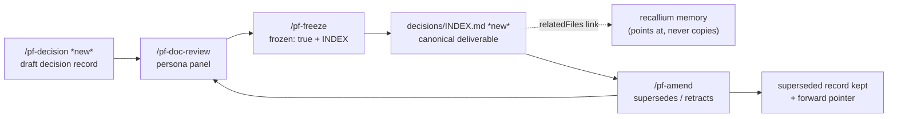
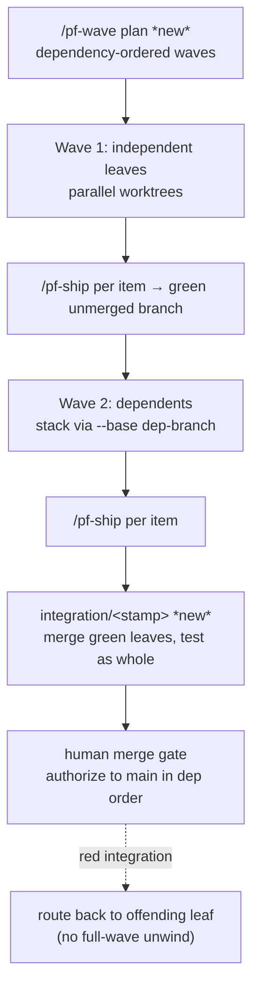

# feat: Dev-cycle Standard gaps — decision records, model tiering, invariants, build waves

Incorporate the four transferable strengths of a colleague's project-agnostic "Standard" development cycle
into phase-flow v2, without reopening decisions the plugin made deliberately (notably R32, memory as the
single source of truth). Ten requirements across four clusters: a first-class **decision-record** artifact
type that reuses the existing freeze/amend/spec-union machinery (R1–R4, the headline), dependency-ordered
**build-wave orchestration** with dependent-branch stacking and an integration branch (R5–R7), an explicit
per-tier **model map** with a reviewer-tier floor (R8–R9), and an optional **invariants-file** constraint
slot surfaced to reviewers (R10). A one-time backfill migrates the founding brainstorm's 14 Key Decisions
into decision records. Delivered in three dependency-ordered phases. The human merge gate and CI-enforced
freeze are preserved throughout — nothing here lets work reach `main` ahead of the gate.

---

## Summary

The colleague's "Standard" is strongest exactly where phase-flow is thinnest: up-front addressable decision
records, multi-stream wave orchestration, and an explicit model-tier map. phase-flow already owns the harder
primitives those need — a frozen-doc family with amendment + spec-union resolution
(`commands/pf-freeze.md`, `commands/pf-amend.md`, `skills/spec-union/`), bounded parallel worktrees
(`skills/worktree/`, `skills/parallelism/`), and a config schema (`docs/config.schema.json`). This plan
adds the missing surfaces on top of that substrate rather than importing the Standard's tooling.

The headline is the decision record: today the founding brainstorm's 14 architectural decisions live only as
undifferentiated prose in one document yet govern four workstream plans, and when R7 was revised the change
became a whole new from-scratch brainstorm with no forward pointer from the original. A decision record gives
each cross-cutting decision its own addressable, reviewed-before-build, frozen file, and reuses the existing
`supersedes`/`retracts` path for revision — so memory links to it (R32 preserved) instead of duplicating it.

The plan is phased: Phase 1 builds the decision-record type and backfills the 14 founding decisions; Phase 2
lands the cheap config wins (model-tier map, invariants slot); Phase 3 builds wave orchestration, the largest
and most independent cluster.

---

## Problem Frame

Grounding each cluster against the current code:

- **Decision records (B).** Freeze is already doc-type-agnostic at the frontmatter level
  (`commands/pf-freeze.md` stamps `frozen: true` + `frozen_at`), but index registration and amendment paths
  are PRD/task-specific (`prds/INDEX.md`, `prds/<n>-<slug>/amendments/`), and `scripts/spec-union.sh` takes a
  PRD path. There is no decision-record path in `docs/layout.md`, no authoring command, and no routing of a
  decision doc through `commands/pf-doc-review.md`. The machinery generalizes, but the seams must be opened
  deliberately.
- **Wave orchestration (A).** `commands/pf-ship.md` orchestrates a single work item's phase loop; there is no
  multi-item wave plan, no dependent-branch stacking, and no integration branch. The substrate exists:
  `scripts/worktree.sh provision` already accepts `--base <ref>` and `--branch`, and `skills/parallelism/`
  owns the ceiling, merge pre-flight, and shared-migration refusal. Waves sit on top of this.
- **Model tiering (D).** `docs/config.schema.json` has `additionalProperties: false` at the top level and
  carries no model configuration. The 7 `agents/pf-*-reviewer.md` personas each declare `model: fast` in
  frontmatter — which R9 (reviewer-tier ≥ builder-tier) flags as the first violation to correct.
- **Invariants (E).** No `invariantsFile` slot exists in the schema; reviewer agents receive only the
  document under review, with no channel for non-negotiable repo constraints.

The unifying constraint: every addition must respect R32 (no competing knowledge store), the CI-enforced
freeze (`scripts/check-frozen.sh`, `.github/workflows/check-frozen.yml`), and the human merge gate
(`commands/pf-ship.md` never merges).

---

## High-Level Technical Design

**Decision-record lifecycle** (reuses the frozen-doc family; new surfaces marked `*new*`):



**Wave orchestration** (sits above the per-item phase loop; preserves the human gate):



Both diagrams are authoritative for component relationships and sequencing; per-unit fields below carry the
detail.

---

## Output Structure

New and modified surfaces (repo-relative; the implementer may adjust layout if a better one emerges):

```text
commands/
  pf-decision.md            # new — author a decision record
  pf-wave.md                # new — wave plan + runner orchestrator
decisions/                  # new — decision-record deliverable family
  INDEX.md
  <n>-<slug>.md
  <n>-<slug>.amendments/
    A<k>-<short>.md
skills/
  decision-record/SKILL.md  # new — decision-record conventions + spec-union reuse
  wave/SKILL.md             # new — wave plan representation + stacking + integration branch
scripts/
  spec-union.sh             # modified — accept decision-record paths, not just PRDs
  model-tier-check.sh       # new — validate reviewer-tier ≥ builder-tier against config
  wave.sh                   # new — wave provision/stack/integration helpers
  integration-branch.sh     # new — integration/<stamp> lifecycle
docs/
  layout.md                 # modified — decision-record + wave-plan paths
  config.schema.json        # modified — models map, invariantsFile slot
config/
  workflow.config.example.json  # modified — example models + invariantsFile
agents/
  pf-*-reviewer.md          # modified (×7) — model tier off `fast` (coordinate w/ plan 004)
```

---

## Key Technical Decisions

- **KTD1 — Decision records are a distinct deliverable family with a `D`-ID namespace, not continued
  brainstorm/PRD R-IDs.** They live in a top-level `decisions/` tree mirroring `prds/` layout, with their own
  `decisions/INDEX.md`. Rationale: cross-cutting decisions are not owned by any single PRD, so reusing a
  PRD's R-ID namespace would mis-file them; a distinct `D`-ID keeps them addressable and orthogonal while the
  freeze/amend/spec-union *mechanism* is reused unchanged. (Resolves an origin "deferred to planning" item.)
- **KTD2 — Revision reuses `/pf-amend` + spec-union, generalized from "PRD path" to "frozen-doc path".**
  `scripts/spec-union.sh` and `commands/pf-amend.md` become doc-type-agnostic rather than gaining a parallel
  decision-specific resolver. Rationale: the supersedes/retracts + forward-pointer behavior is exactly what a
  decision record needs (origin R3); a second resolver would rot. The decision-record supersedes chain is
  linear (a record supersedes one prior record), a strict subset of the PRD amendment model.
- **KTD3 — Memory references decision records by `relatedFiles` link only (R32 preserved).** No
  decision-record content is copied into recallium; `skills/compound/` and `skills/memory/` link to the
  canonical file. Rationale: the decision record is the version-controlled deliverable (the R32 carve-out),
  memory is the cross-cutting knowledge layer that points at it.
- **KTD4 — Full backfill of the 14 founding Key Decisions is a one-time migration unit, not per-decision
  freeze ceremony.** The 14 decisions in `docs/brainstorms/2026-06-22-unified-dev-workflow-plugin-requirements.md`
  (Key Decisions) become individual frozen decision records; the one already revised (R7) is migrated with its
  supersedes pointer to the conditional-review-personas decision. Rationale: the gap is already costing the
  repo; backfilling makes the existing fan-out and the R7 supersession addressable.
- **KTD5 — Model tiering is a config map plus a static validator, not runtime model switching.** A new
  top-level `models` object maps tiers (`deep`/`build`/`cheap`) to concrete model ids and assigns roles
  (`builder`, `reviewer`); `scripts/model-tier-check.sh` validates that each `agents/pf-*-reviewer.md`
  declares a model whose tier ≥ the builder tier. Rationale: agent frontmatter is static in Cursor, so R9 is
  enforced by a check, not by dynamic resolution; this concretizes R30's policy-only tiering.
- **KTD6 — Wave orchestration is a new layer above `/pf-ship`, reusing worktree/parallelism wholesale.** A
  `/pf-wave` orchestrator produces a dependency-ordered wave plan and runs it: independent leaves in parallel
  worktrees, dependents stacked via `worktree.sh provision --base <dep-branch>`, green leaves merged into a
  single `integration/<stamp>` branch tested as a whole, then authorized to `main` in dependency order at the
  existing human gate. Rationale: the substrate (`scripts/worktree.sh`, `skills/parallelism/`) already exists;
  waves add sequencing and an integration branch, not a worktree rewrite. `/pf-ship` is never bypassed.
- **KTD7 — The integration branch never auto-merges and a red integration test routes back to the offending
  leaf.** `integration/<stamp>` is a test surface; the human gate authorizes promotion to `main` in dependency
  order. A red whole-wave test attributes to the failing leaf and re-enters that leaf's stabilize loop without
  unwinding green siblings. Rationale: preserves the R15/R18 human-gate-and-never-merge invariant under
  multi-stream work.

---

## Requirements Traceability

| Origin requirement | Cluster | Implementation unit(s) |
|--------------------|---------|------------------------|
| R1 decision-record type in frozen-doc family | B | U1 |
| R2 individually addressable + reviewed before build | B | U1, U2 |
| R3 revised only via supersedes/retracts + forward pointer | B | U3 |
| R4 memory links by reference, not duplication (R32) | B | U4 |
| (backfill — origin resolve-before-planning) | B | U5 |
| R5 dependency-ordered wave plan | A | U9 |
| R6 dependent stacks on green unmerged branch | A | U10 |
| R7 integration branch + preserved human gate | A | U11 |
| R8 per-tier model map in config | D | U6 |
| R9 reviewer-tier ≥ builder-tier rule | D | U7 |
| R10 optional invariants_file surfaced to reviewers | E | U8 |

---

## Implementation Units

### Phase 1 — Decision records (headline) + backfill

### U1. Decision-record artifact type and authoring command

- **Goal:** Establish the decision record as a first-class frozen-doc family member with its own path,
  `D`-ID namespace, and authoring command.
- **Requirements:** R1, R2 (origin).
- **Dependencies:** none.
- **Files:**
  - `docs/layout.md` (modify — add `decisions/` tree + naming/frozen-by table rows)
  - `commands/pf-decision.md` (new)
  - `skills/decision-record/SKILL.md` (new)
  - `decisions/INDEX.md` (new — living index, never frozen)
  - `scripts/test/run-doc-fixtures.sh` (modify — add decision-record path/ID fixtures)
  - `scripts/test/fixtures/decision-record-*.md` (new fixtures)
- **Approach:** Mirror the PRD path contract: `decisions/<n>-<slug>.md` with `D`-ID requirements inside,
  `decisions/INDEX.md` for living status. `/pf-decision` drafts a record (sections: Context, Decision,
  Rationale, Alternatives, Consequences, `D`-IDs) and hands off to `/pf-doc-review` → `/pf-freeze` (same
  handoff chain as `/pf-prd`). No new freeze tooling — `commands/pf-freeze.md` already stamps frontmatter;
  this unit extends its INDEX-registration branch to recognize the decision-record family.
- **Patterns to follow:** `skills/prd/SKILL.md` (section contract + handoff), `commands/pf-prd.md`
  (numbering/collision policy), `docs/layout.md` (path-contract table).
- **Test scenarios:**
  - Happy path: `/pf-decision` draft lands at `decisions/<n>-<slug>.md` with sequential `<n>` and a `D1`-prefixed requirement.
  - Edge: second decision on the same date/topic increments `<n>` and does not overwrite (mirror PRD collision policy).
  - Edge: `decisions/INDEX.md` gains an entry on freeze with status `not-started` and no `frozen` field on the index itself.
  - Error: drafting over an existing frozen decision record without confirmation is refused.
  - Integration: a frozen decision record is recognized by `scripts/check-frozen.sh` as immutable (covered jointly with U3).
- **Verification:** A decision record can be authored, reviewed, and frozen end-to-end via the existing
  command chain with no edits to freeze internals beyond INDEX recognition.

### U2. Route decision records through persona doc-review

- **Goal:** A decision record is critiqued at decision-time by the persona panel, not only distilled
  retrospectively.
- **Requirements:** R2 (origin).
- **Dependencies:** U1.
- **Files:**
  - `commands/pf-doc-review.md` (modify — accept decision-record doc type)
  - `skills/doc-review/SKILL.md` (modify — decision-record persona selection)
  - `scripts/test/run-doc-fixtures.sh` (modify — decision-record review fixture)
- **Approach:** Make doc-review doc-type-aware so a decision record routes to the same panel a PRD/amendment
  uses. Persona selection follows the repo's current direction (coordinate with plan 004's signal-driven
  selection — see Risks); at minimum coherence + scope-guardian run, matching the amendment-review floor.
- **Patterns to follow:** `commands/pf-amend.md` step 5 (amendment review floor), `commands/pf-doc-review.md`
  persona dispatch.
- **Test scenarios:**
  - Happy path: a decision-record draft dispatched through `/pf-doc-review` returns synthesized findings and applies safe_auto fixes.
  - Edge: Quick-tier decision record reports "no panel" and stops (parity with PRD behavior).
  - Error: a persona sub-agent failure logs and continues with the remaining personas.
- **Verification:** A decision-record draft runs the persona panel and surfaces gated/manual findings before freeze.

### U3. Decision-record revision via generalized amendment + spec-union

- **Goal:** A decision record is revised only by a sibling amendment that supersedes/retracts and leaves a
  forward pointer — never edited in place.
- **Requirements:** R3 (origin).
- **Dependencies:** U1.
- **Files:**
  - `scripts/spec-union.sh` (modify — accept a frozen-doc path generally, not only `prds/` PRDs)
  - `skills/spec-union/SKILL.md` (modify — document decision-record resolution; linear supersedes chain)
  - `commands/pf-amend.md` (modify — accept decision-record parents; amendment dir `decisions/<n>-<slug>.amendments/`)
  - `scripts/check-frozen.sh` (verify/modify — frozen decision records are immutable like PRDs)
  - `scripts/test/run-doc-fixtures.sh` (modify — supersede/retract round-trip fixture for a decision record)
- **Approach:** Generalize the path assumption in `scripts/spec-union.sh` so amendment resolution works for
  any `<frozen-doc>` + its `*.amendments/` siblings (filename-sort order, add/supersede/retract unchanged).
  `/pf-amend` learns the decision-record amendment path. The superseded record stays frozen; the amendment
  carries the forward pointer.
- **Patterns to follow:** `skills/spec-union/SKILL.md` resolution rules, `commands/pf-amend.md` directive
  frontmatter, the exemplar `docs/brainstorms/2026-06-22-...amendments/A1-fail-closed-enforcement-point.md`.
- **Test scenarios:**
  - Happy path: an amendment with `supersedes: [D<n>]` resolves so spec-union returns the replacement and drops the superseded `D`-ID.
  - Happy path: `retracts: [D<n>]` drops the requirement with rationale recorded.
  - Edge: a supersede targeting a non-existent or already-retracted `D`-ID is flagged by coherence review.
  - Edge: two amendments in filename order apply later-over-earlier correctly.
  - Error: a direct edit to a frozen decision record is blocked by `scripts/check-frozen.sh` (CI) and the local pre-commit hook.
  - Integration: `scripts/spec-union.sh <decision-path>` emits JSON effective requirements identical in shape to the PRD path output (interface-stability contract).
- **Verification:** A decision record can only change via a reviewed, frozen amendment, and spec-union resolves the union deterministically for both PRD and decision-record inputs.

### U4. Memory links to decision records by reference (R32)

- **Goal:** Memory points at a decision record instead of duplicating it.
- **Requirements:** R4 (origin); preserves R32.
- **Dependencies:** U1.
- **Files:**
  - `skills/compound/SKILL.md` (modify — on a cross-cutting decision, link the record path via `relatedFiles`, do not copy body)
  - `skills/memory/SKILL.md` (modify — read recipe notes decision records are file-linked deliverables)
  - `providers/recallium.md` (verify — `related_files` already supports the link; no schema change expected)
- **Approach:** Add a doctrine note + write-recipe rule: when a durable cross-cutting decision has a frozen
  decision record, the `decision`-class memory stores a short pointer + `relatedFiles: [decisions/<n>-<slug>.md]`,
  never the record's content. Existing redaction chokepoint unchanged.
- **Patterns to follow:** `skills/memory/CAPABILITIES.md` write contract (`relatedFiles` for file-scoped
  memories), `providers/recallium.md` write-recipe.
- **Test scenarios:**
  - Test expectation: none for the provider (no code change) — doctrine/skill text only; verified by review.
  - Happy path (skill-level): the compound write recipe, given a decision with a frozen record, produces a linked pointer memory rather than a content copy (validated against the documented recipe in review).
- **Verification:** The write recipe demonstrably links rather than duplicates; no decision-record body lands in memory.

### U5. Backfill the 14 founding Key Decisions into decision records

- **Goal:** Migrate the founding brainstorm's 14 Key Decisions into individual frozen decision records,
  including the already-revised R7 with its supersedes pointer.
- **Requirements:** origin resolve-before-planning (full backfill).
- **Dependencies:** U1, U2, U3.
- **Files:**
  - `decisions/<n>-<slug>.md` (new ×14)
  - `decisions/<n>-r7-persona-selection.amendments/A1-signal-driven.md` (new — supersedes the R7 record, pointing at the conditional-review-personas decision)
  - `decisions/INDEX.md` (modify — 14 entries)
  - source: `docs/brainstorms/2026-06-22-unified-dev-workflow-plugin-requirements.md` (read-only; never edited)
- **Approach:** One decision per founding Key Decision bullet, authored via `/pf-decision`, reviewed, and
  frozen. The R7 record is migrated in its original "all seven personas" form and immediately superseded by
  an amendment that forward-points to the signal-driven decision
  (`docs/brainstorms/2026-06-23-conditional-review-personas-requirements.md`), demonstrating the supersession
  path on a real case.
- **Patterns to follow:** U1–U3 mechanisms; `docs/brainstorms/2026-06-23-conditional-review-personas-requirements.md`
  as the supersede target.
- **Test scenarios:**
  - Test expectation: none (content migration) — correctness is verified by review and by spec-union resolving the R7 record to its replacement.
  - Integration: `scripts/spec-union.sh` on the R7 decision returns the signal-driven replacement, proving the backfilled supersession resolves.
- **Verification:** 14 frozen decision records exist with INDEX entries; the R7 record resolves to its superseding decision via spec-union.

---

### Phase 2 — Config-level wins (model tiering, invariants)

### U6. Per-tier model map in config

- **Goal:** Concretize R30's policy-only tiering into a configurable per-project model map.
- **Requirements:** R8 (origin).
- **Dependencies:** none (lands before or alongside U7).
- **Files:**
  - `docs/config.schema.json` (modify — add top-level `models` object)
  - `config/workflow.config.example.json` (modify — example tier→model values + role assignment)
  - `skills/decision-record/SKILL.md` or a short `docs/` note (modify — document the tier vocabulary; optional)
  - `scripts/test/run-impl-fixtures.sh` (modify — schema-validation fixture for `models`)
- **Approach:** Add `models: { tiers: { deep, build, cheap }, roles: { builder, reviewer } }` where `tiers`
  maps tier names to concrete model ids and `roles` maps each role to a tier name. Keep
  `additionalProperties: false` satisfied by declaring the new key explicitly. Global defaults live in the
  example; a repo overrides per-project. No runtime model switching — the map is the source the validator
  (U7) and humans read.
- **Patterns to follow:** existing schema objects in `docs/config.schema.json` (e.g. `worktree`, `checks`)
  for shape and `additionalProperties: false` discipline.
- **Test scenarios:**
  - Happy path: a config with a valid `models` map validates against the schema.
  - Edge: a `roles.reviewer` referencing an undefined tier name fails schema validation.
  - Edge: omitting `models` entirely is valid (optional key) and the validator (U7) treats it as "no enforcement".
  - Error: an unknown property under `models` is rejected (`additionalProperties: false`).
- **Verification:** The schema accepts a well-formed `models` map and rejects malformed ones; the example config carries a usable default.

### U7. Reviewer-tier ≥ builder-tier rule + reviewer agent fix

- **Goal:** Enforce that reviewer agents run at a tier no lower than the builder tier, correcting the 7
  `model: fast` reviewers.
- **Requirements:** R9 (origin).
- **Dependencies:** U6.
- **Files:**
  - `scripts/model-tier-check.sh` (new — validate each `agents/pf-*-reviewer.md` model vs config tiers)
  - `agents/pf-adversarial-reviewer.md`, `agents/pf-coherence-reviewer.md`, `agents/pf-design-reviewer.md`,
    `agents/pf-feasibility-reviewer.md`, `agents/pf-product-reviewer.md`,
    `agents/pf-scope-guardian-reviewer.md`, `agents/pf-security-reviewer.md` (modify — model off `fast`)
  - `rules/pf-naming.mdc` or a new short rule (modify/new — record the tier-floor rule)
  - `scripts/test/run-impl-fixtures.sh` (modify — tier-check fixtures)
- **Approach:** `scripts/model-tier-check.sh` reads `models` from config, maps each reviewer agent's declared
  frontmatter model to a tier, and exits non-zero if any reviewer tier < builder tier. Update the 7 reviewer
  agents to the reviewer tier's model. **Coordinate with plan 004** (conditional-review-personas), which also
  edits these agent files — whichever lands first, the other rebases (see Risks).
- **Patterns to follow:** `scripts/spec-rigor-check.sh` / `scripts/traceability-check.sh` for a gate-style
  check script (exit-code verdict, JSON or line output), `agents/pf-coherence-reviewer.md` frontmatter shape.
- **Test scenarios:**
  - Happy path: with all reviewers at the reviewer tier, `model-tier-check.sh` exits 0.
  - Error: a reviewer left at a tier below builder makes the check exit non-zero and name the offending agent.
  - Edge: no `models` config present → check reports "tiering not configured" and exits 0 (non-blocking, parity with optional config).
  - Edge: a reviewer model not present in the tier map is reported as unmapped rather than silently passing.
- **Verification:** The check fails on a sub-builder reviewer and passes once all 7 reviewers are at/above the builder tier.

### U8. Invariants-file config slot surfaced to reviewers

- **Goal:** An optional hard-constraints document is surfaced to reviewers as non-negotiable constraints.
- **Requirements:** R10 (origin).
- **Dependencies:** none.
- **Files:**
  - `docs/config.schema.json` (modify — add optional `invariantsFile` string slot)
  - `config/workflow.config.example.json` (modify — commented example pointing at `INVARIANTS.md`)
  - `commands/pf-doc-review.md` (modify — inject invariants-file content into persona dispatch when configured)
  - `commands/pf-review.md` (modify — surface invariants to code-review)
  - `skills/doc-review/SKILL.md` (modify — invariants are a non-negotiable constraint class in synthesis)
  - `scripts/test/run-doc-fixtures.sh` (modify — invariants surfaced fixture)
- **Approach:** Add `invariantsFile: <path>` to the schema (optional). When set, `/pf-doc-review` and
  `/pf-review` read the file and pass its content to reviewer agents as a flagged "non-negotiable constraints"
  block, so a finding that violates an invariant is treated as a hard (not advisory) issue.
- **Patterns to follow:** `commands/pf-doc-review.md` persona dispatch (agents already receive the full
  document; invariants ride alongside), schema optional-key shape from `docs/config.schema.json`.
- **Test scenarios:**
  - Happy path: with `invariantsFile` set, a doc-review run injects the invariants content and a violating finding is marked non-negotiable.
  - Edge: `invariantsFile` unset → reviewers run exactly as today (no behavior change).
  - Error: `invariantsFile` points at a missing path → loud warning, review proceeds without invariants (fail-open, not a hard block on a misconfig).
- **Verification:** When configured, reviewers receive and enforce the invariants; when unset, behavior is unchanged.

---

### Phase 3 — Build-wave orchestration

### U9. Wave-plan artifact and representation

- **Goal:** A dependency-ordered wave plan that batches independent work items into parallel waves and orders
  dependent chains, produced once per round of work.
- **Requirements:** R5 (origin).
- **Dependencies:** none (substrate exists); precedes U10/U11.
- **Files:**
  - `commands/pf-wave.md` (new — `plan` subcommand)
  - `skills/wave/SKILL.md` (new — wave-plan representation + dependency model)
  - `docs/layout.md` (modify — wave-plan artifact path)
  - `scripts/wave.sh` (new — emit/parse the wave plan)
  - `scripts/test/run-impl-fixtures.sh` (modify — wave-plan parse/validate fixtures)
- **Approach:** `/pf-wave plan` reads a set of work items (from a task list or an explicit item set) plus their
  dependency edges and emits an ordered wave plan: each wave is a set of items with no intra-wave dependencies;
  dependent items land in later waves. Representation is a small declarative artifact (path defined in
  `docs/layout.md`). Shared-migration overlap defers items to serialized waves (reuse
  `skills/parallelism/` refusal logic).
- **Patterns to follow:** `skills/parallelism/SKILL.md` (ceiling, shared-migration refusal), the wave concept
  already used in `docs/plans/2026-06-23-001-feat-loop-improvement-program-plan.md` (three dependency-ordered
  waves) as a representation precedent.
- **Test scenarios:**
  - Happy path: three items where C depends on A produce wave 1 = {A, B}, wave 2 = {C}.
  - Edge: a dependency cycle is detected and reported rather than emitting an invalid plan.
  - Edge: two items touching the same migration path are serialized into separate waves.
  - Edge: an item set exceeding the parallel ceiling splits a wave to respect `worktree.parallelCeiling`.
- **Verification:** A work-item set with dependencies produces a correct, ceiling-respecting, cycle-checked wave plan.

### U10. Dependent-branch stacking on green unmerged branches

- **Goal:** A dependent item builds on its dependency's green but unmerged branch, so a chain builds unattended
  without touching `main` mid-flight.
- **Requirements:** R6 (origin).
- **Dependencies:** U9.
- **Files:**
  - `commands/pf-wave.md` (modify — `run` subcommand stacking logic)
  - `skills/wave/SKILL.md` (modify — stacking + merge pre-flight discipline)
  - `scripts/wave.sh` (modify — provision dependents via `worktree.sh --base <dep-branch>`)
  - `scripts/test/run-impl-fixtures.sh` (modify — stacking fixtures)
- **Approach:** `/pf-wave run` provisions each dependent worktree with
  `scripts/worktree.sh provision <name> --base <dependency-branch> --branch pf/<name>`, runs `/pf-ship` per
  item, and only advances a dependent once its dependency branch is green. A merge pre-flight
  (`skills/parallelism/`) runs before stacking; no item touches `main`.
- **Patterns to follow:** `skills/worktree/SKILL.md` (`provision --base`), `skills/parallelism/` pre-flight,
  `commands/pf-ship.md` per-item loop (delegated, never bypassed).
- **Test scenarios:**
  - Happy path: a dependent provisions from its dependency's branch and its base contains the dependency's commits.
  - Edge: a dependent does not start while its dependency branch is non-green.
  - Error: a merge-preflight conflict between a dependent and its base halts stacking with a clear message rather than force-stacking.
  - Integration: a 3-item chain (A→B→C) builds unattended with no commit landing on `main`.
- **Verification:** Dependent chains stack and build on green unmerged branches; `main` is untouched mid-wave.

### U11. Integration branch lifecycle and preserved human gate

- **Goal:** Green leaves merge into a single `integration/<stamp>` branch tested as a whole; promotion to
  `main` stays in dependency order at the human gate; a red integration test routes back to the offending leaf.
- **Requirements:** R7 (origin); preserves R15/R18.
- **Dependencies:** U9, U10.
- **Files:**
  - `commands/pf-wave.md` (modify — integration + promotion flow)
  - `scripts/integration-branch.sh` (new — create/teardown `integration/<stamp>`, merge green leaves)
  - `skills/wave/SKILL.md` (modify — integration lifecycle + red-routing)
  - `scripts/test/run-impl-fixtures.sh` (modify — integration + red-routing fixtures)
- **Approach:** After a wave's leaves are green, `scripts/integration-branch.sh` creates `integration/<stamp>`
  and merges the green leaf branches, then runs the whole-suite check (`scripts/check-gate.sh` semantics). On
  green, the human gate authorizes promotion to `main` in dependency order — never auto-merged. On red, the
  failure attributes to the offending leaf, which re-enters its `/pf-stabilize` loop; green siblings are left
  intact. Teardown uses `git worktree`/branch-safe removal (never `rm`).
- **Patterns to follow:** `commands/pf-ship.md` human-gate pause + `check-gate.sh` authority,
  `skills/worktree/SKILL.md` safe teardown, `scripts/check-gate.sh` as the green oracle.
- **Test scenarios:**
  - Happy path: three green leaves merge into `integration/<stamp>`, the whole-suite check is green, and the gate offers dependency-ordered promotion (no auto-merge).
  - Edge: `<stamp>` naming is unique per run and teardown removes the branch/worktree safely.
  - Error: a red integration check attributes to the offending leaf and re-enters its stabilize loop without unwinding green siblings.
  - Integration: promotion to `main` happens only after explicit human authorization, in dependency order.
- **Verification:** Green leaves integrate and test as a whole; promotion is human-authorized and dependency-ordered; a red whole-wave test routes to one leaf without a full unwind.

---

## Alternatives Considered

- **Import the Standard's ADR machinery wholesale** (separate `docs/adr/` tree, numbering script, integrity
  hook). Rejected in the origin and here: it adds a competing knowledge store and reopens R32. The
  decision-record primitive delivers the value reusing the existing frozen-doc family.
- **A decision-record-specific resolver** instead of generalizing `scripts/spec-union.sh`. Rejected: a second
  resolver duplicates the add/supersede/retract logic and rots; generalizing the path assumption is a smaller,
  single-source change (KTD2).
- **Continue brainstorm/PRD R-IDs for decisions** instead of a `D`-ID namespace. Rejected: cross-cutting
  decisions have no owning PRD, so a shared namespace mis-files them and risks collisions (KTD1).
- **Runtime model switching** instead of a static map + validator. Rejected: Cursor agent frontmatter is
  static; a config map plus `model-tier-check.sh` enforces R9 without a runtime resolver (KTD5).
- **A bespoke wave worktree system** instead of layering on `scripts/worktree.sh`. Rejected: the worktree +
  parallelism substrate already exists; waves need sequencing and an integration branch, not a rewrite (KTD6).
- **Land-docs-on-main fast path** (Standard cluster C). Rejected per origin: contradicts the CI-enforced
  freeze and the "no work on bare main" rule (R18).

---

## Risks & Dependencies

- **Reviewer-agent edit collision with plan 004 (conditional-review-personas).** U7 changes the `model:`
  frontmatter of all 7 `agents/pf-*-reviewer.md`; plan 004 also edits those files (signal-driven persona
  selection). *Mitigation:* keep the model-tier fix here but treat it as a coordination dependency — whichever
  plan lands first, the other rebases; U2's persona selection defers to plan 004's signal-driven model where
  they overlap.
- **spec-union interface stability.** `scripts/spec-union.sh` is a published contract for the implementation
  workstream (003). U3 must preserve its output shape for the PRD path while adding decision-record support.
  *Mitigation:* the U3 integration test asserts identical JSON shape for both input types.
- **Freeze/INDEX assumptions.** R1's reuse assumes `commands/pf-freeze.md` and `scripts/check-frozen.sh`
  treat a new doc family the same way. *Mitigation:* U1 explicitly extends INDEX recognition and U3 adds a
  CI-immutability test for frozen decision records.
- **Reviewer-tier rule depends on the model map.** U7 needs U6's `models` config to compare tiers.
  *Mitigation:* U6 sequenced before U7; absent config, the check is non-blocking.
- **Wave orchestration is the largest surface and most likely to slip.** *Mitigation:* it is Phase 3 and fully
  independent — Phases 1–2 deliver standalone value if Phase 3 is deferred.
- **Backfill churn (U5).** Fourteen new frozen files plus an amendment is real churn and review load.
  *Mitigation:* it is one isolated unit after the mechanism (U1–U3) is proven; it can land as its own PR.

---

## Phased Delivery

- **Phase 1 (U1–U5) — Decision records + backfill.** The headline; delivers the addressable, reviewed,
  forward-pointered decision record and migrates the 14 founding decisions. Standalone value.
- **Phase 2 (U6–U8) — Config wins.** Model-tier map, reviewer-tier floor, invariants slot. Low-risk config
  and agent edits; independent of Phase 1 except the shared test harness.
- **Phase 3 (U9–U11) — Wave orchestration.** The largest cluster; layered on the existing worktree/parallelism
  substrate. Independent of Phases 1–2.

Phases are dependency-ordered for value and risk, not hard prerequisites: Phase 2 and Phase 3 could proceed in
parallel worktrees once Phase 1's mechanism is stable, subject to the parallel ceiling.

---

## Scope Boundaries

### Deferred to Follow-Up Work

- Parallel execution of Phase 2 and Phase 3 as separate worktree streams (sequencing optimization, not a scope
  change).

### Deferred for later (from origin)

- The remaining Standard profile slots beyond `invariantsFile` (`distribution`, `platform_floor`, `ai_runtime`,
  `stack`, `status`/`version`) — incremental config completeness, added as concrete need arises.
- Land-docs-on-`main` (cluster C) — re-evaluate only if wave orchestration is adopted and base-branch freshness
  becomes a real pain.

### Outside this product's identity (from origin)

- ADR ceremony as the Standard ships it (separate `docs/adr/` tree, numbering script, integrity hook) — the
  decision-record primitive delivers the value without reopening R32.
- Land-docs-on-`main` as a standing carve-out — contradicts the CI-enforced freeze and R18.
- Changelog / house-voice generation (cluster F) — release tooling, not the workflow plugin's job;
  `prds/COMPLETION-LOG.md` covers internal shipped-phase tracking.

---

## Open Questions

### Deferred to implementation

- The concrete tier→model values for the `models` map (which model id is `deep`/`build`/`cheap`) and whether
  they ship as global defaults with per-project overrides — resolved when wiring U6's example config.
- The exact on-disk wave-plan representation (a standalone artifact vs. an extension of the task list) and its
  path in `docs/layout.md` — pinned during U9.
- The `integration/<stamp>` stamp scheme and teardown cadence — pinned during U11.
- Whether decision-record amendments need their own INDEX column or reuse the PRD amendment-link convention —
  decided during U3.

### Resolved during planning

- **Decision-record ID namespace and path:** distinct `D`-ID namespace under a top-level `decisions/` tree
  (KTD1) — resolves the origin's deferred question.
- **Backfill scope:** full migration of all 14 founding Key Decisions, with R7 migrated and immediately
  superseded (KTD4) — resolves the origin's resolve-before-planning question.

---

## Sources / Research

Internal (origin and grounding):

- `docs/brainstorms/2026-06-23-dev-cycle-standard-gap-analysis-requirements.md` — origin requirements (R1–R10,
  disposition matrix, scope boundaries).
- `docs/brainstorms/2026-06-22-unified-dev-workflow-plugin-requirements.md` — founding decisions (R32, R18,
  R30) and the 14 Key Decisions backfilled by U5.
- `docs/brainstorms/2026-06-23-conditional-review-personas-requirements.md` — the R7 supersede target and the
  plan-004 coordination surface.
- Decision-record / freeze machinery: `commands/pf-freeze.md`, `commands/pf-amend.md`, `skills/spec-union/SKILL.md`,
  `scripts/spec-union.sh`, `skills/prd/SKILL.md`, `commands/pf-doc-review.md`, `docs/layout.md`,
  `scripts/check-frozen.sh`, `.github/workflows/check-frozen.yml`, `hooks/pre-commit-frozen.sh`.
- Wave substrate: `skills/worktree/SKILL.md`, `skills/parallelism/SKILL.md`, `scripts/worktree.sh`,
  `commands/pf-ship.md`.
- Config + agents: `docs/config.schema.json`, `config/workflow.config.example.json`, `agents/pf-*-reviewer.md`.
- Memory linkage: `skills/memory/CAPABILITIES.md`, `skills/compound/SKILL.md`, `providers/recallium.md`.

External:

- The colleague's "Development Cycle — The Standard" workflow document (two-layer Standard + Profile model,
  plan/ADR review gate, wave-runner loop, model tiers, 18-slot profile) — the source of the four transferred
  clusters.


