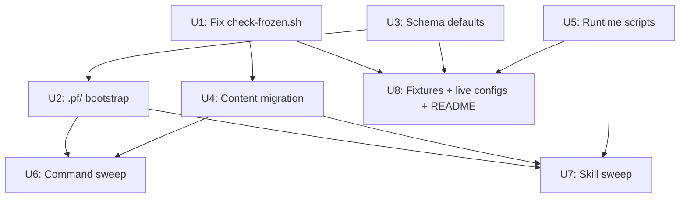

# refactor: Consolidate artifacts under docs/ and plugin files under .pf/

## Summary

Move all plugin-generated artifact directories (`decisions/`, `prds/`) under `docs/` so adopters can gitignore that tree to keep workflow artifacts local. Move all plugin reference files (`layout.md`, `config.schema.json`, `models-tiering.md`, `workflow.config.example.json`) into `.pf/`, a hidden plugin-namespaced directory that eliminates the generic `config/` directory. Update all config defaults, hardcoded path strings, runtime scripts, and test fixtures to reflect the new layout. Patch `check-frozen.sh` to handle git renames correctly before the migration runs.

---

## Problem Frame

Plugin-generated artifact directories (`decisions/`, `prds/`) land at repo root, preventing adopters from gitignoring workflow artifacts without also hiding unrelated project files. Plugin reference files (`layout.md`, `config.schema.json`, `models-tiering.md`) share `docs/` with brainstorm/plan output, so `docs/` cannot be cleanly gitignored. The generic `config/` directory collides with user repo conventions.

(see origin: `docs/brainstorms/2026-06-24-artifact-consolidation-under-docs-requirements.md`)

---

## Requirements

- R1: `docs/` is the sole parent of all plugin-written artifact directories.
- R2: `.pf/` is the sole home for plugin reference files; no meta-files remain in `docs/` or at root.
- R3: `config/` is eliminated entirely.
- R4: `workflow.config.example.json` defaults (`prdsDir`, `decisionsDir`, `tasksDir`) reflect new paths.
- R5: All hardcoded path strings in commands, skills, scripts, and fixtures are updated.
- R6: Existing content (`decisions/`, `prds/`) is migrated, not duplicated or left in place.
- R7: All existing test fixtures pass against new paths after migration.
- R8: A user can add `docs/` to `.gitignore` without hiding any plugin reference or config file.
- R9: `/pf-setup` emits an opt-in gitignore hint for `docs/`.

---

## Key Technical Decisions

**KTD1: Fix check-frozen.sh rename handling before migrating content.**
`check-frozen.sh` uses `git diff --name-status` and handles `R*` (rename) status the same as `M` (modify) and `D` (delete). When frozen artifacts are moved via `git mv`, the script reads the old path, finds it was frozen at base, and flags a violation — causing the migration PR to fail CI. A rename preserves content and is not a modification; `R*` status lines must be skipped. This fix is a hard dependency for U4 (content migration).

**KTD2: Update docs/layout.md content before renaming it to .pf/layout.md.**
`docs/layout.md` documents the path contract and is the source of truth read by skills. Its content references `prds/` and `decisions/` as root directories. Update the content in-place first, then rename to `.pf/layout.md`, then sweep all references from `docs/layout.md` → `.pf/layout.md`. Doing the rename first creates a broken window where references point at a missing file.

**KTD3: $schema relative paths per file location after move.**
Three JSON files carry relative `$schema` paths resolved from their own directory:
- `.pf/workflow.config.example.json` → `"config.schema.json"` (same-dir sibling after co-location)
- `.cursor/workflow.config.json` → `"../.pf/config.schema.json"` (unchanged depth, new target)
- `scripts/test/fixtures/in-repo-memory/config-in-repo.json` → `"../../../.pf/config.schema.json"` (unchanged depth, new target)

**KTD4: Schema $id URL is informational but should be updated for hygiene.**
`docs/config.schema.json` has `"$id": "https://github.com/grdavies/currsor-phase-flow-2/docs/config.schema.json"`. Update to the `.pf/` path. Non-breaking for local validation; matters for remote validators that resolve `$id` references.

**KTD5: scripts/reconcile-status.sh and scripts/feedback-backlog.sh are runtime executables with hardcoded paths — highest migration risk.**
`reconcile-status.sh` has three separate hardcoded `prds/` references (Python default dict, Python literal path, shell variable). `feedback-backlog.sh` hardcodes `$ROOT/prds/GAP-BACKLOG.md` as its default. These are not prose in command files — they execute against the filesystem. Both must be updated before or alongside the content migration.

**KTD6: docs/plans/ historical plan files must NOT be updated.**
Existing plans under `docs/plans/` reference old paths in historical prose and are frozen artifacts. `check-frozen.sh` explicitly exempts `docs/plans/*` from the frozen check. Leave them untouched.

---

## Scope Boundaries

### Deferred to Follow-Up Work
- Auto-migration script for existing user repos (users update `workflow.config.json` manually or re-run `/pf-setup`).
- Enforcing gitignore — opt-in hint only, never forced by the plugin.

### Out of Scope
- Worktree state (`.git/worktrees/*/phase-flow.json`), hook state (`.cursor/hooks/`), wave plan (`.cursor/pf-wave-plan.json`).
- `integration/<stamp>` — git branch naming pattern, not a filesystem directory.
- `docs/brainstorms/` and `docs/plans/` — already correctly located; paths unchanged.
- `docs/plans/` historical plan files — frozen, must not be modified.

---

## High-Level Technical Design

### Target directory layout

```
.pf/
  layout.md                      # was docs/layout.md
  config.schema.json             # was docs/config.schema.json
  models-tiering.md              # was docs/models-tiering.md
  workflow.config.example.json   # was config/workflow.config.example.json

docs/
  brainstorms/                   # unchanged
  plans/                         # unchanged
  prds/                          # was root prds/
    INDEX.md
    COMPLETION-LOG.md
    GAP-BACKLOG.md
    <n>-<slug>/
      <n>-prd-<slug>.md
      tasks-<n>-<slug>.md
      amendments/
  decisions/                     # was root decisions/
    INDEX.md
    SUPERSEDED.log
    <n>-<slug>.md
    <n>-<slug>.amendments/
```

### Dependency graph



U1, U3, and U5 can proceed in parallel. U2 depends on U3. U4 depends on U1. U6 and U7 depend on U2 and U4. U8 is last.

---

## Implementation Units

### U1. Patch check-frozen.sh — rename exemption

**Goal:** Prevent the migration PR from failing CI when frozen artifacts are moved via `git mv`.

**Requirements:** R7 (fixtures pass), KTD1.

**Dependencies:** None — this should land first or in the same commit as U4.

**Files:**
- `scripts/check-frozen.sh`
- `scripts/test/run-doc-fixtures.sh` (verify frozen-check fixture still catches real modifications)

**Approach:** In the `while` loop that reads `git diff --name-status` output, add an early `continue` for `R*` status before the `D|M|R*` case. A rename preserves file content — the frozen artifact is not modified, only relocated. The existing `D|M|R*` case currently matches renames because `R*` is a glob; removing `R*` from that case and adding a preceding `R*) continue ;;` clause is the minimal fix.

Note: `git diff --name-status` emits rename lines as `R<score><TAB>old-path<TAB>new-path`. The current `read -r status path` only captures `old-path` as `path`, silently discarding the new path. This means the check resolves `is_frozen_at_ref old-path BASE` — which is correct for detecting content modification at the old path, but wrong for renames (the old path is being moved, not modified). The fix is to skip `R*` entirely.

**Test scenarios:**
- `git mv` a frozen artifact and run `check-frozen.sh` against the diff → verdict `pass`
- Directly modify (edit content of) a frozen artifact and run `check-frozen.sh` → verdict `fail` (regression guard)
- Add a new file and run → verdict `pass` (add is already exempted via `A) continue`)

**Verification:** `bash scripts/check-frozen.sh` exits 0 after a `git mv` of a frozen file in a test branch.

---

### U2. Bootstrap .pf/ — move plugin reference files

**Goal:** Create `.pf/` and move all four plugin reference files there; eliminate `config/`.

**Requirements:** R2, R3, R8. KTD2, KTD3.

**Dependencies:** U3 (schema defaults updated before move).

**Files:**
- `docs/layout.md` → `.pf/layout.md` (update content in-place first, then `git mv`)
- `docs/config.schema.json` → `.pf/config.schema.json` (`git mv` after U3 updates defaults)
- `docs/models-tiering.md` → `.pf/models-tiering.md` (`git mv`)
- `config/workflow.config.example.json` → `.pf/workflow.config.example.json` (`git mv`)

**Approach:**
1. Update `docs/layout.md` content: replace all `prds/` → `docs/prds/`, `decisions/` → `docs/decisions/` in the directory tree, naming conventions table, command read/write map, and config keys section.
2. `git mv docs/layout.md .pf/layout.md`
3. `git mv docs/config.schema.json .pf/config.schema.json`
4. `git mv docs/models-tiering.md .pf/models-tiering.md`
5. `git mv config/workflow.config.example.json .pf/workflow.config.example.json`
6. Update `$schema` in `.pf/workflow.config.example.json`: `"../docs/config.schema.json"` → `"config.schema.json"` (same-dir sibling).
7. `rmdir config/` (now empty).

**Test scenarios:**
- `.pf/` exists with all four files present
- `config/` no longer exists at repo root
- `docs/layout.md`, `docs/config.schema.json`, `docs/models-tiering.md` no longer exist in `docs/`
- `.pf/workflow.config.example.json` `$schema` resolves to `.pf/config.schema.json` from its own directory

**Verification:** `ls .pf/` shows four files; `ls config/` fails; `ls docs/` shows only `brainstorms/`, `plans/`, `prds/` (after U4), `decisions/` (after U4).

---

### U3. Update schema defaults

**Goal:** Update `prdsDir`, `decisionsDir`, `tasksDir` defaults in the schema so any consumer falling back to schema defaults gets the correct new paths.

**Requirements:** R4, R5.

**Dependencies:** None — can proceed immediately.

**Files:**
- `docs/config.schema.json` (updated before being moved in U2)

**Approach:**
- Change schema default for `prdsDir`: `"prds"` → `"docs/prds"`.
- Change schema default for `decisionsDir`: `"decisions"` → `"docs/decisions"`.
- Change schema default for `tasksDir`: `"prds"` → `"docs/prds"`.
- Update `$id` URL: `"https://github.com/grdavies/currsor-phase-flow-2/docs/config.schema.json"` → `"https://github.com/grdavies/currsor-phase-flow-2/.pf/config.schema.json"`.

**Test scenarios:**
- Schema file contains `"default": "docs/prds"` for `prdsDir`
- Schema file contains `"default": "docs/decisions"` for `decisionsDir`
- Schema file contains updated `$id` URL

**Verification:** `grep "docs/prds" docs/config.schema.json` returns matches for all three default fields.

---

### U4. Migrate content directories

**Goal:** Move `decisions/` and `prds/` to their new locations under `docs/`.

**Requirements:** R1, R6.

**Dependencies:** U1 (check-frozen.sh patched).

**Files:**
- `prds/` → `docs/prds/` (via `git mv`)
- `decisions/` → `docs/decisions/` (via `git mv`)
- `docs/decisions/INDEX.md` (update Path column values from `decisions/NNN-...` → `docs/decisions/NNN-...`)

**Approach:**
1. `git mv prds docs/prds`
2. `git mv decisions docs/decisions`
3. Open `docs/decisions/INDEX.md` and update all `Path` column values that reference the old `decisions/` prefix to `docs/decisions/`.

No content is duplicated. Historical content in `docs/plans/` files that reference the old paths is left untouched (KTD6).

**Test scenarios:**
- `docs/prds/INDEX.md` exists; `prds/` root directory no longer exists
- `docs/decisions/INDEX.md` exists; `decisions/` root directory no longer exists
- `docs/decisions/INDEX.md` Path column values use `docs/decisions/` prefix

**Verification:** `ls docs/` shows `brainstorms/`, `plans/`, `prds/`, `decisions/`; `ls prds/` and `ls decisions/` both fail.

---

### U5. Update runtime scripts

**Goal:** Fix all hardcoded filesystem paths in executable scripts that will break at runtime after the content migration.

**Requirements:** R5, R7. KTD5.

**Dependencies:** None — can proceed alongside U1/U3. Must land before or with U4 to avoid a broken runtime window.

**Files:**
- `scripts/feedback-backlog.sh`
- `scripts/reconcile-status.sh`
- `scripts/wave.sh`

**Approach:**

`scripts/feedback-backlog.sh`:
- Line 13: `BACKLOG="${BACKLOG:-$ROOT/prds/GAP-BACKLOG.md}"` → `BACKLOG="${BACKLOG:-$ROOT/docs/prds/GAP-BACKLOG.md}"`

`scripts/reconcile-status.sh` — three locations:
- Python default dict: `cfg.get("prdsDir", "prds")` → `cfg.get("prdsDir", "docs/prds")`, same for `tasksDir`
- Python literal path: `root / "prds" / "INDEX.md"` → `root / "docs" / "prds" / "INDEX.md"`
- Shell variable: `"$ROOT/prds/COMPLETION-LOG.md"` → `"$ROOT/docs/prds/COMPLETION-LOG.md"`

`scripts/wave.sh`:
- Line 77: serialized contention array `["prds/INDEX.md", "decisions/INDEX.md", ...]` → `["docs/prds/INDEX.md", "docs/decisions/INDEX.md", ...]`

**Test scenarios:**
- `scripts/feedback-backlog.sh` invoked without `--backlog` flag resolves to `docs/prds/GAP-BACKLOG.md`
- `scripts/reconcile-status.sh` with no `prdsDir` in config reads from `docs/prds/`
- `scripts/wave.sh` emits `docs/prds/INDEX.md` and `docs/decisions/INDEX.md` in the wave plan JSON contention array

**Verification:** Run each script against the migrated repo state; no "no such file or directory" errors for prds/decisions paths.

---

### U6. Command reference sweep

**Goal:** Update all hardcoded `decisions/`, `prds/`, `docs/layout.md`, `docs/config.schema.json`, and `docs/models-tiering.md` path strings in command files.

**Requirements:** R5.

**Dependencies:** U2 (`.pf/` files exist), U4 (content at new paths).

**Files:**
- `commands/pf-prd.md` — `decisions/<n>-<slug>.md`, `decisions/`, `prds/`, `docs/layout.md`
- `commands/pf-freeze.md` — `prds/INDEX.md`, `decisions/INDEX.md`, `prds/<n>-...`
- `commands/pf-doc-review.md` — `decisions/<n>-<slug>.md`, `decisions/.../amendments/`, `docs/models-tiering.md`
- `commands/pf-amend.md` — `decisions/<n>-<slug>.amendments/`, `prds/INDEX.md`, `decisions/INDEX.md`, `decisions/SUPERSEDED.log`
- `commands/pf-tasks.md` — `prds/INDEX.md`
- `commands/pf-status.md` — `prds/INDEX.md`, `prds/COMPLETION-LOG.md`
- `commands/pf-execute.md` — `prds/GAP-BACKLOG.md`
- `commands/pf-feedback.md` — `prds/GAP-BACKLOG.md`
- `commands/pf-feedback-close.md` — `prds/GAP-BACKLOG.md` (×2, including explicit `--backlog` argument)
- `commands/pf-brainstorm.md` — `docs/layout.md`
- `commands/pf-setup.md` — `docs/config.schema.json` (×2 in embedded Python snippet), plus add gitignore hint (R9)

**Approach:** In each file, update path strings:
- `decisions/` → `docs/decisions/` (all occurrences of standalone `decisions/` prefix in paths)
- `prds/` → `docs/prds/` (all occurrences of standalone `prds/` prefix in paths)
- `docs/layout.md` → `.pf/layout.md`
- `docs/config.schema.json` → `.pf/config.schema.json`
- `docs/models-tiering.md` → `.pf/models-tiering.md`

For `commands/pf-setup.md`: update both Python snippet lines from `pathlib.Path('docs/config.schema.json')` to `pathlib.Path('.pf/config.schema.json')`. Also add the gitignore hint at the end of the Report step: `"Tip: add docs/ to .gitignore to keep workflow artifacts local (brainstorms, PRDs, decisions)."` (opt-in; do not write to `.gitignore` automatically).

**Test scenarios:**
- No command file contains a bare `decisions/` or `prds/` path prefix (not preceded by `docs/`)
- No command file references `docs/layout.md`, `docs/config.schema.json`, or `docs/models-tiering.md`
- `pf-setup.md` contains `.pf/config.schema.json` in the Python snippet
- `pf-setup.md` contains the gitignore hint string

**Verification:** `grep -r "^decisions/\|[^/]decisions/" commands/` returns no matches; same for `prds/`.

---

### U7. Skill reference sweep

**Goal:** Update all hardcoded path strings in skill files.

**Requirements:** R5.

**Dependencies:** U2 (`.pf/` files exist), U4 (content at new paths).

**Files:**
- `skills/doc-review/SKILL.md` — `decisions/<n>-<slug>.md`, `decisions/.../amendments/`, `decisions/`
- `skills/prd/SKILL.md` — `prds/<n>-<slug>/`, `decisions/<n>-<slug>.md`, `decisions/`, `docs/layout.md` (×2)
- `skills/tasks/SKILL.md` — `prds/<n>-<slug>/tasks-...md`, `prds/INDEX.md`, `docs/layout.md`
- `skills/wave/SKILL.md` — `prds/INDEX.md`, `decisions/INDEX.md`, `docs/layout.md`
- `skills/living-status/SKILL.md` — `prds/INDEX.md`, `prds/COMPLETION-LOG.md`, `prds/GAP-BACKLOG.md`
- `skills/feedback/SKILL.md` — `prds/GAP-BACKLOG.md` (×4)
- `skills/feedback/references/route-record.md` — `prds/GAP-BACKLOG.md`
- `skills/feedback-closure/SKILL.md` — `prds/GAP-BACKLOG.md` (×2, including `--backlog prds/GAP-BACKLOG.md`)
- `skills/memory/SKILL.md` — `decisions/<n>-<slug>.md`, `decisions/SUPERSEDED.log`, `decisions/`
- `skills/compound/SKILL.md` — `decisions/<n>-<slug>.md`, `decisions/SUPERSEDED.log`
- `skills/spec-union/SKILL.md` — `decisions/<n>-<slug>.md`, `decisions/`
- `skills/brainstorm/SKILL.md` — `docs/layout.md`
- `skills/brainstorm/references/requirements-sections.md` — `docs/layout.md`
- `skills/spec-rigor/SKILL.md` — `prds/` path references

**Approach:** Same substitution rules as U6. The `--backlog prds/GAP-BACKLOG.md` literal argument in `feedback-closure/SKILL.md` becomes `--backlog docs/prds/GAP-BACKLOG.md`.

**Test scenarios:**
- No skill file contains a bare `decisions/` or `prds/` path prefix
- No skill file references `docs/layout.md`, `docs/config.schema.json`, or `docs/models-tiering.md`

**Verification:** `grep -r "\"prds/\|'prds/" skills/` returns no matches.

---

### U8. Fixtures, live configs, README, and rules

**Goal:** Update the remaining consumers — test fixture files, live config JSON, README install instructions, and plugin rules.

**Requirements:** R5, R7, R8.

**Dependencies:** U1, U3, U4, U5 (all runtime and migration work complete).

**Files:**
- `scripts/test/run-doc-fixtures.sh` — path assertions for `decisions/INDEX.md`, `docs/layout.md` content check, `prds/test/` temp dir
- `scripts/test/run-impl-fixtures.sh` — `$ROOT/docs/config.schema.json` (×3), `$ROOT/docs/models-tiering.md` (×1)
- `scripts/test/run-memory-provider-fixtures.sh` — `$ROOT/docs/config.schema.json` (×2), schema path in Python
- `scripts/test/run-code-review-fixtures.sh` — `$ROOT/docs/config.schema.json` (×1)
- `scripts/test/run-improvement-fixtures.sh` — `$ROOT/docs/config.schema.json` (×1)
- `scripts/test/fixtures/decision-record-pass.md` — body text contains `decisions/<n>-<slug>.md` literal
- `scripts/test/fixtures/in-repo-memory/config-in-repo.json` — `"$schema": "../../../docs/config.schema.json"`
- `scripts/test/fixtures/in-repo-rules/store/rules/allowlisted-rule.md` — prose mention of `docs/config.schema.json`
- `.cursor/workflow.config.json` — `"$schema": "../docs/config.schema.json"` → `"../.pf/config.schema.json"`; also update `prdsDir`/`decisionsDir`/`tasksDir` values if present
- `README.md` — `cp config/workflow.config.example.json` → `cp .pf/workflow.config.example.json`; `See docs/config.schema.json` → `See .pf/config.schema.json`
- `rules/pf-naming.mdc` — `docs/models-tiering.md` → `.pf/models-tiering.md`

**Approach:**
- `decision-record-pass.md` text and the `run-doc-fixtures.sh` grep that reads it are a coupled pair — update both in the same change. Fixture body `decisions/<n>-<slug>.md` → `docs/decisions/<n>-<slug>.md`; grep assertion updated to match.
- `run-doc-fixtures.sh` line 169: `$ROOT/decisions/INDEX.md` → `$ROOT/docs/decisions/INDEX.md`
- `run-doc-fixtures.sh` line 176: `"$ROOT/docs/layout.md"` → `"$ROOT/.pf/layout.md"` and grep content `'decisions/'` → `'docs/decisions/'`
- `config-in-repo.json` `$schema` depth unchanged (`../../../`), target changes: `"../../../.pf/config.schema.json"`
- `.cursor/workflow.config.json`: update `$schema` and add/update `prdsDir: "docs/prds"`, `decisionsDir: "docs/decisions"`, `tasksDir: "docs/prds"` to match new defaults

**Test scenarios:**
- All five fixture runner scripts execute without `FAIL` lines related to moved paths
- `decision-record-pass.md` body contains `docs/decisions/<n>-<slug>.md`
- `run-doc-fixtures.sh` grep for layout content targets `.pf/layout.md`
- `config-in-repo.json` `$schema` resolves correctly from its fixture directory
- `README.md` install instruction references `.pf/workflow.config.example.json`
- `rules/pf-naming.mdc` references `.pf/models-tiering.md`

**Verification:** Run all five fixture scripts (`bash scripts/test/run-*.sh`) — zero `FAIL` lines. `bash scripts/check-gate.sh` exits 0.

---

## Risks & Dependencies

| Risk | Severity | Mitigation |
|------|----------|------------|
| check-frozen.sh CI failure on migration PR | HIGH | U1 must land in same PR as U4 or earlier |
| reconcile-status.sh serving stale paths at runtime | HIGH | U5 must land with or before content migration (U4) |
| feedback-backlog.sh default path wrong at runtime | HIGH | U5 must land with or before content migration (U4) |
| decision-record-pass.md fixture + grep assertion out of sync | MEDIUM | Update both in U8, same change |
| $schema relative path arithmetic error | MEDIUM | Verify per-file depth at write time (KTD3) |
| docs/plans/ historical plans silently updated | LOW | KTD6 — do not touch `docs/plans/*` files |

---

## Open Questions

- None blocking implementation. All decisions resolved in brainstorm and research.

---

## Sources & Research

- Origin: `docs/brainstorms/2026-06-24-artifact-consolidation-under-docs-requirements.md`
- Repo research: [ef2186a9](ef2186a9-43d0-4e9f-a691-861506d484e2) — identified `reconcile-status.sh` and `feedback-backlog.sh` hardcoded paths (HIGH risk), `$schema` relative path arithmetic per file, `config-in-repo.json` fixture, `rules/pf-naming.mdc` reference, and `pf-setup.md` embedded Python snippet
- Learnings research: [80798aea](80798aea-ee9c-4d92-95b3-d76fbd38a1c4) — confirmed `wave.sh` contention array not in requirements sweep, `decision-record-pass.md` coupled-pair update requirement, `layout.md` self-referential update-before-move sequencing
