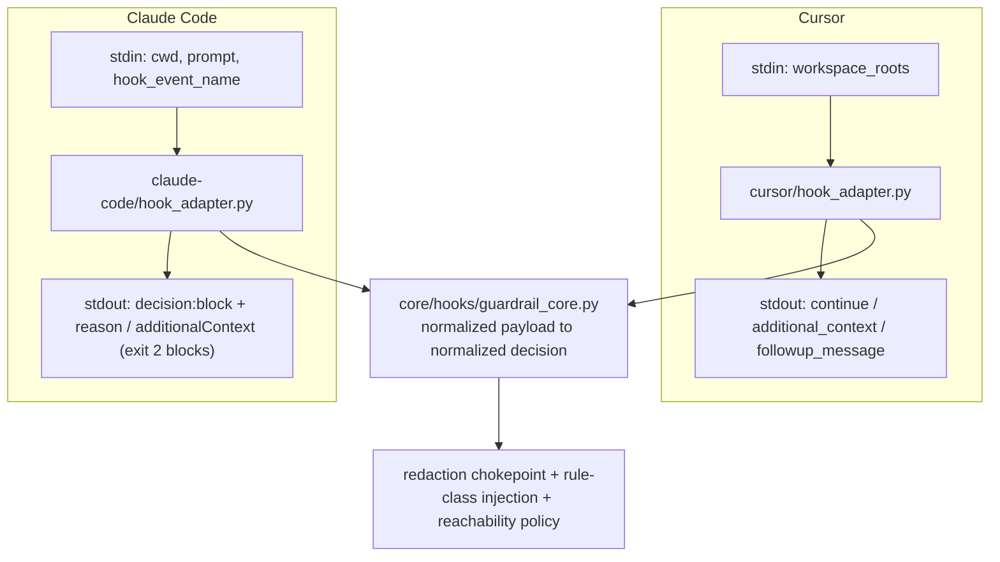

# feat: Cross-platform portability M0–M3

## Implementation status

| Unit | Phase | Deliverable | Status | Commit |
| --- | --- | --- | --- | --- |
| U1 | M0 | Byte-parity harness + golden manifest | done | `16bc680` |
| U2 | M1 | Capability descriptor schema + Tier-1 descriptors | done | `73c7964` |
| U3 | M1 | Additive `core/` extraction | done | `ebfc230` |
| U4 | M1 | Shared `guardrail_core` + hook adapters | done | `5d2cfb3` |
| U5 | M1 | Emitter framework + `pf generate` | done | `83d569c` |
| U6 | M2 | Cursor flip + `dist/cursor/` + root-layout removal | done | `f788cf3` |
| U7 | M3 | Claude Code emitter + `dist/claude-code/` | done | `23ce6b0` |
| U8 | M3 | Guardrail matrix fixtures (Cursor + Claude) | done | `23ce6b0` |
| U9 | M3 | Provenance + generated-source docs | done | `23ce6b0` |

**Post-review fix** (code review on branch): `be2743e` — Claude `session-context.md` path on installed
trees; `sync-local-install.sh` custom dest no longer overwrites source.

**Verification (branch head):** `run-parity-fixtures.sh`, `run-capability-fixtures.sh`,
`run-relocation-fixtures.sh`, `run-hook-fixtures.sh`, `run-guardrail-matrix-fixtures.sh`,
`run-emitter-fixtures.sh` (includes dist freshness gate), `run-claude-golden-fixtures.sh`,
`run-gate-fixtures.sh`, `run-memory-provider-fixtures.sh`.

**Implementation landed** on `feat/portability-m0-m3` ([PR #13](https://github.com/grdavies/currsor-phase-flow-2/pull/13)).

---

## Summary

Establish the platform-agnostic `core/` + per-platform emitter architecture and prove it on two
Tier-1 platforms. Build a byte-parity harness that freezes today's emittable Cursor content (M0), extract all
workflow content and guardrail logic into `core/` behind a capability-descriptor/emitter seam (M1),
flip Cursor to install from generated `dist/cursor/` with zero regression (M2), then add Claude Code
as the second Tier-1 platform — the load-bearing proof that adding a platform leaves `core/`
untouched (M3). Stops before the `pf run`/`pf doctor` CLI, the memory transport split, and any Tier-2
target.

---

## Problem Frame

phase-flow v2 is a self-contained Cursor plugin whose workflow logic is already portable Markdown,
Bash, and Python, but whose *wiring* is Cursor-only: the `.cursor-plugin/plugin.json` manifest, the
`hooks/hooks.json` lifecycle, `.mdc` rule frontmatter, and the Cursor hook stdin/stdout protocol. The
brainstorm (`origin`) resolves to a single `core/` source of truth plus per-platform capability
descriptors and emitters, unified later by a `pf` CLI. This plan executes the first four migration
phases (M0–M3 of the origin's M0–M5+ sequence), which together stand up the architecture and validate
it across both hook-capable platforms before any Tier-2 or CLI-runtime work begins.

The single highest-risk coupling is the hook layer: the fail-closed guardrail guarantee
(`hooks/before-submit-guardrails.py`) must remain genuinely enforcing on each Tier-1 platform.
Research confirms Claude Code's `UserPromptSubmit` hook can block a prompt (`decision:"block"` /
`exit 2`), so true fail-closed parity is achievable; the residual gap is path/glob-scoped rule
auto-attach, which Claude Code has no native equivalent for and which this plan downgrades honestly.

---

## Requirements

### Source of truth and abstraction

- R1. All workflow content (command bodies, skill bodies, rule text, agents, scripts, provider logic,
  shared guardrail logic) is authored only under `core/`; no workflow content lives in a
  platform-specific location after M1. (origin P1)
- R2. Each platform is described by a capability descriptor (flags `hooks`, `skills`, `commands`,
  `rules`, `subagents`, `mcp`, `memoryXport`) plus an emitter; `core/` and emitters branch only on
  capability flags, never on platform name. (origin P2)
- R3. Adding Claude Code requires only a new descriptor, a new emitter, and its golden test, with zero
  edits to `core/` — verified by M3 landing without touching any `core/` file. "Zero `core/` edits" is
  backed by emitter-side body transforms (repo-root path rewriting *and* plugin-root env-var
  substitution), not by hand-editing bodies. (origin P3, P5)
- R4. When a capability is absent and not emulable for a platform, the emitter refuses to emit rather
  than producing a half-working tree. (origin P4)

### Cursor parity and migration

- R5. A parity harness snapshots the current Cursor tree as a frozen golden manifest before any source
  flip. (origin P18)
- R6. The Cursor emitter reproduces the frozen baseline of verbatim-copied content (commands, skills,
  rules, agents, providers, and copied scripts) byte-for-byte; the refactored hook files are verified
  via behavioral characterization parity (golden stdin→stdout + exit code), not byte-hash. The parity
  test gates the migration and stays green throughout. (origin P18, success criterion "zero Cursor
  regression")
- R7. After the flip, Cursor installs from generated `dist/cursor/`; the old root-level layout is
  removed only once parity is green. (origin P19 M2)

### Claude Code as Tier-1

- R8. Claude Code receives native hooks mapping `sessionStart`→`SessionStart`,
  `beforeSubmitPrompt`→`UserPromptSubmit`, `stop`→`Stop`, with genuine fail-closed blocking on the
  submit hook. (origin P5, P14, P15 "Native")
- R9. The shared guardrail logic (redaction chokepoint, rule-class injection, reachability /
  `requireRuleClass` policy) lives once in `core/` and is invoked identically by both platforms'
  hook adapters; it is not reimplemented per platform. (origin P14)
- R10. Cursor's `globs`/`alwaysApply` rule frontmatter is re-emitted per platform: `alwaysApply: true`
  rules map to Claude Code `CLAUDE.md`; conditional ("USE WHEN") rules map to skill-style
  description heuristics. The absence of native glob auto-attach is recorded as the one honestly-
  reported fidelity downgrade. (origin P6, P15 honesty principle)
- R11. Rule-class promotion remains human-gated on both platforms. (origin P17)

### Generation, testing, and provenance

- R12. A minimal generation entrypoint reads `core/` + a descriptor, runs the platform emitter, and
  writes the native tree to `dist/<platform>/`, idempotently. The `pf doctor` and `pf run` surfaces
  are out of scope for this plan. (origin P8; defers P9, P10)
- R13. Both `dist/cursor/` and `dist/claude-code/` are generated, committed, and golden-tested for
  review visibility and diff-noise auditability. A CI freshness gate enforces "committed `dist` ==
  `generate(core/)`" — running `generate --all` must produce no git diff — so committed trees cannot
  silently drift from `core/`. (origin Outstanding Question on dist commit policy — resolved here for
  both Tier-1 trees)
- R14. The test harness is extended with: byte-parity (Cursor golden tree of emittable content),
  capability-schema conformance (no orphan flags), per-platform generation golden trees, a `dist/`
  freshness gate (`generate --all` yields no git diff against committed trees), and a
  guardrail-enforcement check on the Claude Code hook path (submit-hook blocks on unreachable memory;
  session-hook injects context). (origin P21, scoped to M0–M3)
- R15. `PROVENANCE.md` is extended to track each emitter's source; the generated-source model is
  documented in the repo's path/layout contract. (origin P20)

---

## Key Technical Decisions

- **Freeze the baseline before extracting — scoped to emittable content.** M0 snapshots the subset of
  the current tree the Cursor emitter is responsible for producing (the verbatim-copied content:
  commands, skills, rules, agents, providers, copied scripts) into a committed golden manifest of
  relative path + content hash. It deliberately excludes non-emitted infrastructure (`docs/`,
  `scripts/test/`, build tooling) and the post-flip `core/`/`platforms/`/`pf/` dirs, because
  `dist/cursor/` is the emitted plugin payload, not a copy of the whole repo root — comparing the two
  shapes directly would flag every non-emitted path as a mismatch. The refactored hook files are
  excluded from the byte-hash manifest (U4 rewrites them, so they cannot be byte-identical) and are
  instead gated by behavioral characterization parity. With those scopes set, "Cursor never regresses"
  is a mechanical test result, not a judgment call.

- **Hooks split into shared guardrail core + thin per-platform I/O adapter.** The decision logic in
  `session-start.py`, `before-submit-guardrails.py`, and `memory-sync-stop.py` is already mostly
  portable (plugin root resolved from `__file__`, not an env var). The Cursor coupling is the I/O
  protocol: stdin `workspace_roots` and stdout shapes (`{additional_context}`, `{continue,
  user_message}`, `{followup_message}`). The refactor extracts a platform-neutral guardrail body that
  takes a normalized payload and returns a normalized decision, plus a per-platform adapter that
  parses the platform's stdin shape and serializes the platform's stdout shape + exit code. One
  guardrail body serves both Tier-1 platforms. (Alternative — separate hook entrypoints per platform —
  duplicates the fail-closed logic and violates R9.)

- **Fail-closed lives at the submit hook on both platforms.** Cursor enforces in `beforeSubmitPrompt`;
  Claude Code's `SessionStart` can inject context but cannot abort, while `UserPromptSubmit` *can*
  block (`decision:"block"`/`exit 2`). Mapping the existing submit-guardrail body to `UserPromptSubmit`
  yields genuine fail-closed parity; `SessionStart` is used only for context injection. This matches
  the current design, where the session hook is fail-open and the submit hook is fail-closed.

- **Glob-scoped rules are the one honest downgrade.** Claude Code has no native equivalent to Cursor's
  `globs:` auto-attach. `alwaysApply: true` rules emit into `CLAUDE.md`; conditional rules emit as
  skill descriptions with "USE WHEN" heuristics. The capability descriptor records `rules: claude-md`
  and the loss of glob precision is documented rather than papered over. Most current plugin rules are
  either `alwaysApply: true` (e.g. `pf-naming`) or already phrased as "USE WHEN", so the practical loss
  is small.

- **Minimal generation entrypoint now; full `pf` CLI deferred to M4.** This plan builds only the
  emitter framework and a generation-only `generate` entrypoint sufficient to produce `dist/<platform>/`
  (installation stays with `sync-local-install.sh`). The
  `pf doctor` capability matrix and the `pf run` Tier-2 hook polyfill belong to the origin's M4 and are
  out of scope, since neither Tier-1 platform needs a runtime wrapper.

- **Commit both Tier-1 `dist/` trees.** `dist/cursor/` must be committed (it is what Cursor installs
  post-flip and what the parity test compares). `dist/claude-code/` is also committed so emitter output
  is reviewable in PRs and golden-tested, accepting the diff noise as the price of auditability.

- **Capability descriptor as data, emitter as code.** The descriptor is a static declaration (JSON);
  the emitter is the only place platform-shaped output is produced. Schema conformance is tested so a
  flag with no emitter handling (or vice versa) fails CI.

---

## High-Level Technical Design

Target layout after M3 (as implemented):

```text
core/                         # platform-agnostic source of truth (R1)
  commands/ skills/ rules/ agents/ scripts/ providers/
  hooks/
    guardrail_core.py         # shared decision logic
    pf_hook_util.py           # shared config/provider/allowlist resolution
    session-context.md        # session hook template (also copied into dist hooks/)
  pf-reference/               # .pf contracts (layout, config schema, models tiering)
platforms/
  cursor/      { descriptor.json, emitter.py, hook_adapter.py }
  claude-code/ { descriptor.json, emitter.py, hook_adapter.py }
pf/                           # generation entrypoint: python3 -m pf generate [--all]
dist/
  cursor/                     # generated + committed; byte-parity golden (134 emittable paths)
  claude-code/                # generated + committed; run-claude-golden-fixtures.sh
scripts/
  test/                       # harness (parity, schema, emitter, hook, guardrail-matrix, …)
  pf-resolve-plugin-root.sh   # resolves core/ vs dist install root for workflow scripts
  copy-to-core.sh             # syncs core/scripts from root scripts (post-flip maintenance)
  sync-local-install.sh       # rsync dist/cursor/ → ~/.cursor/plugins/local/phase-flow-v2
PROVENANCE.md  README.md
```

**Post-flip repo root:** legacy `commands/`, `skills/`, `rules/`, `agents/`, `providers/`, `hooks/`,
and `.cursor-plugin/` are **removed**. Workflow scripts remain at repo `scripts/` (mirrored into
`core/scripts/` via `copy-to-core.sh`) so the test harness and local gate runners keep stable paths;
`pf-resolve-plugin-root.sh` points runtime scripts at `core/` when root providers are absent.

Original target layout (pre-implementation reference):

```text
core/                         # platform-agnostic source of truth (R1)
  commands/ skills/ rules/ agents/ scripts/ providers/
  hooks/
    guardrail_core.py         # shared decision logic (was: session/submit/stop bodies)
    pf_hook_util.py           # shared config/provider/allowlist resolution
  pf-reference/               # .pf contracts (layout, config schema, models tiering)
platforms/
  cursor/      { descriptor.json, emitter, hook_adapter.py }
  claude-code/ { descriptor.json, emitter, hook_adapter.py }
pf/                           # minimal generation entrypoint (generate only; install via sync script)
dist/
  cursor/                     # generated + committed; byte-parity with M0 snapshot
  claude-code/                # generated + committed; golden-tested
scripts/test/                 # extended harness (parity, schema, golden trees, guardrail)
PROVENANCE.md  README.md
```

Hook protocol normalization (the M1/M3 load-bearing seam):



Event mapping (both platforms invoke the same `guardrail_core` body):

| Neutral lifecycle | Cursor event | Claude Code event | Fail-closed? |
|-------------------|--------------|-------------------|--------------|
| session-start (inject context) | `sessionStart` | `SessionStart` | No (inject only; CC cannot abort) |
| pre-submit guardrail | `beforeSubmitPrompt` | `UserPromptSubmit` | Yes — true per-prompt block |
| stop / memory-sync | `stop` | `Stop` | n/a (always exit 0) |

---

## Implementation Units

Units are grouped by migration phase. Cursor parity (U1's golden manifest) gates every later unit.

### Phase M0 — Parity baseline

### U1. Byte-parity harness and frozen Cursor snapshot

- **Goal:** Capture today's emittable Cursor plugin content as an immovable golden reference and
  provide a reusable tree-vs-manifest assertion.
- **Requirements:** R5, R6, R14
- **Dependencies:** none
- **Files:** `scripts/snapshot-tree.sh` (or `.py`), `scripts/test/run-parity-fixtures.sh`,
  `scripts/test/fixtures/parity/cursor-golden.manifest` (committed), `scripts/test/parity-compare.sh`
- **Approach:** Snapshot only the file set the Cursor emitter will produce — the verbatim-copied
  content (`commands/`, `skills/`, `rules/`, `agents/`, `providers/`, and the workflow `scripts/`
  the emitter copies) — recording `relative-path<TAB>sha256` sorted deterministically. Exclude
  non-emitted infrastructure (`docs/`, `scripts/test/`, build tooling), VCS/build artifacts
  (`.git`, `node_modules`, `__pycache__/`, `*.pyc`), and the refactored hook files (`hooks/*.py`,
  `hooks/hooks.json`) — the latter are gated by behavioral characterization parity in U4/U6, not by
  byte-hash. The comparator takes a target directory and a manifest and reports the first mismatch
  (missing, extra, or hash-diff). Snapshot now so the baseline predates extraction.
- **Patterns to follow:** existing `scripts/test/run-*-fixtures.sh` drivers (exit-code + per-case
  reporting); reuse the inclusion/exclusion list from `scripts/sync-local-install.sh`.
- **Test scenarios:**
  - Happy path: comparator on a directory matching the manifest exits 0 with a "match" verdict.
  - Edge: a directory with one extra file, one missing file, and one byte-changed file each produce a
    distinct, named mismatch and a non-zero exit.
  - Edge: manifest ordering is deterministic across two runs (re-snapshot yields an identical manifest).
- **Verification:** `run-parity-fixtures.sh` passes; the committed manifest reflects the current tree.

- **Status:** done (`16bc680`). Golden manifest: 134 emittable paths; `snapshot-tree.sh` prefers `dist/cursor/` when present.

### Phase M1 — Extract core/ and the abstraction seam

### U2. Capability descriptor schema and Tier-1 descriptors

- **Goal:** Define the capability-flag vocabulary as data and supply the Cursor and Claude Code
  descriptors.
- **Requirements:** R2, R4, R14
- **Dependencies:** U1
- **Files:** `platforms/descriptor.schema.json`, `platforms/cursor/descriptor.json`,
  `platforms/claude-code/descriptor.json`, `scripts/test/run-capability-fixtures.sh`
- **Approach:** Schema enumerates the seven flags, but the M1 value sets are scoped to what M0–M3
  actually exercises — only values with a backing emitter in this slice: `hooks: native|none`,
  `skills: native|none`, `commands: slash-md|none`, `rules: mdc|claude-md|none`,
  `subagents: native|none`, `mcp: yes|no`, `memoryXport: mcp`. Cursor =
  `hooks:native, rules:mdc, mcp:yes`; Claude Code = `hooks:native, rules:claude-md, mcp:yes`. The
  deferred Tier-2/transport values (`hooks:wrapper`, `skills:command-emulated`, `commands:prompt-file`,
  `rules:agents-md|gemini-md`, `subagents:emulated`, `memoryXport:http|cli`) are **forward-declared in
  the M4 unit that first emits them**, not baked into the M1 conformance schema — so the schema never
  admits a value with no emitter. Conformance test fails on any flag value outside the (scoped) schema
  or any emitter-referenced flag missing from a descriptor.
- **Patterns to follow:** `.pf/config.schema.json` (JSON Schema style already in repo); jq-based
  fixture assertions in `scripts/test/run-gate-fixtures.sh`.
- **Test scenarios:**
  - Happy path: both descriptors validate against the schema.
  - Error: a descriptor with an unknown flag value fails conformance with a named error.
  - Error: a descriptor missing a schema-required flag fails conformance.
- **Verification:** `run-capability-fixtures.sh` passes; both descriptors validate.

- **Status:** done (`73c7964`).

### U3. Extract platform-agnostic content into core/

- **Goal:** Establish `core/` as the single authoring location for all workflow content, **additively**
  — without breaking the live root-loaded Cursor plugin.
- **Requirements:** R1
- **Dependencies:** U1
- **Files:** copy `commands/`, `skills/`, `rules/`, `agents/`, `scripts/` (workflow scripts, not the
  test harness or build tooling), `providers/` into `core/`; relocate `.pf/` contracts to
  `core/pf-reference/`. No content edits — byte-identical copies only.
- **Approach:** Copy (not `git mv`) into `core/` so the repo-root layout stays live and authoritative
  for Cursor — which loads from `./commands/`, `./skills/`, etc. via `plugin.json` — until the U6 flip
  regenerates `dist/cursor/` and removes the root layout. The byte bodies under `core/` are unchanged
  (the emitter, not the copy, is responsible for any platform shaping). Keep `scripts/test/` and the
  new `pf/` generation tooling outside `core/` (they are build/test infrastructure, not emitted
  content). Internal cross-references that assume repo-root paths are inventoried here and resolved by
  the emitter's path rewriting in U5/U6, not by editing bodies. (The transient root/`core/`
  duplication is removed atomically in U6.)
- **Patterns to follow:** the consolidation refactor (`docs/plans/2026-06-24-001-refactor-artifact-consolidation-plan.md`)
  for a path-relocation sweep.
- **Execution note:** This M1 extraction is **additive** — the legacy root layout remains functional
  and is removed only at the parity-gated U6 (M2) flip. Do not delete or `git mv` the root layout in
  this unit; the dogfooded plugin (and its guardrail hooks) must stay loadable throughout M1.
- **Test scenarios:**
  - Happy path: every file in the M0 manifest that is workflow content has a corresponding path under
    `core/` (a relocation-coverage check confirms nothing was dropped).
  - Edge: every `core/` file body is hash-identical to its repo-root counterpart (copy, not rewrite).
  - Edge: the root layout remains loadable — `plugin.json` paths still resolve and the existing hook
    fixtures still pass after the copy (no regression to the live plugin during M1).
- **Verification:** relocation-coverage check passes; `core/` copies are byte-identical to root; the
  live root-loaded plugin still passes its existing fixtures.

- **Status:** done (`ebfc230`). Root duplication removed in U6 (`f788cf3`).

### U4. Refactor hooks into shared guardrail core + per-platform adapter

- **Goal:** Separate platform-neutral guardrail logic from the Cursor I/O protocol so one body serves
  both platforms.
- **Requirements:** R9, R11
- **Dependencies:** U3
- **Files:** `core/hooks/guardrail_core.py` (extracted decision logic),
  `core/hooks/pf_hook_util.py` (moved), `platforms/cursor/hook_adapter.py`,
  `platforms/claude-code/hook_adapter.py`, `scripts/test/run-hook-fixtures.sh` (extended)
- **Approach:** `guardrail_core` exposes three functions over a normalized payload
  (`{workspace_root, prompt?, event}`): session-context build (returns context string, fail-open),
  submit guard (returns `{allow, message}`, fail-closed on unreachable provider / corrupt allowlist /
  strict-empty rules **and on any unexpected exception** — the submit path preserves the current
  top-level `except Exception: _block(...)` catch-all so a refactor bug cannot silently degrade it to
  fail-open), stop/memory-sync (returns optional followup, always non-fatal). The Cursor
  adapter parses `workspace_roots` and serializes `{additional_context}` / `{continue,user_message}` /
  `{followup_message}`. The Claude Code adapter parses `cwd`/`prompt`/`hook_event_name` and serializes
  `hookSpecificOutput.additionalContext` (SessionStart) and `{decision:"block",reason}` + `exit 2`
  (UserPromptSubmit). Rule-class promotion stays human-gated in the shared body.
- **Patterns to follow:** current `hooks/before-submit-guardrails.py` decision branches; the
  `PF_RULES_SCRIPT` / `PF_WORKSPACE_ROOT` env override seams already present.
- **Execution note:** Characterize first — capture the current Cursor hook stdout for the existing
  fixtures before refactoring, then assert the Cursor adapter reproduces it exactly.
- **Test scenarios:**
  - Covers R9. Submit guard: provider reachable + non-empty rules → `allow:true`; provider unreachable
    in strict mode → `allow:false` with a message, via the shared body (not adapter-local logic).
  - Happy path (Cursor adapter): given the existing `run-hook-fixtures.sh` stdin payloads, stdout
    `{continue}` matches the pre-refactor golden exactly.
  - Happy path (Claude Code adapter): a blocking decision serializes to `{decision:"block",reason}` and
    exits 2; an allow decision exits 0.
  - Edge: session-context build with an unreachable provider fails open (returns degraded context, no
    raise) on both adapters.
  - Integration: corrupt allowlist → submit guard blocks on both adapters through the same code path.
  - Covers R9. Fail-closed catch-all: an unexpected exception injected into `guardrail_core`'s submit
    path makes the Cursor adapter emit `{continue:false}` and the Claude Code adapter emit
    `{decision:"block"}` / exit 2 — never fail-open.
- **Verification:** extended `run-hook-fixtures.sh` passes for both adapters; Cursor stdout is
  byte-identical to the characterization golden.

- **Status:** done (`5d2cfb3`). Fixtures target `dist/cursor/hooks/` post-flip.

### U5. Emitter framework and minimal generation entrypoint

- **Goal:** Provide the capability-driven emitter base and a generation-only `generate` entrypoint that
  writes `dist/<platform>/` from `core/` + a descriptor. Installation is handled separately by
  `sync-local-install.sh` (U6/R7), not by `pf`.
- **Requirements:** R2, R4, R12, R14
- **Dependencies:** U2, U3, U4
- **Files:** `pf/generate.py` (or `pf/__main__.py` with a `generate` subcommand),
  `pf/emitter_base.py`, `scripts/test/run-emitter-fixtures.sh`
- **Approach:** The base emitter copies `core/` content, applies descriptor-driven transforms, and
  writes a manifest path → output path map; it refuses (non-zero, named error) when the descriptor
  declares a capability the emitter cannot satisfy (R4). Transforms operate on file bodies as well as
  layout: (a) rewrite internal repo-root path references to the emitted layout, and (b) substitute the
  platform plugin-root env var and its fallback (e.g. `CURSOR_PLUGIN_ROOT` → `CLAUDE_PLUGIN_ROOT`, and
  the literal `$HOME/.cursor/plugins/...` fallback in `checks-gate`) so `core/` bodies stay
  platform-neutral. The base emitter copies only via an explicit content allowlist/exclusion (mirroring
  `sync-local-install.sh` exclusions plus `__pycache__/`, `*.pyc`, and any provider runtime/state/secret
  paths) so committed `dist/` trees can never capture non-content. The entrypoint is
  `generate <platform>` / `generate --all`, idempotent (re-run reproduces the tree). No `doctor`/`run`
  subcommands.
- **Patterns to follow:** Python-with-shell-shellout style of the existing hooks; argument handling
  kept minimal.
- **Test scenarios:**
  - Happy path: `generate` against a tiny fixture `core/` + descriptor produces the expected output map.
  - Happy path: a fixture body containing `${CURSOR_PLUGIN_ROOT}` (and the `$HOME/.cursor/plugins/...`
    fallback) is emitted with the platform's plugin-root env var substituted per the descriptor.
  - Error: a descriptor demanding an unsupported capability triggers the R4 refusal with a named error
    and non-zero exit.
  - Edge: a runtime/state artifact placed under a copied subtree (e.g. `__pycache__/`, a provider state
    file) is excluded from the emitted `dist/` tree by the copy allowlist.
  - Edge: two consecutive `generate` runs produce byte-identical output (idempotence).
  - Covers R13. Freshness gate: running `generate --all` against the real `core/` produces **no git
    diff** against the committed `dist/cursor/` and `dist/claude-code/` trees; a deliberate un-emitted
    `core/` edit makes the gate fail.
- **Verification:** `run-emitter-fixtures.sh` passes; entrypoint is idempotent; the freshness gate is
  green against the committed `dist/` trees.

- **Status:** done (`83d569c`). Entrypoint: `python3 -m pf generate [platform] [--all]`.

### Phase M2 — Flip Cursor to generated source

### U6. Cursor emitter, parity-gated flip, and root-layout removal

- **Goal:** Generate `dist/cursor/` that matches the M0 baseline, install Cursor from it, and remove the
  legacy root layout (the transient duplication left by U3's additive copy) **atomically, only once
  parity is green** — so the dogfooded plugin is never broken.
- **Requirements:** R6, R7, R13
- **Dependencies:** U1, U3, U5
- **Files:** `platforms/cursor/emitter` (concrete emitter), `dist/cursor/` (generated, committed),
  `scripts/sync-local-install.sh` (point source at `dist/cursor/`), `scripts/test/run-parity-fixtures.sh`
  (assert `dist/cursor/` matches the golden manifest)
- **Approach:** The Cursor emitter writes `.cursor-plugin/plugin.json`, `hooks/hooks.json` (events
  wired to the Cursor hook adapter entrypoints), and copies commands/skills/rules(`.mdc`)/agents/
  scripts/providers, rewriting any internal repo-root path references to the emitted layout. Generate
  `dist/cursor/`, assert byte-parity of the verbatim-copied content against U1's manifest **and**
  behavioral characterization parity for the emitted hooks (the hooks are not in the byte-hash
  manifest), then repoint `sync-local-install.sh` at `dist/cursor/` and delete the now-redundant root
  layout in the same change. Parity test is the gate.
- **Patterns to follow:** current `.cursor-plugin/plugin.json` and `hooks/hooks.json` are the exact
  emitter output target; `sync-local-install.sh` rsync inclusion rules.
- **Execution note:** Generation, the parity/behavioral assertions, the `sync-local-install.sh`
  repoint, and the root-layout deletion all land in **one atomic PR** — `dist/cursor/` exists and
  parity is green before the root layout is removed, so there is no window where the dogfooded plugin
  loads from an absent or half-migrated tree. If parity fails, the deletion does not proceed.
- **Test scenarios:**
  - Covers R6. The verbatim-copied content in `dist/cursor/` generated from `core/` + the Cursor
    descriptor byte-matches the M0 golden manifest (path set and every hash); the emitted hooks pass
    behavioral characterization parity (the U4 stdin→stdout + exit-code goldens).
  - Happy path: `sync-local-install.sh` copies `dist/cursor/` to the local plugin dir with the same
    inclusion/exclusion behavior.
  - Edge: a deliberate one-file divergence in `core/` surfaces as a parity failure (gate actually
    fails closed).
- **Verification:** parity test green against `dist/cursor/`; Cursor loads the generated plugin after a
  reload with no behavioral change.

- **Status:** done (`f788cf3`). Also added `pf-resolve-plugin-root.sh`, emitter freshness gate, `.gitignore`
  for `scripts/test/fixtures/emitter-fixture/out/`.

### Phase M3 — Add Claude Code (second Tier-1)

### U7. Claude Code emitter and dist tree

- **Goal:** Emit a complete Claude Code plugin tree from the same `core/`, with rules downgraded
  honestly.
- **Requirements:** R3, R8, R10, R13, R14
- **Dependencies:** U5, U6
- **Files:** `platforms/claude-code/emitter`, `dist/claude-code/` (generated, committed),
  `scripts/test/run-emitter-fixtures.sh` (Claude Code golden tree)
- **Approach:** Emit `.claude-plugin/plugin.json`, `hooks/hooks.json` mapping `SessionStart`/
  `UserPromptSubmit`/`Stop` to the Claude Code hook adapter (using `${CLAUDE_PLUGIN_ROOT}`), commands
  to `commands/*.md` (frontmatter mapped: `description` kept; Cursor `alwaysApply`/`trigger` dropped or
  mapped to `argument-hint` where meaningful), skills to `skills/<name>/SKILL.md`, agents to
  `agents/*.md` (carry `name`/`description`, map `model`). Apply the body env-var substitution from U5
  so command/skill/agent bodies referencing `${CURSOR_PLUGIN_ROOT}` (and the `$HOME/.cursor/plugins/...`
  fallback in `checks-gate`) emit with `${CLAUDE_PLUGIN_ROOT}` — required for the CI-gate workflow to
  resolve on Claude Code. Rules: `alwaysApply: true` → appended to an emitted `CLAUDE.md`; conditional
  rules → skill descriptions with "USE WHEN" text. Confirm no `core/` file is edited by this unit
  (R3 proof).
- **Patterns to follow:** Claude Code manifest/hook/skill/command shapes from the research dossier;
  Cursor emitter (U6) structure.
- **Test scenarios:**
  - Covers R3. The M3 diff touches `platforms/claude-code/**`, `dist/claude-code/**`, tests, and docs
    only — zero `core/` edits (a guard test asserts no `core/` path in the unit's change set, or a
    reviewer checklist item backed by the golden trees).
  - Happy path: Claude Code golden tree matches expected output for manifest, hooks, a sample command,
    a sample skill, and a sample agent.
  - Covers R3. A command body that referenced `${CURSOR_PLUGIN_ROOT}` in `core/` emits with
    `${CLAUDE_PLUGIN_ROOT}` in `dist/claude-code/`, with no edit to the `core/` source body.
  - Covers R10. An `alwaysApply: true` rule appears in emitted `CLAUDE.md`; a "USE WHEN" rule appears as
    a skill description; the descriptor records `rules: claude-md`.
  - Error: Covers R4. If the descriptor declared a capability the emitter could not satisfy, generation
    refuses.
- **Verification:** `dist/claude-code/` golden test passes; manifest and hook wiring are well-formed.

- **Status:** done (`23ce6b0`, follow-up `be2743e`). Golden driver:
  `scripts/test/run-claude-golden-fixtures.sh` (manifest, hooks, `CLAUDE.md`, env substitution, USE WHEN
  skill downgrade). Env substitution handles `${CURSOR_PLUGIN_ROOT:-...}` bash-default syntax.

### U8. Claude Code guardrail-enforcement test

- **Goal:** Prove the emitted Claude Code hooks enforce fail-closed at submit and inject at session
  start.
- **Requirements:** R8, R9, R14
- **Dependencies:** U4, U7
- **Files:** `scripts/test/run-guardrail-matrix-fixtures.sh`, fixtures under
  `scripts/test/fixtures/guardrail-matrix/`
- **Approach:** Drive the Claude Code hook adapter with `UserPromptSubmit` stdin (`cwd`, `prompt`) under
  a stubbed unreachable memory provider and assert it blocks (`decision:"block"` or `exit 2`); drive
  `SessionStart` and assert it returns `additionalContext` without aborting. Mirror the existing Cursor
  hook fixtures so both platforms run the same scenarios against the shared guardrail body.
- **Patterns to follow:** `scripts/test/run-hook-fixtures.sh` (stdin JSON + jq on stdout); provider
  stubbing via `PF_RULES_SCRIPT`.
- **Test scenarios:**
  - Covers R8. UserPromptSubmit + unreachable provider (strict) → blocked, with a reason; exit code
    signals block.
  - Happy path: UserPromptSubmit + reachable provider + non-empty rules → allowed (exit 0, no block).
  - Happy path: SessionStart → `additionalContext` present; never aborts even when the provider is down
    (fail-open session).
  - Integration: the same unreachable-provider scenario blocks on both the Cursor and Claude Code
    adapters (parity of enforcement through one code path).
- **Verification:** `run-guardrail-matrix-fixtures.sh` passes for both platforms.

- **Status:** done (`23ce6b0`). Matrix driver delegates to `run-hook-fixtures.sh`; scenario catalog in
  `scripts/test/fixtures/guardrail-matrix/README.md`.

### U9. Provenance and generated-source documentation

- **Goal:** Record emitter provenance and document the generated-source model.
- **Requirements:** R15
- **Dependencies:** U6, U7
- **Files:** `PROVENANCE.md` (extended), `core/pf-reference/layout.md` (note generated layers),
  `README.md` (install reflects `dist/<platform>/`)
- **Approach:** Add emitter rows to `PROVENANCE.md` (component → source under `core/` → emitter →
  emitted `dist/` target). Note in the layout contract that `dist/cursor/` and `dist/claude-code/` are
  generated + committed and must be regenerated via the entrypoint after `core/` edits. Update README
  install steps to reference the generated trees. The `/pf-upstream` command remains deferred (no
  command file added here).
- **Patterns to follow:** existing `PROVENANCE.md` table; `core/pf-reference/layout.md` "Living vs
  frozen layers" section.
- **Test scenarios:** Test expectation: none — documentation and provenance manifest only.
- **Verification:** `PROVENANCE.md` lists both emitters; README install steps match the flipped model.

---

## Scope Boundaries

### In scope

M0–M3: the parity harness, `core/` extraction, the capability-descriptor/emitter seam, the hook
shared-core/adapter refactor, the Cursor flip to generated source, and Claude Code as the second
Tier-1 platform — with both `dist/` trees committed and golden-tested.

### Deferred to follow-up work

- The `pf doctor` capability/enforcement matrix and the `pf run` Tier-2 hook polyfill (origin M4).
- The memory transport split (MCP / HTTP / CLI) and non-MCP reach (origin M4) — both Tier-1 platforms
  here use the existing MCP/in-repo provider path unchanged.
- All Tier-2 platforms — Codex, Copilot, Factory Droid, Qwen Code, OpenCode, Pi, Antigravity CLI
  (origin M4–M5+).
- A `/pf-upstream` command implementing provenance refresh (already deferred upstream).
- Promoting the founding portability decisions into `docs/decisions/` records (recommended in the
  origin's resolved Outstanding Question; not part of this implementation).

### Outside this product's identity

- Marketplace publishing/distribution of the universal package (origin out-of-scope).
- Forcing fail-closed where a platform cannot enforce it (not applicable here — both targets are
  hook-capable Tier-1).
- Per-platform behavior forks beyond what `core/` expresses.

---

## Risks & Dependencies

- **Hidden Cursor-specific artifacts break byte-parity.** Any current file not reconstructible from
  `core/` + the Cursor emitter fails M2's parity gate. Mitigation: the M0 manifest plus U3's
  relocation-coverage check surface such files as emitter inputs before the flip; treat unexplained
  parity diffs as missing emitter logic, not as a reason to relax the gate.
- **Claude Code glob-rule downgrade.** Conditional rules lose path-precise auto-attach (research
  confirmed no native equivalent). Mitigation: emit `alwaysApply` rules into `CLAUDE.md` and conditional
  rules as "USE WHEN" skill descriptions; record the loss in the descriptor and `PROVENANCE.md`. Risk is
  low because most current rules are always-on or already "USE WHEN" phrased.
- **`SessionStart` cannot abort on Claude Code.** Any "refuse to start" intent must live in the submit
  hook. Mitigation: the design already enforces fail-closed at `UserPromptSubmit`, not session start.
- **Internal repo-root path references in moved content.** Bodies that assume root-relative paths must
  be rewritten by the emitter, not by editing `core/`. Mitigation: inventory references in U3; handle
  rewriting in the emitter (U5/U6) so `core/` stays canonical.
- **Dependency on origin assumption validation.** The origin lists Claude Code Tier-1 viability as an
  M3 validation item; research has now confirmed native blocking hooks and a `CLAUDE_PLUGIN_ROOT` env
  analog, de-risking the assumption before implementation.

---

## Sources / Research

Internal:

- `origin` brainstorm — requirements P1–P21, the M0–M5 phasing (P19), and the resolved decision-record
  Outstanding Question.
- Current wiring to be emitted: `.cursor-plugin/plugin.json`, `hooks/hooks.json`, and the Python hooks
  `hooks/session-start.py`, `hooks/before-submit-guardrails.py`, `hooks/memory-sync-stop.py`
  (Cursor stdin `workspace_roots`; stdout `{additional_context}` / `{continue,user_message}` /
  `{followup_message}`; plugin root from `__file__`).
- `hooks/pf_hook_util.py` — shared config (`.cursor/workflow.config.json`), provider resolution, and
  `providers/<provider>-rules.sh` lookup, the basis for `core/hooks/`.
- `scripts/sync-local-install.sh` — rsync inclusion/exclusion rules reused by the parity harness and the
  Cursor emitter output target.
- `scripts/test/run-*-fixtures.sh` — the exit-code + jq + grep harness the new parity, schema, golden,
  and guardrail-matrix drivers extend (no byte-parity mechanism exists today).
- `skills/memory/CAPABILITIES.md` + `providers/recallium.md` + `providers/recallium-rules.sh` — the
  already-abstracted memory seam, unchanged in this plan.
- `docs/plans/2026-06-24-001-refactor-artifact-consolidation-plan.md` — precedent for a path-relocation
  sweep (U3).

External (patterns; not runtime dependencies):

- Claude Code extension model (official Anthropic docs, `code.claude.com/docs`): `UserPromptSubmit`
  supports `decision:"block"` / `exit 2` (genuine fail-closed); `SessionStart` injects
  `additionalContext` but cannot abort; `.claude-plugin/plugin.json` manifest with root-level
  components; `${CLAUDE_PLUGIN_ROOT}` ≈ `CURSOR_PLUGIN_ROOT`; `CLAUDE.md`/`@import`/`.claude/rules/` for
  always-on rules; **no native glob-scoped rule auto-attach** (the one downgrade).
